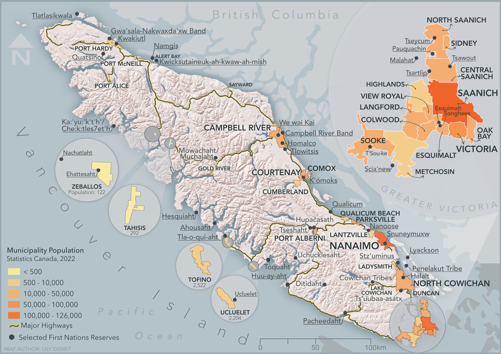

# Thematic vs. Reference maps 

Maps can be physical or digital, static or interactive. However, there are 2 broad categories spatial visualizations can be categorized into: ***reference maps*** and ***thematic maps***. Reference maps are descriptive, showing “the lay of the land”, whereas thematic maps render the results of spatial analysis. 
Later in the week you'll also be introduced to multimedia narratives that use (often reference) maps and spatial data to tell an interactive story using a web-based platform. 

----

# Reference Maps
**Reference maps** show the lay of the land, such as the geographic context surrounding your research location or area of interest. Reference maps can be as simple as a drop pin location, or more complex with data layers, labelling, and insets. 

<!-- These examples are of course all static reference maps.  -->

Insets, which are maps nested within maps, either zoom-in to show a particular area in greater detail or zoom-out to contextualize the area of interest within broader geographical context. Reference maps, like any map, should have at minimum an explanatory title, north arrow, scale, legend, map author and data source statement. If there are only one or two data layers which are intuitively symbolized and clearly marked, a legend is sometimes unnecessary.

<!-- 
Satellite imagery 

 -->
 

 

Other reference maps include road atlases, hiking maps (handheld or web-based, like AllTrails), pocket atlases, or transport specific maps such as the below cycling map of Vancouver and Montréal. The reference map most often used in your everyday is likely Google Maps.

[Vancouver cycling map](https://vancouver.ca/streets-transportation/cycling-routes-maps-and-trip-planner.aspx){:target="_blank"}     

[Vélo Québec Bikeways map](https://www.velo.qc.ca/en/toolkitssss/greater-montreal-bikeway-map/){:target="_blank"}   

 

 

----

# Thematic Maps
Another kind of map is a thematic map. Writes [Statistics Canada](https://www150.statcan.gc.ca/n1/pub/92-195-x/2021001/other-autre/theme/theme-eng.htm){:target="_blank"}: “A thematic map shows the spatial distribution of one or more specific data themes for standard geographic areas.” 

## Choropleth maps

Choropleth maps are useful to visualize and compare the density, frequency, or quantity of a value generalized across standardized geographic areas (such as zip-codes, provinces, or countries). See [Axis Map's guide to choropleth maps](https://www.axismaps.com/guide/choropleth){:target="_blank"} for more. 

Unless you specifically want to emphasize differences in total number of events/data points, it is best practice to normalize your data when choropleth mapping. Normalization is when you divide the values for each geographic area by something like the area in square kilometers or total population of that area. For instance, mapping winter flu cases across census tracts in British Columbia, you’d want to normalize the total cases in each census tract by that tract’s total population. Normalization enables better comparison across multiple geographic areas. See [Axis Maps](https://www.axismaps.com/guide/standardizing-data){:target="_blank"} for more. 

 
Choropleth maps can include all the detail of a reference map. Here, total population was visualized. Note the inset in the map below, and manner in which small features have been made more easily visible. 

 

## Proportional Symbol maps
Choropleth maps use a color gradient to convey value differentials, whereas proportional symbol maps use symbol size. Proportional symbol maps are useful to visualize the quantity of something across respective locations. Proportional symbols are quite intuitive, and can be combined with other parameters like color and lettering size to provide rich spatial information. Proportional symbols can even be layered atop a choropleth map. See [Axis Map's guide to Proportional Symbols](https://www.axismaps.com/guide/proportional-symbols){:target="_blank"} for more. 

In most cases you do not normalize values when using proportional symbols, as that would reduce the range in difference. If anything, it can be useful to exaggerate the range slightly. While Absolute Scaling renders symbols increasingly larger along a linear scale, Perceptual/Apparent Scaling compensates for the eye’s tendency to reduce difference in sizes close together. See [here](https://makingmaps.net/2007/08/28/perceptual-scaling-of-map-symbols/){:target="_blank"} for more. 

## Dot Density maps
Dot density maps are useful in visualizing the concentration and distribution of discrete incidents. Each dot can represent an event (e.g., an earthquake), or a multiple such as 10. Dot Density maps can over-simplify. See [Axis Map's guide to Dot Density Maps](https://www.axismaps.com/guide/dot-density) for more. 

## Heatmaps
Heatmaps are useful in visualizing the intensity or frequency of occurrence. Heatmaps can be thought about as generalized dot density maps.

 

## Cartograms
Cartograms distort area to emphasize the value associated with a geographic region. When using cartograms, it’s important to consider whether your audience is already familiar with the un-distorted geography, otherwise they might not glean the added information.

There is a case to be made that all maps are thematic, as the definition of boundaries, borders, names, etc. is a political - and almost always contested - act. In other words, there are no neutral maps that simply, impartially, represent an objective reality or truth. See [Crampton and Krygier (2006)](https://acme-journal.org/index.php/acme/article/view/723) or [Harley (1992)](https://quod.lib.umich.edu/p/passages/4761530.0003.008/--deconstructing-the-map?rgn=main;view=fulltext) for a seminal introduction to critical cartography, or [Wang and Liu (2022)](https://www.researchgate.net/publication/365011390_Maps_and_cartography_Progress_in_international_critical_cartographyGIS_research) for an overview of critical cartography and GIS through the last several decades. See also the classic by Denis Wood, The Power of Maps. For an excellent read on the power of Google Maps, see [Digital territories: Google maps as a political technique in the re-making of urban informality](https://journals.sagepub.com/doi/10.1177/0263775818766069){:target="_blank"}.
{: .note}

 

