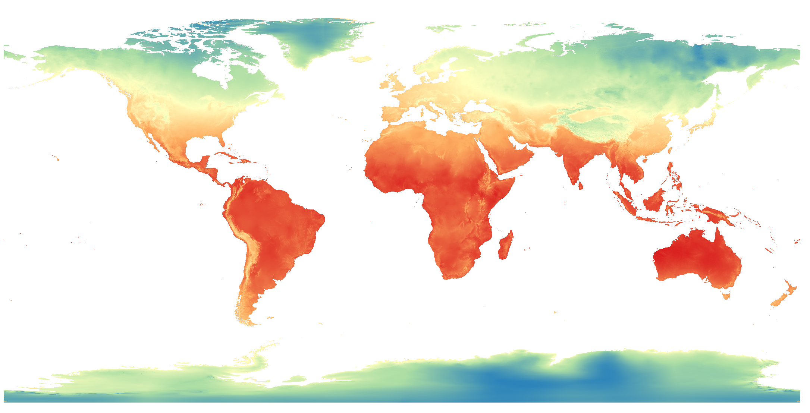
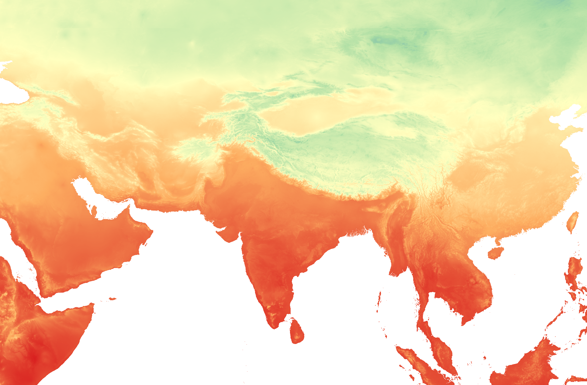
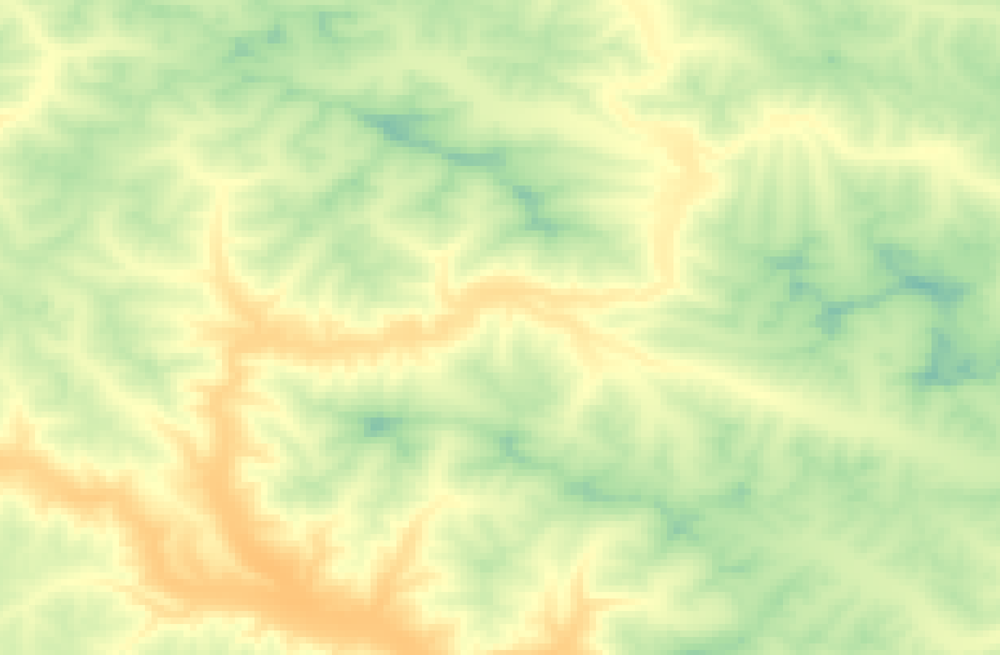
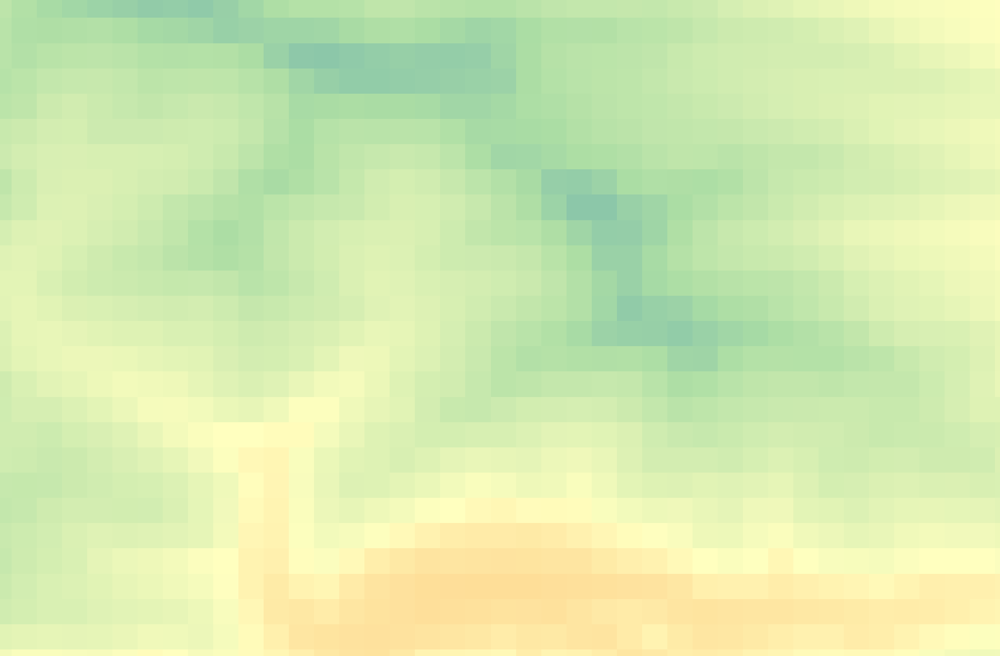
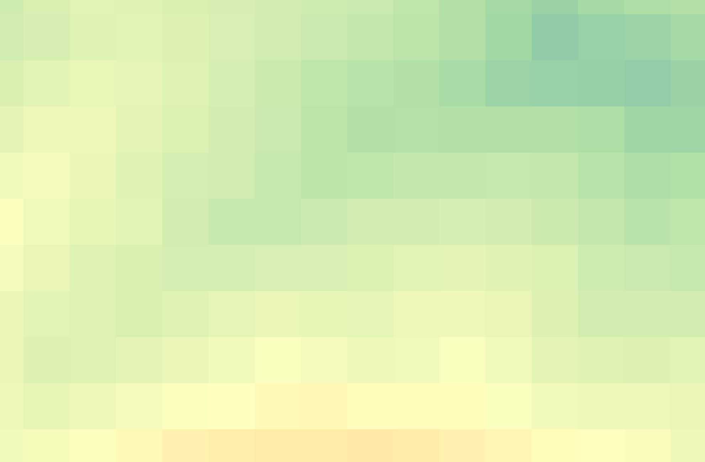

# What is Spatial Data?

Spatial data, sometimes called 'geospatial data', is data that contains locational information, most often *coordinate points*. Just like text documents require specific software to open and edit them, spatial data require certain software to open, view, analyze, and modify them. This course will introduce you to different tools and platforms for working with spatial data. The main kind of software for visualizing, analyzing, and modifying spatial data is Geographic Information System, or a GIS. Additionally, there are browser-based platforms for uploading and visualizing spatial data. We will talk more about GIS tomorrow, and online platforms later in the week. 

Before we turn to visualizing spatial data, we must first be able to identify data as spatial. It is important to understand the different forms spatial data take and how to make data legible to different mapping platforms. Outside this workshop, you will not always be given pre-prepared data that's stored in the appropriate format for the task at hand. Rather, it is most likely you will be downloading data from the web or creating and combining new data — all of which requires knowledge of data types and file formats.  

  

    On this page:
  

  {: .text-delta }
 - TOC
{:toc}

-----

## Raster vs. Vector Data
There are 2 main types of spatial data: **vector** and **raster**. 

**Raster data** is made up of pixels arranged in a grid, whereas **vector data** is made up of vertices and the paths between them that create geometries representing real-world features. If you're working with continuous geospatial phenomena such as satellite imagery, topography, or climatic data (like rainfall or temperature), you're likely using raster data. If you’re working with points, lines, or polygons, that’s likely vector data.

### Vector Data
{: .no_toc}
Each vector dataset will contain *either* points, lines, or polygons. However, a dataset can include multiple features (multiple points, *or* multiple lines, *or* multiple polygons). For example, below are a handful of vector datasets, including Vancouver neighborhoods (polygons), city blocks (polygons), restaurants (points) and streets (lines). A Geographic Information System (GIS) allows you to add multiple datasets, layering them on top of each other in order to run calculations between them to answer spatial questions. For instance, in a GIS, you could load in the below datasets and then use vector analysis tools to learn how many restaurants are within a 5 kilometer radius of a given city block, or the square area of each neighborhood.

 

 
 
 

 

<!-- In another example, below is a map consisting of three layers of vector data: cities (points), major roads (lines), and land/water (polygons). Cities, roads, land, and water are all different datasets consisting of vector data. Each feature (each polygon, point, or line within a given dataset of points, lines, or polygons) contains various information such as a unique identifier, the area in square kilometers or length, the name, the population, etc. These attributes can be explored from within a GIS by opening what's called the Attribute Table.

  -->

### Raster Data
{: .no_toc}
Rasters, on the other hand, can generally only store one value per pixel. This value could be a color representing different kinds of topography (think of the whites, greens, and browns representing different elevations in the image below) or the quantity of something like rainfall, temperature, or distance. Multiple rasters *can* be overlaid to generate a multi-part raster, but generally, each pixel of a single raster can store one value meaning your raster is showing one variable. You can also do math between raster layers, or run boolean operations to isolate all pixels that do or do not meet certain criteria. An example of this is Suitability Analysis, where multiple rasters are created, each representing the where a single criteria is met; then, these rasters are overlaid to visualize areas of high suitability (such as habitat). 

Below is are three examples of raster data: topography, aerial imagery, and historical rainfall for the month of February (averaged 1970-2000) from [WorldClim](https://worldclim.org/data/index.html), an excellent database of freely available historical climate data. 

 

## File Extensions
Just like a textual data can be stored in different document formats (`.docx`, `.pdf`, `.txt`, `.rtf`, etc.), spatial data can be stored in different formats too. The file extensions of spatial data give us clues about the kind of data we're working with. Although the nuance of file formats might seem too detail oriented for an introduction to reference mapping, being aware of different spatial data types and formats will help you know what to download and troubleshoot why something may not be opening/working. If you have no prior experience with spatial data, this may be quite overwhelming right now. However, with a little bit of practical experience under your belt file formatting will quickly become common sense to you. See [here](https://gisgeography.com/gis-formats/) for an exhaustive list of formats spatial data can take. 

**Raster data** will often be [TIF](https://en.wikipedia.org/wiki/TIFF) (aka TIFF) file and have the extension `.tif` or `.tiff`. Raster data may also be in an ASCII text file, with the extension `.asc`, or a compressed raster file formats. 

**Vector data** come in more diverse file formats: 
- The Shapefile is an industry standard format with the extension `.shp` (and a host of "sidecar files" — be sure to keep them all together). Vector data downloaded in a shapefile format will almost always need to be unzipped before use. Shapefiles store data in binary. Therefore, shapefiles are not legible to human eyes and can only be opened and visualized by a GIS. 
- GeoJSON, on the other hand, stores vector data in `.geojson` files that can be opened (and edited) in a code editor or online in [geojson.io](https://geojson.io/). From there, geoJSON can easily be parsed with human eyes.
- Spatial data might even be stored in an excel sheet or a `.csv` file. 
- KML, or Keyhole Markup Language, is particular to Google Earth and Google Maps and doesn't work well in a GIS. This is why, when using Google platforms, you'll need to upload your data in either `.kml` or `.csv` format. 
- If your data does not have an explicit spatial component, but includes place names or addresses, with a little work, this can be made legible to tools and platforms designed to read spatial data. Also note that historical data might come in the form of a scanned map that will need to be "georeferenced", or projected into a 2-dimensional coordinate space. Additionally, in a GIS, you can convert raster data to vector data and vector data to raster data, and extract raster values to a vector dataset.
<!-- doesnt mean its not spatial data, just that the spatial componant isn't legible (yet) to tools/platforms/software designed to read in spatial data.  -->
- If your data's locative information is in the form of text — for example, country/city names or street addresses — this can be made legible to a GIS with a few extra steps (see [geocoding](https://ubc-library-rc.github.io/gis-plugins-qgis/content/geocoding.html)). You may have to create new columns and populate them with coordinate information.  

  

## Data Sources
Now that you understands what spatial data is and the different formats it comes in, you may be wondering *Where, then, do you find spatial data?* Maybe you already have some, maybe you’re still searching. A lot of spatial data is accessible via the internet, albeit under different licenses.

### Historical Data and DH Specific Data Sources
{: .no_toc}
- [Borealis](https://borealisdata.ca/dataverse/HGIS?q=&types=dataverses%3Adatasets&sort=dateSort&order=desc&page=1){:target="_blank"}
- [National Historical Geographic Information System (NHGIS)](https://www.nhgis.org/){:target="_blank"}

### Libraries, Municipal portals, and Governmental agencies 
{: .no_toc}
Municipal and governmental agencies local to your project are also great places to begin looking. For example, see for Vancouver the [Vancouver Open Data Portal](https://opendata.vancouver.ca/pages/home/){:target="_blank"}, [Data BC](https://catalogue.data.gov.bc.ca/){:target="_blank"} for Provincial data, and [Natural Resources Canada](https://natural-resources.canada.ca/science-data/data-analysis/geoca){:target="_blank"} or [here](https://natural-resources.canada.ca/science-data/data-analysis/geospatial-data-tools-services/geospatial-data-tools-services){:target="_blank"} for national resource data. Many Canadian cities have their own municipal open data source, though downloading the data will be different depending on the platform used by each city. 

### Free and open source context layers
{: .no_toc}
[Natural Earth](https://www.naturalearthdata.com/downloads/){:target="_blank"}, which we will use today, provides  free, public domain raster and vector data at a global scale. For example, you can download country and state outlines (and from various state-based perspectives), rivers/lakes/reservoirs, oceans and coastlines, and landmasses. You can also download hillshade data from Natural Earth whose symbology you can adjust in QGIS to show topography. This makes it an excellent resource for simple reference mapping for academic publication.

### World (historical) data
{: .no_toc}
The [Humanitarian Data Exchange](https://data.humdata.org/){:target="_blank"} contains lots of useful global data. [WorldClim](https://worldclim.org/){:target="_blank"} publishes historical climate data such as precipitation and temperature, which you can download as raster datasets. For free and open-source infrastructural data, see [Open Street Maps (OSM)](https://www.openstreetmap.org/#map=11/49.2151/-123.0393){:target="_blank"}. Refer to our [Plugins in QGIS Workshop](https://ubc-library-rc.github.io/gis-plugins-qgis/content/extracting-osm-data.html){:target="_blank"} for a demonstration of how to extract and download OSM data or use it as a basemap for your maps. 

### Satellite Imagery
{: .no_toc}
Satellite imagery can often be downloaded directly from providers. For example, download Sentinel data from the [Copernicus Browser](https://browser.dataspace.copernicus.eu/?zoom=5&lat=50.16282&lng=20.78613&demSource3D=%22MAPZEN%22&cloudCoverage=30&dateMode=SINGLE){:target="_blank"}. If you're using QGIS, the [SRTM-Downloader](https://plugins.qgis.org/plugins/SRTM-Downloader/){:target="_blank"} plugin is a handy tool to download NASA data for a specific area of interest directly from within your GIS interface. If you are a UBC student, staff, or faculty, you can [request a Planet account](https://researchcommons.library.ubc.ca/planet-imagery/){:target="_blank"} to gain access to much more imagery. 

### Creating your own
{: .no_toc}
Finally, you can always create your own vector layers, or create new shapefiles within a GIS by tracing existing data. We will discuss data creation and editing further on another day. 

If you are working with historical or physical maps and want to digitize them or otherwise create spatial data using them as template, you might need to use a georeferencer. We will discuss [georeferencing](../day3/4-georeferencing.md){:target="_blank"} more later in the week. 

#### Resources for Finding and Working with Spatial Data
{: .no_toc}
- [Working with Spatial Data](https://projects.lincolnmullen.com/spatial-workshop/spatial-data){:target="_blank"} by Lincoln Mullen
- [Concordia's Guide to geospatial data](https://www.concordia.ca/library/guides/geospatial-data/geodata.html){:target="_blank"}

