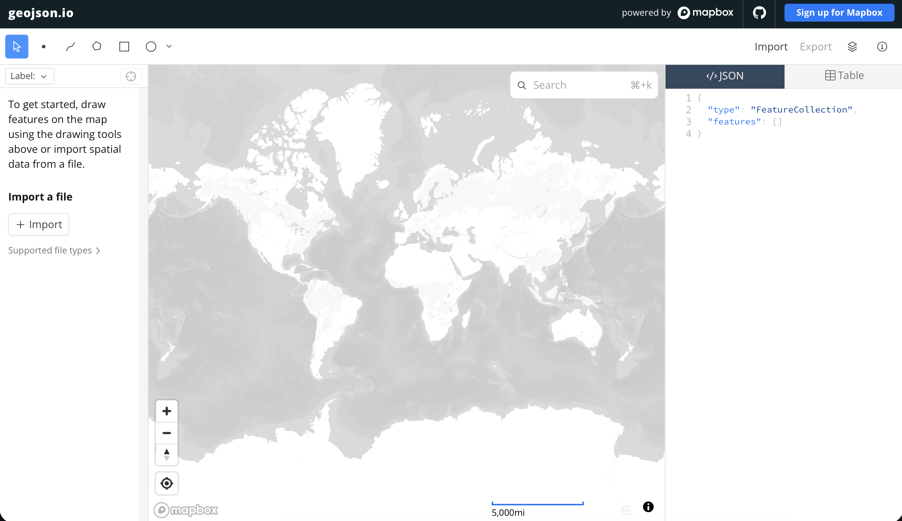
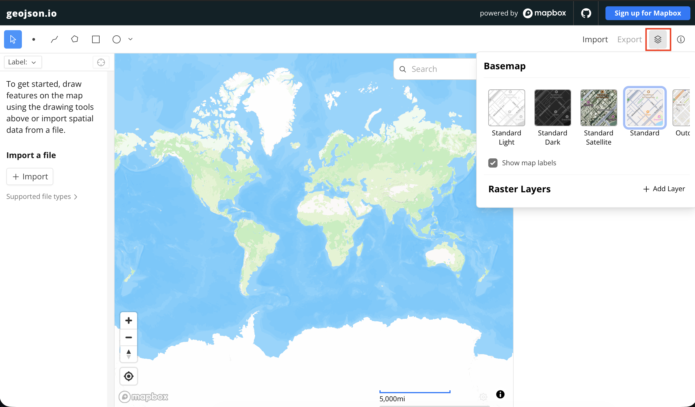
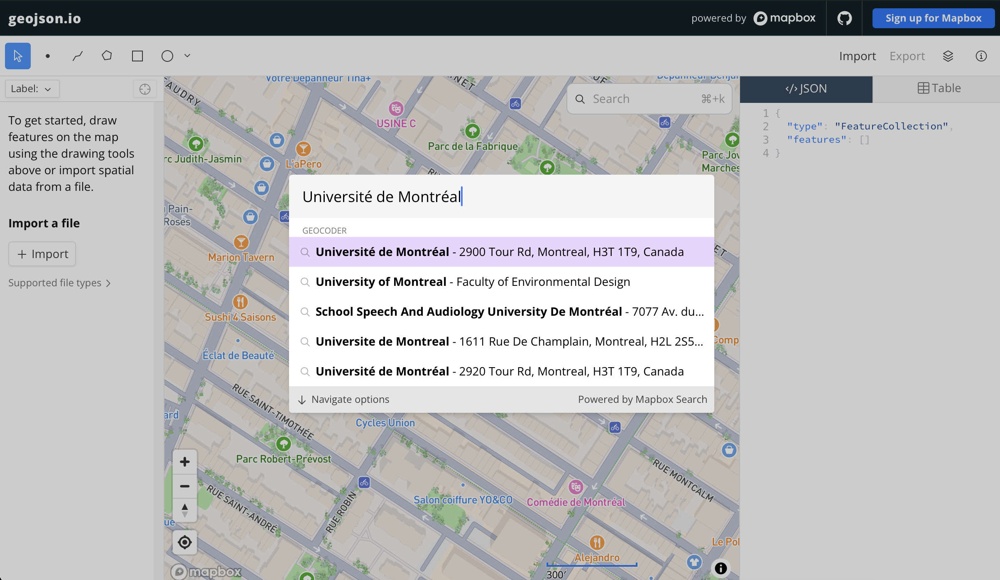
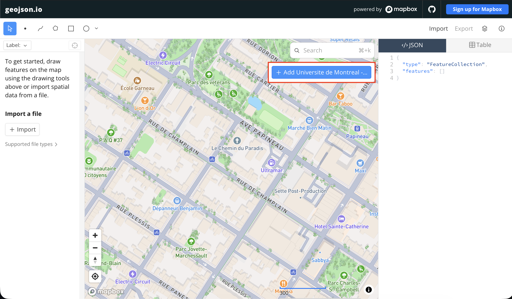
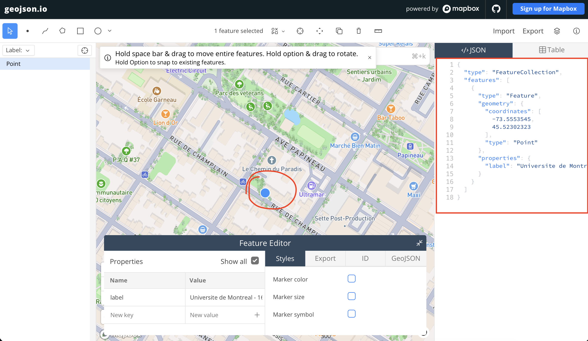
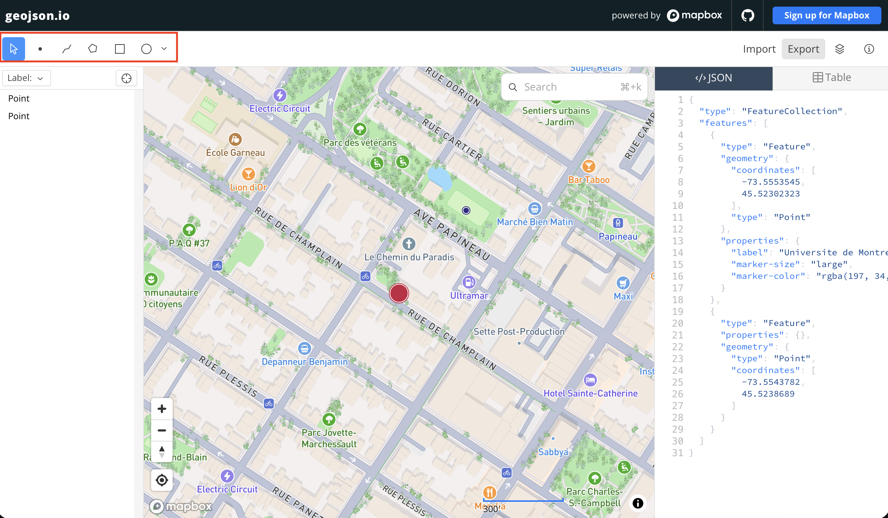
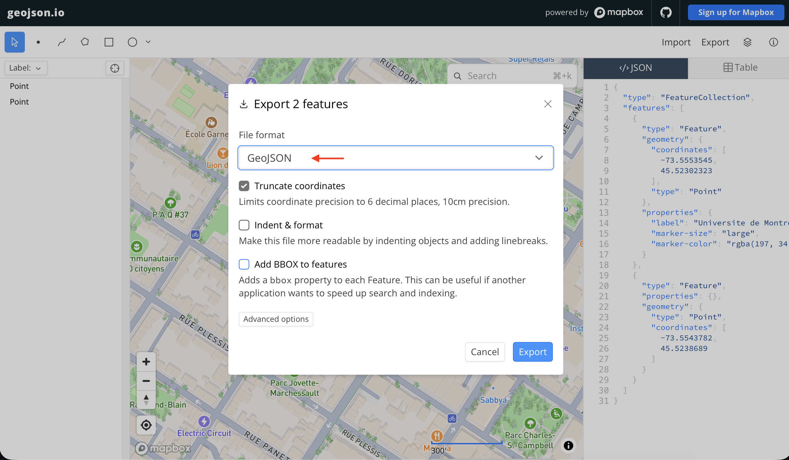

# Data Wrangling
{: .no_toc}

or call it Data preparation - im still developing the below so feel free to contribute thoughts/text/resources
{: .warn}

Although there is a lot of spatial data available for download which, with some modification (using tools and workflows largely introduced tomorrow), can suit a variety of mapping purposes, you will doubtless run into situations where you have to create your own data. For example, maybe you want to plot significant sites visited by the protagonist of a novel, or the opera houses frequented by a notable musician. 

This page outlines common workflows and considerations — whether you are creating spatial data from scratch or simply turning latent spatial information into a form legible to mapping tools and platforms. 

  

    On this page:
  

  {: .text-delta }
 - TOC
{:toc}

----

<!-- 3. Creating and editing spatial data (shapefiles, geojson.io; csv prep; geolocating); and -->

## Creating data freehand with geojson.io 
You can easily create a dataset containing one or more points, lines or polygons using the online platform [geojson.io](https://geojson.io/next/){:target="_blank"}. Here, you can click and draw on the interface, then save your dataset as multiple spatial file formats. Not only is Geojson.io an easy way to create a small set of point, line, or polygon data, it is also a great tool to quickly change between formats once your data is spatialized. 

### Create a point over UdeM
{: .no_toc}

*1*{: .circle .circle-purple}Go to <a href="https://geojson.io/next/" target="_blank">geojson.io</a> 

 

*2*{: .circle .circle-purple} You can adjust the Basemap from the top right-hand corner.

 

*3*{: .circle .circle-purple} Now, you can add points/lines/polygons either by searching places up, or zooming to known areas and simply tracing on top of the map. 

> * Let's firs try adding a point over UdeM by searching it up. Simply type "Universite de Montreal" or "University of Montreal" in the search bar and the webmap should zoom to the desired location.

> * Now click on the blue "Add to Map" button

You'll see now a point has been added to the map. Not only that, the geojson for the point is visible in the right-hand panel, and an editable table for the point data has been added to the bottom of your window.

*4*{: .circle .circle-purple} You can also create a dataset of *either* points *or* lines *or* polygons by drawing directly onto the map. 

 

*5*{: .circle .circle-purple} When you're done, you can export your geojson as geojson or shapefile or csv or kml. as you'll learn throughout the course, different platforms prefer — or even require — differently formatted data. not only is Geojson.io an easy way to create a small set of point, line, or polygon data, it is also a great tool to quickly change between formats once your data is spatialized. 

 

<!-- > other uses -> drag in csv - edit etc. need to check this out for myself
- show how you can load in data and modify etc.  -->

 

## Preparing spreadsheet data

Alex - feel free to note in the Google Doc your considerations/tips/suggestions for preparing spreadsheet data based on your expertise doing so! I'll copy that in. What's here is still very stream of consciousness.
{: .warn}

Generally, for data to be spatial and therefore legible to the variety of tools and platforms we'll introduce this week, it needs to include coordinates organized into two distinct columns: latitude and longitude. 

If you're beginning with data formatted in a spreadsheet, you'll either have latent spatial information or none at all. By 'latent spatial information' we're referring to columns that contain information such as place names, addresses, countries, cities, or even descriptive text detailing places, voyages, or otherwise spacetimes. 

If no locational information is present whatsoever, can it be deduced? Do you know where each feature is or whether there are relevant locations associated with each feature? If so, great! If not, perhaps your data simply isn't spatial. 

If latent spatial information is present, you'll need to turn it into coordinates. Depending on the number of features in your dataset, this might be more or less time consuming. If there are only a handful of features and your goal is to plot these as *points*, you can simply use a different platform to match the location mentioned to an exact coordinate point, then copy and paste that into your spreadsheet (remembering to give latitude and longitude separate columns). 

One straightforward way to do this is to use Google Maps. In Google Maps, you can either look up locations or turn on Satellite View to visually find them. Then, right-click on the map and click the coordinate pair that pops up to copy it to your clipboard. You can then paste these coordinates into your spreadsheet (remembering to give latitude and longitude separate columns). 

are we demo-ing this? Should i write documentation? 
{: .warn}

One important thing to consider, however, is where on the map points are depends on the coordinate reference system in which these points are created and stored. That is, the coordinate pair representing the precise location of your accommodations here in Montreal as viewed in Google Maps might be meters or kilometers away if uploaded to a map whose coordinate reference system was different from that of Google Maps. Coordinate points taken from Google Maps will be stored in `WGS84`. 

Note that from the spreadsheet side, you can only add *point* data. If you want to trace georeferenced historical maps or create line/polygon features, either use Geojson.io introduced above, or work within QGIS to create shapefiles. The documentation to do this is included under [Tools and Workflows](../day3/1-tools-workflows.md){:target="_blank"}, but will not be taught this week.

<!-- example - you have a csv with locations but cities or provinces or addresses, not coordinate points.. a couple options. 1 - do by hand... 

spreadsheet  data - alex will have gone over the day before adding CSV data, and considerations.  -->

 

## Geocoding
Geocoding is a process by which addresses are given coordinate locations, thus allowing them to be manipulated in a GIS. In other words, geocoding transforms tabular data into spatial data. Reverse Geocoding is when you begin with a set of geolocated points (coordinates) and use a tool to get the street addresses of each point. 

You can geocode with QGIS, a free and open-source geographic information system (GIS) which will be introduced tomorrow. See [UBC Library's tutorial on geocoding](https://ubc-library-rc.github.io/gis-plugins-qgis/content/geocoding.html){:target="_blank"} and [UCSC resource to geocoding](https://guides.library.ucsc.edu/DS/Resources/QGIS){:target="_blank"} for geocoding with QGIS. Additionally, [GeoCoding](https://plugins.qgis.org/plugins/GeoCoding/){:target="_blank"} is another QGIS plugin specific to finding addresses or reverse geocoding. 

You don't need to geocode in a GIS! If you aren't using a GIS for any other portion of your project, consider using an online geocoder like [BC Address Geocoder](https://www2.gov.bc.ca/gov/content/data/geographic-data-services/location-services/geocoder){:target="_blank"} or [geocod.io](https://www.geocod.io/free-geocoding/){:target="_blank"}, or explore more free and paid options [here](https://gisgeography.com/geocoders/){:target="_blank"}.

 

## Tracing georeferenced features in QGIS - creating spatial files
Describe what it is and why

The documentation to do this is included under [Tools and Workflows](../day3/1-tools-workflows.md){:target="_blank"}, but will not be taught this week.

oh also editing..../digitizing shapefiles.. if there's time

do you agree it's wise to add this documentation - I never added it to our RC workshop on  Reference Mapping in the Additional Content section, so good to have even if we don't go over here. 
{: .warn}

  

## Resources for Data Collection and Preparation
- [Terrastories](https://terrastories.app/), a tool by [Awana Digital](https://awana.digital/mapeo), is a great resource for collecting place-based data on the go.
- [ArcGIS Survey 124](https://survey123.arcgis.com/) allows you to collect surveys with spatial information. 
- [Creating a new shapefiles in QGIS](https://ubc-library-rc.github.io/gis-reference-mapping/content/hands-on8.html)
- [Considerations for downloading data](https://ubc-library-rc.github.io/gis-spatial-stories/content/resources-for-data-assembly.html) 
- [Geocoding in QGIS](https://programminghistorian.org/en/lessons/geocoding-qgis)
- Tutorial on [Spreadsheet Skills](https://handsondataviz.org/spreadsheet.html) from [Hands-On Data Visualization](https://handsondataviz.org/) by Jack Dougherty & Ilya Ilyankou 
<!-- - [Creating New Vector Layers in QGIS 2.0](https://programminghistorian.org/en/lessons/vector-layers-qgis) -->

