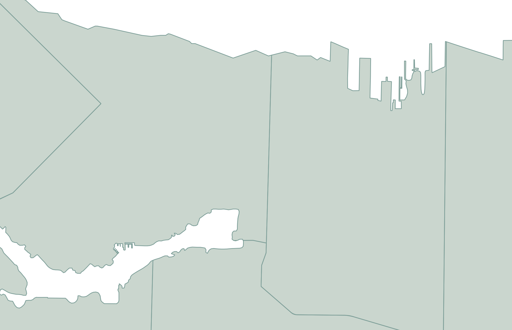
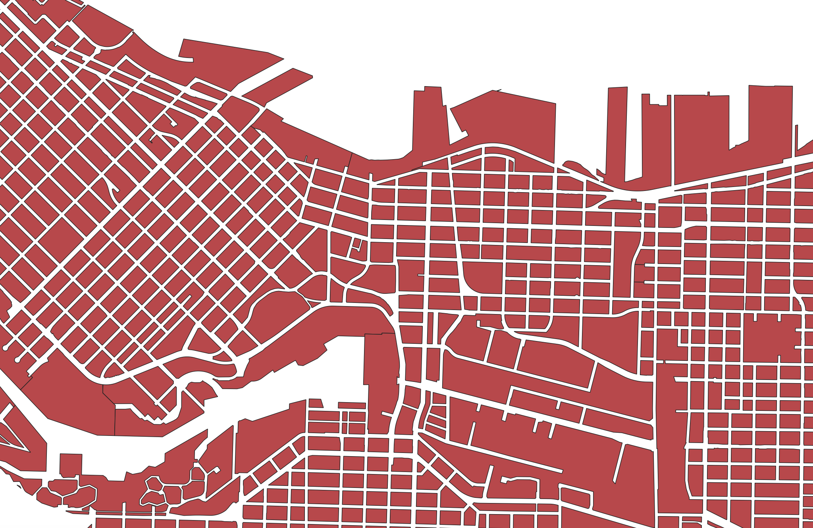
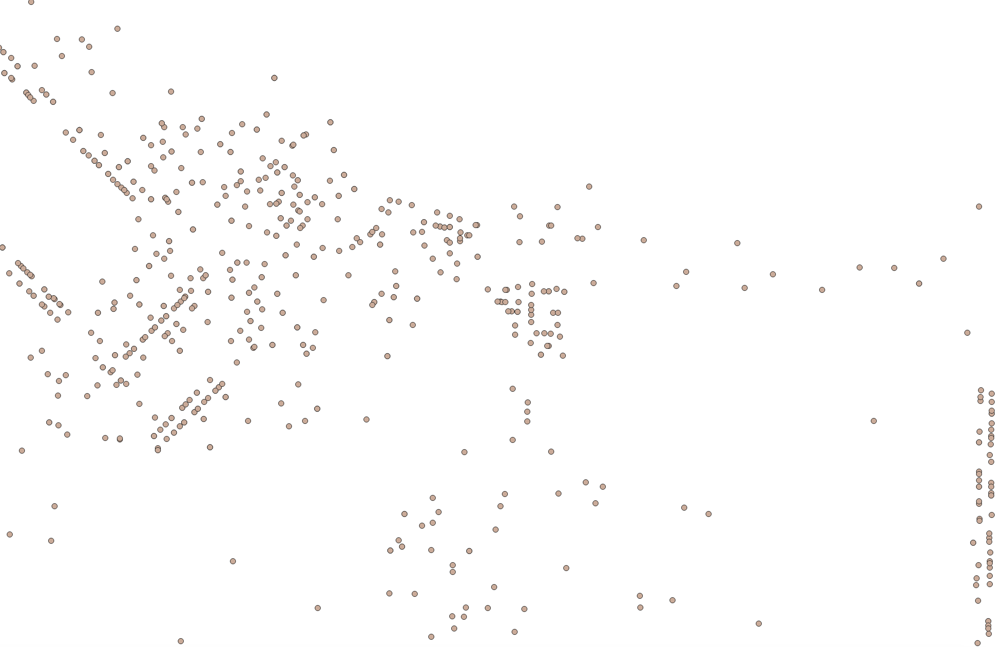
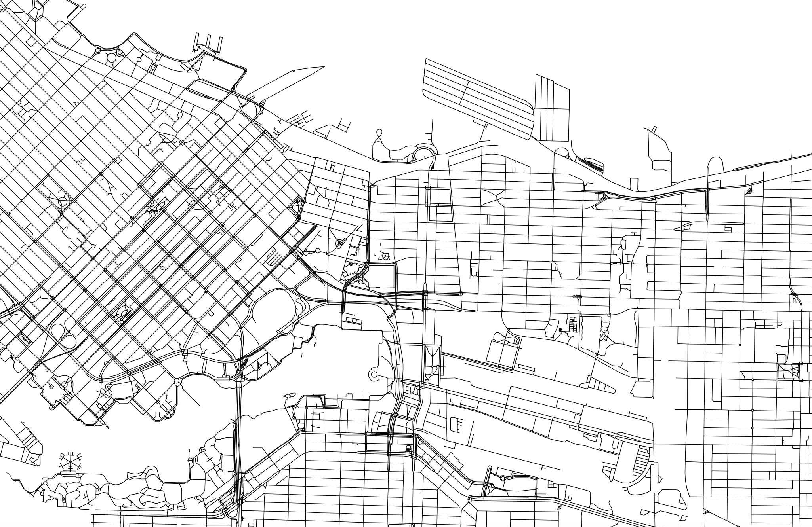
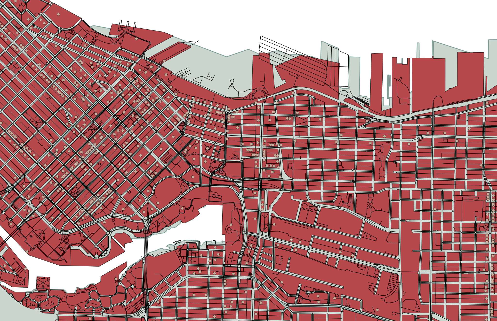
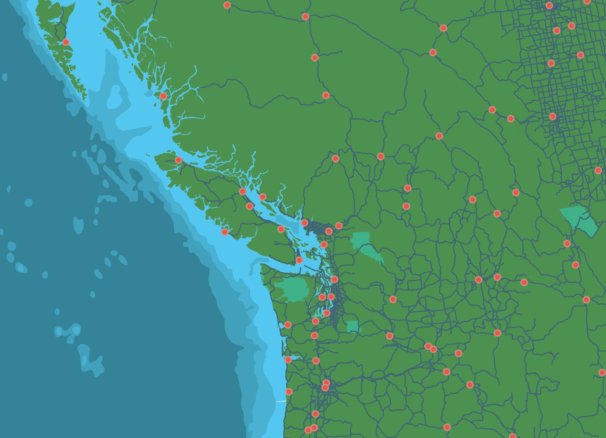
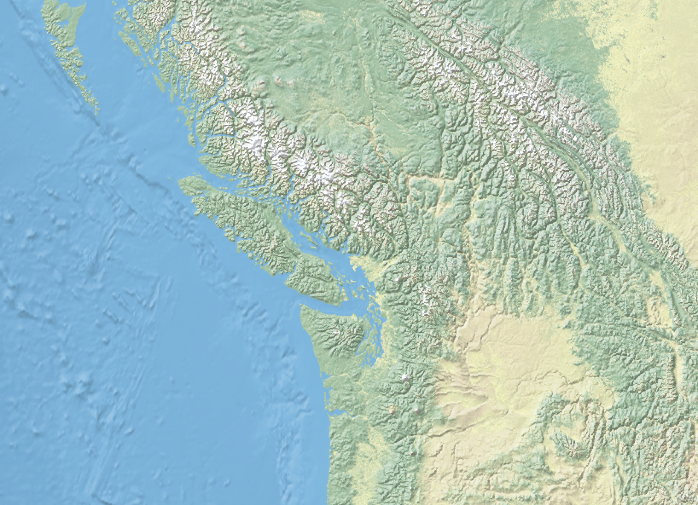
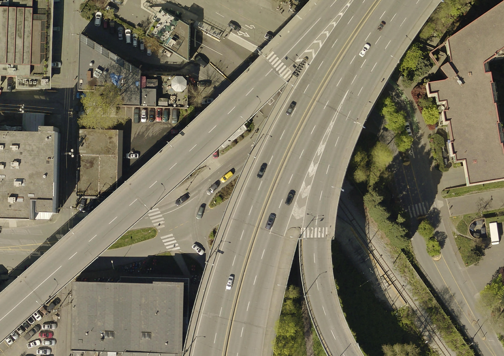

# Spatial data and the DHSI course dataset

What is spatial data? Spatial data, sometimes called 'geospatial data', is data that has locational information, most often coordinate points. 

If your data - not explicitly spatial, but has place names or addresses, can be made legible to tools and platforms meant to read spatial data. also note on historical data - georeferencing. doesnt mean its not spatial data, just that the spatial componant isn't legible (yet) to tools/platforms/software designed to read in spatial data. 

<!-- Just like text documents require specific software to open and edit them, spatial data require certain software to open them. throughout the course of this week, you will learn different tools and plaftforms for visualizing spatial data. The main kind of software for visualizing, analyzing, and modifying spatial data is Geographic Information System, or a GIS. we will talk more about GIS tomorrow.  -->

 <!-- how to explain this without discussing a GIS? or, could discuss a gis, as in, a gis, like a text editor, allows you to visualize, modify, and analyze spatial data files. tomorrow we will talk more about a GIS.  -->

<!-- A Geographic Information System (GIS) works with data that is tied to a location on Earth. This type of data is often referred to as "spatial data", "geospatial data", or even "GIS data", and is spatially referenced using location information — most commonly geographic coordinates. A GIS uses this location information to project a geospatial file into a virtual geographic space where it can then be visualized and manipulated. If your data's locative information is in the form of text — for example, country/city names or street addresses — this can be made legible to a GIS with a few extra steps (see [geocoding](https://ubc-library-rc.github.io/gis-plugins-qgis/content/geocoding.html)). You may have to create new columns and populate them with coordinate information.  -->

## Raster vs. Vector Data
There are 2 main types of spatial data: **vector** and **raster**. 
        
**Raster data** is data which is made up of pixels arranged in a grid, whereas **vector data** is made up of vertices and the paths between them that create geometries representing real-world features. If you're working with continuous geospatial phenomena such as satellite imagery, topography, or climatic data (like rainfall or temperature), you're likely using raster data. If you’re working with points, lines, or polygons, that’s likely vector data.

### Vector Data
Each vector dataset will contain *either* points, lines, or polygons. However, a dataset can include multiple features (either points, lines, or polygons). For example, below are a handful of vector datasets, including Vancouver neighborhoods (polygons), city blocks (polygons), restaurants (points) and streets (lines). A GIS allows you to add multiple datasets, layer them on top of each other, and run calculations between them. For instance, in a GIS, you could load in the below datasets and then use spatial analysis tools to learn how many restaurants are within your neighborhood, or within 10 blocks of you. 

 

 
 
 

In another example, below is a map consisting of three layers of vector data: cities (points), major roads (lines), and land/water (polygons). Cities, roads, land, and water are all different datasets consisting of vector data.

 

Each feature (each polygon, point, or line within a given dataset of points, lines, or polygons) contains various information such as a unique identifier, the area in square kilometers or length, the name, the population, etc. These attributes can be explored from within a GIS by opening what's called the Attribute Table.

### Raster Data

Rasters, on the other hand, can generally only store one value per pixel. This value could be a color representing different kinds of topography (think of the whites, greens, and browns representing different elevations in the image below) or the quantity of something like rainfall or temperature. Multiple rasters *can* be overlaid to generate a multi-part raster, but generally, each pixel of a single raster can store one value meaning your raster is showing one variable. You can also do math between raster layers, or run boolean operations to isolate all pixels that do or do not meet certain criteria. An example of this is Suitability Analysis. 
    

## File Extensions
    
    Just like a textual data can be stored in different formats (.docx, .pdf, .txt, .rtf), spatial data can be stored in different formats. 

Spatial data have different file extensions that you may be used to.

- Raster data will often be [TIF](https://en.wikipedia.org/wiki/TIFF) (aka TIFF) file and have the extention `.tif` or `.tiff`. 

- Vector data come in more diverse file formats. The Shapefile is an industry standard format with the extension `.shp` (and a host of "sidecar files" — be sure to keep them all together). Shapefiles store data in binary. Therefore, shapefiles are not legible to human eyes and can only be opened and visualized by a GIS. GeoJSON, on the other hand, stores vector data in `.geojson` files that can be opened in a code editor or online in [geojson.io](https://geojson.io/). From there, geoJSON can easily be parsed with human eyes.

Spatial data might even be stored in an excel sheet or `.csv` file. See [here](https://ubc-library-rc.github.io/gis-reference-mapping/content/hands-on7.html) for documentation outlining how to add CSV data as a layer to a QGIS project. 

See [here](https://gisgeography.com/gis-formats/) for an exhaustive list of formats spatial data can take. Although the nuance of file formats might seem too detail oriented for an introduction to reference mapping, being aware of different spatial data types and formats will help you know what to download and troubleshoot why something may not be opening/working. If you have no prior experience with spatial data, this may be quite overwhelming right now. However, with a little bit of practical experience under your belt file formatting will quickly become common sense to you. 

 

<!-- #### More Resources
- [Considerations for downloading data](https://ubc-library-rc.github.io/gis-spatial-stories/content/resources-for-data-assembly.html) 
- [Adding CSV data to QGIS](https://ubc-library-rc.github.io/gis-reference-mapping/content/hands-on7.html)
- [Creating new shapefiles in QGIS](https://ubc-library-rc.github.io/gis-reference-mapping/content/hands-on8.html) -->

interoperability 

<!-- 
In a GIS, you can convert raster data to vector data and vector data to raster data, and extract raster values to a vector dataset.  -->

## The DHSI course dataset

