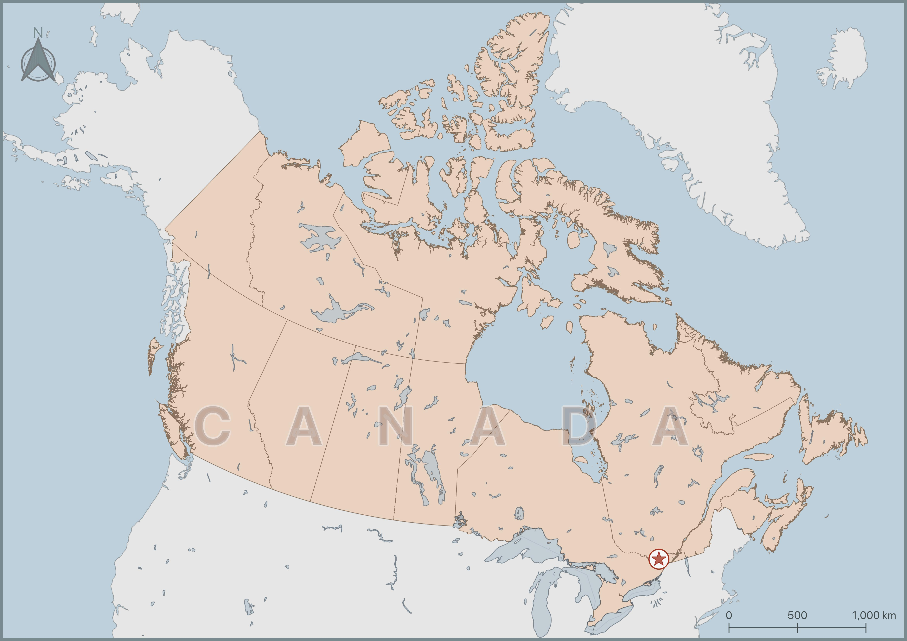
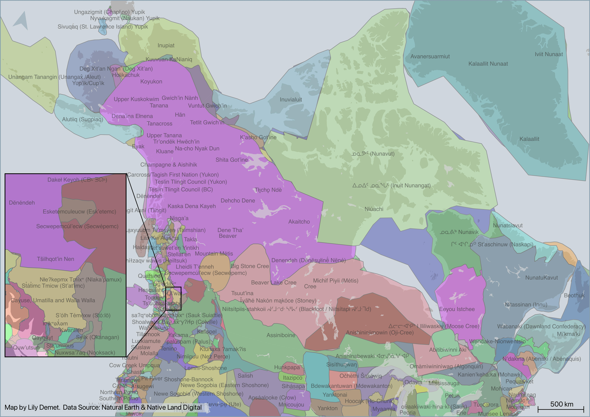
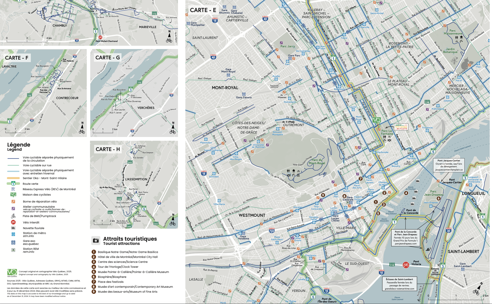
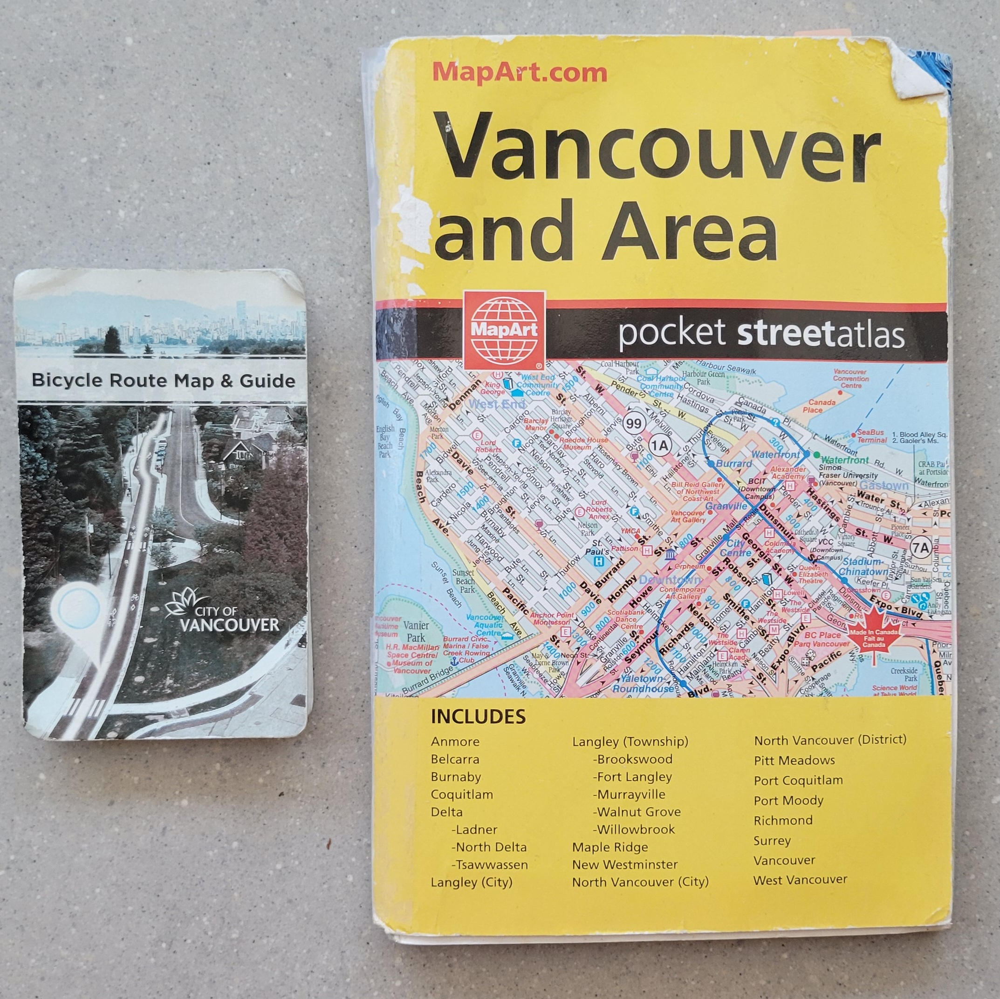
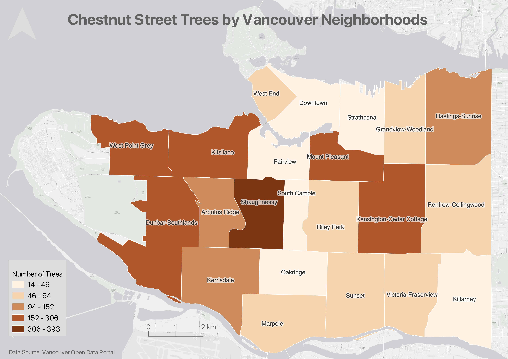
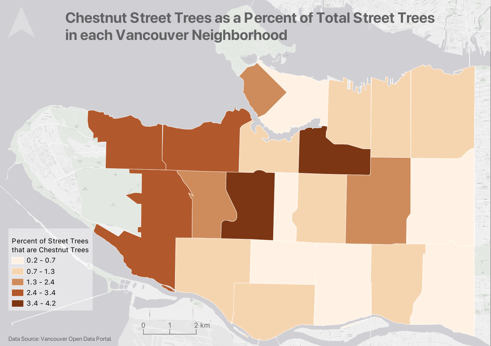
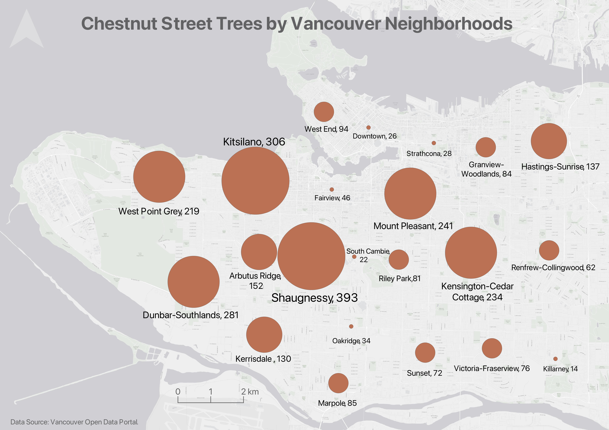
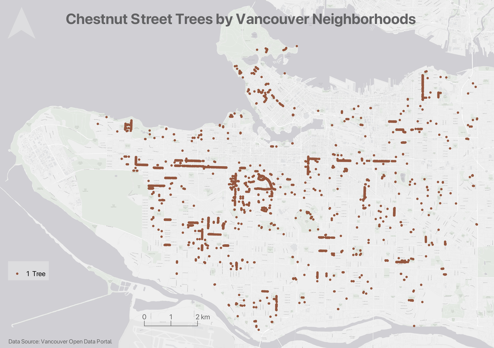
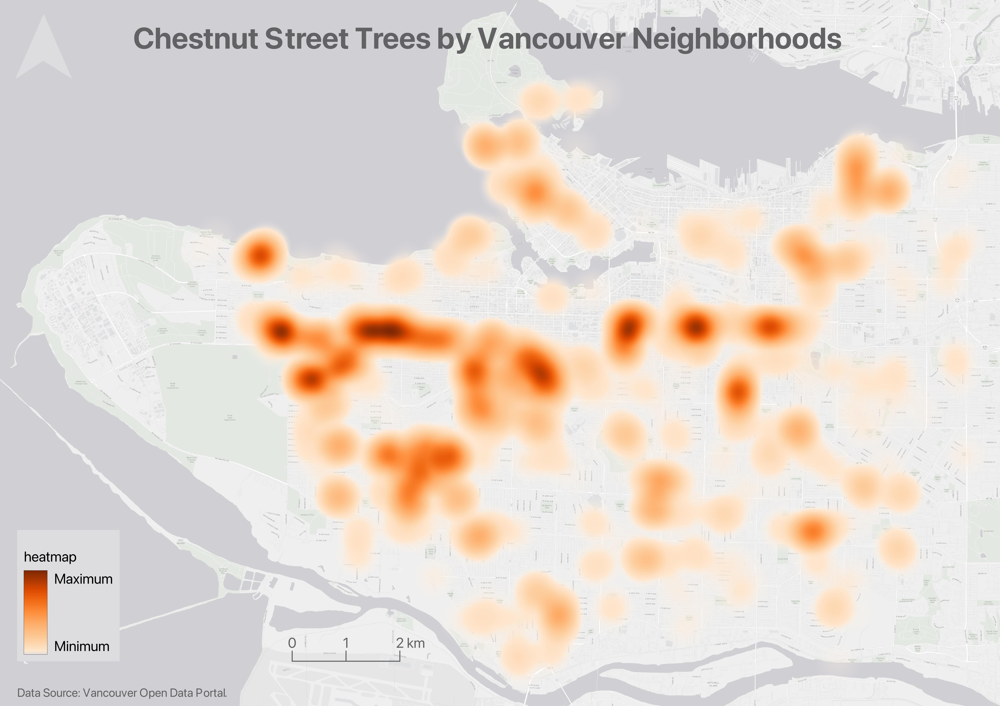
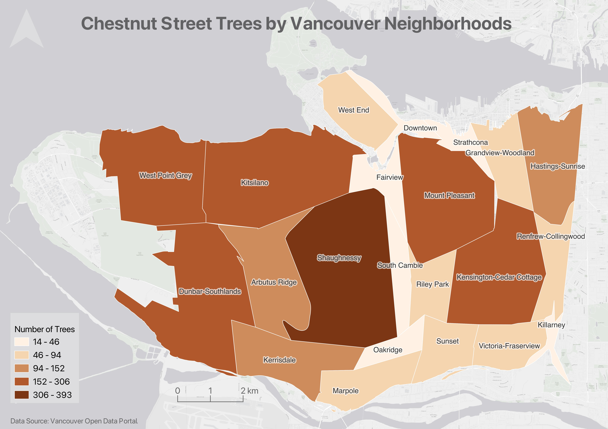

# Thematic vs. Reference maps 
<!-- 
MAYBE THIS SHOULD GO ON DAY 2
Unless - fits in to key concepts in cartography. OR, move whole learning objective to day 2.  -->
Spatial data -> Maps. 

Maps can be physical or digital, static or interactive. However, there are 2 broad categories spatial visualizations can be categorized into: reference maps, thematic maps. Later in the week you'll also be introduced to multimedia narratives that use (often reference) maps and spatial data to tell an interactive story using a web-based platform. 

Let's review the two main kinds of maps: reference maps and thematic maps. Reference maps are descriptive, showing “the lay of the land”, whereas thematic maps render the results of spatial analysis

## Reference Maps
**Reference maps** show the lay of the land, such as the geographic context surrounding your research location or area of interest. Reference maps can be as simple as a drop pin location, or more complex with data layers, labelling, and insets. Reference maps, like any map, should have at minimum an explanatory title, north arrow, scale, legend, map author and data source statement. If there are only one or two data layers which are intuitively symbolized and clearly marked, a legend is sometimes unnecessary.

<!-- These examples are of course all static reference maps.  -->

**Insets**, which are maps nested within maps, either zoom-in to show a particular area in greater detail or zoom-out to contextualize the area of interest within broader geographical context.

Satellite imagery 

Other reference maps include road atlases, pocket atlases, or transport specific maps such as the below cycling map of Vancouver and Montreal. The reference map most often used in your everyday is Google Maps.

[Vancouver cycling map](https://vancouver.ca/streets-transportation/cycling-routes-maps-and-trip-planner.aspx)     

[Vélo Québec Bikeways map](https://www.velo.qc.ca/en/toolkitssss/greater-montreal-bikeway-map/)   

 

----

## Thematic Maps
Another kind of map is a thematic map. Writes Statistics Canada: “A thematic map shows the spatial distribution of one or more specific data themes for standard geographic areas.” 

### Choropleth maps

IF I HAVE TIME I COULD CHANGE THE EXAMPLES TO BE MORE DIGITAL HUMANITIES ORIENTED

Choropleth maps are useful to show and compare the density, frequency, or quantity of a value generalized across standardized geographic areas (such as zip-codes, provinces, or countries). Unless you specifically want to emphasize differences in total number of events/data points, it is best practice to normalize your data when choropleth mapping. Normalization is when you divide the values for each geographic area by something like the area in square kilometers or total population of that area. For instance, mapping winter flu cases across census tracts in British Columbia, you’d want to normalize the total cases in each census tract by that tract’s total population. Normalization enables better comparison across multiple geographic areas.

### Proportional Symbol maps
Proportional symbol maps are useful to visualize the quantity of something across respective locations. Choropleth maps use a color gradient to convey value differentials, whereas proportional symbol maps use symbol size. Proportional symbols are quite intuitive, and can be combined with other parameters like color and lettering size to provide rich spatial information. Proportional symbols can even be layered atop a choropleth map.

Note: In most cases you do not normalize values when using proportional symbols, as that would reduce the range in difference. If anything, it can be useful to exaggerate the range slightly. While Absolute Scaling renders symbols increasingly larger along a linear scale, Perceptual/Apparent Scaling compensates for the eye’s tendency to reduce difference in sizes close together.

### Dot Density maps
Dot density maps are useful to show the concentration and distribution of discrete incidents. Each dot can represent an event (e.g., an earthquake), or a multiple such as 10. Dot Density maps can over-simplify.

### Heatmaps
Useful to show intensity or frequency of occurrence. Heatmaps can be thought about as generalized dot density maps.

### Cartograms
Cartograms distort area to emphasize the value associated with a geographic region. When using cartograms, it’s important to consider whether your audience is already familiar with the un-distorted geography, otherwise they might not glean the added information.

There is a case to be made that all maps are thematic, as the definition of boundaries, borders, names, etc. is a political - and almost always contested - act. In other words, there are no neutral maps that simply, impartially, represent an objective reality or truth. See Crampton and Krygier (2006) or Harley 1992 (1992) for a seminal introduction to critical cartography, or Wang and Liu (2022) for an overview of critical cartography and GIS through the last several decades. See also the classic by Denis Wood, The Power of Maps.

### Univeriate vs multivariate 

### Static maps vs web maps
All the above maps just introduced are static maps. On day 3, we will explore web maps. web maps such as xyz are interactive, on the web, xyz. however, webmaps can still be either reference or thematic. 