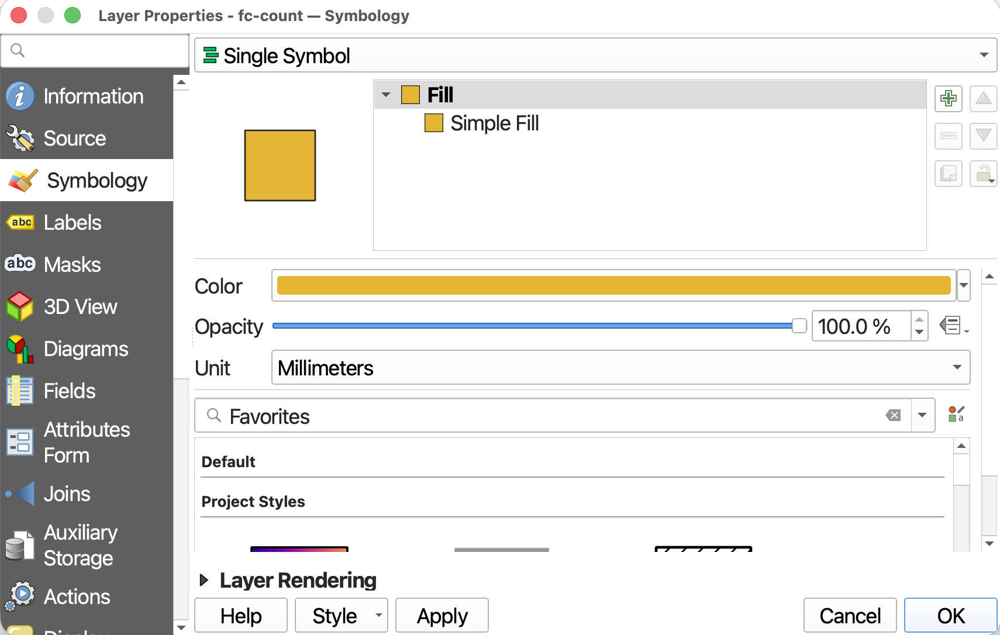
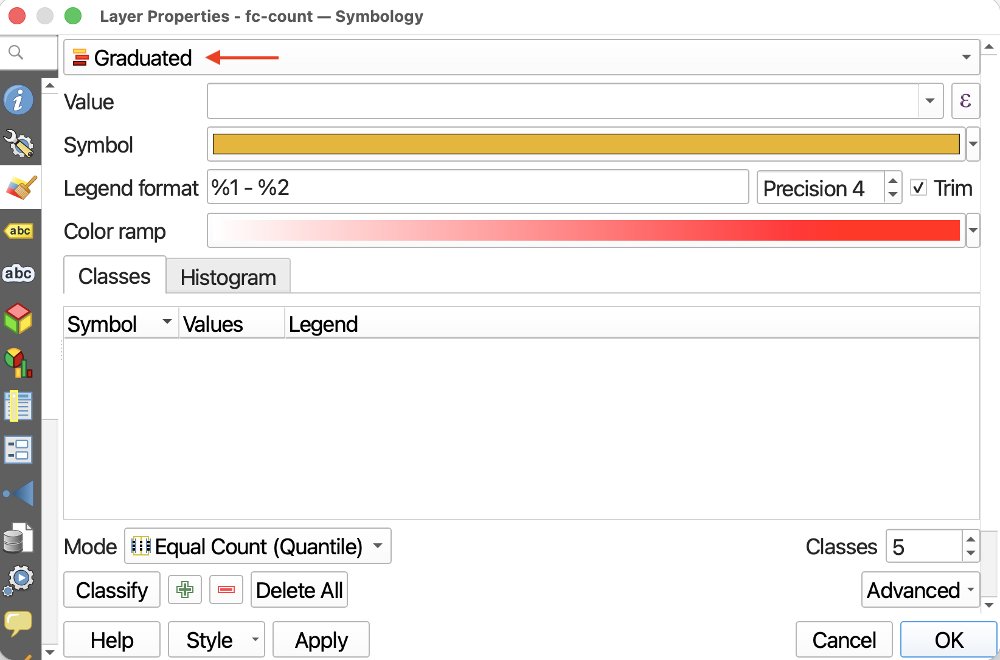
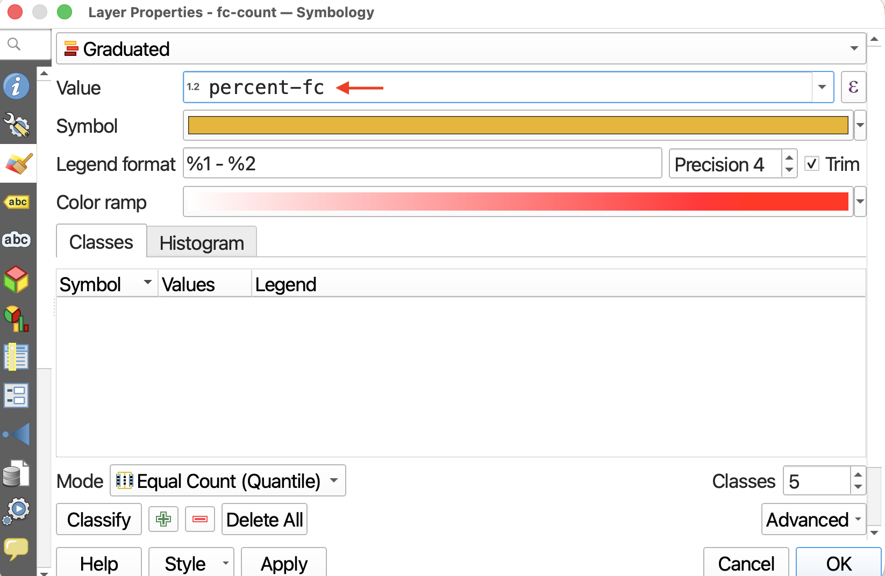
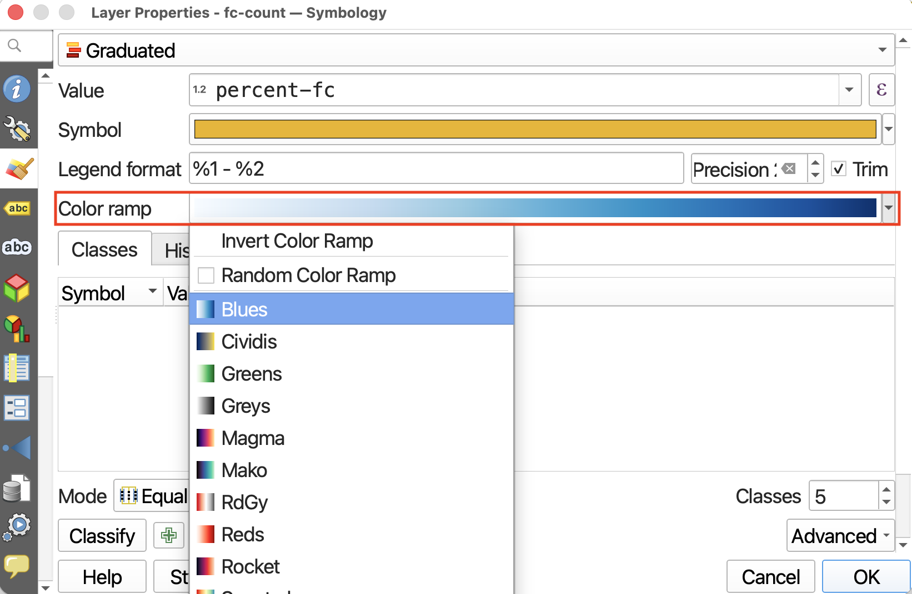
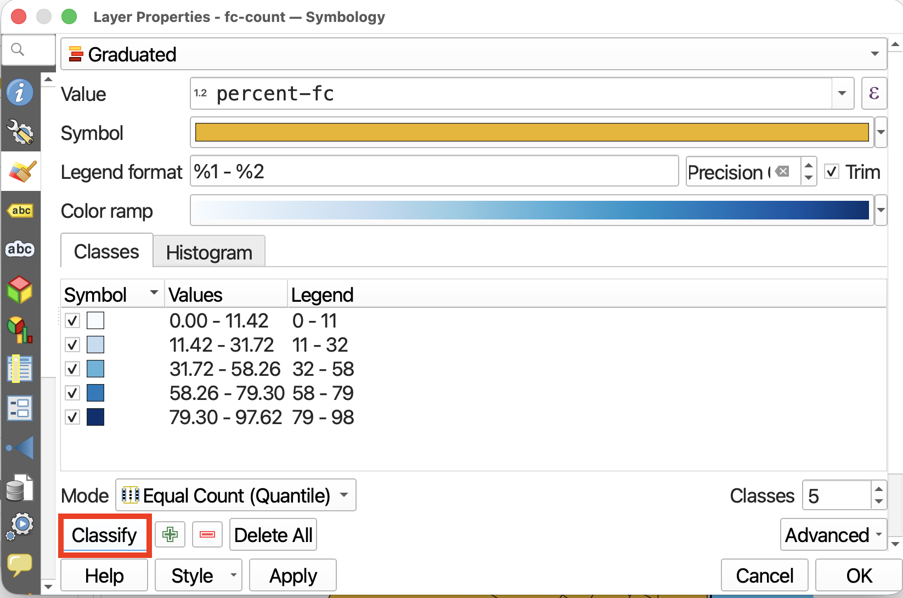
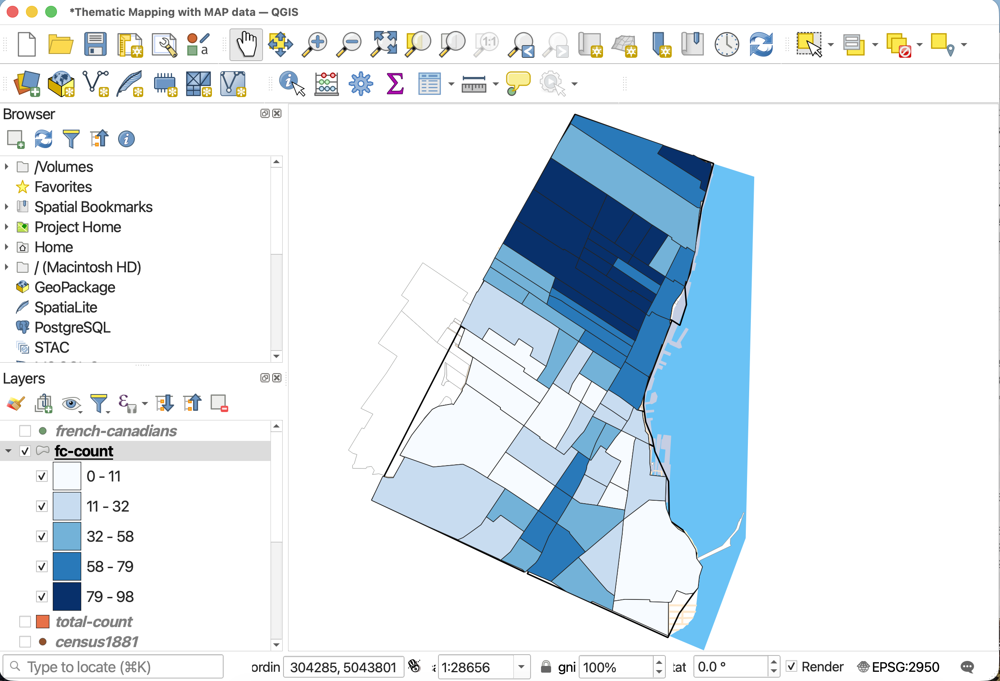
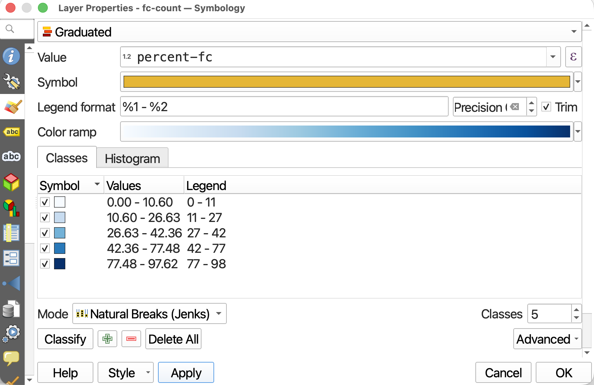
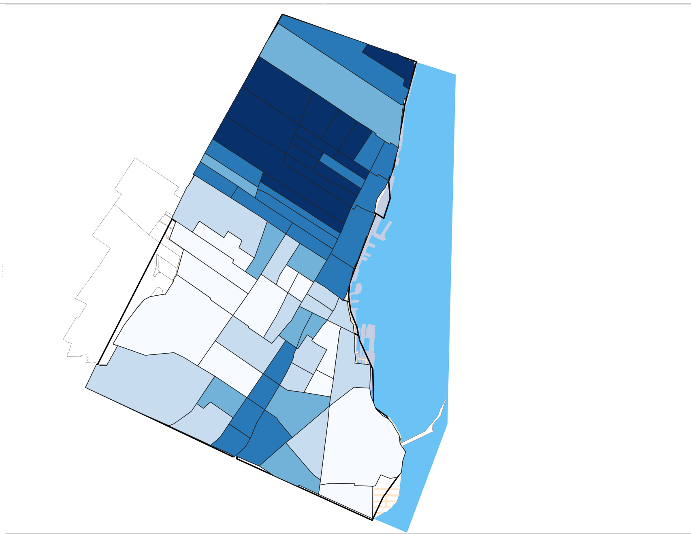
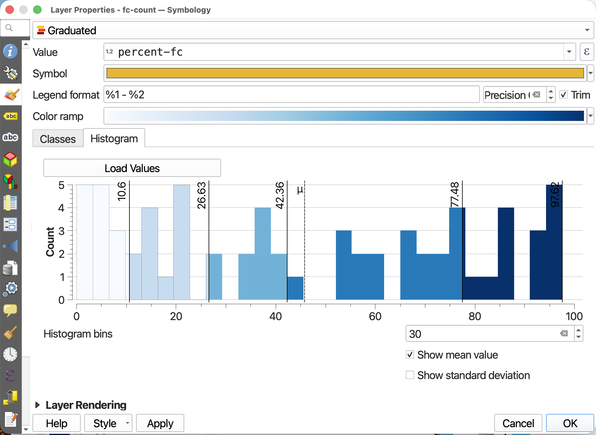

# Choropleth Symbology
As it is, we can't glean any information regarding the spatial distribution of French Canadians in Historic Montreal by simply looking at `fc-count`. So, what we need to do is change the Layer **Symbology**  to render visible the values in the `percent-fc` field. We can use either color or symbols to convey the range of total trees. Let's begin by making a choropleth map, using a color gradient to visualize the percentage of the population that are French Canadian in each historic census tract.

----

## 

*1*{: .circle .circle-yellow} Remove or turn off all point layers. Turn off `total-pop` for now. Then, open the symbology for `fc-count`. 
<!-- In the Layers Panel, right-click on `vanHoodsCount` and go to **Properties**. Then, in the Layer Properties window, navigate to the **Symbology** tab.  -->

 

*2*{: .circle .circle-yellow} At the very top, we can see that the symbology is set to **Single Symbol**. This means every feature in the dataset is rendered in the same color. Since we want to show a range of values, we need to change the symbology. Click on Single Symbol and from the drop-down, choose **Graduated**. This will allow you to symbolize each neighbourhood along a gradient of color, with darker colors representing more trees and lighter colors representing fewer. 

 

*3*{: .circle .circle-yellow} Set the **Value** to `fc-percent`. This tells QGIS which numerical field to visualize. (If nothing shows up, check the attribute table of `fc-count` to ensure `percent-fc` is a numerical field.) 

Notice that you can choose any numerical field. You could make a choropleth map of total population. 

 

*4*{: .circle .circle-yellow} **Precision** refers to how many decimals you want to include, and checking the **Trim** box removes trailing zeros from the legend. You can change the precision here to include fewer decimal places than the column originally has. 

<!-- Because we are dealing with whole numbers of trees, so long as Trim is checked it doesn’t matter the precision. -->

 

*5*{: .circle .circle-yellow} You can select a color ramp from the given options, or design your own. Hover over “All Color Ramps” to see all options. For now, change the color ramp to **blues**. 

 

*6*{: .circle .circle-yellow} So far, we’ve set up the symbology but we have to apply it to our values. Click **Classify** to classify the `percent-fc` values. 

 

Then, click **Apply** to see your map change. Only after clicking **Classify** and then **Apply** will you see the results.

 

*7*{: .circle .circle-yellow} While the default classification mode is set to Equal Count (Quantile), you can choose amongst different classification modes. Classification modes determine how the distribution of data are grouped or “classified”, and therefore which values are associated with which colors. Read more about different classification modes [here](https://pro.arcgis.com/en/pro-app/latest/help/mapping/layer-properties/data-classification-methods.htm).

- Change the classification **Mode** to **Natural Breaks (Jenks)**. Then hit **Apply**. 
- You can also increase or decrease the number of classes, though between 5 and 7 is best practice. For today, keep the number of **Classes** set to **5**. 

- If you toggle to the **Histogram** tab, you can click **Load Values** to see the distribution of `percent-fc` values. The X-axis indicates percentage French Canadian population, whereas the Y-axis, “Count”, refers to the number of census tracts with this percentage French Canadians. The number of bins refers to how granularly the number line is broken down. 

 

*8*{: .circle .circle-yellow} Click **Apply** again and drag/resize your symbology window so you can see your map canvas. When you are satisfied, click **OK** and close the Layer Properties/Symbology window.

---

Congratulations! You've made a choropleth map!

---