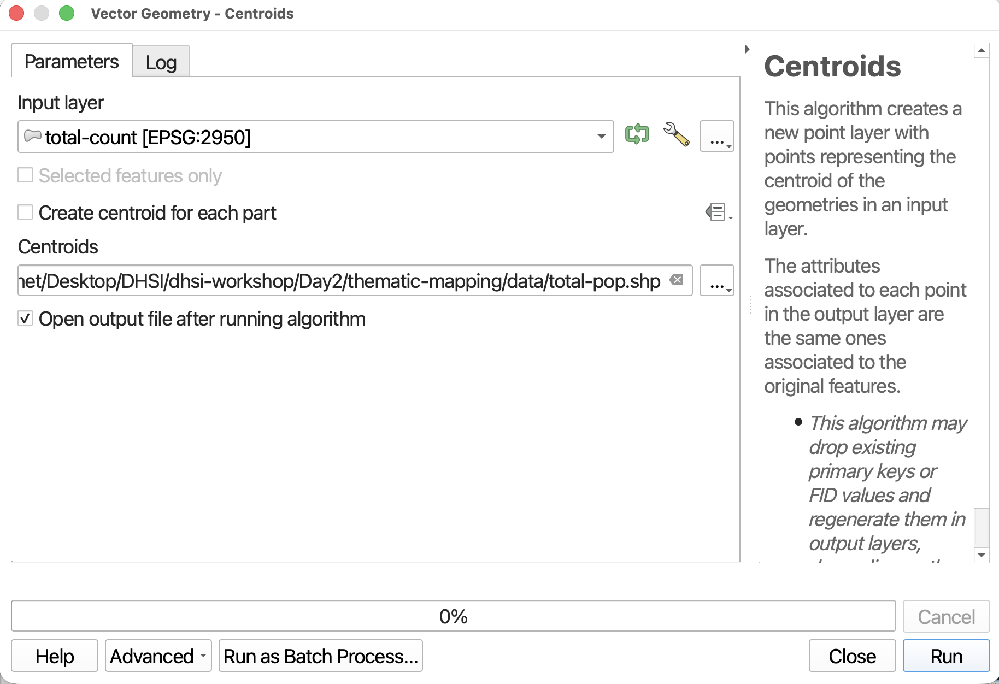
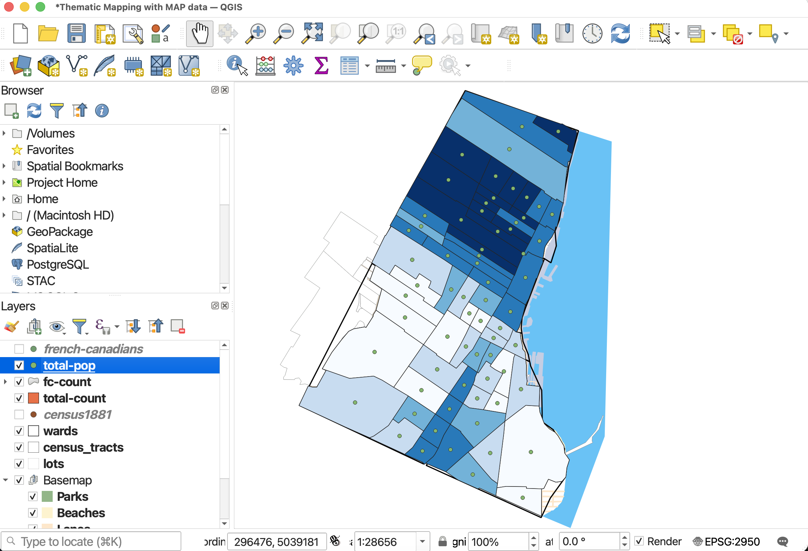
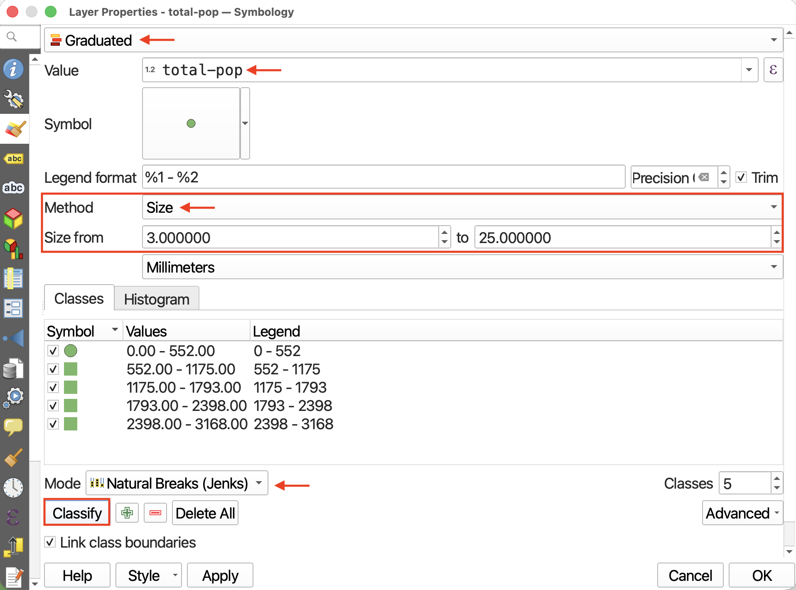
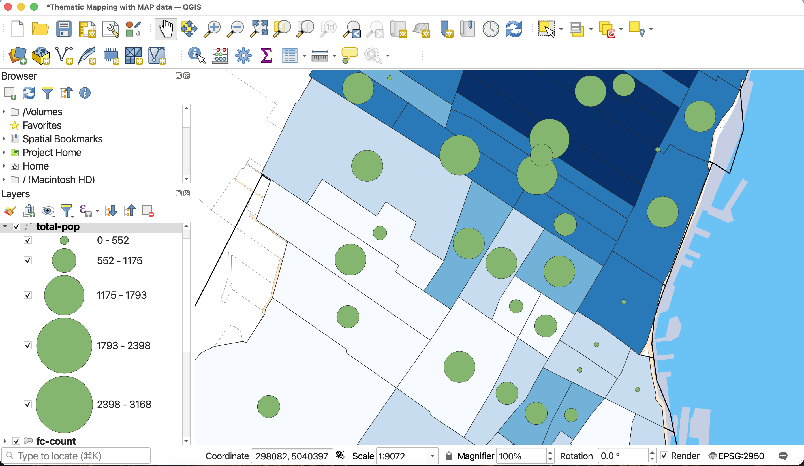

# Making a Proportional Symbol Map
Now, let's use symbols visualize total population in each census tract. The map will be busy since census tracts are so small and may of them, but this is just to demonstrate the workflow. 

<!-- Let's make a proportional symbol map of total fc per census tract? or ward?  -->

----

## Convert polygons to points 
You can make proportional symbol maps in QGIS simply by applying a **graduated symbology** to a *point layer*, where each point represents a standard geographic area *and contains the value of interest*. 

In the **Processing Toolbox**, search for the tool called **Centroids**. It should be under **Vector Geometry**. 

Run the **Centroids** tool with the following parameters:

- **Input layer**: `total-count`
- Save the output layer as a file to your `dhsi-workshop/Day2/thematic-mapping/data` folder, and call it `total-pop`. 
- Do NOT check make centroids for each. this will create multiple files. 
<!-- To save the output file as a permanant layer even before running the tool,  -->

 

## Adjust Symbology to Graduated by Size

If not automatically added to your map, load `total-pop`. Open the layer **Symbology**. 

- Change the symbology type to **Graduated**.
- Set the **Value** to `total-pop`.
- Then, change **Method** to **Size**.
- Change the minimum size to **3**mm and the maximum size to at least **20**mm. 
- Change the classification mode to **Natural Breaks (Jenks)**. 
- To change the symbol symbology, click on Symbol option and then select “Simple Marker”.

  

  

Then, hit **Classify** and **Apply**. Then close the Properties window and return to the main QGIS interface. 

 

<!-- Again, this is messy but just to show workflow.  -->

 

#### Resources for Proportional Symbol Mapping
- [Axis Map's guide to Proportional Symbols](https://www.axismaps.com/guide/proportional-symbols){:target="_blank"}
- Another UBC Research Common's [tutorial on Proportional Symbol Mapping](https://ubc-library-rc.github.io/gis-reference-mapping/content/hands-on12.html){:target="_blank"}, including guide to sizing proportional symbols by hand in an illustration software.
- [Perceptual Scaling of Map Symbols](https://makingmaps.net/2007/08/28/perceptual-scaling-of-map-symbols/){:target="_blank"} by John Krygier.

