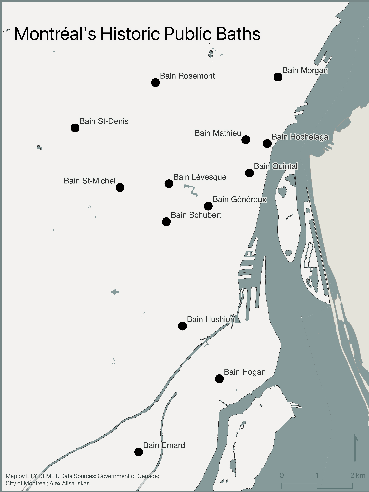
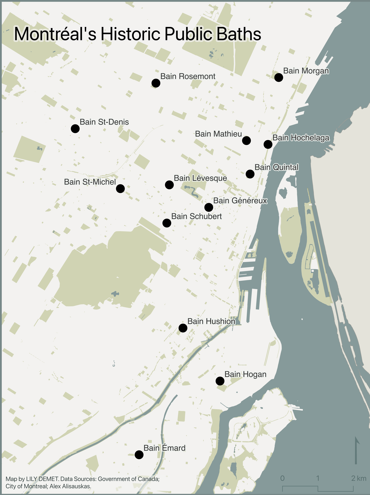
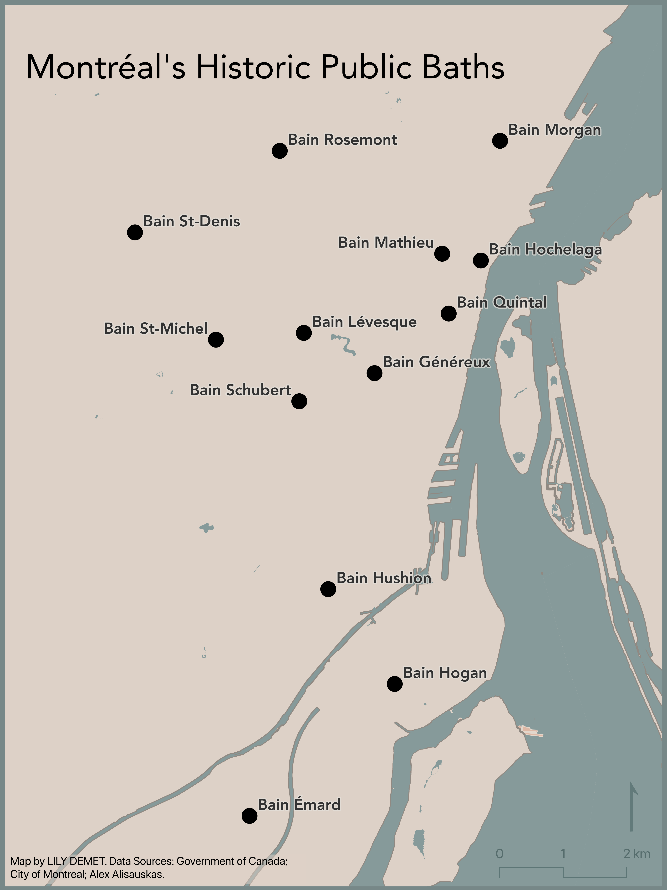
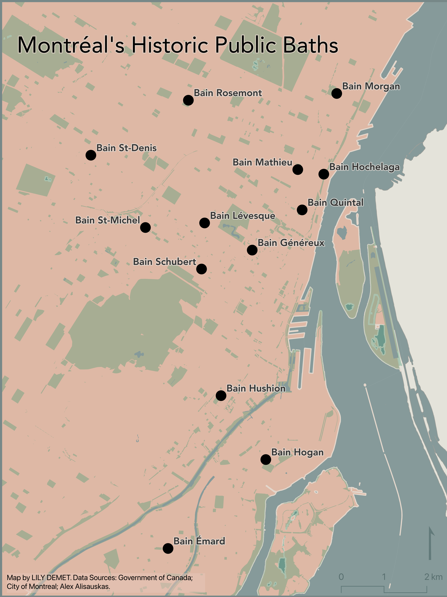

# Reference Mapping

As a reminder, **reference maps** show the lay of the land, such as the geographic context surrounding your research location or area of interest. Reference maps can be as simple as a drop pin location, or more complex with data layers, labelling, and insets. Like any map, reference maps should have at minimum an explanatory title, north arrow, scale, legend, map author and data source statement. If there are only one or two data layers which are intuitively symbolized and clearly marked, a legend is sometimes unnecessary.
<!-- Reference mapping, while not (necessarily) involving spatial analysis, still requires skill for the final map to look neat and polished.  -->

In what follows you will be guided through gathering data, adding your data to a QGIS project, managing data layers, and creating a reference map for export. Below you can find some examples of reference maps made with the data we'll be using. 

  

#### Resources for Reference Mapping
- Want to go through this tutorial again but with different example data? Check out UBC Library's [Mapping for Academic Publication (Reference Mapping)](https://ubc-library-rc.github.io/gis-reference-mapping/) workshop. 