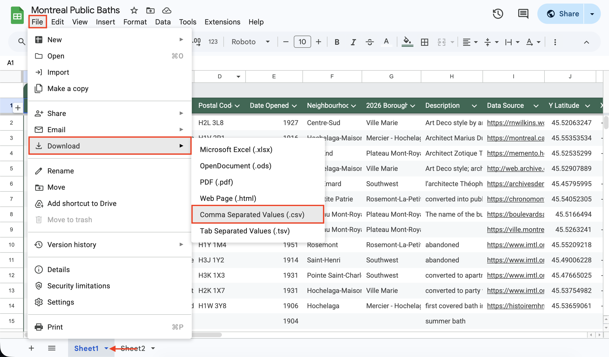
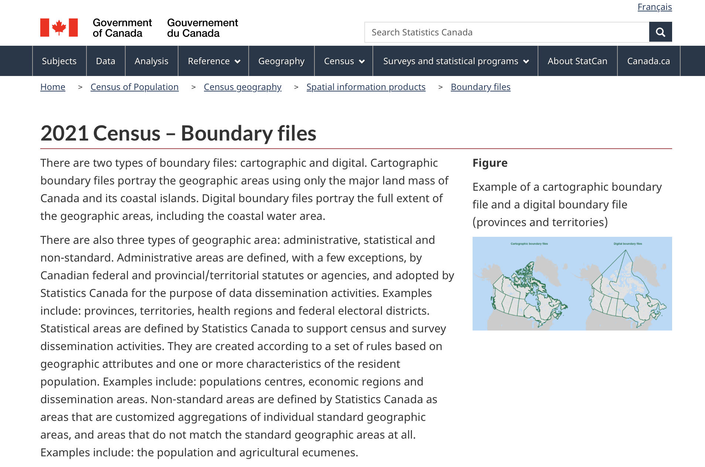
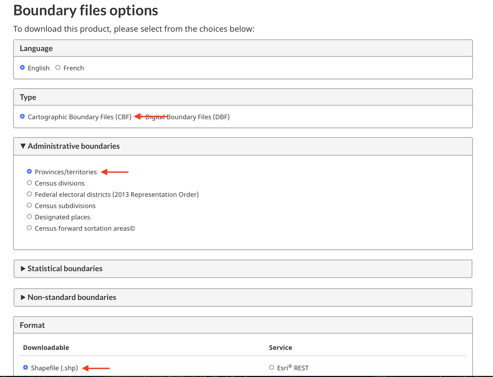
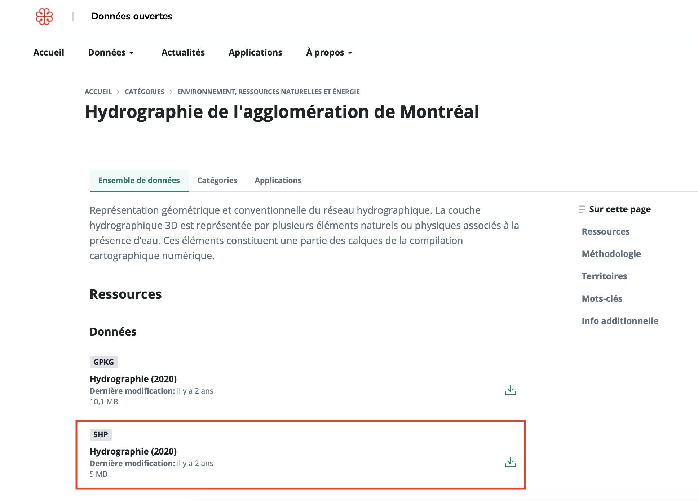
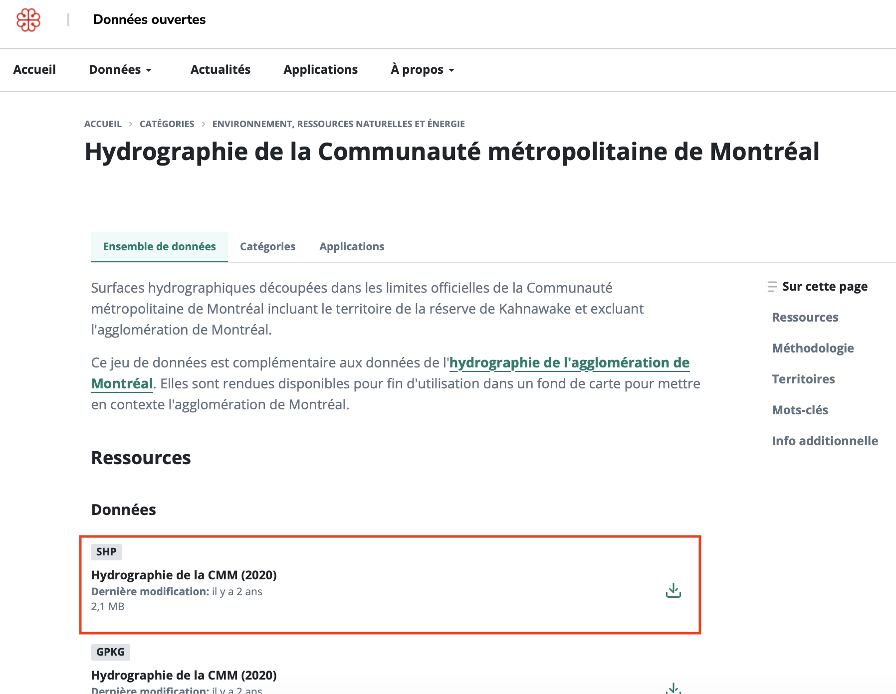
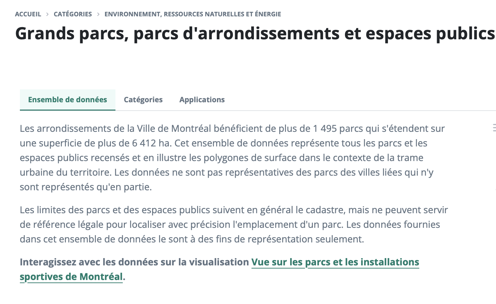
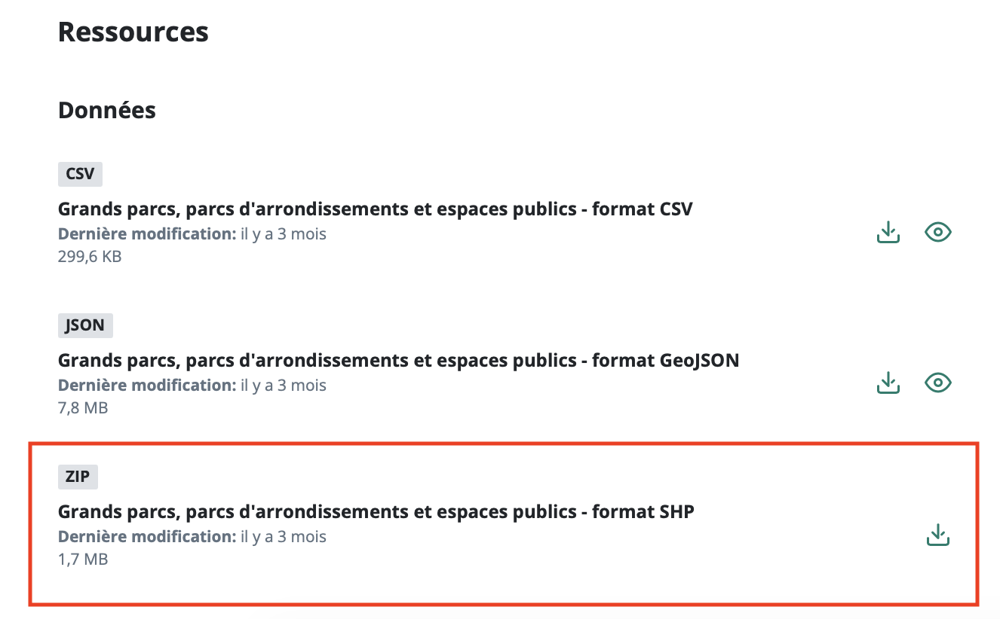

# Gathering Data
{: .no_toc}

This morning you will develop familiarity with the QGIS interface by making a reference map of historic public bath houses in Montréal. However, to give this dataset – put together by Alex Alisauskas — some context, we'll need some more spatial data representing relevant geographic features: the city of Montréal, Canadian provinces, urban green spaces, and water features. We could add a lot more to this list, but for today, let's keep it simple. 

If you look inside the `dhsi-workshop/Day2` folder you'll see subfolders for both this morning and this afternoon. Inside `dhsi-workshop/Day2/reference-mapping` you'll see one shapefile for the city of Montréal (remember, shapefiles have multiple "sidecar" files, so 1 shapefile might appear as a handful of files all named the same thing but with different extensions). This shapefile is a slightly edited version of the Administrative Boundaries of the urban agglomerations of Montreal file, provided by both the [City of Montréal data portal](https://donnees.montreal.ca/dataset/limites-administratives-agglomeration){:target="_blank"} and the [Government of Canada](https://open.canada.ca/data/en/dataset/9797a946-9da8-41ec-8815-f6b276dec7e9){:target="_blank"}. However, there are no other data provided (besides a backup-data folder in case). 

**Because in the real world data is seldom provided neatly packaged, we'll begin this morning's lesson by guiding you in downloading and synthesizing vector data from multiple online sources.**

----

## Montréal's Historic Public Bath Houses
Our data layer will be <a href="https://docs.google.com/spreadsheets/d/11GN2Al7_QNFpcOxBhjVXv0KuP-yv44F1zQZ1KxIE7EM/edit?usp=sharing" target="_blank">Montréal's Historic Public Bath Houses</a>, a dataset created by Alex Alisauskas. Recalling yesterday's discussion of vector data formatting, Alex will now introduce the dataset and explain her process and considerations for making it. Then, she will guide us in exporting it as a `.csv` file called `public-baths`. 

 
 

## Basemap Data

We will download the following shapefiles as contextual data: 

1. [Provincial boundaries](https://www12.statcan.gc.ca/census-recensement/2021/geo/sip-pis/boundary-limites/index2021-eng.cfm?year=21){:target="_blank"};
2. Water features, both the [Hydrography for Montréal agglomerations](https://donnees.montreal.ca/fr/dataset/hydrographie){:target="_blank"} *as well as* [Hydrography for the wider Montréal Metro Area](https://donnees.montreal.ca/fr/dataset/hydrographie-communaute-metropolitaine-montreal){:target="_blank"}; and 
3. [Parks and Green Spaces](https://donnees.montreal.ca/fr/dataset/grands-parcs-parcs-d-arrondissements-et-espaces-publics){:target="_blank"}

Move each dataset you download to `dhsi-workshop/Day2/reference-mapping` and, if it's a zip file, *unzip it* there. You will notice very quickly the varying degrees of data management — for instance, provinces are named `lpr_000b21a_e` and green spaces are in a folder simply called `shapefile`. Keep this in mind when you create your own data or work on your own project.

If you have any trouble downloading the data, we've created a `backup-data` folder with all the necessary files zipped. Just be sure to unzip the files before trying to use them. 
{: .note}

### 1. Download Provincial Boundaries
We'll download [provincial boundaries](https://www12.statcan.gc.ca/census-recensement/2021/geo/sip-pis/boundary-limites/index2021-eng.cfm?year=21){:target="_blank"} from census data hosted by the Government of Canada's data portal. The website calls it **2021 Census – Boundary files**. 

 

### 2. Download Water Features
We'll download two sets of water features from the City of Montréal's data portal, one for the 
[City of Montréal](https://donnees.montreal.ca/fr/dataset/hydrographie){:target="_blank"} *as well as* the [Montréal Metro Area](https://donnees.montreal.ca/fr/dataset/hydrographie-communaute-metropolitaine-montreal). Use the same process for each. **Make sure you download the shapefile (`.SHP`) for both — the shapefiles are listed in different orders for each dataset.**

 

 

### 3. Download Green Spaces
We'll download [Parks and Green Spaces](https://donnees.montreal.ca/fr/dataset/grands-parcs-parcs-d-arrondissements-et-espaces-publics){:target="_blank"} also from the city of Montréal's data portal. Note that the format for shapefile will show ZIP. This is simply a shapefile stored in a compressed folder you'll have to unzip once you download and move it into `dhsi-workshop/Day2/reference-mapping`.

 
 

 

Be sure to move all downloads into the folder `dhsi-workshop/Day2/reference-mapping` and unzip any compressed files. 
{: .warn}

