# Project Set-up
{: .no_toc}

Before we begin mapping, let's take a moment to familiarize ourselves with the QGIS interface by way of project set-up. QGIS can be opened by opening a prepared QGIS project file, or simply by launching the application. **This morning we'll start from scratch so that you can practice setting up a project as you would in the real world.**  

  

    On this page:
  

  {: .text-delta }
 - TOC
{:toc}

----

## Open & Save a new QGIS project

 

>   **Launch the QGIS application now!** If you have successfully downloaded and installed QGIS, the application should open and look like this:

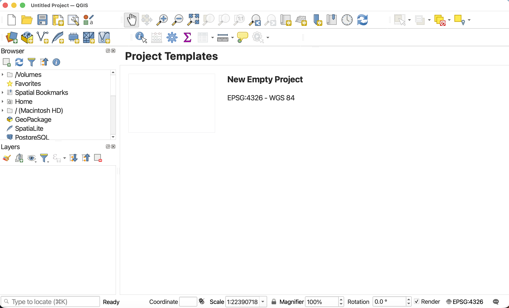

>  **Click new empty project to begin.** 

 

To save your project, navigate to the `Project` Menu at the stop of your screen and go down to "Save". Just like with documents in a text editor, you can also "Save As" to save your project as a new file, thus creating multiple back-up versions of an original.  It is important to regularly save your project while working in case QGIS crashes. 

>  Save this project to the folder `dhsi-workshop/Day3/reference-mapping` as `reference-mapping_YOURNAME.qgz`. Be sure to change the file extension to .qgz. You can learn more about QGIS file formats [here](https://docs.qgis.org/3.34/en/docs/user_manual/appendices/qgis_file_formats.html){:target="_blank"}.

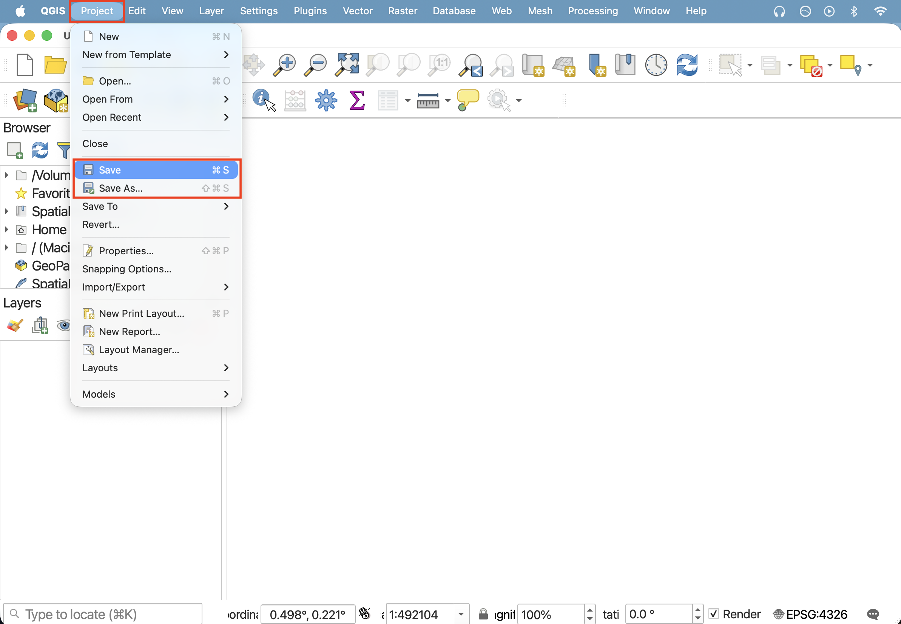
 

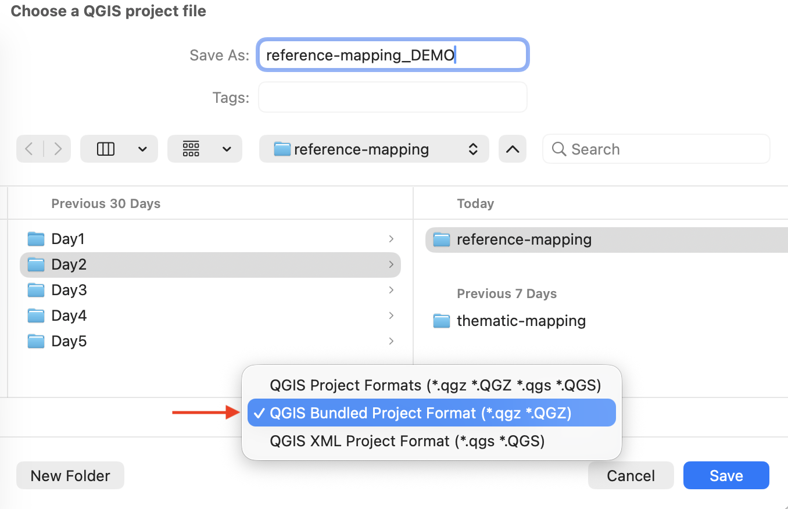

 

Moving forwards, you can also use the save icon in your **Toolbar** to save your project regularly. 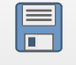

 

## Navigate the Graphical User Interface (GUI) 
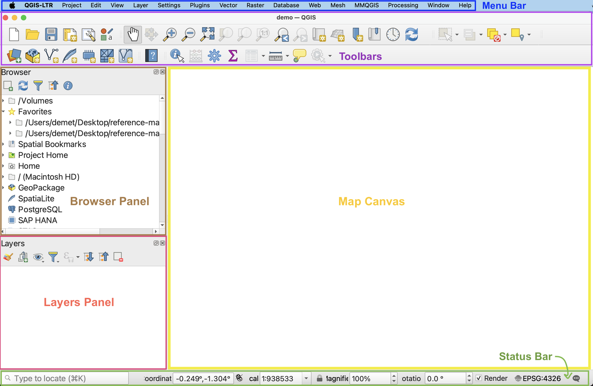

- **Menus** - At the very top of your screen you’ll see menus which, when clicked on, expand to show many more options and even sub-menus. Notice that these menus are only visible when you’ve clicked into the QGIS application. Though you can drag the application interface around your screen, the menus stay at the top. If you click out of the QGIS application, the menu will disappear. These menus provide easy access to a variety of tools you’ll use in your everyday mapping. Like any new interface, it may take some time to become familiar with what’s stored where.

- **Toolbars** - The toolbar is the area at the top of your QGIS application with all the icons. The toolbar actually contains multiple toolbars, which are groups of icons that, when clicked, allow you to navigate around your map canvas, make click-based selections, edit layer geometries, create spatial bookmarks, and much more. You can customize this area of your GUI to fit your needs, adding and removing sets of tools by clicking on the great area of the toolbar.

- **Browser and Layers Panel** - When you open the project prepared for you, you should see two panels on the left-hand side of your interface. The browser panel lets you easily navigate your file system for data and project files. Your layers panel displays your project’s data layers and provides access to configuration settings. If you ever accidentally close a Panel, you can open it again by going to the View menu at the top of your screen, down to Panels, and then selecting the ones you wish. You can also right-click anywhere in the toolbar’s greyspace and select the Panels and Toolbars you want to show or hide.

- **Status Bar** - The status bar displays current information about the map canvas, and allows you to make adjustments in the map’s scale and rotation.

- **Map Canvas or Map View** - Call it either one. This is where the map is displayed and updated as layers are loaded. You can zoom/pan the map canvas as well as select features and other operations.

 

## Customizing the interface
You can change the look and feel of your GUI, as well as adjust default settings from the menu **QGIS-LTR --> Preferences** or the menu **Settings --> Options.** Both menus are located at the top of your screen when QGIS is open and the application is active (meaning you've clicked anywhere on it). 

The application Options window looks like the image below. Most customizations you'll want to make at this stage will be under "General".     

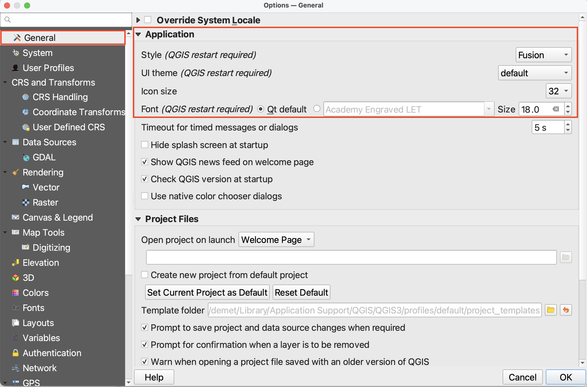

- **Light and Dark mode** - So long as your Style is set to Fusion and UI Theme is set to default, whether your QGIS application is light or dark depends on whether your computer System Settings have Appearance as light or dark. If you change your computer's Appearance settings, be sure quit (saving first, of course) and re-open your QGIS project for the changes to take effect. 

- **Increasing font and icon size** - Make sure to resize the Options dialogue window so you can see the drop-down for "icon size" and "font". (It is particularly difficult to see QGIS drop-down and close window icons in dark mode.) Now you can increase the font and/or icon size. Icon changes will happen as soon as you click OK. Changes in font size won't update until you quit and restart QGIS, so make sure you save your project now. 

 

## Loading Data 
Once you've acquainted yourself with the QGIS interface, it's time to add data you gathered to your project. 

There are a couple ways to add data to your map canvas: 

- **Browser panel** From the Browser panel, likely docked to the left of your screen, expand the `Home` directory (aka folder) and navigate to your workshop data folder. Expand that folder to see the data inside, then double-click or drag and drop each file to add it to your project. Alternatively, you can add a **Favorite** connection in the Browser panel to save you the trouble of finding your data folder. To do this, click “Favorites” at the top of the Browser panel's list and connect the workshop data folder as a favorite directory. Make sure not to click *into*, merely select it. 
- **Data Source Manager** The Data Source Manager is the same sort of portal as the Browser, just in a separate dialogue box rather than a docked panel. You can open the Data Source Manager by double-clicking the 3 colorful squares icon in the Toolbar, or from the Layer menu at the top of your screen.
- **Layer menu** A third way to add layers to your map canvas is through the Layer menu at the top of your screen. Under Layer, navigate to **Add Layer** (it should be the third item down) and select Add Vector Layer... or Add Raster Layer.... This will open the same Data Source Manager dialogue box as before.
- **Drag and drop** files from your data folder directly onto your map canvas. This method is not recommended as it can easily lead to data disorganization. >>> see what it looks like Data - discussed previously. 

To Do
{: .label .label-green }

Drag and drop data from workshop folder to your QGIS project *in the following order*:

1. **Provinces**, a shapefile named `lpr_000b21a_e.shp` from the `lpr_000b21a_e` folder. 
2. **Montréal Admin Boundaries**, a given layer named `montreal.shp`
3. **Parks and Green Spaces**, a shapefile named `Espace_Vert.shp` in the folder `Shapefile`. 
4. And then water features, *specifically* `CARTO_DRA_EAU_JOUR` AND `CARTO_DRA_BASSIN` from the folder `hydrographie-2020`, and `MERN_DRA_HYDROGRAPHIE.shp` from the folder `mern_dra_hydrographie_2020_shapefile`.

Your map canvas will now look like this. 

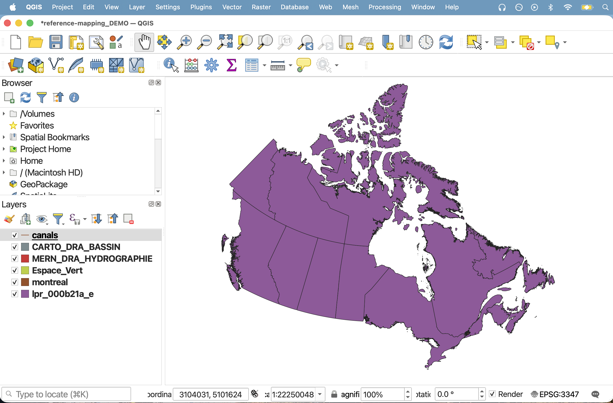

 

Your map canvas has zoomed out to the "Extent" of most geographically expansive layer loaded — provinces. Let's **zoom to Montréal**. Right-click `montreal` in the **Layers Panel** and click **zoom-to**. Don't worry about default colors - we'll learn how to change change them shortly.

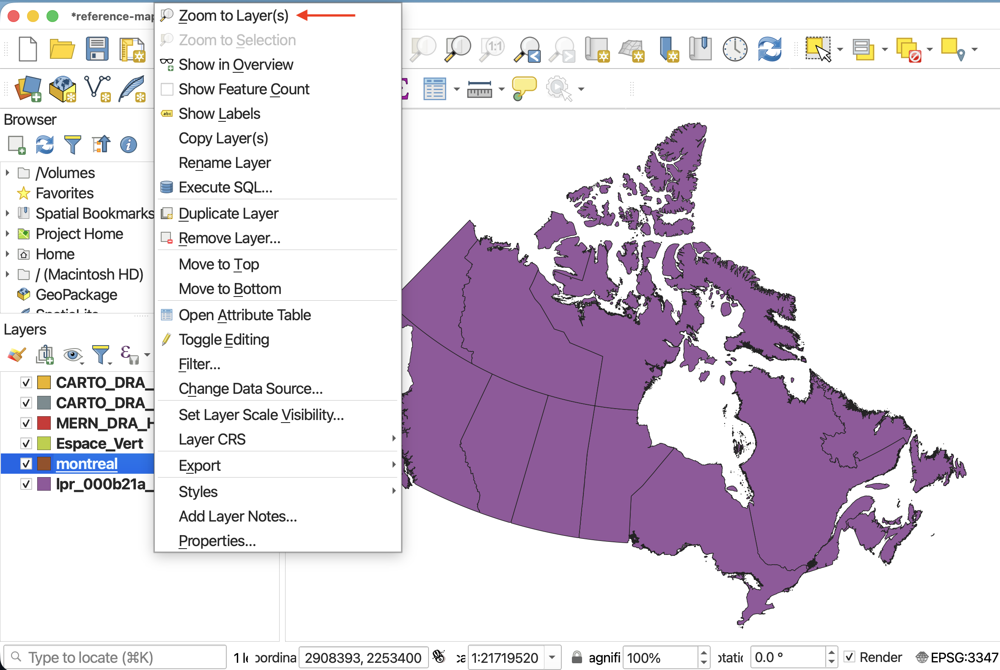
 

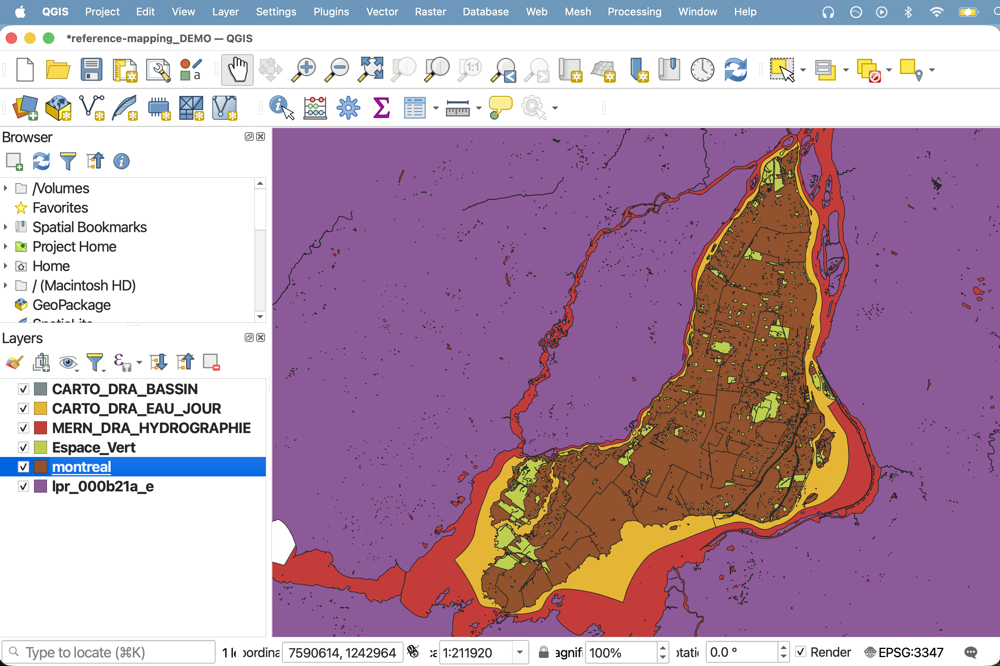

 

 **SAVE YOUR PROJECT**

 

Your data isn't saved _inside_ your QGIS project. Rather, the *filepath connections* are saved, as well as any modifications to symbology made to the layers in QGIS. When mapping in QGIS, it's important to keep track of where the data you're working with is stored. If you move your data, QGIS won't know where to look for it and a red exclamation mark will appear in the Layers Panel. You can click on this warning to tell QGIS where the data is now stored. 
{: .note}

 

## Loading CSV data to QGIS
Tabular data stored in CSV (comma separated value) files can be uploaded to a GIS and rendered spatial so long as latitude and longitude are given in two distinct columns and their values stored as numbers. *Tabular data must be in a CSV file format with latitude and longitude stored as numbers in two separate columns before uploading to QGIS.* 

>  From the **Layer** menu at the top of your screen, go to **Add Layer** -> **Add delimited text layer…**

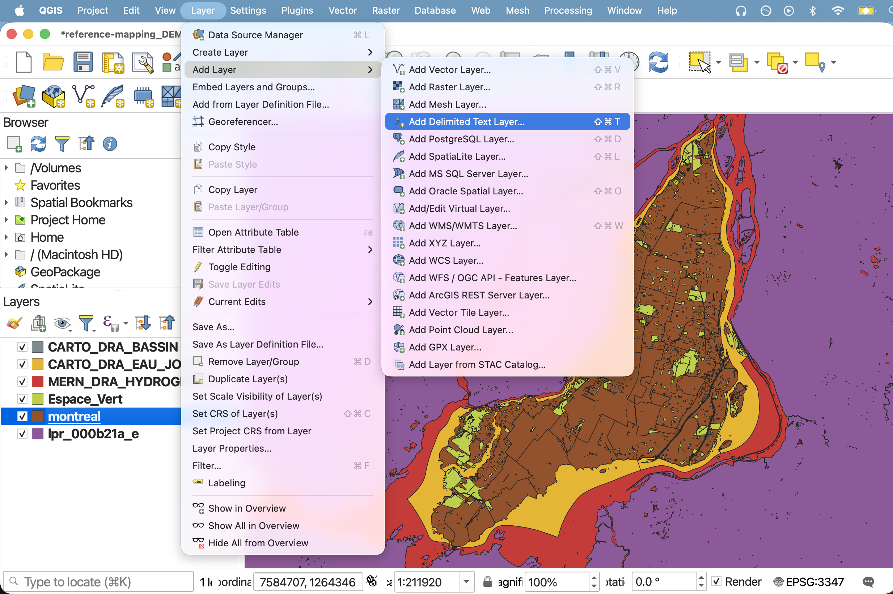

>  The Data Source Manager will open. Click the three dots beside File name to navigate to `public-baths.csv` and select it.

>  Change **Geometry Definition** to Point Coordinates. Now look below to the Sample Data section. This gives a preview of your dataset. The data is difficult to see because you cannot expand it, but scroll horizontally until you reach the last two fields (or whichever fields contain your personal data’s latitude and longitude). If you scroll vertically (I recommend using the up & down arrows, otherwise you may accidentally change the field type), values will be revealed line by line. Ensure the columns for latitude and longitude are being read as Decimal (double), *not* text. 

<!-- Notice for the demo dataset, lat and lon (latitude and longitude) are currently being read as Text (string). Simply click where it says Text (string) and change it to Decimal (double) for both those columns. -->

>  Now return to **Geometry Definition**. Ensure the X field is set to longitude and the Y field is set to latitude. This may seem counter intuitive, but consider what values change as you move towards the north or south pole. As you move up or down towards the north or south pole — in other words, as you change along the Y-axis — you are changing latitudes. If you move east to west around the globe - constituting change in the X-axis direction - you are changing longitude.

> Scroll down and set the `Date opened` field to **Date data** format.

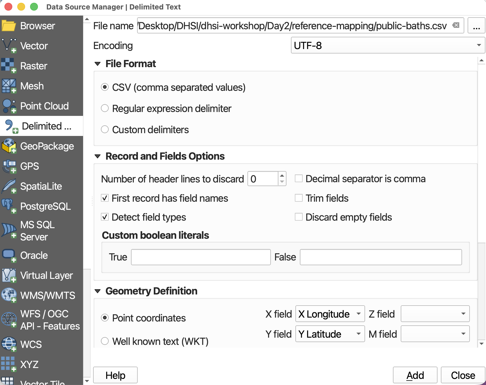

 

>  Now click **Add** at the bottom right-hand corner to add your CSV as a spatial layer to your map. Once you add the layer, the Data Source Manager will not go away, so you’ll have to close it. `public-baths` should now be added to your map canvas.

>  **Zoom-to** the new layer.  

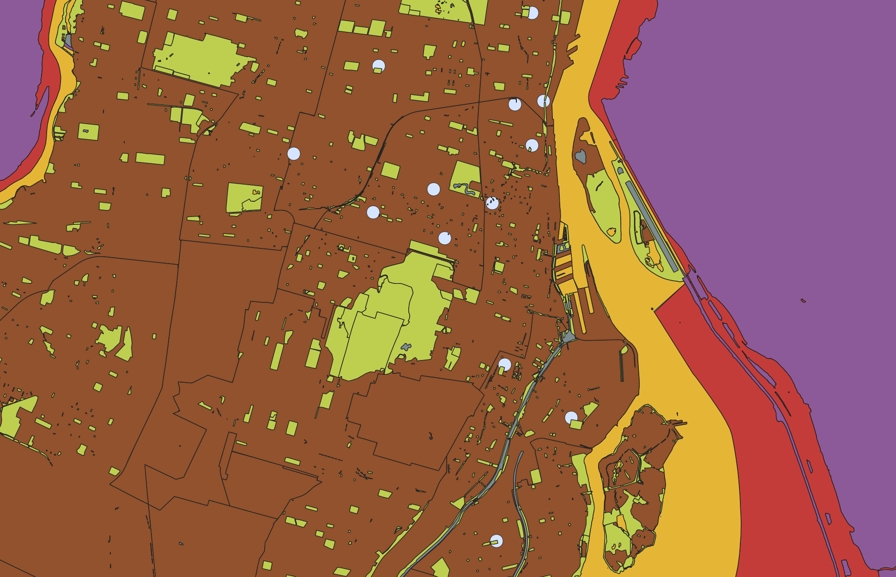

 

Importantly, this file is still a CSV. It's simply been spatialized by QGIS. In order to edit the file, you'll have to export it in a geospatial file format such as a GeoJSON or Shapefile. To export a layer, right-click the layer and go to "Export". Then give it a name and location by clicking the tree dots next to the Layer Name input. Change the file format to GeoJSON. Because this file is point data containing location coordinates, we will set the projection to `WGS84`. 
{: .note}

 

## Interacting with Layers

- 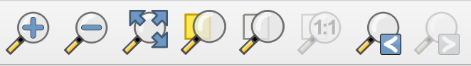 Take a moment to zoom in and out using the **Magnification tools** in your **Toolbar**.  

- 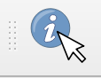To use the Identify tool, click the tool icon in the **Toolbar**, then, with the layer of interested highlighted in your Layers Panel, click on any feature. This will pull up the tabular data associated with that feature (the "row" in the Attribute Table). Use the **Identify tool** to look up the neighborhood names of the layer for Montréal. 

- 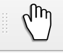 To stop the Identify tool, close the pop-up window and click the **Pan tool**.

 

## Set the Project CRS
<!-- ## Project Properties -->

Now if you zoom out a bit your map might look a little wonky or warped, and the parallel is not straight.  

You can access the Project Properties from the the **Project** menu. Open the Project Properties and click down to **CRS**. You can see the current project CRS is set to `NAD83 / Statistics Canada Lambert`. 

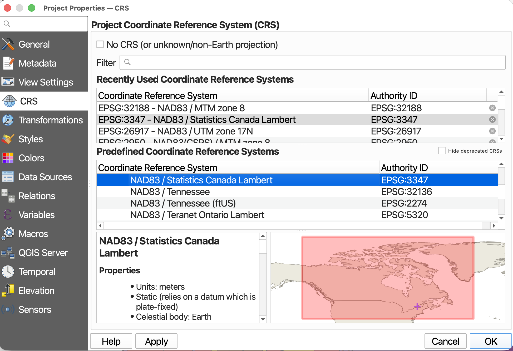

CRS stands for Coordinate Reference System, and describes the mathematics behind transforming a 3-dimensional Earth to fit on a 2-dimensional screen. A projection is part of the Coordinate Reference System, and is responsible for projecting a set of points from a 3-dimensional space onto a 2-dimensional plane. There are a variety of projections, each one preserving some characteristics of shape, area, distance, and direction, while distorting others. When choosing the best projection for your map, it is important to consider the content you are visualizing and the extent of the geographic area. Every spatial data layer comes with its own stored projection, often noted at the point of download. Note: If you don't set a projection at the start, your QGIS project will assume the projection of the first layer you add.

<!-- still need to do-->
You'll notice the project CRS is set to `NAD83 / Statistics Canada Lambert`. This is from the provincial layer, our first layer added. This projection works well for the entirety of Canada, but we can get more specific since we're only looking at Montréal. Change the project CRS to `NAD83 / MTM zone 8`. Much of Montréal's data is stored with this projection. 

>  Click **OK** to any transformation warnings. 

<!-- explain why thats going on.  -->

 <!-- also we do this bc lots of the Montréal data is stored in this projection. (when we do qgis to web we can turn this map into the web map by adding basemap and xyz - will also have to change project projection though - that is if basemap still works/allowed) -->

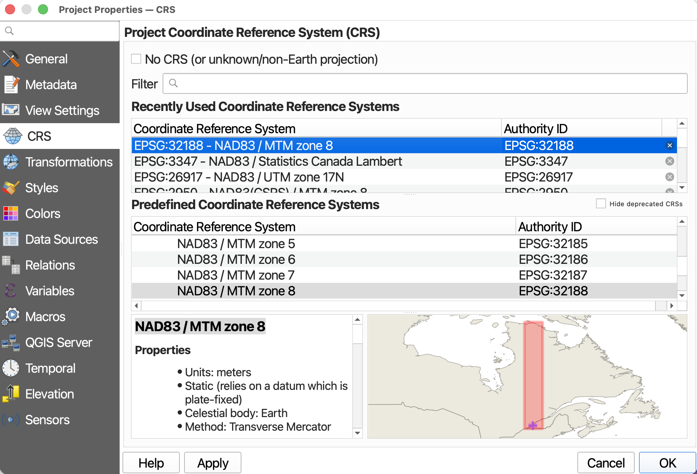

> * If you zoom back out you'll notice the parallel is now straight. 

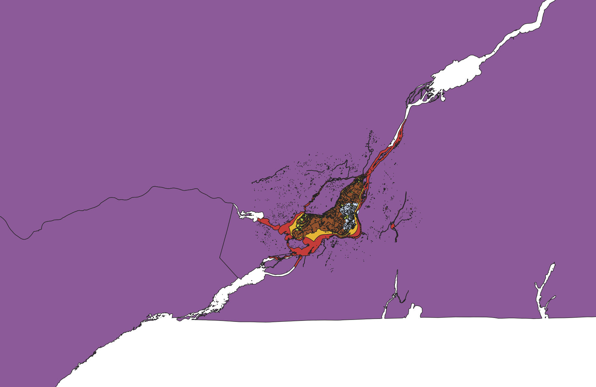

Again, setting the project CRS doesn’t change the stored projection of each layer, only how they are rendered ‘on the fly’ by QGIS. QGIS will reproject all the project layers ‘on the fly’ to match the project CRS. You can change the stored projection of layers with the Warp and Reproject Layer tools.

For more on Coordinate Reference Systems, see [here](https://ubc-library-rc.github.io/gis-georeferencing/content/projections.html){:target="_blank"} or check out our resource on [Understanding Map Projections](https://ubc-library-rc.github.io/map-projections/){:target="_blank"} for more. QGIS also has extensive documentation on [coordinate reference systems](https://docs.qgis.org/3.44/en/docs/gentle_gis_introduction/coordinate_reference_systems.html){:target="_blank"}, and [pbcGIS](https://www.pbcgis.com/projection_fundamentals/){:target="_blank"} offers more background information if you're curious.
{: .note}

 

## Managing Layers
Although this map has only a handful of layers, some projects require you to juggle more than 10 layers. Having strategies to stay organized is therefore important. Additionally, layers that cover the entire earth are quite large and require lots of processing power to load anew each time you pan and zoom around your map canvas. Best practice is therefore to "hide" or "turn off" layers you aren't using so as not to slow your computer down. Below are some tips to stay organized.

- **Rendering order** Note that we added layers to our project in a very specific order. This is because QGIS will render layers from the top down, meaning the layers to the top of your Layers Panel list will sit above the layers below. We added the provinces layer first so it wouldn't cover up all subsequent layers. You can reorder your layers at any time by dragging them up or down. 

     > Drag `public-baths` to the bottom of your layers. See how it disappears? Now drag it all the way to the top. 
     > Drag green spaces just below it. 

- **Turning layers on and off** Turn layers on and off (or hide and show them) by clicking the little checkbox beside each layer. If you've added a layer but don't see it rendered, it is likely underneath another layer. Rather than rearranging every layer until you find it, you can successively turn each layer off until you find the one you're looking for.  

    > Turn `lpr_000b21a_e` off. This will allow you to zoom and pan around your project more easily as your computer won't be working to re-load a large file each time. 

- **Zoom to layer** To zoom to a layer, simply right-click (control-click) any layer and select the top option to "Zoom to Layer(s)". Zooming to a layer simply centers the extent of that layer in your map canvas. Often times when you first open a QGIS project, even if data is loaded and turned on, your map canvas will appear blank. Zooming to a layer will immediately populate your screen with the loaded layers. If you zoom to any of the global layers, you will return to the global view. 

     > Try zooming to `public-baths`. This is what we want to center our map on. 

- **Renaming layers** You can rename layers in the Layers Panel. This does not change the datasets themselves, but rather their nicknames as they appear in your QGIS project. To rename a layer, simply right-click the layer in your Layers Panel and go to "Rename Layer". 

  
     > Try renaming your layers. For example, rename `public-baths` to   `Historic Public Baths`. 
     > Rename all layers. 

 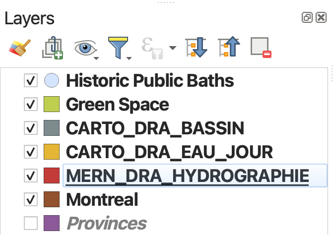

 

- **Grouping Layers**  If you're ever working with numerous layers, you can create layer groups through the group icon or by right-clicking anywhere that's empty in the Layers Panel and selecting "Add Group". Once you've added and named a group, you can drag layers into it. You can move layers out of a group at any time, and right-click the group to remove or rename it. Each layers group will have its own visibility checkbox, meaning that even as you set the visibility for each individual layer within the group, only by rendering the group itself visible will any of its nested layers appear on your screen. 

> Practice creating a group for all water features and moving them into it. Drag group up to the top just below `public-baths`. 

 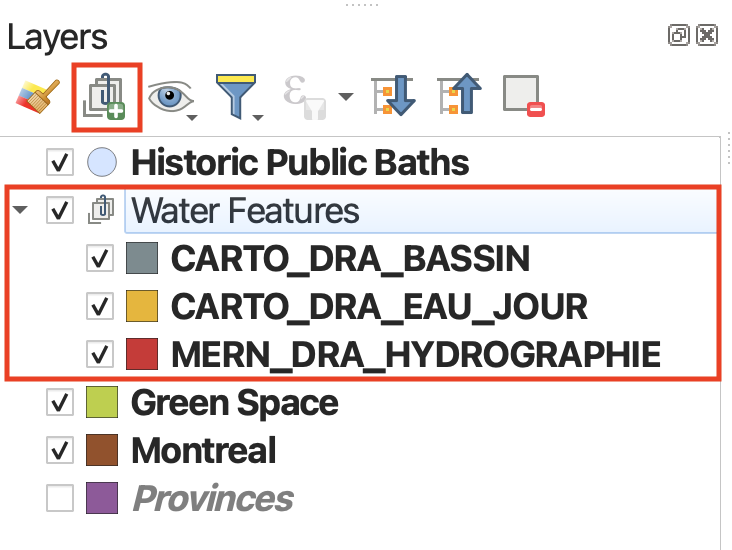
   

- **Removing layers** Just as you can add layers to your QGIS project, you can remove layers at any time. This will not delete the datasets themselves; after all, they are not saved inside your QGIS project (as ArcGIS would do). Rather, it is the file connections that are saved, as well as edits to their symbology made in QGIS. To remove a layer connection from your project, simply right-click that layer in your Layers Panel and select "Remove Layer...". 

- **Checking file paths** If you are ever uncertain where a loaded layer is stored on your physical computer, hover over the layer to see its file path.

- **Refreshing Data Source**  If you add new data to your working folder already pinned as a favorite directory in your Browser Panel, you might need to "Refresh" the folder connection for the new files to appear. Simply right-click the folder connection and select "Refresh". You can also click the Refresh icon to refresh all connections. 

 

- **Exporting Layers** Exporting a layer essentially makes a copy of the dataset on your computer with a name, file type, and location of your choice. This can be useful if you want to make a copy of a layer, save a temporary layer as a permanent file, or save a selection as a new layer/dataset. To export a layer, simply right-click the layer, go to "Export" --> "Save Feature As...". Note that your new file will not have the same symbology, though you can copy/paste one layer's symbology to another. "Duplicating" a layer, which you can also do by right-clicking a layer in your Layers Panel, doesn't create a copy of the dataset, just adds it twice to your project. 

 

**SAVE YOUR PROJECT** 

<!-- - **Managing data from browser panel** Note that you _can_ delete data on your computer from the Browser Panel by right-clicking the layer  (deleting files) -->

## Spatial Bookmarks
Another tip, especially if you're using a single layer to make a map of different locations, is to make **spatial bookmarks**. A spatial bookmark is exactly what it sounds like: a way to bookmark a canvas extent to return to layer. You can add a spatial bookmark from the bookmark icon in the **Toolbar**, from the **View menu**, or from the Spatial Bookmark tab in your **Browser Panel**. You can then set it to your map canvas, or a layer, etc. You can then save the bookmark with a name to your project (this project alone) or to your user settings (every QGIS project you ever make and open). 

<!--  -->

To Do
{: .label .label-green }
Make a spatial bookmark of `public-baths` If you've already zoomed to the provinces layer, set your spatial bookmark extent to "Map Canvas Extent". Otherwise, be sure `public-baths` are centered on your screen first, or set the that layer as your extent. Save to Project Bookmarks. 

 

----

You are now setup to begin mapping! Be sure to **SAVE YOUR PROJECT** before continuing on. Save from either the save icon in your toolbar or from the **Project menu** --> **Save**. 

#### Resources for Project Setup
- [QGIS GUI comprehensive documentation](https://docs.qgis.org/3.34/en/docs/user_manual/introduction/qgis_gui.html#qgis-gui){:target="_blank"}
- [QGIS Configuration](https://docs.qgis.org/3.34/en/docs/user_manual/introduction/qgis_configuration.html#){:target="_blank"}
- [QGIS Project Properties](https://docs.qgis.org/3.34/en/docs/user_manual/introduction/qgis_configuration.html#project-properties){:target="_blank"}

