# Layer Symbology
{: .no_toc} 

Just as the QGIS Project had Project Properties, each layer has properties of its own. To view a layer's properties, right-click the layer in the Layers Panel and go to "Properties..." at the bottom. We won't dwell on all the project properties today, but notice you can learn more information about the layer here, including where it's stored on your computer, and its projection, or CRS. 

**Symbology** governs the outline and color fill of points, lines, and polygons. Depending on the audience and publisher of your reference map, you might have constraints such as Black and White. Keep this in mind. For now, we'll map in color.

As they are, the layers we've added to our map canvas aren't particularly aesthetic, nor is foreground adequately differentiated from background. Before we compose our map for export, let's take some time to modify our layers' symbology to create a more polished looking map.

  

    On this page:
  

  {: .text-delta }
 - TOC
{:toc}

----

## Changing Layer Symbology

### 1. Increase the size/color/icon of Public Baths

Let's begin by changing the size of our points representing historic public baths across Montreal. The default symbology when the layer was added renders them quite small and hard to see. Let's increase the size of these points.

To Do
{: .label .label-green }
Open the Properties for the layer `public-baths`, and navigate to **Symbology**. 

> - Click down to **Simple Marker**. 
> - Here you can increase the size of your points, change the fill color (the color of the point itself), or add a stroke color (outline). (Line features will only have a stroke.)

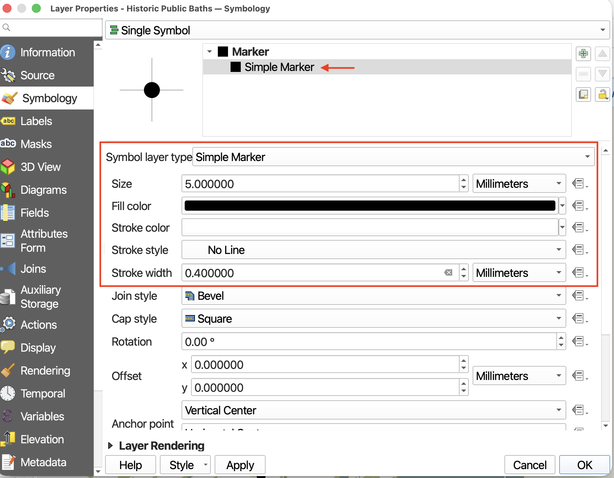

 

If you want to use a stylized/specific icon to demarcate your points, switch the **Symbol layer type** from "Simple Marker" to "SVG Marker". SVGs are scalable vector graphics. 

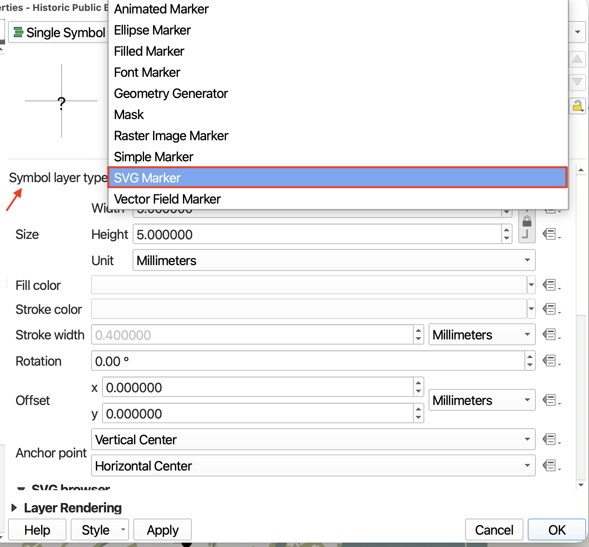

> You can then choose from a range of loaded icons, or [add your own](https://docs.qgis.org/3.44/en/docs/user_manual/style_library/style_manager.html)

[see also](https://gis.stackexchange.com/questions/137855/importing-svg-symbols-into-qgis)

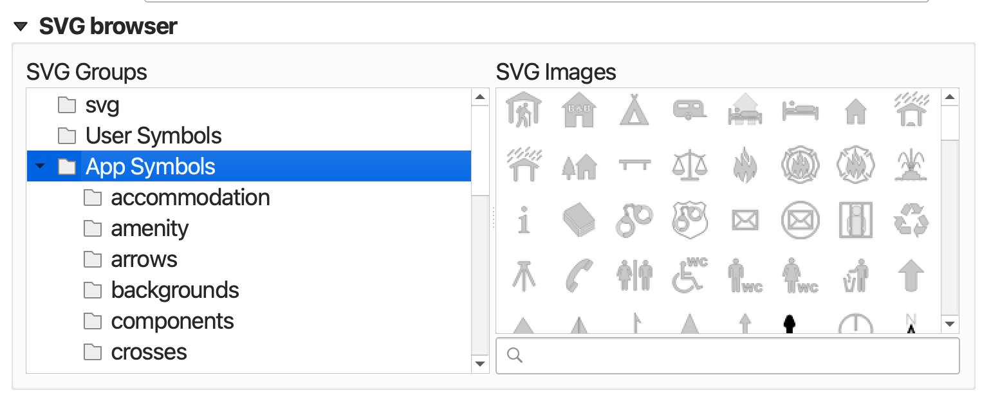

 

### 2. Change water feature color 
Now let's update the color of the water features. Unlike points, these are polygon features. However, they similarly will have a fill to change. 

To Do
{: .label .label-green }

Zoom to `CARTO_DRA_EAU_JOUR`. Then, open the **Symbology** for the layer. You can also open the symbology by double clicking the layer's symbol icon in the Layers Panel. 

<!-- 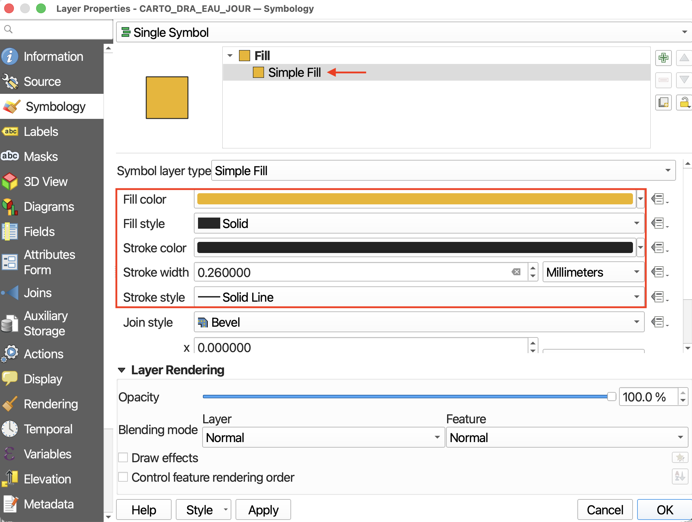 -->

> - **Click down to Simple Fill**. 
> - Click on the color bar to change the color. Expand the dialogue window if necessary. 
> - You can change the "stroke", or outline color. Or, by setting Stroke style to "No line", remove it all together.  try changing stroke to be one. 
> Hit apply to see your changes

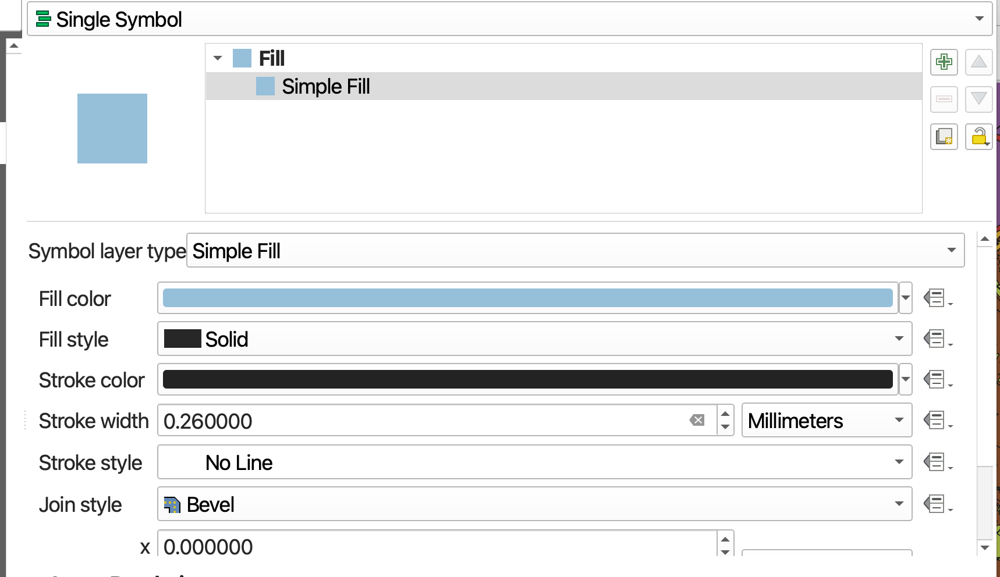

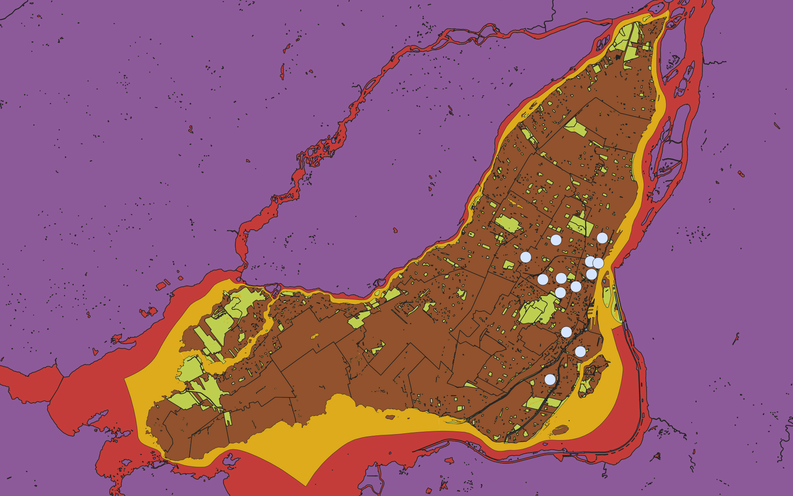 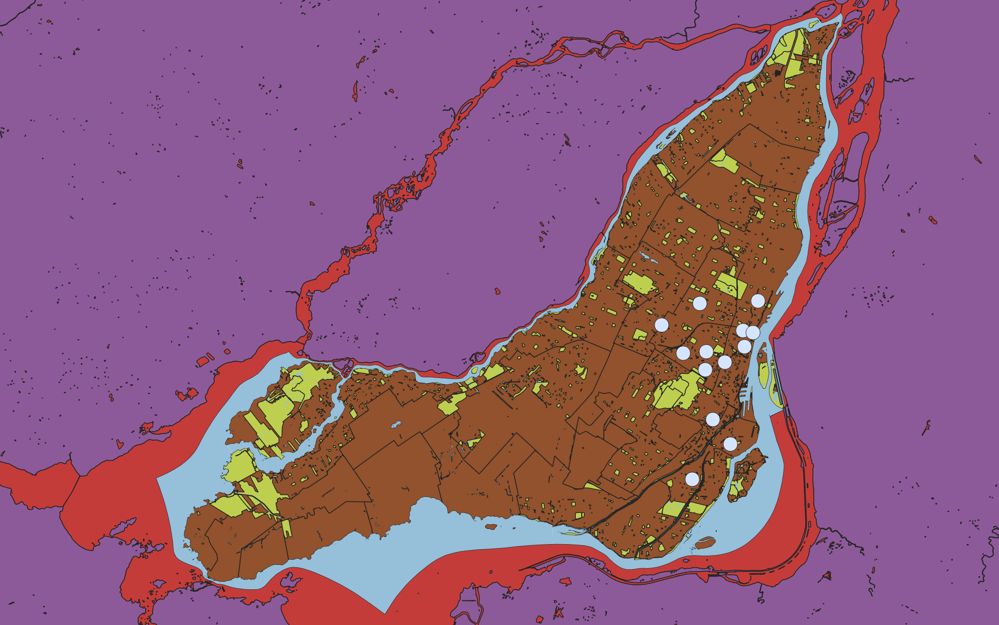

<!--  -->

If you want to make your map in Black & White, change the Color Model from RGB to CYMK. Then set everything but K to 0. You can also color sample from the eye-dropper tab. 

 

### Tip: Copy and Pasting Symbology
- **Copy/Paste Symbology** Right-click the layer whose symbology you want to copy in the Layers Panel, go to "Styles" --> "Copy Style" --> "Symbology". Then right-click the target layer, and go to "Styles" --> "Paste Style" --> "Symbology".

<!--copy paste symbology slide deck-->
<html>
<link rel="stylesheet" href="../style.css">

  
1 / 3

  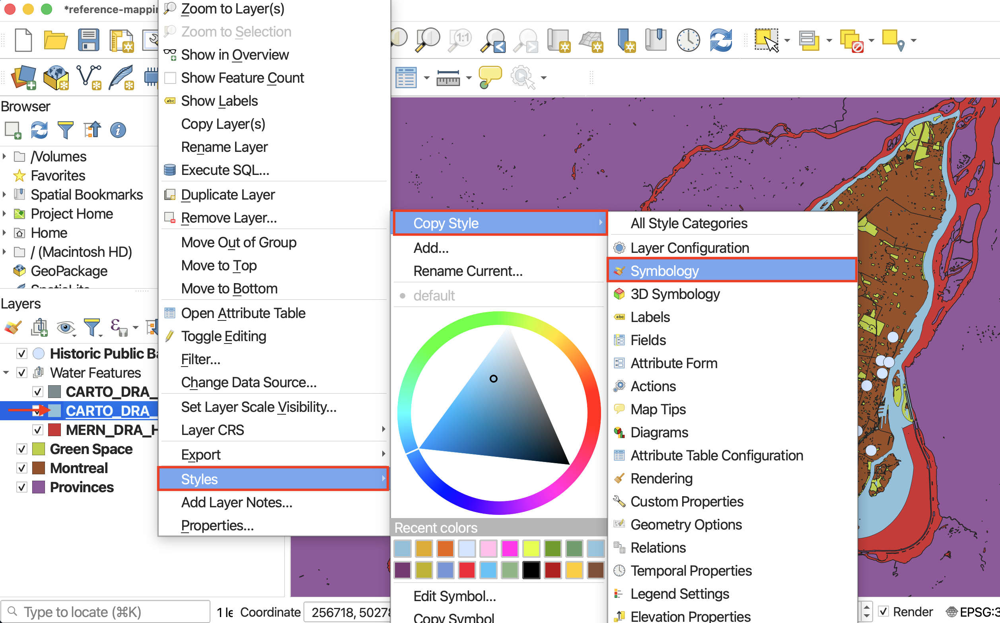

  
2 / 3

  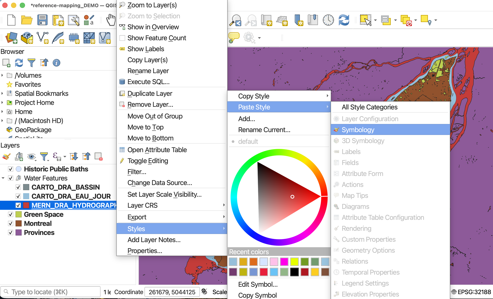

  
3 / 3

  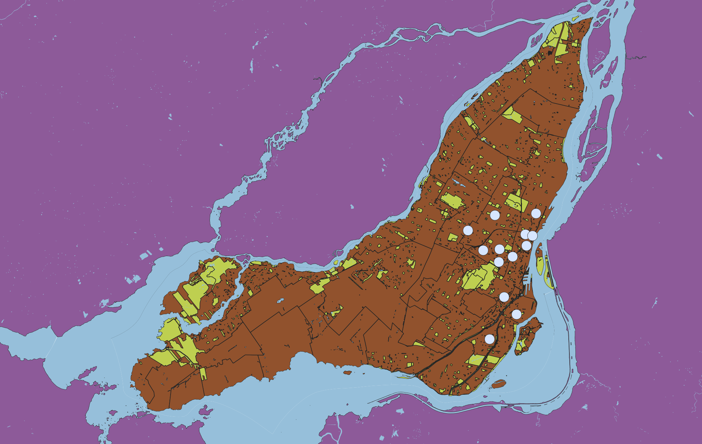

<a class="prev1" onclick="plusSlides3(-1)">❮</a>
<a class="next1" onclick="plusSlides3(1)">❯</a>

   
   
   

</html>

 

> - You can copy and paste symbology until all water features are the same color!!

**SAVE YOUR PROJECT**

  

### Categorized Symbology

The symbology style for any given vector layer can be Single, Categorized, or Graduated. So far, we've been using Single Symbol symbology. This means that each layer will have a single symbology, or color/outline.

However, if you wanted to have each borough a different color, you could change the symbology to categorized and categorize by name - random colors. 

Make sure to hit classify. 

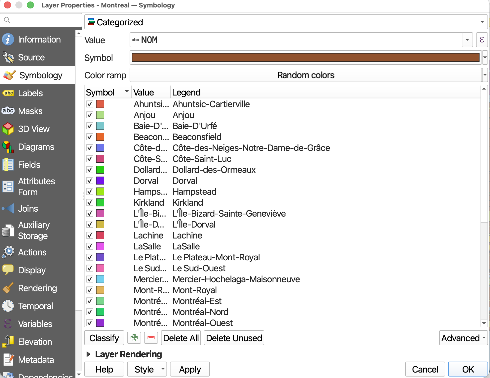
 

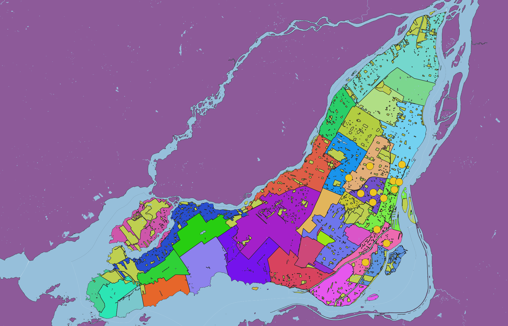

Learn more about how to edit the resulting symbology [here](https://ubc-library-rc.github.io/gis-reference-mapping/content/hands-on3.html#symbology). 

> Also rule-based etc. 

---

**Before we give you some time to modify your layers' symbology, we want to introduce the idea of visual hierarchy.**

---

# Visual Hierarchy
Visual hierarchy describes the order in which elements on a map grasp the viewer's attention. What elements do you want to prioritize and what is the order of importance? Maps can become busy places when everything is vying for attention. The following are considerations and techniques for foregrounding what's important, and backgrounding what's less so. 

<!-- Note: Some of the elements mentioned below aren't things you currently have on your map, but rather items you'll add to your final map layout like a scalebar, north arrow, and legend. just add in that section about visual hierarchy... -->

-----

## Color 
{: .no_toc}

You can create a background/foreground contrast with color by modifying a colors value (its lightness or darkness) or its saturation. Generally, highly-saturated colors will come to the fore, as will light colors if the majority is dark, or vice versa. 
(When working in Black & White, think about your grayscale as a palette in and of itself.) 

For example - both relatively de-saturated, but one is brighter and darker than the other. montreal comes to the fore. 

*Bright*, *saturated*, and *dark* colors jump forwards, whereas pale and desaturated hues fade to the back. (When working in Black & White, think about your grayscale as a palette in and of itself.) 

If combining - same brightness level, saturated will come forward

First, establish which elements are your foreground and which are your background. These are not often clear divisions, so perhaps you can list them out in descending order of importance. 

When using light vs. dark colors to establish a visual hierarchy between foreground and background, you can *either* choose for your focus elements to be much darker or much lighter. This is especially the case if there are multiple elements that need to be foregrounded. 

> Use same color but slightly desaturated for background. make sure water features etc. still differentiated. 

> use lighter for foreground, darker for background

> use color for foreground and greyscale or desaturated for background.

A lot is subjective - also eyes different.  

 

<!--carousel styling and code adapted from W3schools-->
<html>
<link rel="stylesheet" href="./styles.css">

  
1 / 4

  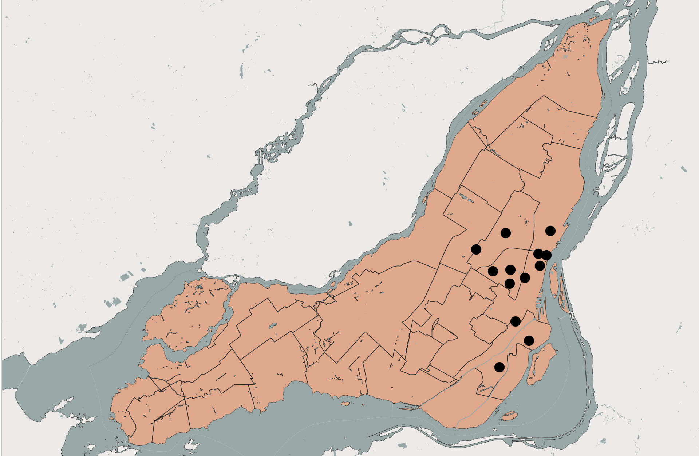
  <!-- 
Caption Text
 -->

  
2 / 4

    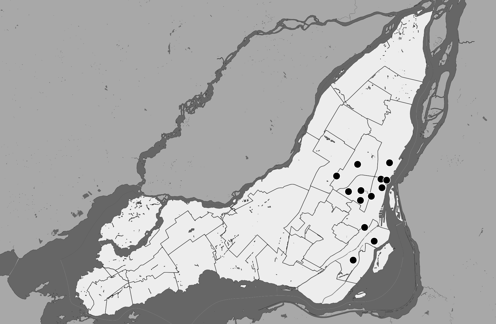

  
3 / 4

    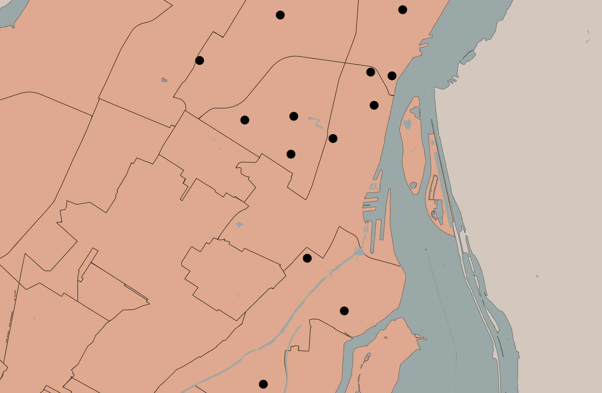

  
4 / 4

    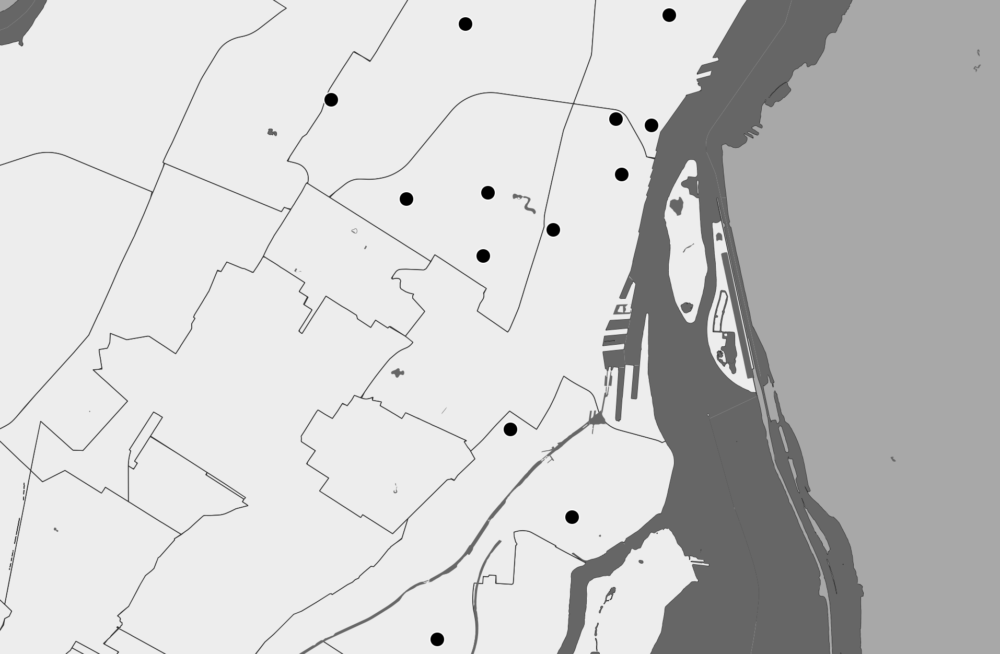

<a class="prev1" onclick="plusSlides(-1)">❮</a>
<a class="next1" onclick="plusSlides(1)">❯</a>

   
   
   
   

</html>

 

If there are multiple elements in the foreground, you can choose contrasting colors to distinguish them, or, choose similar colors to connect them. Likewise, choosing similar colors for backgrounded items like a data source statement and north arrow, can help minimize the number of colors the viewer has to interpret. 

Additionally, it can help to use the eyedropper color sampling option to match these elements' color to whatever they are on top of (like the ocean) and then simply make them a tad darker so they are visible still. Same with legend backgrounds and neatlines (borders around map items). You can also copy and paste the color's hex code, or add it to your pallette. 

Be careful, however, not to make colors too light, lines to thin, or text too small. What appears contrasting on the computer screen will be less contrasting in print. Best practice is to have text size _at minimum_ 7pt, and line width _at minimum_ .3 or .5pt. Again, it depends on your medium of publication but if you plan to publish your maps in print, err on the side of darker, wider, and bigger. 

-  [ColorBrewer](https://colorbrewer2.org/#type=sequential&scheme=BuGn&n=3) is a fantastic resource for generating customized color palettes. [Coloring for Colorblindness](https://davidmathlogic.com/colorblind/#%23D81B60-%231E88E5-%23FFC107-%23004D40) will help you design colorblind-friendly palettes. 

If you want your map to be all around softer, you can set the background elements in a grey or desaturated color, and give a warmer color to your foregrounded elements.

 

## Outlines
{: .no_toc}

An outline brings something to your attention, adding crispness to form. To send elements to the background, consider removing their outlines. A light-colored outline against a darker foregrounded element will help it stand out and vice versa. 

If both foreground and background are outlined, consider color matching by adding light-colored outlines to light objects, and dark outlines to darker objects.  light-colored outlines  Consider removing outlines from background layers, such as ocean, lakes, and countries. Consider adding a light outline to provinces of all once color, or removing all together if provinces symbolized in a categorized manner. Keep in mind the color of an outline also impacts visual hierarchy.

Giving an outline to the lakes in a color slightly darker than their fill emphasizes them nicely:

<!--outline carousel-->
<html>
<link rel="stylesheet" href="../style.css">

  
1 / 3

  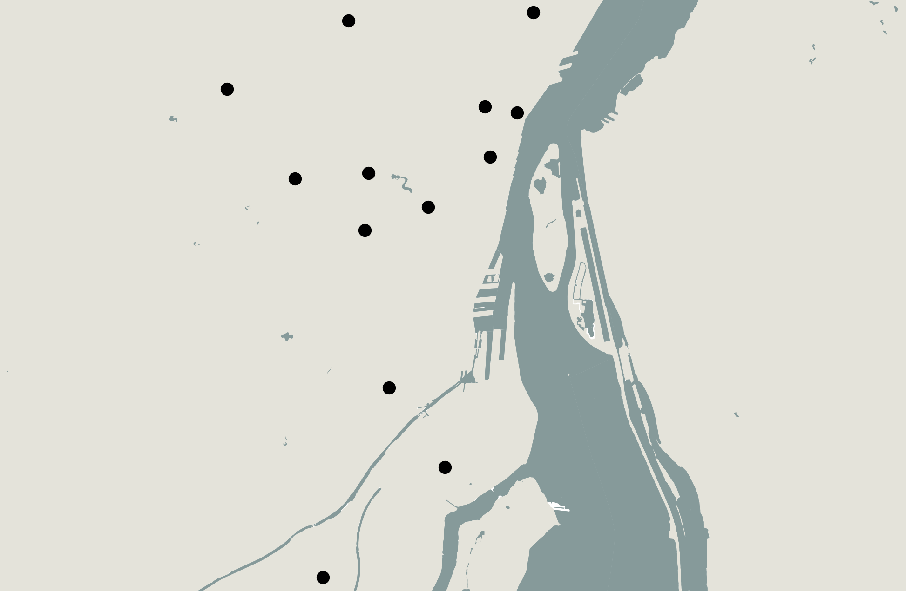

  
2 / 3

  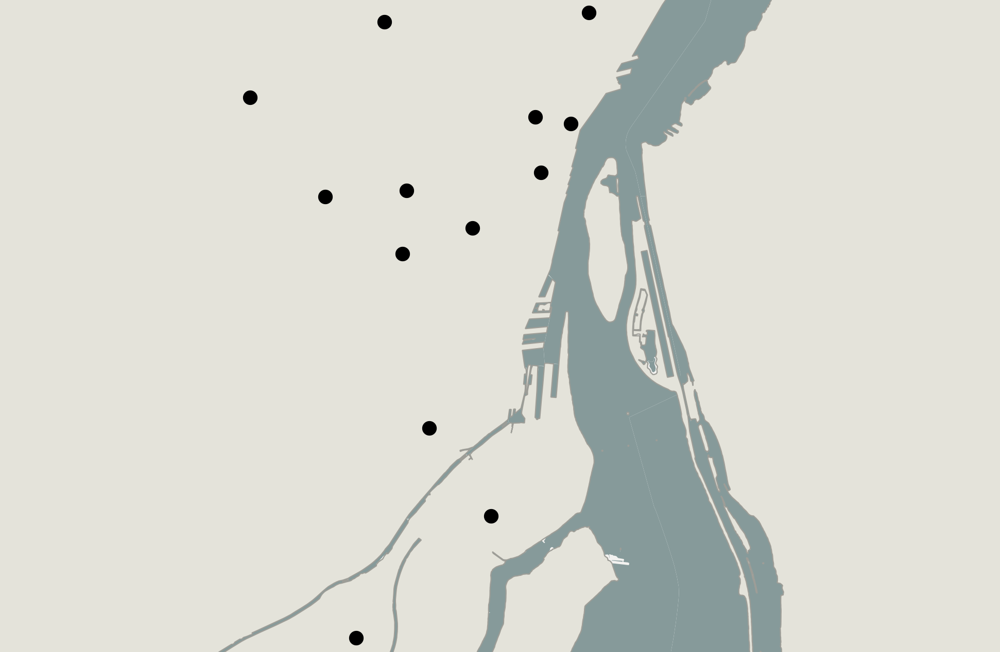

  
3 / 3

  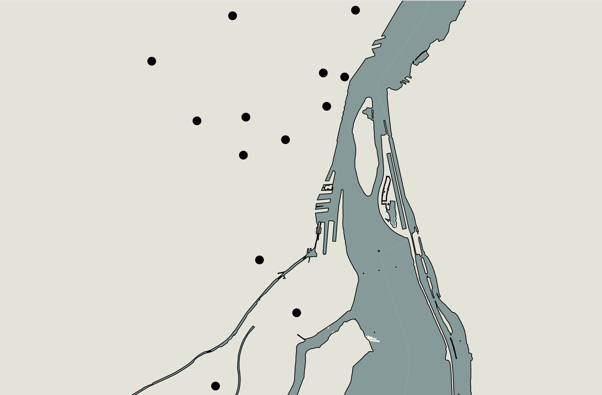

<a class="prev1" onclick="plusSlides1(-1)">❮</a>
<a class="next1" onclick="plusSlides1(1)">❯</a>

   
   
   

</html>

## Transparency
{: .no_toc}

Transparency allows overlapping layers to be seen, as well as lightens the overall hue of a layer. Transparency helps elements fade into the background, like the backing of a legend or a north arrow. 

<!--transparency carousel-->
<html>
<link rel="stylesheet" href="../style.css">

  
1 / 2

  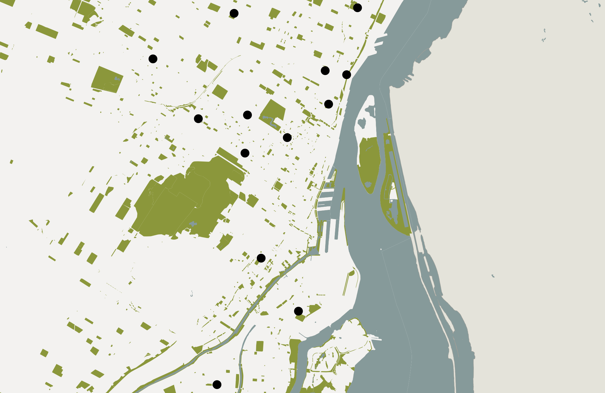

  
2 / 2

  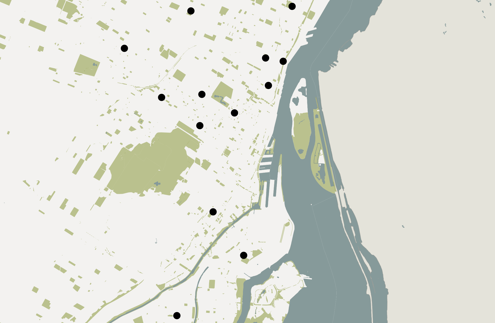

<a class="prev1" onclick="plusSlides2(-1)">❮</a>
<a class="next1" onclick="plusSlides2(1)">❯</a>

   
   

</html>

Transparency also serves to de-accentuate things like outlines and text buffers. 

## Practice
{: .no_toc}

To Do
{: .label .label-green }
While there is more to Visual Hierarchy, that is enough to get you started. Take 15 minutes to change symbology of each layer with visual hierarchy in mind. And, catch up if you need. we will circulate. 

MAKE SURE TO BE ZOOMED INTO BATHS WHEN YOU PRACTICE 

----

#### Other resources for Visual Hierarchy
{: .no_toc}
- [GIS&T Body of Knowledge](https://gistbok-topics.ucgis.org/CV-03-007)  on Visual Hierarchy
- [Axis Maps guide to Lettering](https://www.axismaps.com/guide/labeling)
- Book chapter on [Cartographic design process](https://colorado.pressbooks.pub/makingmaps/chapter/cartographic-design-process/)
- [The Routledge Handbook of Mapping and Cartography](https://www.taylorfrancis.com/books/edit/10.4324/9781315736822/routledge-handbook-mapping-cartography-alexander-kent-peter-vujakovic) (Search it via UBC Library for free online access as UBC student, staff, or faculty)

