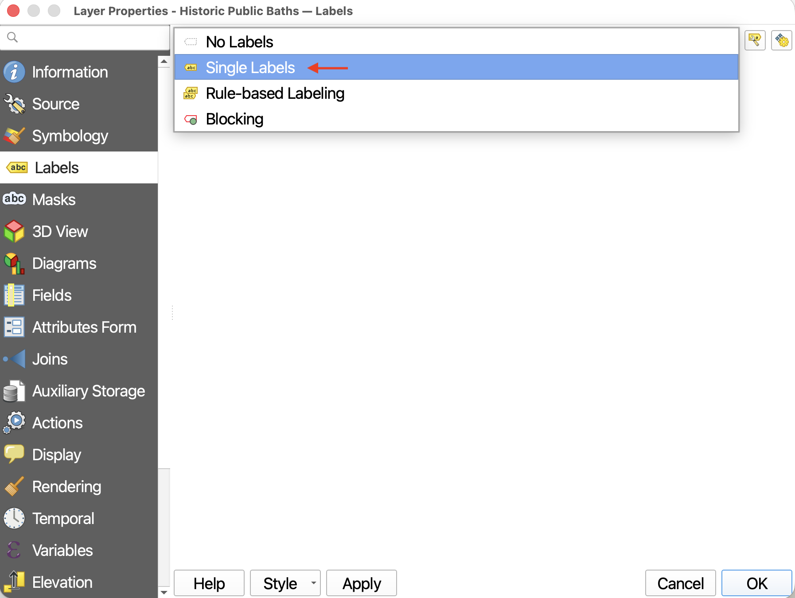
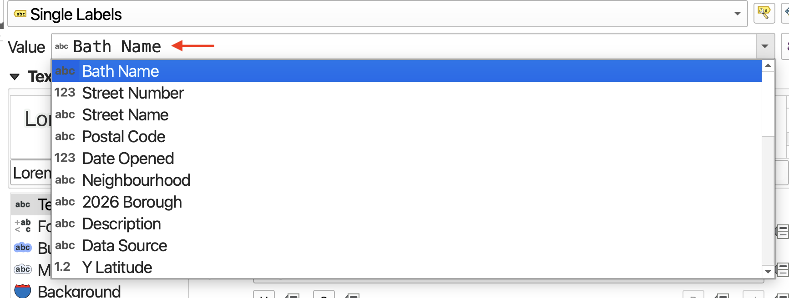
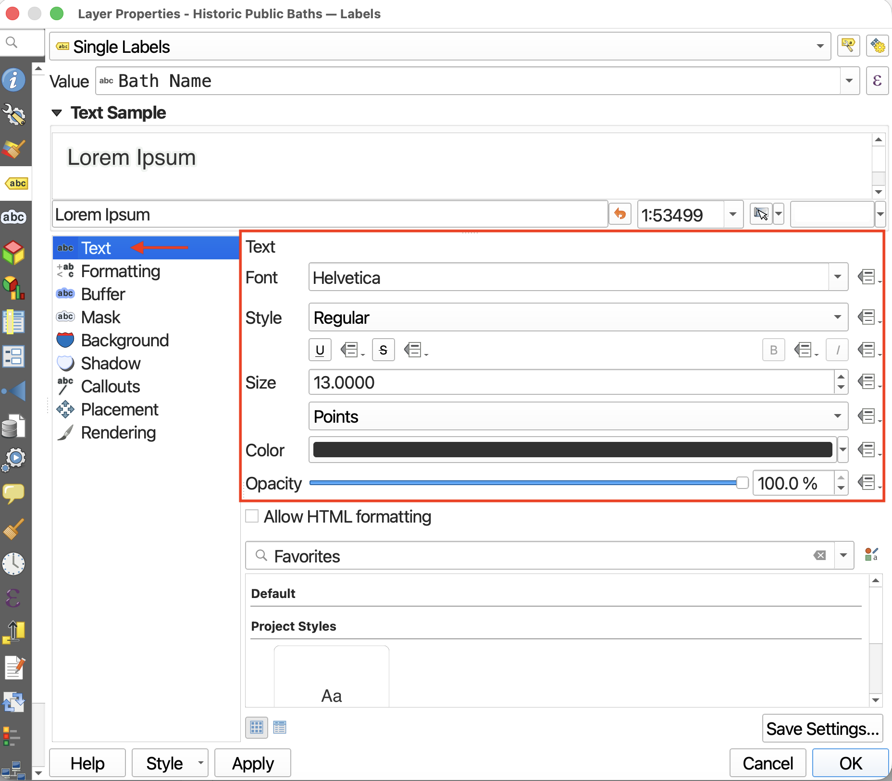
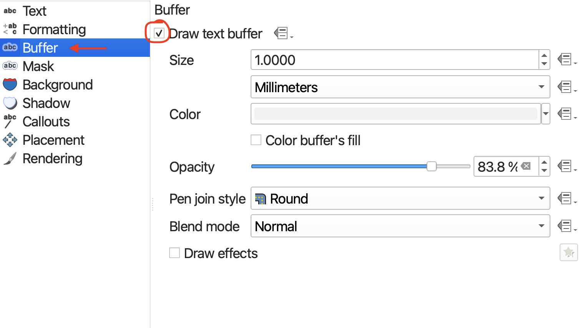
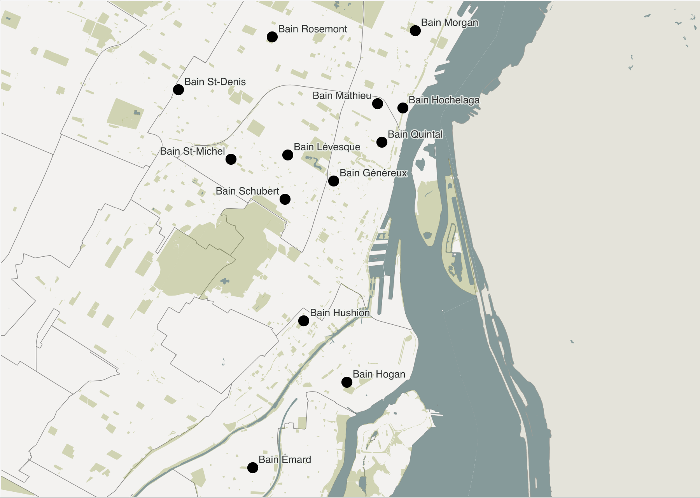

# Labelling 

Another Layer Property useful to know is **Labels**. Labels allows you to add labels to a layer based on an attribute value. You can turn off the labels at any time by returning to a layer's properties, or by right-clicking the layer and clicking "Show Labels" again. 

----

## Add labels to Public Baths

Open the Layer Properties for `public-baths`. Navigate to **Labels** just beneath Symbology. 

> * Change **No Labels** to **Single Labels**. 

> * Set the **Value** to `Bath Name`. This way the labels will appear as each bath's name. 

 

Now you can customize your labels quite a bit. 

First, you can change the size, font, color, and opacity (or transparency) of your text. 

If your text is difficult to read, you can add a buffer to highlight it from the background. Considering visual hierarchy, it can be a good idea to use a semi-transparent color that's already predominant in the map's background to highlight your text. 

Finally, you can adjust the labels' placement around a point by going down to **Placement**. This is most useful when labelling polygons. 

 

might write more on this or just cut out
{: .warn}

While more comprehensive design work on your map can be managed in an illustration software like Inkscape or Adobe Illustrator, with some time and patience, a great deal of customization can be done right within QGIS. For example, categorizing features and styling their labels differently. 

Leader lines etc. 

