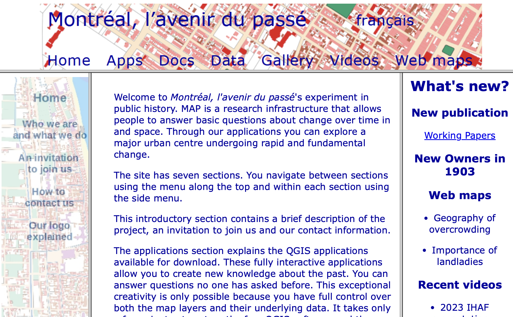
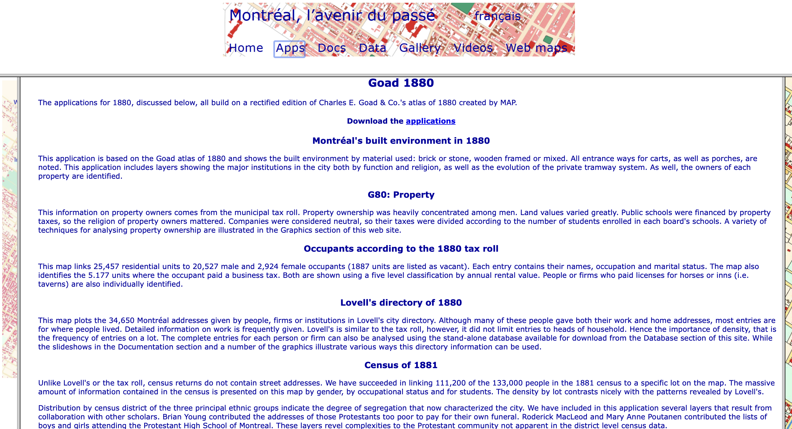

# Thematic Mapping QGIS

As a reminder, **thematic maps** visualize specific aspects of a dataset across space. Or, as Statistics Canada puts it: “A thematic map shows the spatial distribution of one or more specific data themes for standard geographic areas.” As reviewed yesterday, there are different kinds of thematic maps each suiting a different purpose. (elaborate each)

This afternoon you will learn how to make 2 most common thematic maps: a choropleth map and a proportional symbol map. We will be using historic data of Montreal created by the MAP project to visualize religion? as well as occupation across the city. 

Exmaples of maps we will make...

<!-- how to adjust symbology - make choropleth and proportional symbol map 
intro spatial analysis vector tools first, and then make thematic maps after?  -->

## Today's data

The data for today's lesson is from the public history project *[Montréal, l’avenir du passé (MAP)]([Montréal, l’avenir du passé (MAP)](https://mun.ca/mapm/fra/accueil_cadre.html))*, directed by Sherry Olson and Robert C.H. Sweeny. Translating to *Montréal, The Future of the Past*, MAP digitizes, geocodes, and georeferences data from historical atlases, city directories, census records, and municipal tax rolls to show demographic change over time and space in Montréal. For more about the MAP project 

As a public history project, MAP makes their [spatial datasets](https://mun.ca/mapm/eng/about_frame.html) freely available and their entire website and documentation is bilingual (French & English). Not only that, they have [prepared QGIS applications](https://mun.ca/mapm/eng/about_frame.html) which visualize selected data. You can simply download one of these "apps" and explore a given time period. MAP is therefore an exceptional example of digital humanities using GIS! And QGIS, for that matter!! 

MAP has enthusiastically encouraged us to use their data in this DHSI workshop, but we highly recommend exploring their datasets and prepared QGIS applications directly. Today's exercises will work with data available in the **Goad 1880** applications which "build on a rectified edition of Charles E. Goad & Co.'s atlas of 1880 created by MAP." This download contains multiple QGIS projects and data all from 1880-1881. While physical features such as water, streets, and buildings come from the **1880 Goad Atlas**, administrative data on lots, wards, and census tracts — and of course census data itself — come from the **1881 Census**. Data on occupants and business rents comes from the **1880 Municipal tax roll**, and further demographic information comes from **Lovell's directory of 1880-81**. 

More about the MAP project can be found on the Centre interuniversitaire d’études québécoises (CIEQ) website: [https://map.cieq.ca/](https://map.cieq.ca/en/). This site is tailored less towards downloading and playing with datasets than exploring them online. For instance, [mix and match variables](https://map.cieq.ca/en/birdseyeview/mixandmatch.html), [how people made a living](https://map.cieq.ca/en/lookingfortheaction/howdidtheymakealiving.html), [street crawling](https://map.cieq.ca/en/viewsfromhomebase/streetcrawling.html), or just look at [Lovell Directory data in web map form](https://schema.uqam.ca/application/run/2033)!! For more on their sources, see the CIEQ website subpages ["Our Gorgeous Sources"](https://map.cieq.ca/en/project/gorgeoussources.html) and ["In the Storeroom"](https://map.cieq.ca/en/project/storeroom.html#Shapefiles). 
{: .note}

----
## What we'll use... 
Below we've outlined the data used in today's lesson with a description of what it visualizes as well as, for reference, what it's named in the Goad 1880 MAP application download and any modifications made to the original dataset. Data was renamed for ease of understanding. 

All the data we'll use is stored in shapefile format.  While QGIS projects within the Goad 1880 MAP application download were set to the projection `NAD83(CSRS) / MTM zone 8`, individual shapefiles were not stored with projections but rather "projected on the fly" when loaded into a project. Therefore, all renamed shapefiles were also saved with the Coordinate Reference System (CRS) `NAD83(CSRS) / MTM zone 8`. The only difference this makes is in the kinds of sidecar files associated to a shapefile. 

### Demographic data from 3 sources
- `census1881` Demographic data from the 1881 Census containing 111,208 features, with information on name, age, sex, occupation, religion, disability ('blind', 'deaf', 'dumb', 'unsound'), birth place, and more. The geographical tie is at the lot level, and while the full census contained some twenty thousand more responses, MAP was only able to successfully link 111,208 at the lot level (quite impressive!). This data layer is named `g80cen81` in MAP's Goad 1880 application download. 

-  `lovell_directory` Demographic data from Lovell's Directory, 1880-1881. This directory contains 34,658 features with attribute information on name, sex, occupation, address, widow status, and kind of living quarters. There is also information on whether each entry was part of a firm/company, and whether they had a second address. As MAP writes: "Although many of these people gave both their work and home addresses, most entries are for where people lived." This data layer is named `lovell_mtl` in MAP's Goad 1880 application download. This is not to be confused with the layer `lovellmtl` which contains practically the same information but which doesn't break down occupation into distinct column(s). Lovell's Directory in web map form can be explored [here](https://schema.uqam.ca/application/run/2033). 

- `taxroll_occupants` Demographic data from the Tax Roll of June 1880, City of Montreal. This dataset contains 29,453 features with information on occupants' first and last names, address, sex, occupation, rent, and ward. Tax Roll data is limited to heads of household meaning there are fewer entries than Lovell's Directory and far fewer than the 1881 Census. MAP sourced the data from [Archives de la Ville de Montréal](https://archivesdemontreal.ica-atom.org/role-devaluation-1880). This data layer is named `occupant` in MAP's Goad 1880 application download. Note however that the Goad 1880 application download also contains a file called `g80_roll` which contains the same number of features. Indeed, it is almost identical (though it contains more attributes). However, there are a few inconsistencies between them. Despite this, `occupant` was chosen over `g80_roll` as it has fewer attributes and for the purposes of our QGIS practice, minor discrepancies are of no concern. 

<!-- : for instance, the locations of tobacconist Henry Philip and the Parish Church, located in adjacent lots, are reversed in MAP's `occupant` and `g80_roll` layers (in the `occupant` dataset, Henry Philip is in Lot **PROPID 20102** and the Parish Church in Lot **PROPID 20103** (according to the Census Lots); in the `g80_roll` dataset their positions are reversed yet the lot ID's are also one increased in the layer attribute.) Additionally, just above these lots, in Lot **PROPID 20161** (according to the Census), the `g80_roll` dataset  has only Charles Holland, Manager, and La Banque Nationale, whereas `occupant` contains a third 'occupant', Ontario Bank. The rent for this bank is over double that of La Banque Nationale, indicating it as a distinct occupant. Then, above, in Lot **PROPID 20161**, the `g80_roll` dataset  has only Charles Holland, Manager, and La Banque Nationale, whereas `occupant` contains a third 'occupant', Ontario Bank. The rent for this bank is over double that of La Banque Nationale, indicating distinct occupant. These minor differences were overlooked due to the nature of our task at hand: practicing QGIS with historical data. Explain why chose occupants rather than taxroll? cleaner. explain how there could be doubles - eg work etc. explain how this dataset includes businesses as well as individuals. and how res_rent and bus_rent add up to a bit more - some work in same building/lot they live in? but more often, elsewhere, contributing more entries.  -->

- `business_rent` Rent paid by businesses according to the Municipal Tax Roll of June 1880. This data layer is named `bus_rent` in MAP's Goad 1880 applications download. It contains only 5,117 features, whereas MAP's dataset on residential rents (`res_rent`) contains 25,457. Combined, this amounts to 30,574 features which is more than the Tax Roll dataset of 29,453. This is simply because business proprietors who were also heads of household would have submitted entries both for their place of residence and their place of work. 

### Administrative Boundaries/Units
-  `lots` Individual lots according to the 1881 Census. Containing 12,226 features, this layer was originally named `censuslt` in MAP's Goad 1881 applications download. `censuslt` is geographically nearly identical to `newlots81`, the latter containing one more feature. However, the two datasets differ in attribute tables. `censuslt` was chosen for our exercises because it has a fewer attributes and thus a cleaner attribute table. Both `censuslt` and `newlots81` differ from the dataset for lots used in MAP QGIS applications which visualize `g80_lots`. This dataset has a few hundred fewer lots, and differences are especially apparent around the waterfront. Because we will be visualizing census data, lots for our workshop are based on census lots. 

- `wards` Wards from the 1881 Census. This data layer is also named `wards` in MAP's Goad 1880 applications download.

- `census_tracts` Census tracts 1881 Census. This data layer is named `ctracts` in MAP's Goad 1880 applications download. To see visualizations specific to this administrative/census level see the QGIS Project `Census returns 1881.qgs` in MAP's Goad 1880 applications download.

### Contextual Features
Physical and infrastructural features are organized into the data subfolder `features`. These layers are `parks`, `beaches`, `lanes`, `streets`, `quays`, and `water`. Each shapefile was slightly renamed for consistency and saved them with a projection. Additionally, the `water` dataset was modified to rectify an issue with the geometry in the canal feature. 

You'll notice when you open the QGIS project for today that the files for contextual features are already loaded — if hidden — in the project. This is because MAP went to great efforts to curate a symbology for this basemap data that works well, and re-loading them to our project would require we do all this work over again. This way, we can simply turn on the layer group when we are ready to map. 

 
  

**Alright! Now that we understand what data we're using and where it came from, Let's move on to some hands on practice with QGIS!**

