# The Attribute Table
{: .no_toc}

The **Attribute Table** is where you can view the tabular data associated with vector datasets. Here, you can query your data by running complex selections, directly edit individual features, and perform mathematical operations on your layers. See the [QGIS documentation on working with the attribute table](https://docs.qgis.org/3.40/en/docs/user_manual/working_with_vector/attribute_table.html) for more.

  

    On this page:
  

  {: .text-delta }
 - TOC
{:toc}

----

## Exploring the Attribute Table 
If you haven't already, launch the `thematic-mapping.qgz` project in the folder `dhsi-workshop/Day2/thematic-mapping`. Turn on the layer `census1881`. 

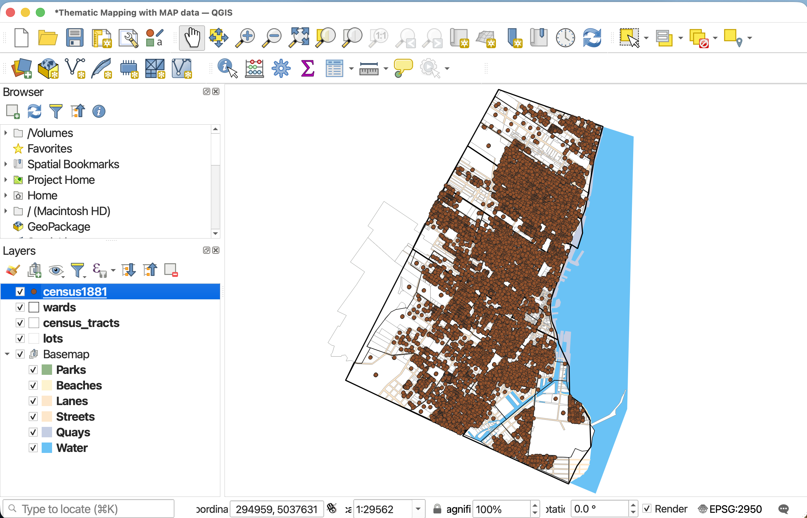

 

> To open a layer's attribute table, right-click the layer in the Layers Panel and go to "Open Attribute Table". **Open the Attribute Table for `census1881`**.

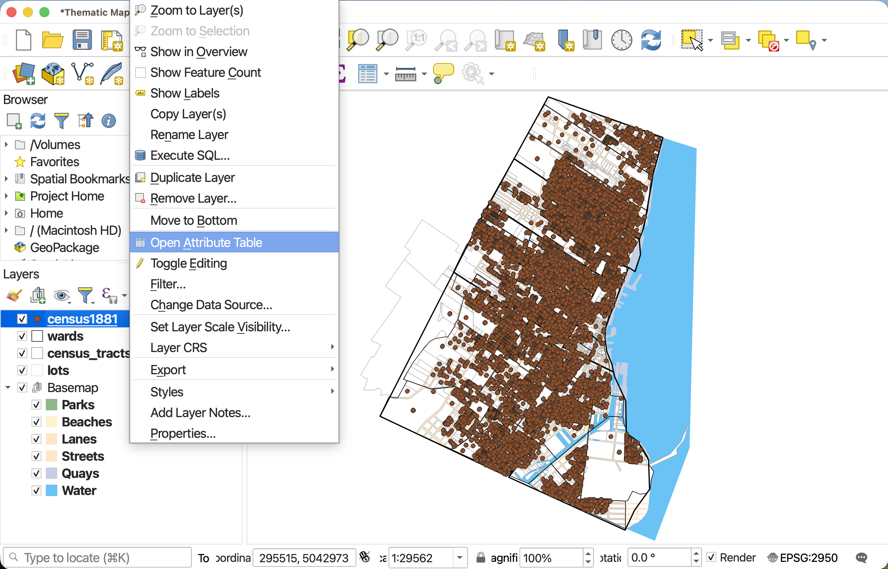

<!-- You can also use the Attributes Toolbar (so long as it's turned on) to open the Attribute Table of a layer highlighted in the Layers Panel. 

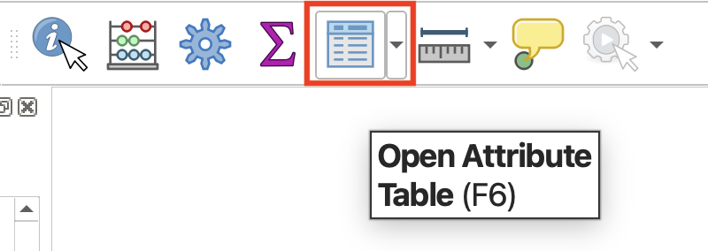 -->

The attribute table might take a while to load as there are over a hundred thousand points. Additionally, since the attribute table will open in a new window, sometimes this can get lost behind the main QGIS interface. 

Note that there are several attributes (columns) that describe each feature (row) in this dataset. Manually re-size the column widths until you can read each attribute.

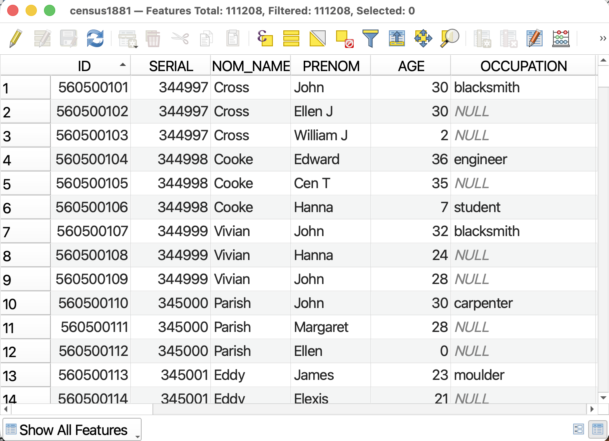

 
The column headings are called **Attributes**. Each column is called a **Field** and each row is called a **Feature**. Each feature corresponds to one point on your map. (If you were looking at the attribute table of `lots`, each feature would correspond to a polygon, and so on.) At the top of the Attribute Table you can see there are 111,208 features, or census returns, in this dataset. Each feature, or person, has multiple attributes, including the `NOM_NAME` and `AGE`, `OCCUPATION` and `RELIGION`. Sometimes cell values will be `NULL` meaning the feature contains no information for a given value. For instance, not all individuals entered an occupation. 

Notice that text values are left-justified whereas numerical values are right-justified. Sometimes QGIS will read numbers as text, disabling mathematical operations. If this happens, you will have to create a new field and set the type to either integer or decimal.
{: .note}

 

You can order Features in descending or ascending order by clicking on the attribute. 
> - Click `AGE` to sort all Features from youngest to oldest. (Null will appear first; scroll past these to reach infants.) Click `AGE` again to sort from tallest to shortest. 
> - Click `OCCUPATION` to sort the occupations in alphabetical order. 

On the bottom-right hand corner there are two icons allowing you to toggle between "Table View" (your current view) and "Form View". Form view will show you a summary of all a feature's attributes. 

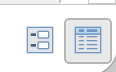

 

At the top of the Attribute Table you'll see some tools. Let's take a closer look at these now. 

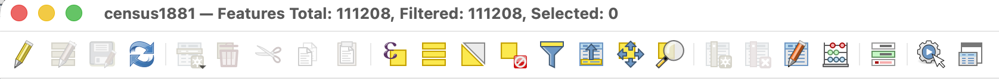

 

## Selecting by Attribute
Selections are different than using the Identify tool to highlight a feature and expose its attributes. Selections select a set of features in the Attribute Table. Once attributes are thus selected, you can edit them, export them, or perform more analysis. 

There are many ways to make selections in QGIS. 
- You may **manually select** features from the map canvas using the **Selection Toolbar** 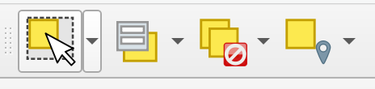;
- You may **select features by location** using the **Select by location** vector analysis tool; 
- And you can **select features by attribute** within the Attribute Table. 

<!-- Other selections - we'll explore more in the afternoon. right now - select bakers from xyz. -->

<!-- or pick occupation

run selections for bakers from all 3 demographic layers, then from businesses to find bakeries???  -->

We will be using historic data for Montréal to visualize the spatial distribution and density of French Canadians according to the 1881 census. So, we want to select just those identified as French Canadian from this dataset. There are a couple different ways we could run this query: we could select all individuals who have an origin listed as French (and derivatives such as xyz), or we could select those whose ethnicity `ETH` is french canadian (`FC` or `fc`). To make our lives simpler we will do the latter. 

*1*{: .circle .circle-yellow} From the Attribute Table of `census1881`, click on the **Select features using an expression** button.

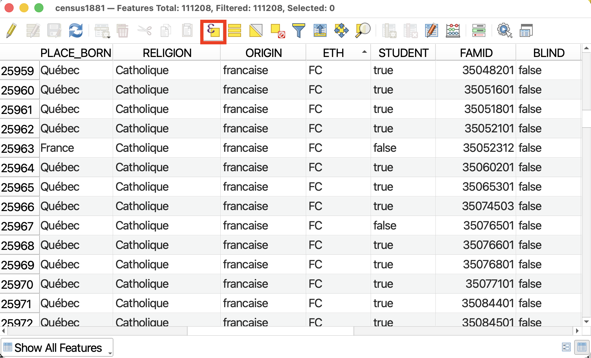

We will use this tool to query and select only features where `ETH` is “FC” or `ETH` is “fc”. Rather than writing an expression by hand, we will select the appropriate fields, values, and operators from the drop-downs provided. This ensures no syntax errors are made and our selection runs smoothly.

*2*{: .circle .circle-yellow} From the middle panel, expand **Fields and Values**. Double click on `ETH` to add it to the Expression builder.

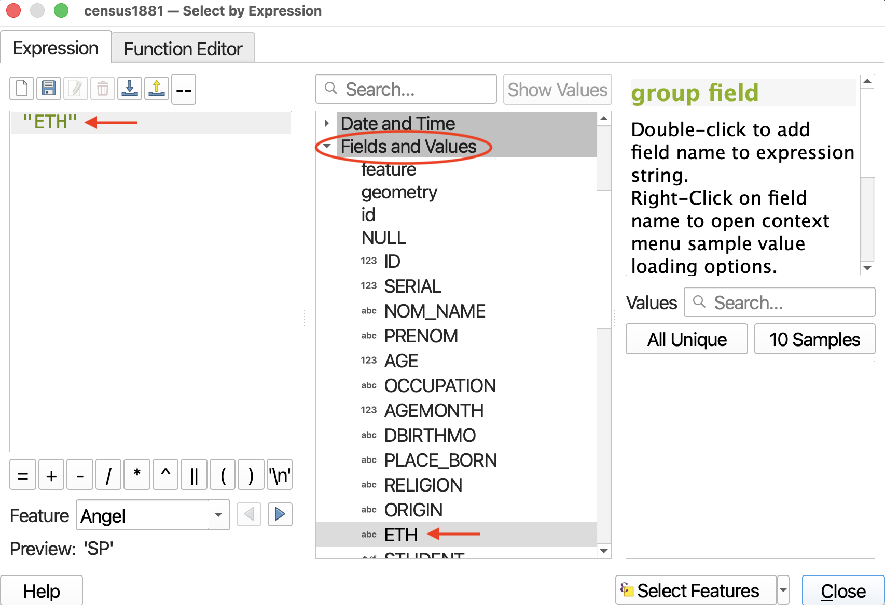

  

*3*{: .circle .circle-yellow} Then click the `=` operator. You will get a warning saying your expression is invalid. That's okay! We aren't finished building it.

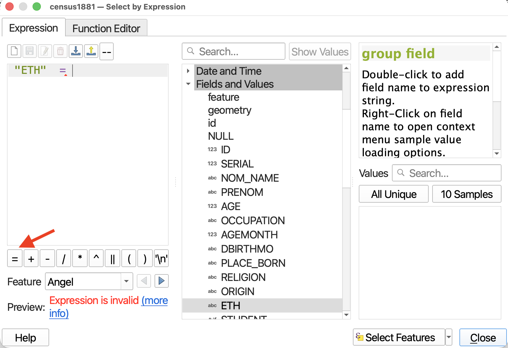

 

*4*{: .circle .circle-yellow} Finally, we need to indicate what Ethnicity is equal to. In the right-hand panel, click the button for **All Unique** to display all the unique values for common name in the dataset. This is a handy way to find out the unique values of any given attribute. 

French Canadian is abbreviated to FC. However, *it is both upper case and lower case*. We have to include both. 

First, double-click on "FC" to add it to the expression. Then, add the text `or`, and add `ETH` `=` again. Then double-click "fc". **Your final expression should now be `"ETH"  =  'FC' or  "ETH"  =   'fc'`. IT IS VERY IMPORTANT YOUR EXPRESSION MATCHES EXACTLY.**

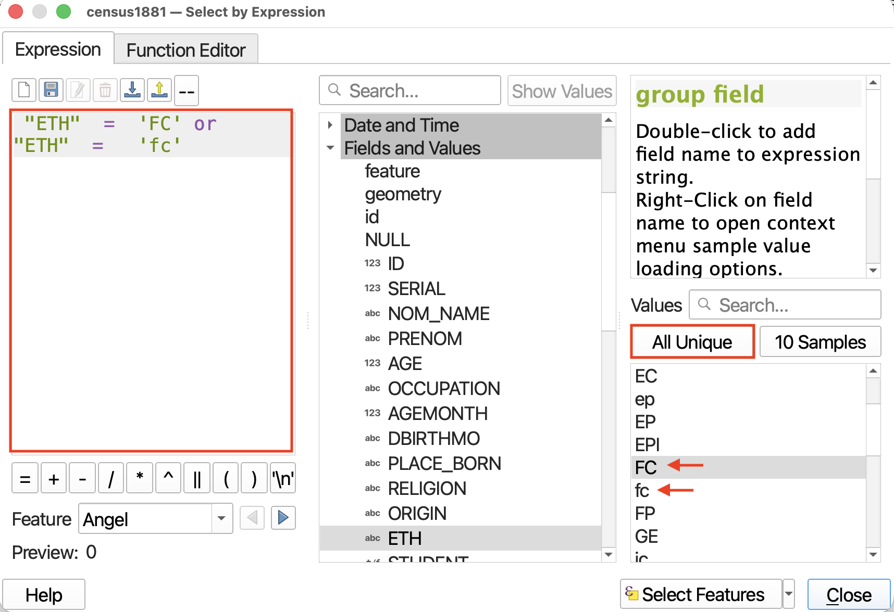

 
*5*{: .circle .circle-yellow} Now click **Select Features** on the bottom-right. Close the expression builder and return to the Attribute table. You will see that 59,033 features have been selected. Selected features will be highlighted in the Attribute Table. If you the Attribute Table indicates a selection was made but you don't see any highlighted features, try ordering the Attribute Table by `ETH`, and then scrolling down to the letter "F". 

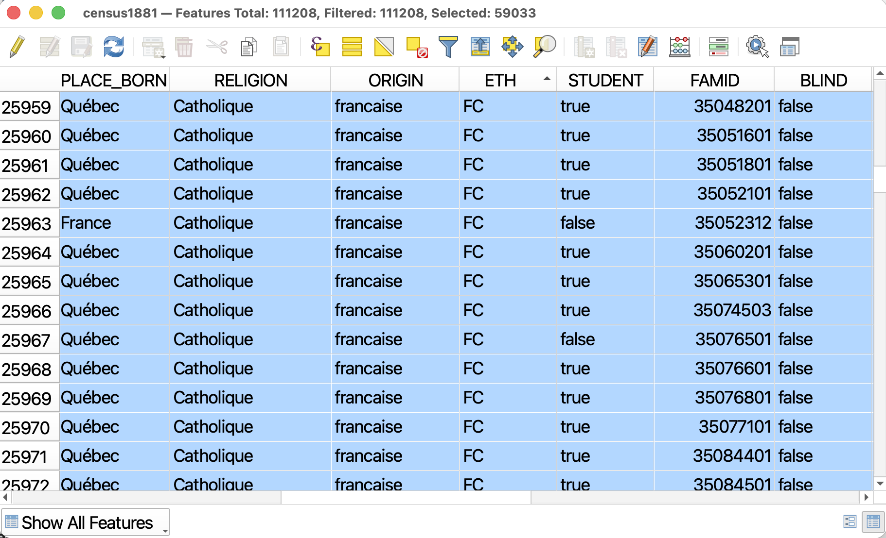

 
Note: You can also choose to Show Selected Features only. Alternatively, you can change the Attribute Table view to view *only selected features*. Just be sure to change the view back afterwords, or next time you open the attribute table it will appear empty if no selections have been made.  

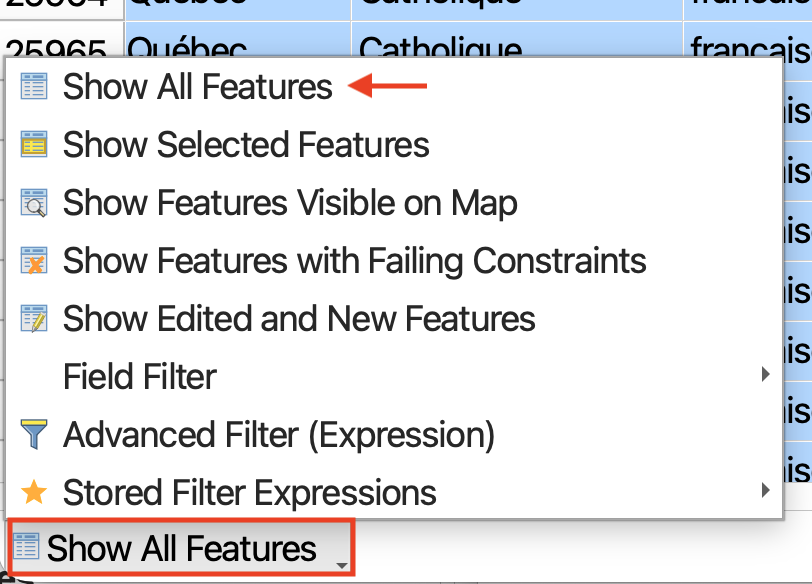

 

Close the Attribute Table and return to the main QGIS interface. In the Map View, you should see your selection highlighted. Now that you've selected only individual's whose ethnicity is French Canadian, we can export this selecten as a brand new dataset. 

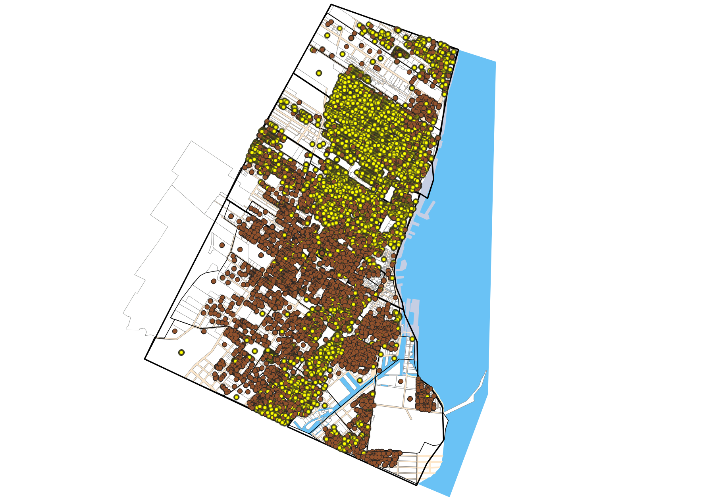

 

*6*{: .circle .circle-yellow}
Right-click on the layer `census1881` in the Layers Panel. Choose **Export** and then be sure to choose **Save *selected* Features As**. 

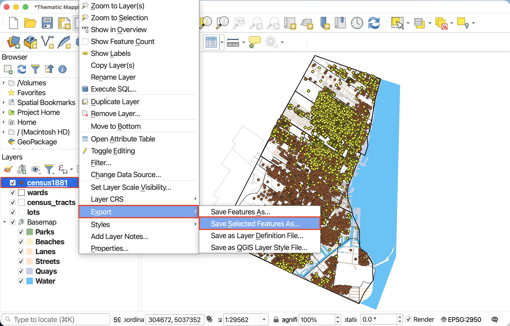

 

*7*{: .circle .circle-yellow} In the window that opens, give the new file both a name *and a location*. To give it a location, click on the three dots and navigate to the `dhsi-workshop/Day2/thematic-mapping` folder. Call this file `french-canadians`. 

- Keep it an Esri Shapefile. 
- Keep the projection set to the Project CRS. 

<!-- **Then, expand "Select fields to export and their export options". Scroll down to `geo_point_2d` and check `Use Key/Value`.** -->

Click Okay. The new layer should be created and automatically added with a new default color to your map. If not, add it now. 

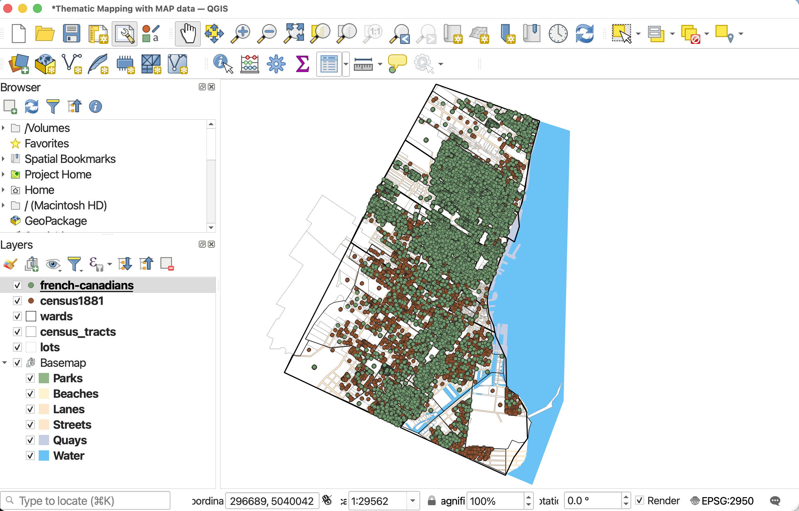

 

 **SAVE YOUR PROJECT**

 

## Count points in polygon 
Since our goal is to create a thematic map that visualizes the spatial distribution of French Canadians in historic Montréal, we need to find out how many French Canadians filled out a census in each census tract.  While we could count up the many, *many* points by hand, this would take a long time and could introduce human error. Instead, we will use QGIS vector analysis tools to do the counting for us. Tomorrow we will go into more detail about tools and workflows in QGIS. Today we will use 2 tools: Count points in polygon and, later on for our proportional symbol map, Centroids. 

There are two main ways to access spatial analysis tools in QGIS: 1. through the **Vector** menu and 2. through the **Toolbox** located in the **Processing** menu.

Go ahead and open the **Processing Toolbox**. 

If you don't see the **Processing** menu at the top of your screen, you may have to enable the processing plugin. Click on the **Plugins** menu at the top of your screen, and then on **Manage and Install Plugins…**. In the search bar, type in "Processing". Make sure to **select the Processing box**, and then click Close. You should now see the Toolbox icon and be able to proceed with the next steps. Once enabled, you will be able to access the Processing menu anytime you open this or any other QGIS project. 
{: .note} 
 

*1*{: .circle .circle-yellow} In the Processing Toolbox, search for the QGIS tool called **Count points in polygons**. It will be nested under **Vector analysis**. This tool will count the number of points (French Canadians) in each polygon (Historic Montréal census tracts), and append the total to each census tract in `census_tracts` as a new attribute.

In the tool window, select the following inputs:

- **Polygons**: `census_tracts` 
- **Points**: `french-canadians` 
- **Count field name**: `FC` (the name of the attribute that will store the total French Canadians for each census tract.)

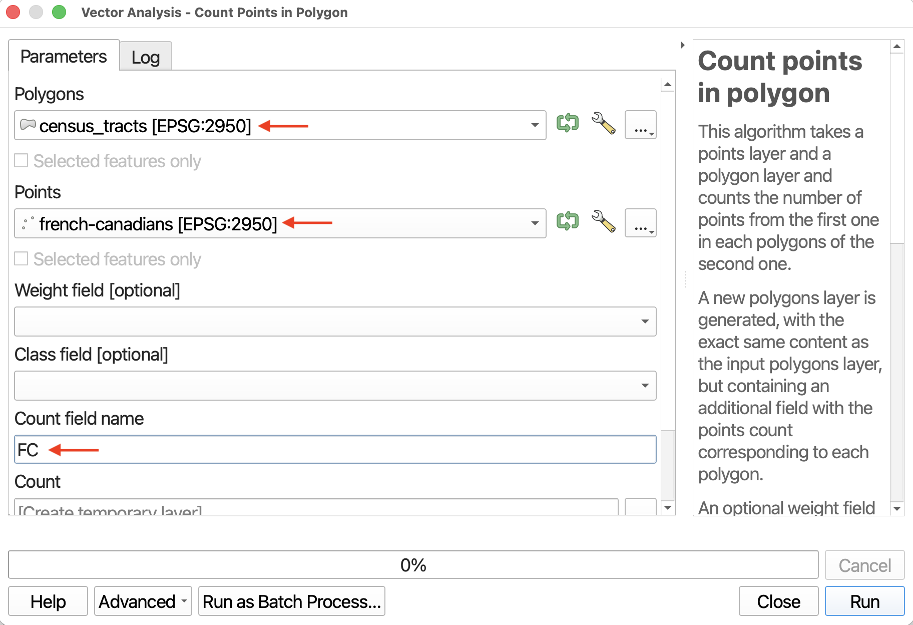

Click **Run**, then **Close** when the process has finished. Note: you may see the caution ‘No spatial index exists for points layer, performance will be severely degraded’. You can ignore this.

*You should now have a new layer called `Count` in your Layers Menu*. This is because, unless you specify the output of a tool to be a permanent layer, it will create a temporary layer with the tool's name. 

 
*2*{: .circle .circle-yellow} Take a look at the Attribute Table for `Count`. You can now see the number of French Canadians in each census tract. Close the attribute table to continue.

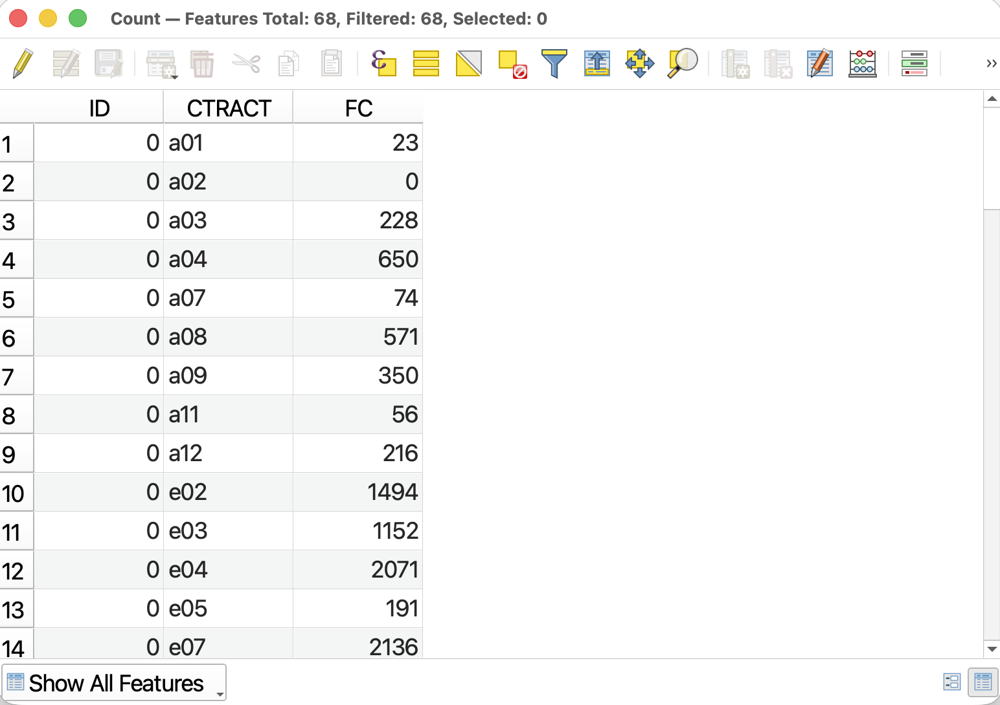

 

*3*{: .circle .circle-yellow} Save `Count` as a permanent layer to your data folder by right-clicking it and selecting either **Make Permanent** or **Export - Save Features As..**. Save the file to the `dhsi-workshop/Day2/thematic-mapping/data` folder and call it `fc-count`. Everything else can remain as default. Click **OK**.  

Be sure to add `fc-count` to your project if it doesn't add automatically. Then, remove `Count` and **Save your project**. 

Note that if you have any trouble exporting the file, it's likely because you didn't specify a location, just a name for it.Additionally, note that the layer name might not update in your Layers Panel even after you save the temporary layer as a permanent one. However, if you hover over the layer it should reveal the correct file path and name. If you want to update the layer name in your project, simply remove the layer and re-add it from your project folder. 

 

*4*{: .circle .circle-yellow} 
RUN THE SAME WORKFLOW TO APPEND TOTAL POPULATION PER CENSUS COUNT TO CENSUS TRACTS. Your point file this time will be `census1881`. Call that output file `total-count`. 

<!-- ## Centroids: From polygon to point  -->

<!-- run centroid on count (for proportional symbol map later) or move to proportional symbol map section 

wait no do later - all as part of prop. symbol map activity
-->

  

## Joins 
Now we have two polygon layers of census tracts, `fc-count` and `total-count`, which contain information of total French Canadians and Total Population (according to the 1881 Canadian census) respectively. Since we want to visualize not simply the *number* of French Canadians per census tract, but rather the percent French Canadians compared to the total population, we need to first join these two layers together and then perform a mathematatical operation between the columns for total French Canadians and total population.

Joins are very useful to know. Different kinds of joins - spatial joins. We will be joining `fc-count` and `total-count` by a common attribute, `CTRACT`. You can join two layers by a colomn so long as each feature has a unique value for the attribute. It's okay if the attribute is called something different in each layer (for example, if in one layer it were `CTRACT` while in the other `TRACTID`). 

To add a join, go to the Layer Properties of the layer you want to append information *to*. Let's use `fc-count`. 

Click down to Joins. You'll see there are no current joins to this layer. Click the plus icon to add a new join.

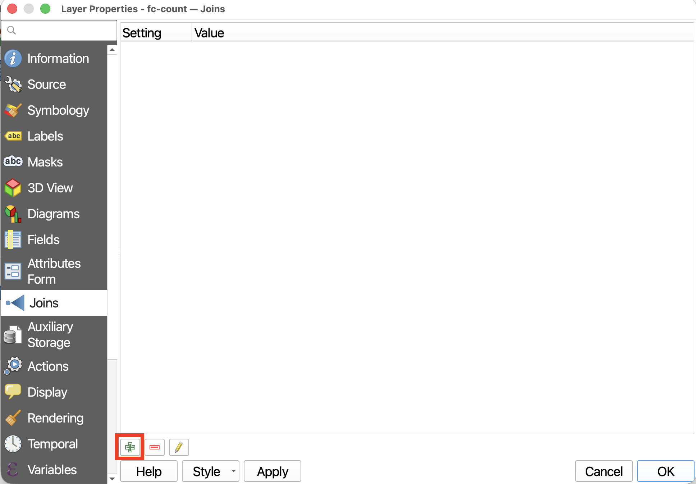

A new window will pop up. This window is easily lost behind other QGIS windows. 

- Our **Join Layer** will be `total-count`
- Our **Join Field** will be `CTRACT`
- Our **Target Field** will also be `CTRACT`

Note that you can check on Join Fields to customize which fields join. We don't need ID or CTRACT again, so you can just click `total-pop` (or whatever you set your column to - maybe its NUMPOINTS).

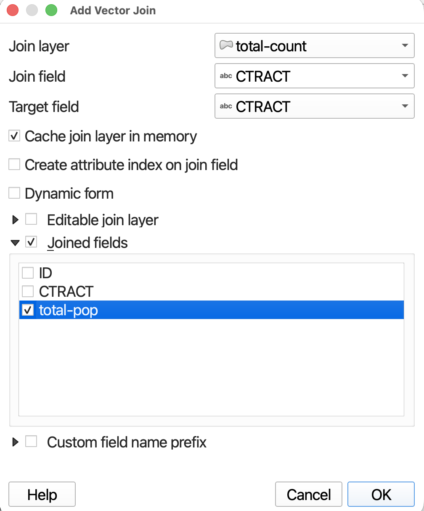

Click Okay in this window, and then OK in the Joins Layer Property. Open the attribute table of `fc-count`. You should see a new column!

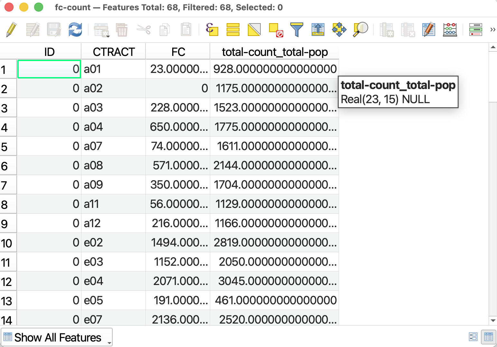

 **SAVE YOUR PROJECT**

 

## Field Calculator 
Our final step in the is to calculate the percentage French Canadian population in each census tract. As QGIS writes, the **[Field Calculator](https://docs.qgis.org/3.44/en/docs/user_manual/working_with_vector/attribute_table.html#using-the-field-calculator)** "allows you to perform calculations on the basis of existing attribute values or defined functions, for instance, to calculate length or area of geometry features. The results can be used to update an existing field, or written to a new field (that can be a virtual one)."

To get the percent French Canadian population in each census tract, we need to calculate (French Canadians / Total population) * 100. Let's add a column to our attribute table that performs this calculation using Field Calculator. 

 

*1*{: .circle .circle-yellow} Using Field Calculator to create and populate a new column constitutes editing the layer and the Attribute Table. As a safeguard against messing up your data, QGIS only allows editing when "Edit mode" is toggled on. You can toggle on edit mode either by right-clicking a layer in the layers panel, or directly from the Attribute Table by clicking the pencil icon. 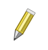

 

Once you've toggled on editing mode, more tools will become available in the Attribute Table's toolbar. 

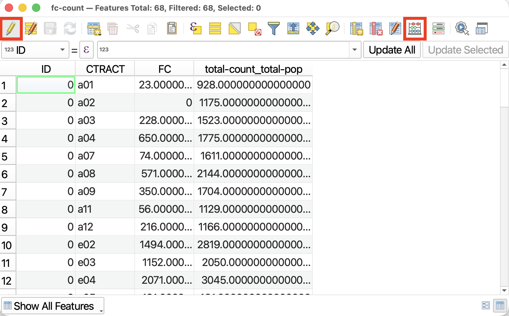

*2*{: .circle .circle-yellow} Open the **Field Calculator** by clicking on the abacus icon . The Field Calculator window is similar in format to Select by Expression, but here we build an expression to populate a new or existing column. In Field Calculator, you can calculate the area of features, run mathematical operations between columns (as we will do), or update or reformat an existing column. 

- We want to create a new field (but *not* a virtual one). 
- The output name will be `percent-fc`.
- Change the Output field type to **Decimal number (real)**. We can drop the precision down to 2. 

Now, to build the expression, expand **Fields and Values** like before. Build an expression that divides the field for French Canadians by the field for Total population, then multiplies that number by 100. BE SURE TO USE PARENTHESES. 

> `(  "FC"  /  "total-count_total-pop"  )  * 100`

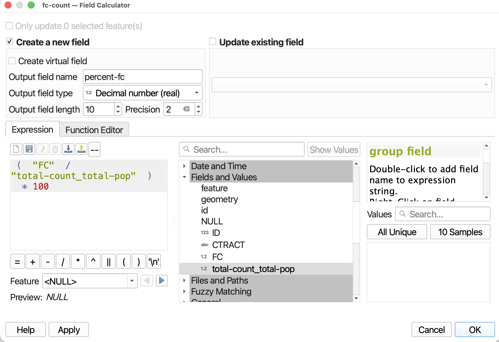

 

> Now click **OK** and return to the Attribute Table. You will see a new field.

 

*3*{: .circle .circle-yellow} Before moving on, you MUST save your edits and toggle *off* editing mode. First, click the , then click the pencil icon again. 

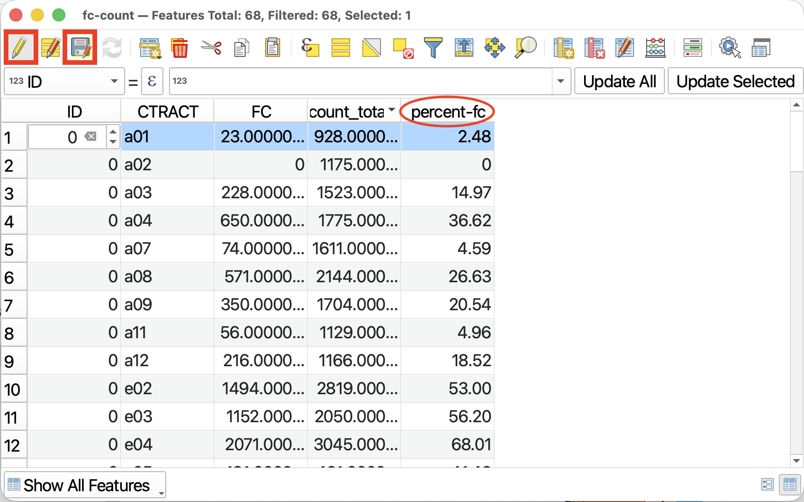

 

 **SAVE YOUR PROJECT**

<!-- 
## workflow ... 

Percentage French Canadian Workflow... 

select and export attribute where eth = FC or fc. 

save as.

count points in census tract polygon both for french-canadian and for total population. 

join count for total pop to count for french-canadian-count. 

then show how to edit attribute table, field calculator to make new column thats percent. 

then next page - choropleth map.  -->

