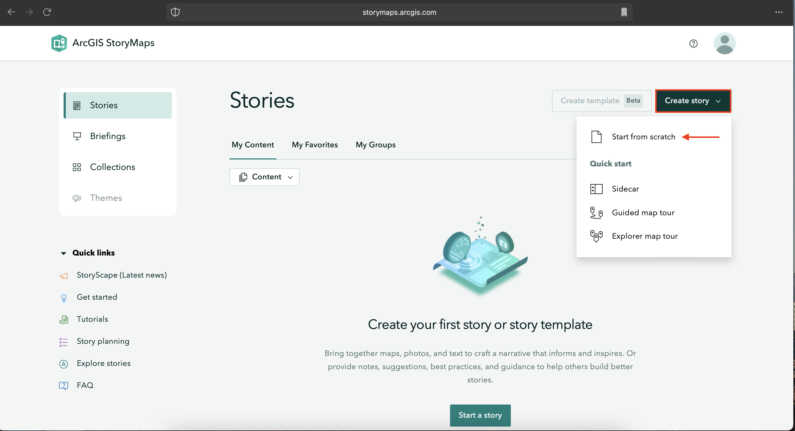
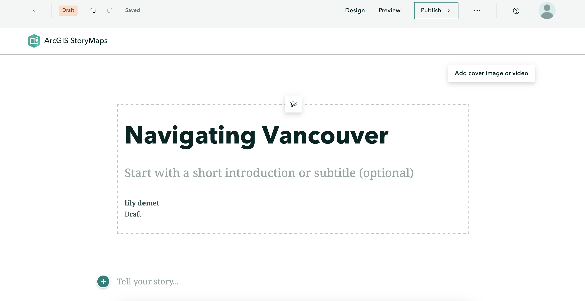
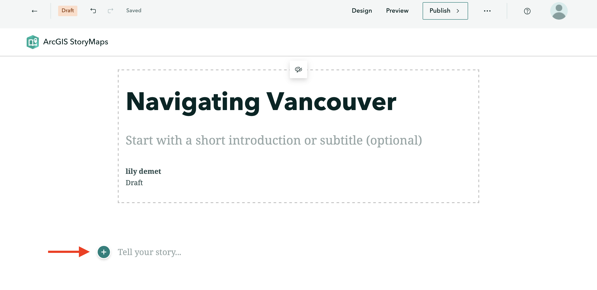
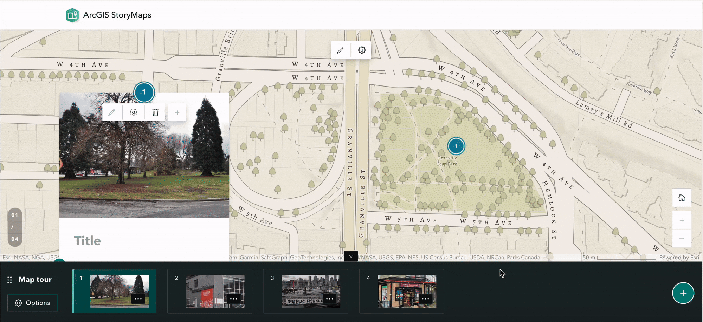
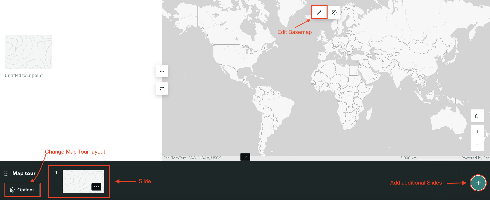

# Create an ArcGIS Online StoryMap
{: .no_toc}

ArcGIS Online is frequently changing what tools are available under a Free License. View their tutorial on [Getting Started with ArcGIS StoryMaps](https://storymaps.arcgis.com/stories/cea22a609a1d4cccb8d54c650b595bc4) for the most up-to-date documentation.

<!-- 
Still need to go through and see what new free things there are - thinking we can leave this page here but link to Esri's documentation and just sort of vibe the interface if/when we demo...
{: .warn} -->


<details open markdown="block">
  <summary>
    On this page:
  </summary>
  {: .text-delta }
 - TOC
{:toc}
</details>
----


## 1. Create a new StoryMap

After creating a free ArcGIS Online Public Account, navigate to [storymaps.arcgis.com/stories](https://storymaps.arcgis.com/stories) and **Sign In**. Click **Create story**. You'll notice there is an option to either Start from scratch or "Quick start" using one of the provided templates. Sidecars and map tours are elements that can be added to any StoryMap, so for the purposes of this workshop, select **Start from scratch**.




Alternatively, you can create a new StoryMap from the ArcGIS Online homepage by going to **Content** (in the top banner) and clicking **Create app**. From here, select **ArcGIS StoryMaps** and you're good to go. 


The theme of our demo StoryMap is everyday navigations in Vancouver. However, feel free to use your own locations in your own geography or here in Montréal. The focus is less on creating a cohesive, polished story and more on introducing you to the interface.

<br>

## 2. Explore the interface 
Go ahead and give your StoryMap the title: `Navigating Vancouver`. You'll notice a little paintbrush and palette icon appears, allowing you to center or justify the header block. Feel free to add a subtitle and descriptive text, as well as your name. You can also add a cover image or video. If you choose to do so, browse and upload a file from `dhsi-workshop/Day3/Storymaps`. (If you haven't moved your own images into the workshop folder, this is a reminder to do so. The purpose of keeping your files together is simply to keep you organized.)

<br>




- On the top upper left-hand corner of the interface, notice your changes have **saved automatically**. The curved forward and backward arrows allow you to **undo** and **redo** your moves as you go. The straight back arrow will take you back to the StoryMaps homepage. Notice also that you're working in ```Draft``` mode. 

- On the upper right-hand corner of the interface, you'll see options to **Preview** and **Publish** your StoryMap. Preview allows you to look at your StoryMap as if you were an outside visitor to the site, while Publish actually makes your work visible online. You can Publish your StoryMap as many times as you want. Previewing your StoryMap will not change what is Published. 

- Who can see your published work? The three dots (ellipses) beside Publish reveal **more actions**. Here you can delete your story all together, duplicate it (if, for instance, you want to make different versions), and manage the **settings**. 

- To see the **full details** of your StoryMap, go back to the StoryMaps homepage and click the three dots beside your StoryMap's tile. Here you can set things like terms of use, attribution, sharing permissions, description, and more. **Change share access to public, ensuring everyone can see your final map.**


- Lastly, **Design** enables you to choose an out-of-the box **Theme** for your StoryMap. Note: only paid AGOL accounts allow you to create your own Themes. However, there is still a variety to choose from. 

<br>

To Do
{: .label .label-purple}
Before moving on, choose a Theme you like (or keep the default). 


<br>

## 3. Content Blocks 
A StoryMap is essentially a one-page website made by adding blocks of various content one after another. These blocks are called **content blocks**, and can be added by simply clicking the  waiting below your title.  

<br>



When you click on , you'll see the different kinds of content that can be added. Notice, however, some options are greyed out when working with a free account. Not to worry — you can still get a lot done with the content blocks available. 

### Basic Content Blocks
{: .no_toc}
Basic content blocks include Text, Button, Separator, and Code. 

- **Text** allows you to add and style paragraphs, including hyperlinking text. Once you begin writing, simply highlight the text you want to modify and the styling menu will appear. 

- **Button** allows you to add hyperlinked text styled as a button. Add a word or phrase as appropriate, then click the pencil icon to add a hyperlink. The appearance of button is determined by the StoryMap Theme, and cannot be changed within free account. 

- **Separator** simply adds a plain line to your StoryMap. 

- **Code** allows you to embed a code block formatted as such. Click on the gear icon to indicate what language your code is in. 


- To **delete** any content block, click out of it and then hover over the block until a trashbin icon appears. You can drag and **rearrange** content blocks as you wish. 


### Data Visualization
{: .no_toc}

- **Map** will take you out of StoryMaps to ArcGIS Online mapping platform. Later in this workshop you will be guided through creating a simple web map to embed in your StoryMap.

- **Chart** will create a column, bar, donut, line chart out of manually imputted data. You cannot upload external spreadsheets, however. 

- **Table** creates a simple table which can be populated with text. 


### Media
{: .no_toc}
With a free account, there is the possibility to add **Image** or **Video**. You can either upload or link multimedia. For video in particular, it's recommended to link from an external source, like YouTube, since longer videos will rapidly use up your storage. 

<!-- Swipe - compare two images, for example static maps. remember static maps are made outside and uploaded as image blocks. swipe can also work with maps.  -->


### Immersive 
{: .no_toc}
Immersive content allows you to create guided tours where text and images elaborate locations of significance chosen on an ArcGIS supplied basemap. Remember, you can choose for your entire StoryMap to be formatted in either of these ways. Create a new StoryMap anytime. 


## 4. Add text and media

First things first, add a **text** content block to explain what this StoryMap is about. Highlight your text and experiment with the different styling options. 

Add an **image** from `storymaps-workshop` folder — either your own or one provided. Notice you can dictate whether the image sits to the left or right of your text, or takes up the width of the screen. Clicking the gear icon, you can give the image an attribution and alt text. 

Also note that there is a size limit to the media you can upload on the public account. If you plan on uploading a lot of rasters to your Content, you may need to resize them. Additionally, if you have long videos it's recommended you upload them to another platform, like YouTube, and embed them via links. This won't take up any space on your account.

Add any other content blocks you wish. Then **add a separator bar**. 


## 5. Add Immersive Content


### Map Tours
You can create a map tour to showcase a set of places. You can decide whether your readers get to explore these places in any order, or are led through in an order of your choosing. 




<br><br>

If you select **start from scratch**, you'll be prompted to "Select a map tour layout". The options are Guided or Explorer. Guided leads the reader through an order of your choosing, whereas Explorer allows the reader to peruse on their own. 

When you choose a layout, a new content block will be added to your StoryMap. It will look something like the below. The bottom banner contains the "Slides" of your map. Each slide displays some text and/or multimedia, and is connected to a location on the map. 



<br>

- To add a location, click on the first Slide and select "Add location". Now, you can either search the location on the top-right, or zoom-in to it. With your cursor as a crosshair, click the location and save. Once you choose a point and click "Add to map", there are two options of zoom level that you can select when you add a location. Using map tour setting will automatically adjust the zoom level so all points are visible simultaneously. Use current zoom level will keep the zoom level always be street or city. You can always go back and edit locations later. 


- To customize the basemap, click the pencil icon. 


- You can also always change a map tour layout by going to its Options in the bottom left corner of the content block. 

<br>


To Do
{: .label .label-purple}
To practice, choose a layout and add some pictures to locations. 


<br>


### Sidecar

Scroll down on your StoryMap to add another content block. This time add a Sidecar from Immersive Content. In a Sidecar element, text and multimedia scroll over an image. In each slide of a Sidecar, you can add the same content blocks you would to your StoryMap. 


<br>

## Finalizing your StoryMap for Publication
Now it's time to add the maps we just created with the online mapping tool to our StoryMap. 

### Add Credits and Attributions
{: .no_toc}
All the way at the bottom of your StoryMap you can add Credits and Attributions. Here is a great place to note any organization you're working with or cite your research references.  

### Publish 
{: .no_toc}
Although in a real-world scenario you may wait until your project is further along before publishing a first version, let's practice publishing now. (If you don't want to publish your work you can also just preview it to see what it would look like.)

<br>


*That's it! Now you know how ArcGIS Online StoryMaps works!*

