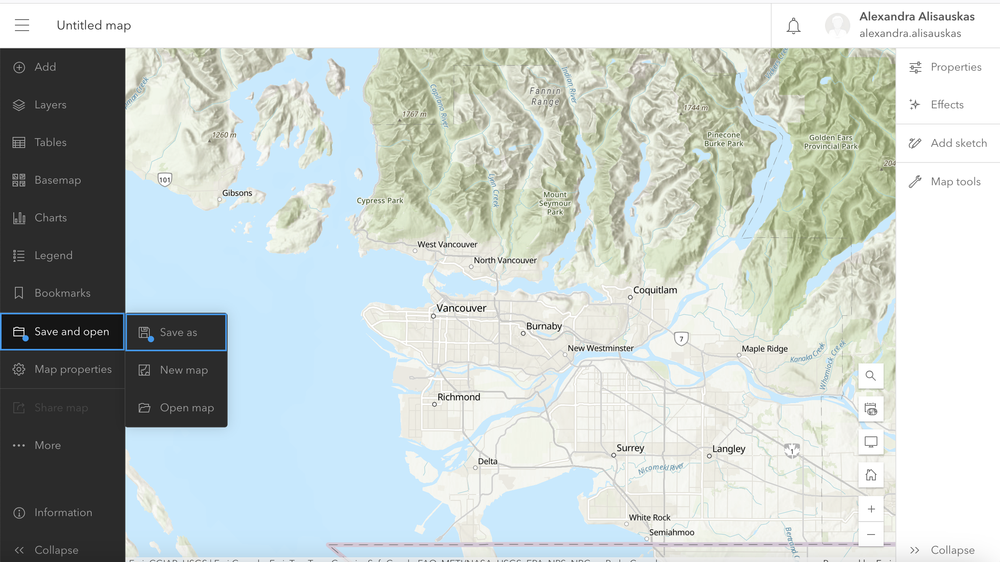
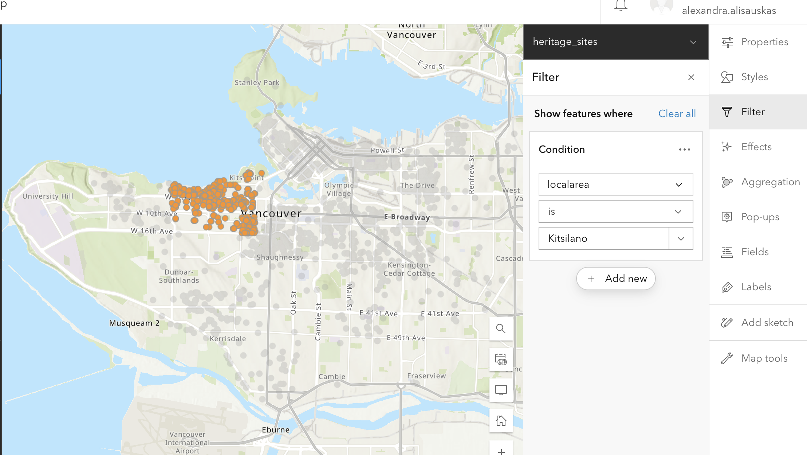
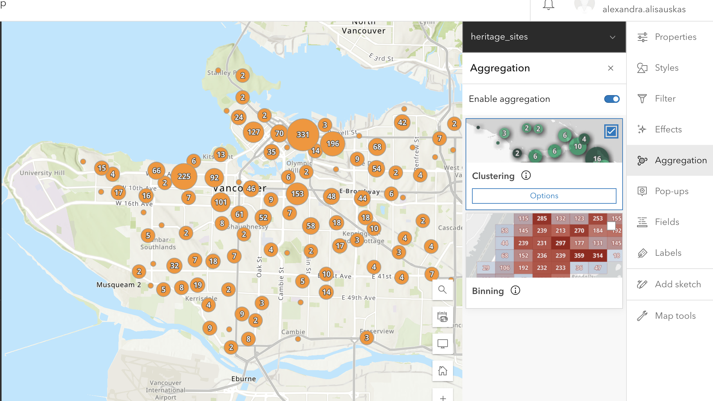
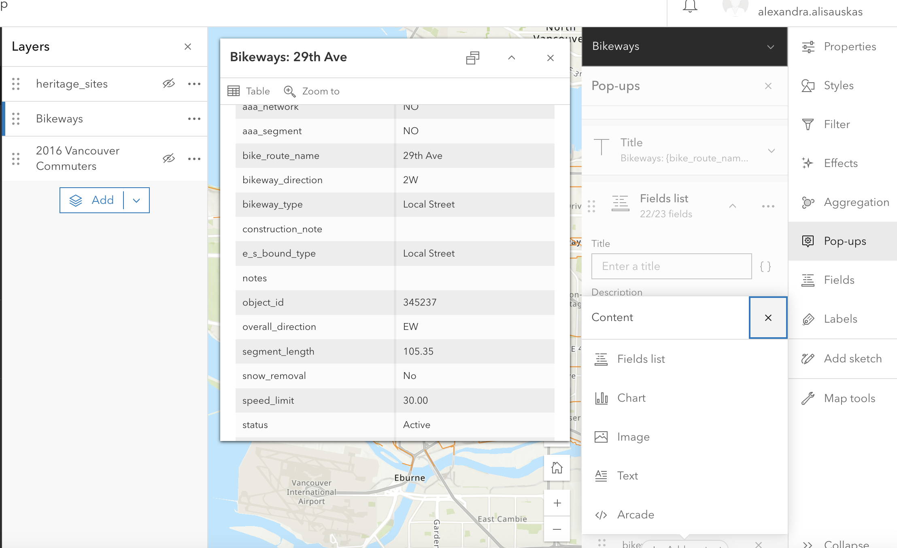
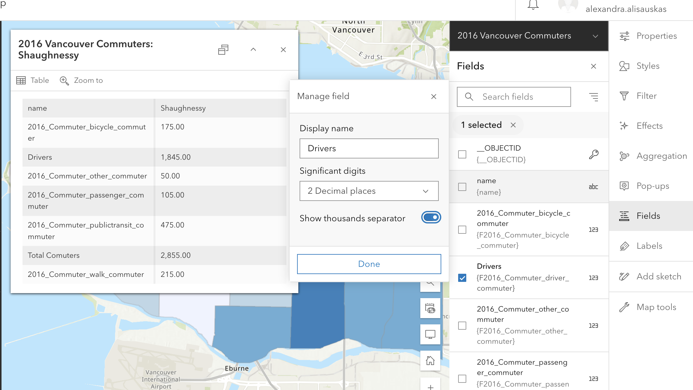
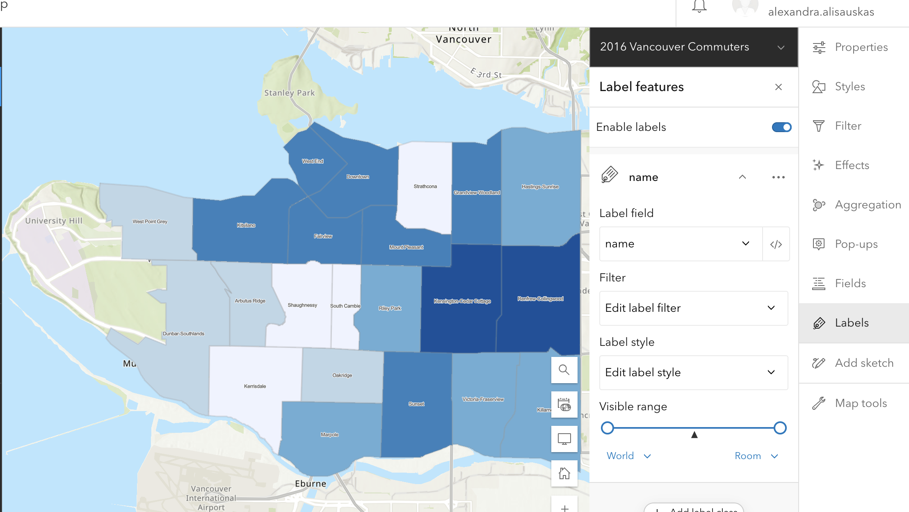
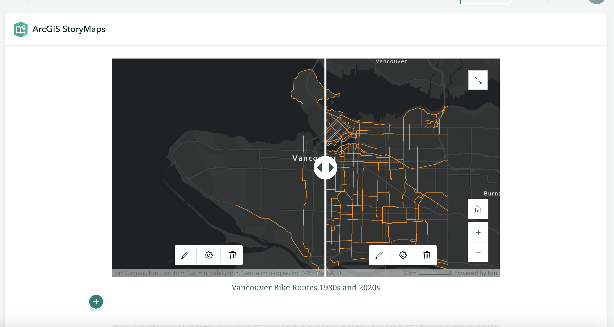

# Create a Web Map with ArcGIS Online 
{: .no_toc}

<!-- i ported the content in as all one page but i can absolutely break it up just like it is in the [og website](https://ubc-library-rc.github.io/gis-storymaps/content/create-a-webmap.html)... lmk what makes the most sense for teaching/demo-ing 
{: .warn} -->

An ArcGIS web map is an interactive display of geographic information that you can use to tell stories and answer questions. If you want to include any dynamic maps that include layer data in your StoryMap, you will need to create it through ArcGIS Online first. 

Note that the public account and organization account have different user interfaces and functions. The public account does not have access to some functions, including any spatial analysis tools.

 

The following documentation uses data on Vancouver commuters. This data can be found in the folder `dhsi-workshop/Day3/storymaps/`. However, inside that folder you will also find data on [public pools from the City of Montréal](https://donnees.montreal.ca/en/dataset/piscines-municipales){:target="_blank"}. You are encouraged to practice mapping using this data. 
{: .note}

  

    On this page:
  

  {: .text-delta }
 - TOC
{:toc}

----

# Getting Started

To get started creating a webmap, **Sign in** to ArcGIS Online and select **Map** in the top banner. This will take you to a new untitled map project. 

Zoom to the area of interest you want to work on. Select **Save and Open** from the left-hand vertical menu and **Save as** to create a new map anchored at your desired extent. Throughout editing your map, save it to make sure to preserve your visualizations.

Whenever you open a new map in ArcGIS Online, it will open with a default Topographic basemap. To change this, select **Basemap** from the left-hand menu and choose the option that best suits your data and visualization. 

 

# Adding Data

Today we will work with commuter data from the city of Vancouver. Adding data requires first finding relevant data and downloading it, then uploading it to your ArcGIS online account. Once uploaded to your "content", you can visualize spatial data in the online mapping tool. You can also load spatial data directly to a webmap in progress. However, make sure your data's visibility is set to public if you want to share your project with others. Even if your webmap or StoryMap visibility is set to public, you will get an error unless the data visibility is *also* set to public. 

 

## Find Data 
<!-- The [Vancouver Open Data Portal](https://opendata.vancouver.ca/pages/home/) is an excellent source for a variety of municipal data, including geographic data layers such as points, lines and polygons (vector data), and aerial imagery (raster data).  -->

As long as the data you are looking at has a geographic element, you can download it. When downloading from the "Export" tab, make sure to download it as a **GeoJSON** file. This will ensure we can add it as a layer to your ArcGIS Online webmap. 

 

## Add Data from File
In the sidebar menu of your ArcGIS Online map, click on **Layers**, then on click on the drop down arrow next to **Add layer** to add a layer from a file.

To Do
{: .label .label-purple}
You will find the sample data for this workshop already prepared for you in `dhsi-workshop/Day3/storymaps`. Take a moment to add each file as a layer to your ArcGIS Online webmap and play around with features.

> - `Vancouver_Commuter_2016.geojson` is a polygon layer with commuter data from the 2016 census joined to local area boundaries (aka neighborhoods).

> - `bikeways.geojson` is a line layer showing Vancouver bike paths.

> - `heritage-sites.geojson` is a point layer showing Vancouver heritage sites.

 

## Add Data from the Living Atlas
You can also add data from the [Living Atlas](https://livingatlas.arcgis.com/en/home/){:target="_blank"}, a large collection of geographic information compiled and created by Esri.

Click on **Layers**, then click on the **Add** button.

From the dropdown arrow next to **My Content**, select **Living Atlas** and search for layers to add.

*Note: If you only have a public ArcGIS account, you will have access to fewer layers in the Living Atlas.*

 

## Displaying Layers

You can add as many layers as you want and they will display simultaneously.

Next to the layer name, you will see an eye icon and three dots. Click on the eye to make the layer visible or invisible.

If you click on the three dots next to the layer name, you have the following options:

> - Zoom to layer: Will zoom your map to the layer location
> - Show properties: Displays things like symbology
> - Attribute table: Shows the data in a tabular format
> - Rename and Remove

 

# Other Visualization Tools

## Filter
Use the filter feature to create a condition and determine what shows up on your map. This feature is useful if you have data that varies in type/category or date. You can also filter to only include features in a certain neighbourhood.

If you want to create a Swipe on your StoryMap, the Filter function can be very useful to single out data and create the individual maps that make up the Swipe. Once you’ve filtered the data you want to show, make sure to “Save as” your map. In the example below I have filtered heritage sites in the local area of Kitsilano.

To Try
{: .label .label-purple }
On the `heritage_sites` layer, try filtering to include only sites with an interior heritage designation

On the `Bikeways` layer, try filtering to include only bikeways created in the 1990s

 

## Aggregation
You can enable aggregation on your map.

**Binning** aggregates data to predefined cells, representing point, line, or polygon data as a gridded polygon layer. The bins show point, line, or polygon density in geographic space instead of screen space.

**Clustering** aggregates points into clusters and displays them as one symbol. Clusters use proportionally sized symbols and change dynamically with the map scale. Clustering only works for point features.

Spatial aggregation is one method for visualizing high-density data. Read more about best practices for [visualizing high-density data](https://doc.arcgis.com/en/arcgis-online/reference/best-practices-high-density-data.htm){:target="_blank"}.

 

## Pop Ups
Pop-ups can bring focus to the attributes associated with each layer in the map, such as hiking trails, land use types, or unemployment rates. They can contain attachments, images, charts, and text, and they can link to external web pages.

The Pop Ups tool lets you configure which attributes are displayed and how. You can edit how your pop up s titled, and determine which fields to include. You can also add content, like images, charts, or text.

 

## Fields
The fields feature lets you edit field elements for your geographic attributes. In the free account, you can rename fields, and select decimal points.

 

## Labels
The Label feature lets you add labels for various elements on your map. Click enable, then select which field you want to serve as a label. In the examplbe below, the neighbourhood name field is being used as a label.

 

## Add Sketch 
You can add add points, or draw lines, shapes, etc. with the Add Sketch function. This can be useful to highlight map features manually. Any sketch elements you add will create a new layer with those elements.

  

## Finalizing your StoryMap for Publication
Now it's time to add the maps we just created with the online mapping tool to our StoryMap. 

### Add Web Maps to StoryMap
Return to your StoryMap and add a **map** content block. Choose the map you just made.

### Add Swipe
A **Swipe** content block allows you to compare two images, static maps, or even two web maps. Swipe is great to show changes over time.

Each map on the swipe is a separate we bmap. You will have to create a separate web map highlighting the features you want to include. For instance, you will have to create a map for 1980s bike routes and one for 2000s bikeroutes. You can easily do this with the filter option on webmaps.

