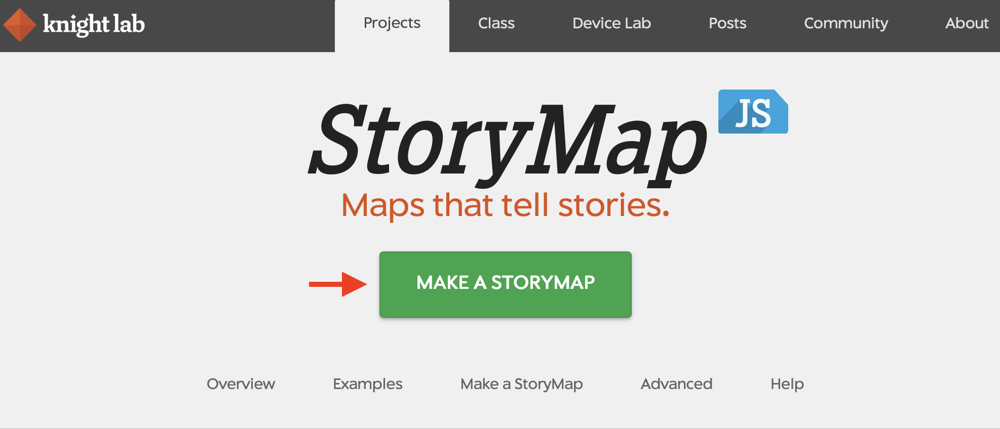
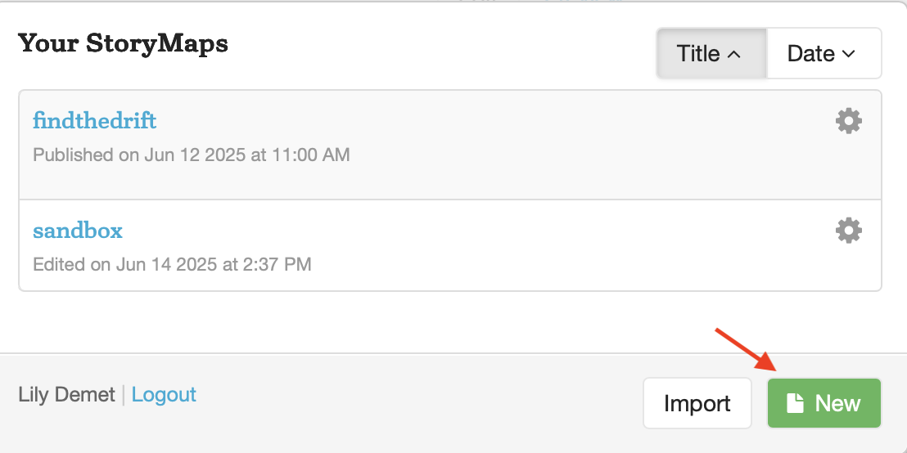
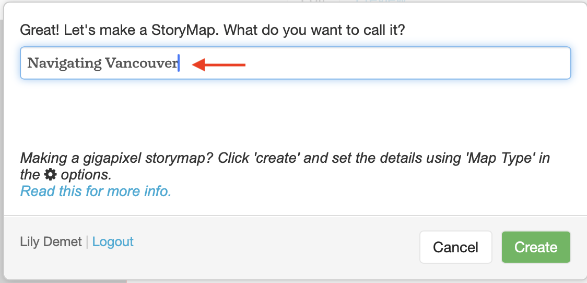
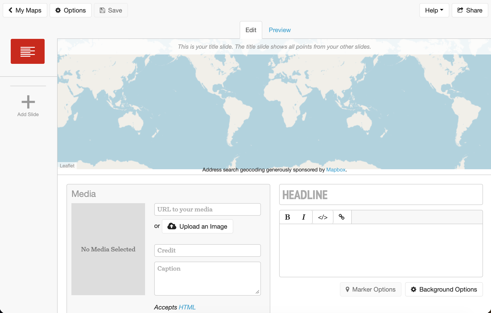
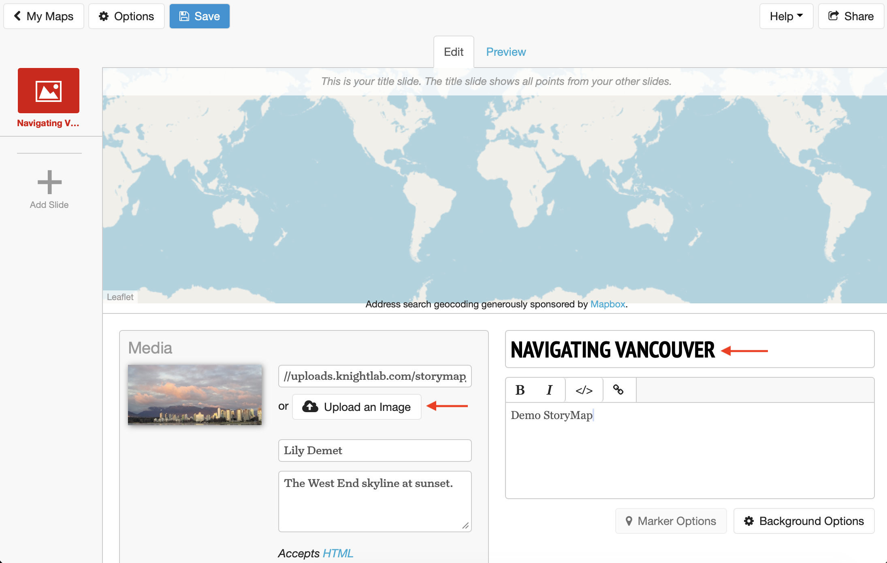
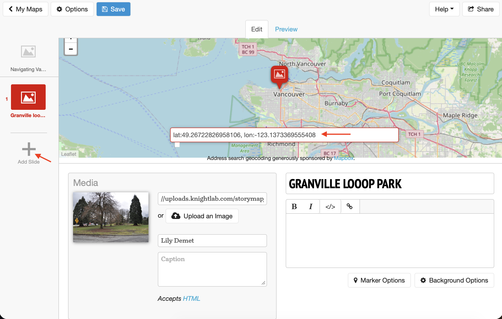
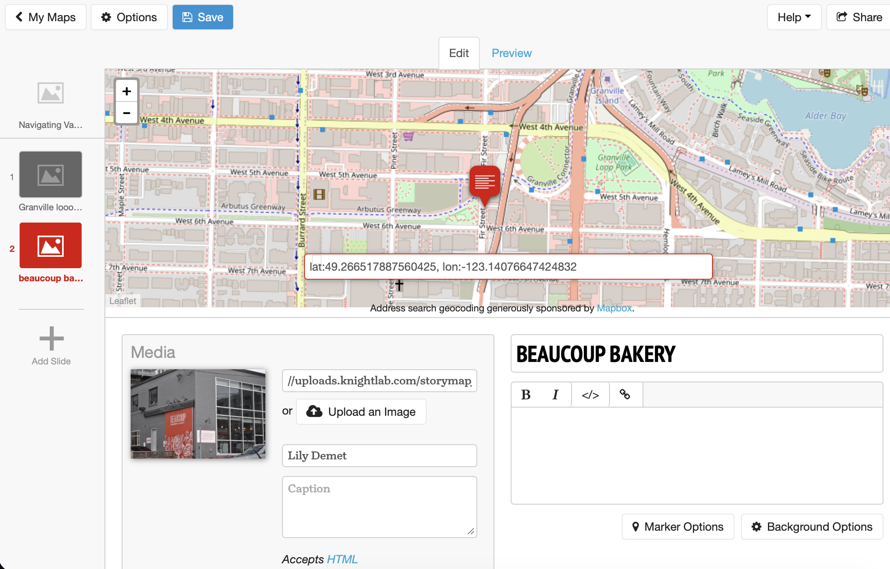
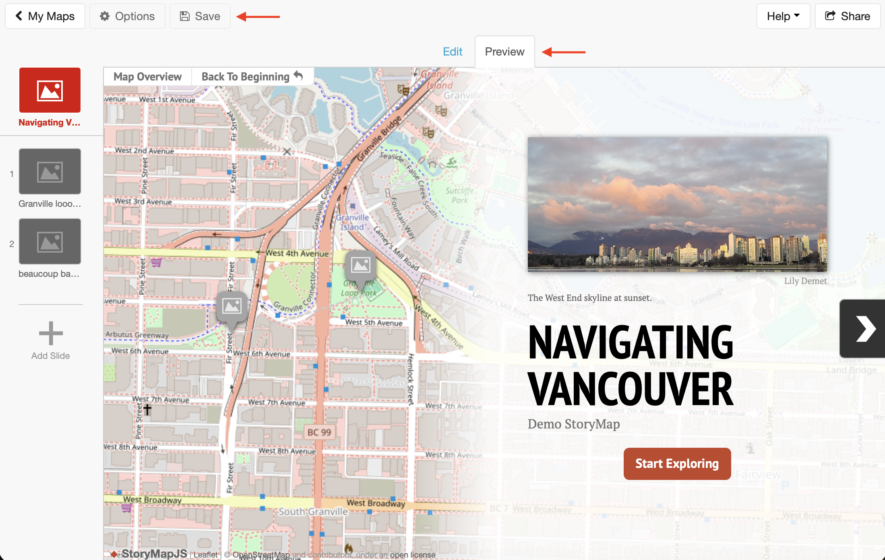
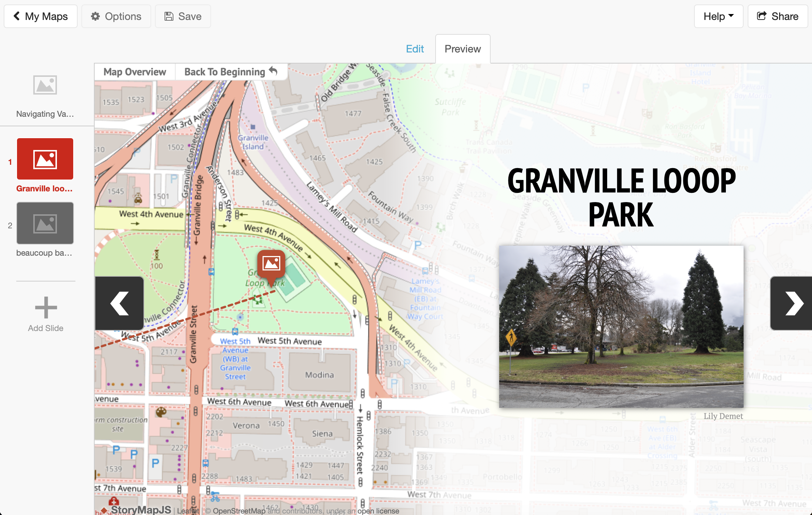

# Create a Knightlab StoryMap
{: .no_toc}

<!-- ## 1. Create a Knightlab StoryMap -->

> * Navigate to [storymap.knightlab.com](https://storymap.knightlab.com/) and click the green button that says "MAKE A STORYMAP".

> * You will be prompted to sign in with your Google Account. Unfortunately, this is the only way you can edit a Knightlab StoryMap, unless you configure it to run from your own server.

> * Create a New StoryMap and call it "Navigating Vancouver" or, if you are using pictures from this week, "Navigating Montreal".

 

## Add a title page
This is the KnightLab StoryMap interface. Along the left, you can add (and delete) slides which you can edit in the main space. You can toggle between edit mode and preview to see your story in action. Remember to save your work intermittently. 

> * Give your StoryMap a title and title image. Again, you can use images from the folder `dhsi-workshop/Day3/storymaps/` or upload your own. 

 

## Add slides
Go ahead and continue adding slides. You'll be prompted to add geographic coordinates for the subsequent "stops" on your StoryMap. An easy way to do this is to use Google Maps to search for places, then copy and paste the coordinates by right-clicking on Google Maps. Do be sure to format your coordinates in KnightLab as directed, otherwise your points won't show up. 

## Save and Preview
When you're happy with your progress, you can save and preview your StoryMap. 

