# Vector Tools
{: .no_toc}

This page will introduce some common **vector tools** and spatial analysis workflows useful for map making. 

  

    On this page:
  

  {: .text-delta }
 - TOC
{:toc}

As you saw yesterday, vector tools can be searched for in the **Processing [Toolbox](https://docs.qgis.org/3.44/en/docs/user_manual/processing/toolbox.html){:target="_blank"}**. They can also be accessed from the **Vector menu** at the top of your screen, and are grouped by task: Geoprocessing, Geometry, Analysis, Research, and Data Management. For today, let's open the **Toolbox** back up and use it to search for tools common to map making. 

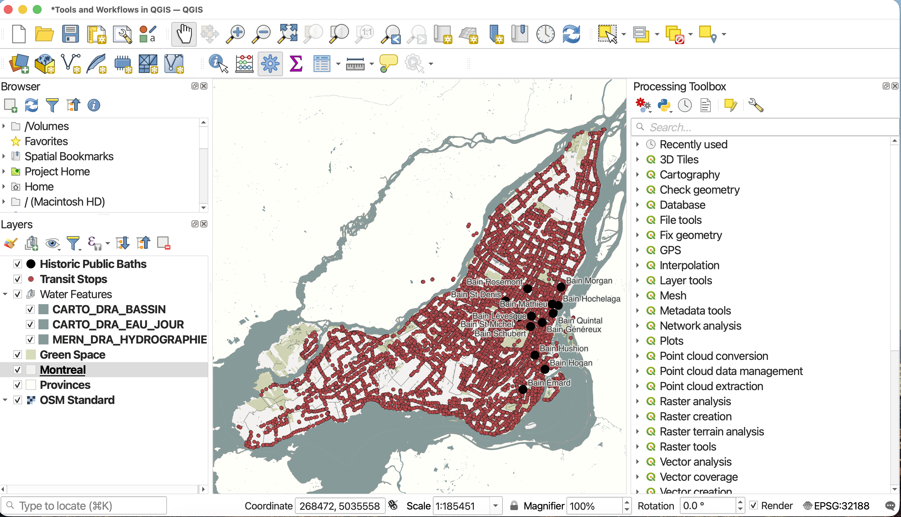

Remember, if you don't see the **Processing** menu at the top of your screen, you may have to enable the processing plugin. Click on the **Plugins** menu at the top of your screen, and then on **Manage and Install Plugins…**. In the search bar, type in "Processing". Make sure to **select the Processing box**, and then click Close. You should now see the Toolbox icon and be able to proceed with the next steps. Once enabled, you will be able to access the Processing menu anytime you open this or any other QGIS project. 
{: .note} 

----

## Clip
The first tool we'll use is **[Clip](https://docs.qgis.org/3.44/en/docs/user_manual/processing_algs/qgis/vectoroverlay.html#clip){:target="_blank"}**, one of the most frequently used tools. Like a cookie cutter, Clip takes an Input layer (the cookie *dough*) and an Overlay layer (the cookie *cutter*), clipping the Input to the extent of the Overlay. 

Clip helps identify a set of points from a larger dataset within a particular area. It is a useful tool for highlighting a particular smaller extent of your map and its features, or for clipping a certain area of interest or historical period etc. 

Let's practice Clipping Transit Stops to Montréal. As we can see, there are a few stops outside the city limit as outlined by our current shapefile of Montréal. 

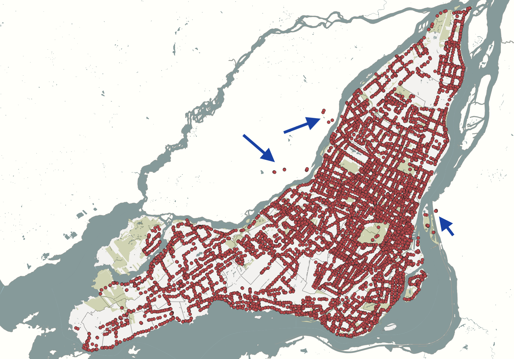

In the Processing Panel, search for "Clip". Make sure you open the tool under **Vector Overlay**.

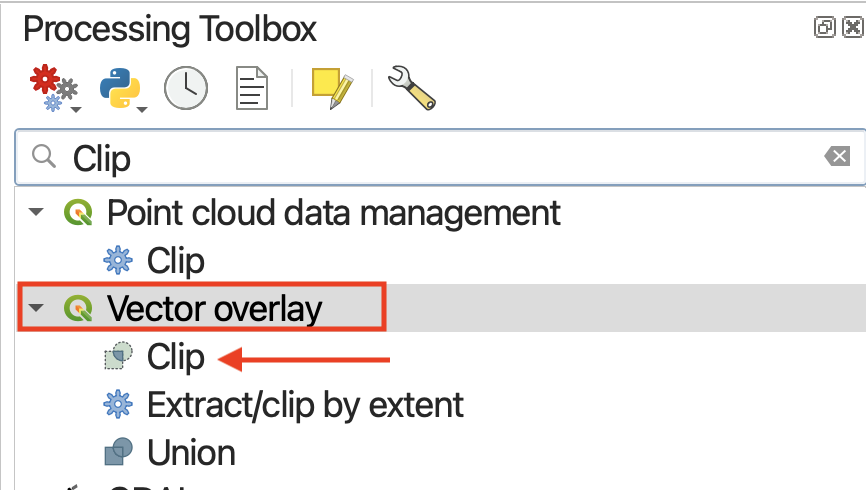

Clicking a tool will open a dialogue window specific to that tool. On the right hand side will be a description of what the tool does, and on the left, prompts for selecting input layers as well as saving the output layer to a file. 

> * Set `Transit Stops` as your Input layer
> * Set `Montreal` as your Overlay layer 

Since we're just practicing, we can leave the output as a temporary layer. Remember, the output, unless saved at this step, will load as a temporary layer with the name of the tool — in this case, "Clip".

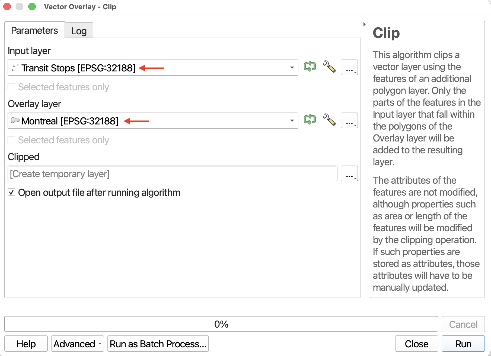

> * Now run the tool. Ignore any warning saying "No spatial index exists for the input layer"; this is how the data came. 
> * Close the tool (it might have jumped behind your main QGIS interface), and return to your map view. Toggle off `Transit Stops` for a moment so you can see Clip layer alone. You'll notice there are no longer any stops outside Montréal. 

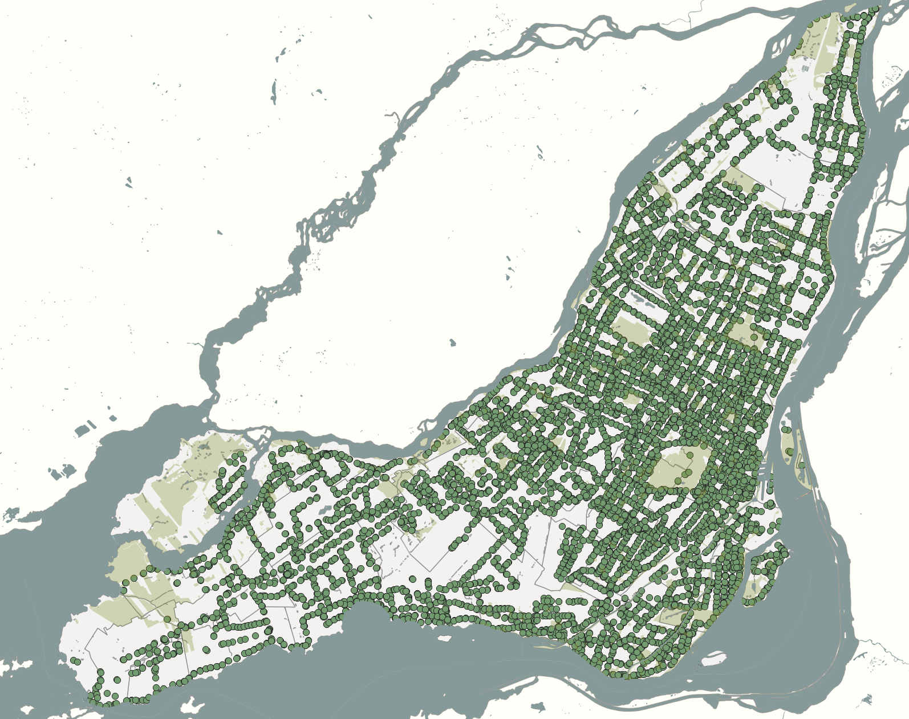

 

## Buffer
**[Buffer](https://docs.qgis.org/3.44/en/docs/gentle_gis_introduction/vector_spatial_analysis_buffers.html){:target="_blank"}** is probably the second most used/useful tool. Like the name implies, buffer creates a new layer that buffers a distance around points, lines, or polygons, and includes the area of the feature(s) buffered. Buffer is therefore useful for determining spatial proximity but defining a distance zone around features. For example, you could use Buffer areas prone to flooding around a water feature, or to determine a radio signal’s geographic influence or the area of a neighborhood disturbed by construction sounds.

Find the Buffer tool under **Vector Geometry**.

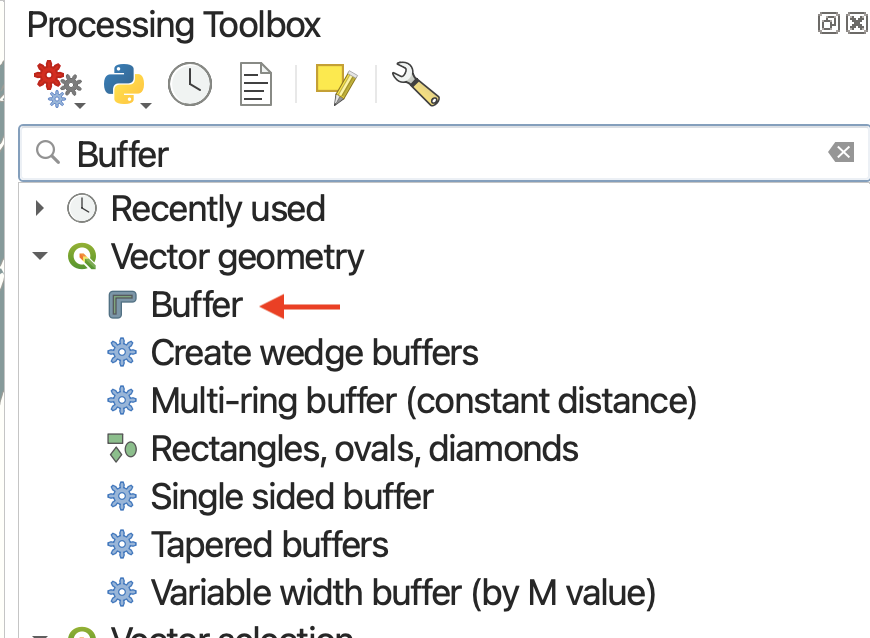

Let's buffer `300 meters` around `Green Space`. 

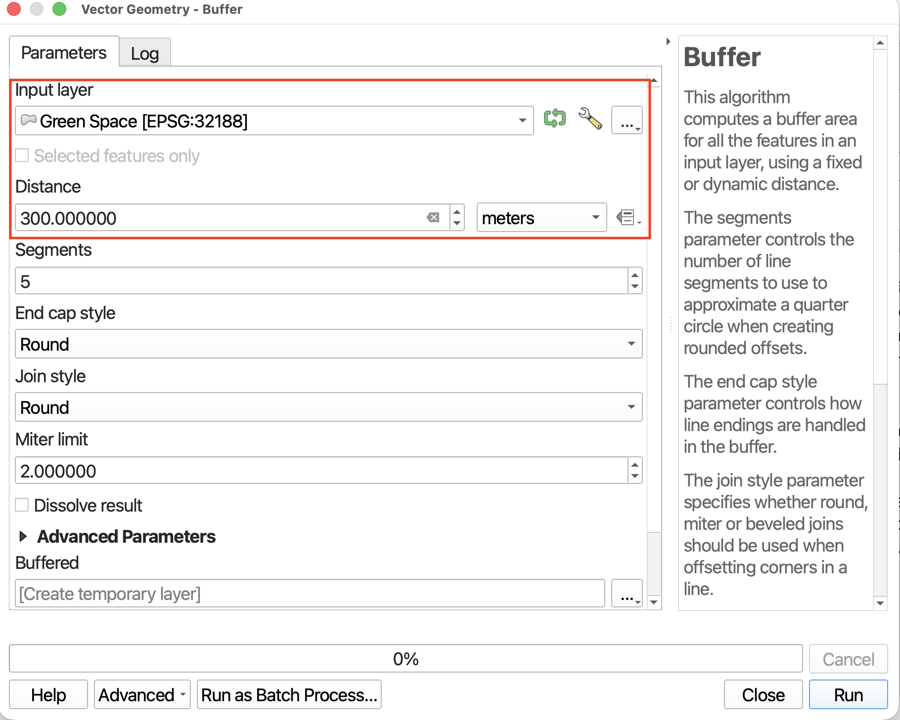

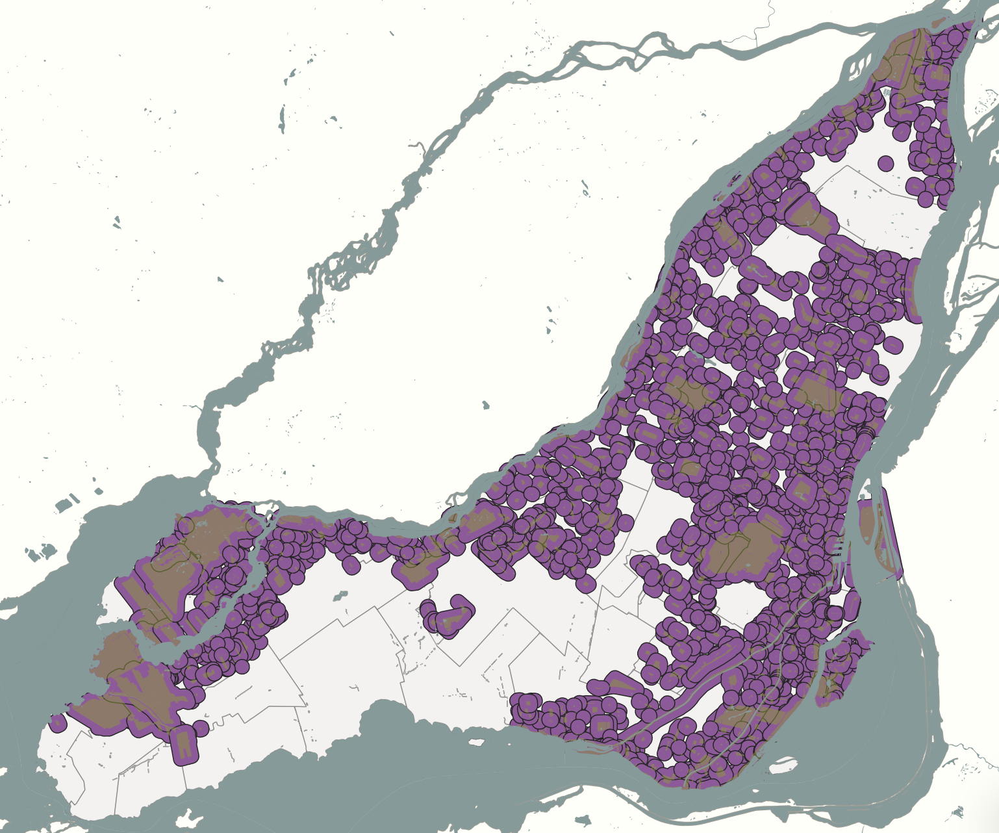

If you return to the Map Canvas, you can see there are distinct areas without many green spaces. More specifically, without green spaces in the dataset. If you toggle off the layers for Montréal and Provinces and zoom in, you'll see that while areas around the airport are indeed lacking green spaces, there are green spaces on Open Street Map not part of Montréal's Green Space dataset. 

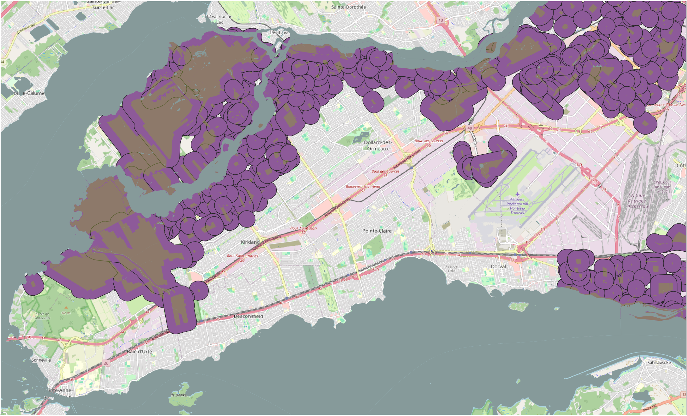

 

One more thing in Buffer to be aware of is the option to **Dissolve**. Currently, each buffer is its own polygon. However, if we clicked the Dissolve option before running the tool, we get an output layer like this:

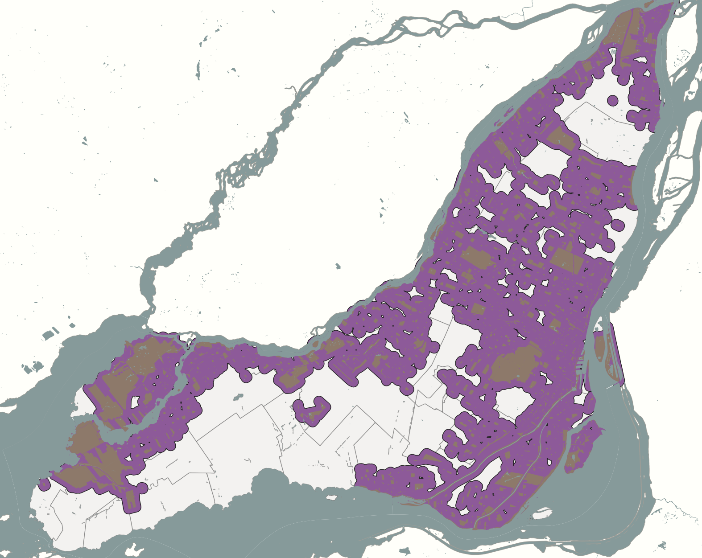

<!-- Buffer around mtl - could clip batch water.  -->

<!--you can also dissolve a non dissolved buffer-->

 

## Difference
**[Difference](https://docs.qgis.org/3.44/en/docs/user_manual/processing_algs/qgis/vectoroverlay.html#difference){:target="_blank"}** is like a spatial subtraction. Again, it will create a new layer so you don't have to worry about permanently altering your existing data (the correlate tool in ArcGIS, Erase, does just that). 

> * Zoom in to the Lachine Canal. 
> * Toggle on and off the 1st grouped Water Feature layer called `CARTO_DRA_BASSIN`. 

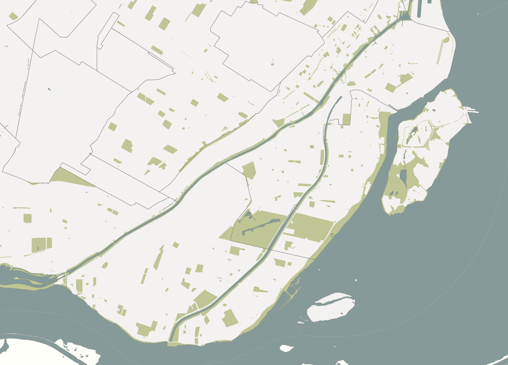

You'll notice the `Green Space` includes the canal area. This means when we map, the layer for `Green Space` must always be beneath the water layer, otherwise the canal won't show up. However, we can use Difference to remove the areas of the green space polygon where the canal is.  

Open the **Difference** tool under Vector Overlay. 

> * The Input layer will be `Green Space`
> * The Overlay layer will be `CARTO_DRA_BASSIN`

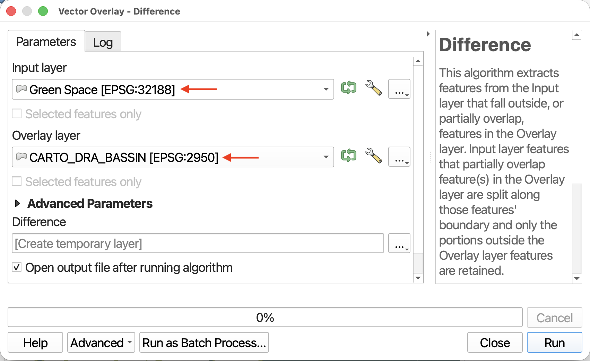

> * Now run the tool. Ignore any warnings you get about `Green Space`. 
> * The resulting layer called Difference will likely load *over* all the water features.  Note, however, that you can still see the Lachine Canal. Difference is all the green spaces minus the canals and other urban water features.

 

## Dissolve 
**[Dissolve](https://docs.qgis.org/3.44/en/docs/user_manual/processing_algs/qgis/vectorgeometry.html#dissolve){:target="_blank"}** takes multiple features within 1 layer and dissolves the boundaries between them. As it stands, the shapefile for Montréal has 34 distinct neighborhoods. When symbolizing the layer for our reference map earlier, we were unable to get rid of these lines. Perhaps you don't want these lines visible. Dissolve will remove the differentiation; *however, as an important caveat, the resulting layer will no longer have 34 distinct features in the attribute table*. 

> * Open the **Dissolve** tool under **Vector geometry**

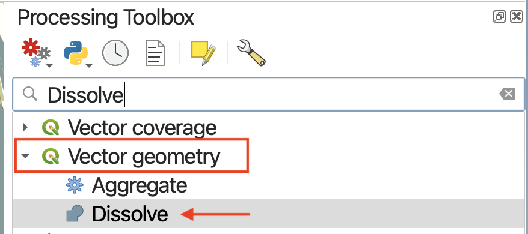

> * Select `Montreal` as the Input layer. 

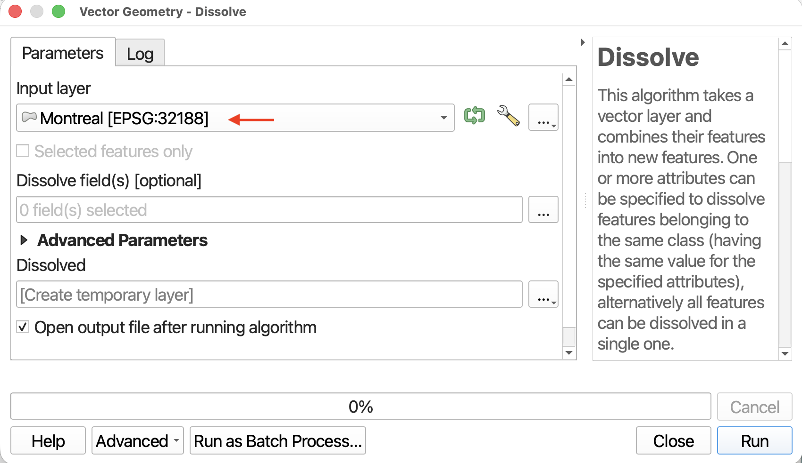

 

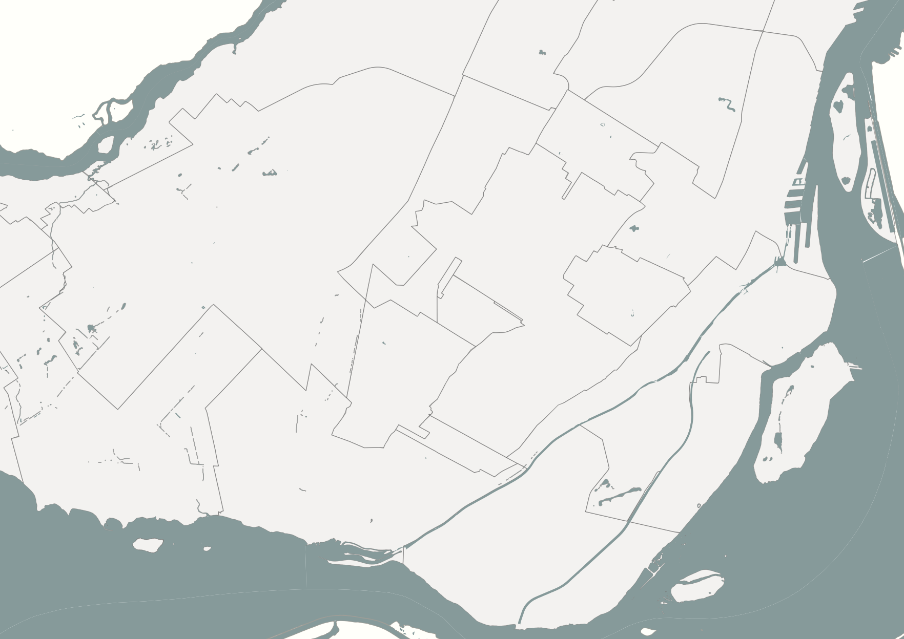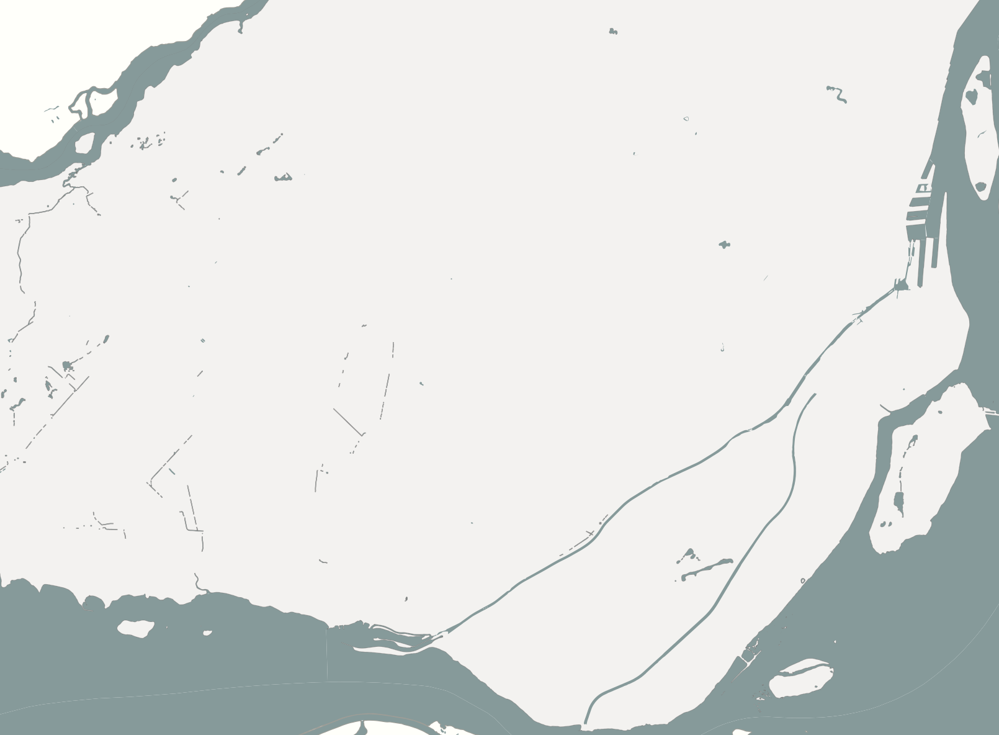

 

## Merge
Writes QGIS: **[Merge](https://docs.qgis.org/3.44/en/docs/user_manual/processing_algs/qgis/vectorgeneral.html#merge-vector-layers){:target="_blank"}** "Combines multiple vector layers of the same geometry type into a single one." 

Merge can be a useful tool to manage your data. For example, we currently have 3 layers grouped together visualizing water features. To make life easier, we could just merge them all together. 

> * Open the **Merge Vector Layers** tool under **Vector general**.

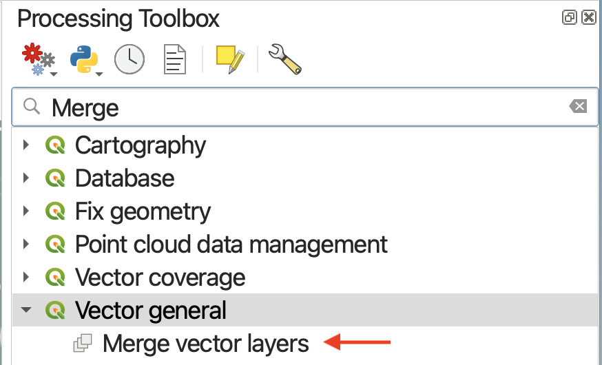

> * Click the three dots to choose your Input Layers. Select all 3 water features currently grouped together
> * Set the Destination CRS to be that of the project. This only matters if your Input layers have different CRSs.

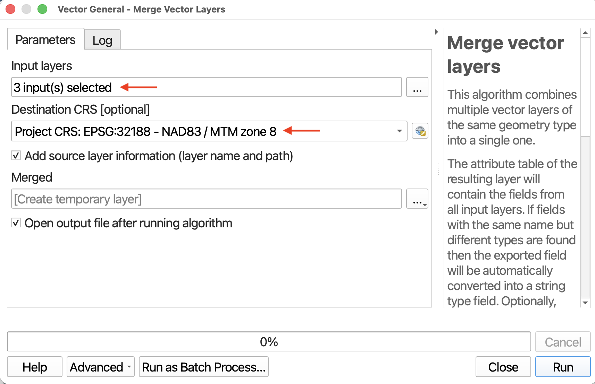

> * Now run the tool. Turn off the grouped water features in your main QGIS interface. You should now have a single layer for water features. If needed, you can run dissolve to get rid of the demarcations between vector layers merged. You can also copy and paste symbology from any of the former water layers. 

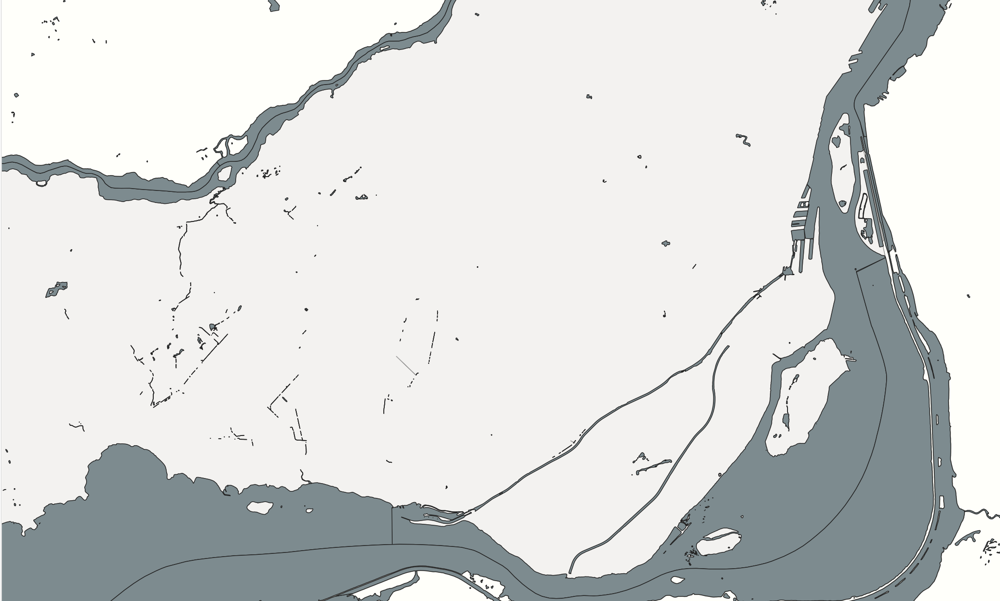

 

<!-- ## Union/Intersection??

**[Intersection](https://docs.qgis.org/3.44/en/docs/user_manual/processing_algs/qgis/vectoroverlay.html#id61)**

**[Union](https://docs.qgis.org/3.44/en/docs/user_manual/processing_algs/qgis/vectoroverlay.html#union)**

differentiate merge, dissolve, union

???intersection - - similar to join??? union - similar to merge?  -->

<!-- Note that Clip, buffer, difference, dissolve etc. all geoprocessing tools. what that means. Geoprocessing tools are useful for modifying the spatial extent of features, particularly in relationship to other layers. Geoprocessing is often done in the beginning of a QGIS project to prepare the data layers for further analysis. -->

  

## Select by location
**[Select by location](https://docs.qgis.org/3.44/en/docs/user_manual/processing_algs/qgis/vectorselection.html#select-by-location){:target="_blank"}** allows you to select features in 1 layer based on their spatial relationship with those in another layer using various spatial operators. 

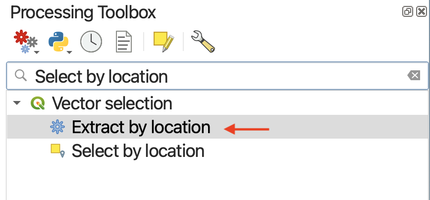

> * Currently, our `Provinces` layer is very bulky. Let's create a shapefile of only Quebec by *selecting only provinces that **contain** the layer Montreal*.  

<!-- we could think of a puzzle that uses other spatial operators
{: .warn} -->

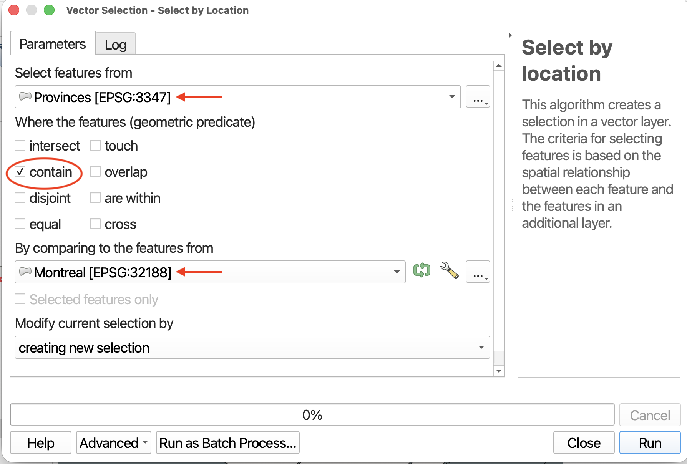

<!-- Notice there are many spatial operators you could have chosen from to select by location.  -->

> * Now zoom-to `Provinces`. You'll see only Quebec is selected and highlighted yellow. Right-click the `Provinces` layer in your Layers Panel and Export *Selected* Features as a new shapefile. Now you can remove the giant `Provinces` file. 

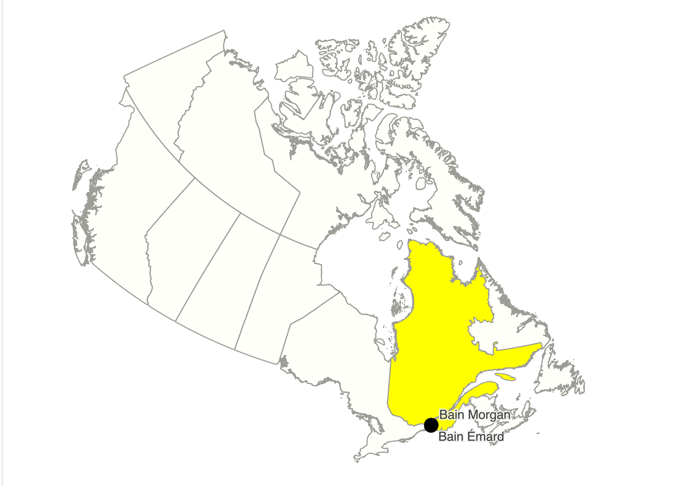

It's always best to only have files you absolutely need in your final map. Often, downloading free and open source data from the web means downloading files for the entire world or country. These can be cumbersome for your computer to load and handle and, as you saw yesterday, all layers will initially zoom to the extent of the most geographically expansive file. 

Note that we could have easily just selected Quebec from `Provinces` by using the selection toolbar, or, opened the attribute table of `Provinces` and clicked on the row for Quebec. Or, we could have even done a select by expression (like we did yesterday) to select all features where `"PRENAME"  =  'Quebec'`. 

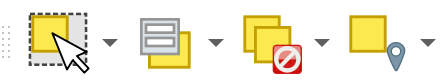

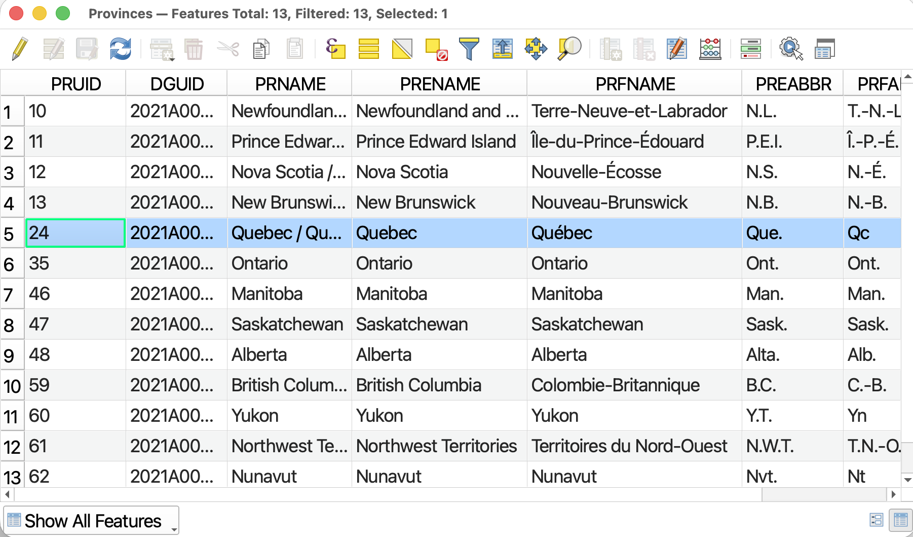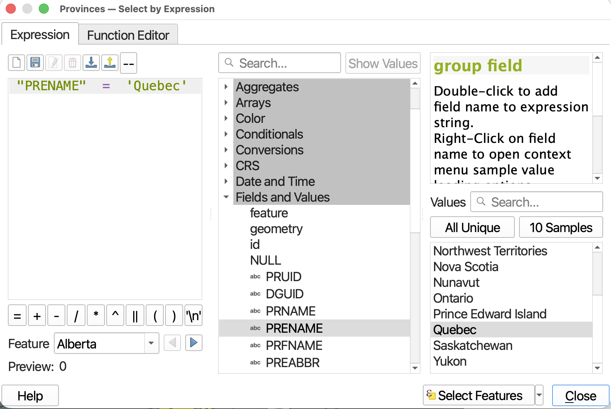

 

## Select within distance
Slightly different than the above tool, **[Select within distance](https://docs.qgis.org/3.44/en/docs/user_manual/processing_algs/qgis/vectorselection.html#select-within-distance){:target="_blank"}** "creates a selection in a vector layer. Features are selected wherever they are within the specified maximum distance from the features in an additional reference layer" (QGIS). 

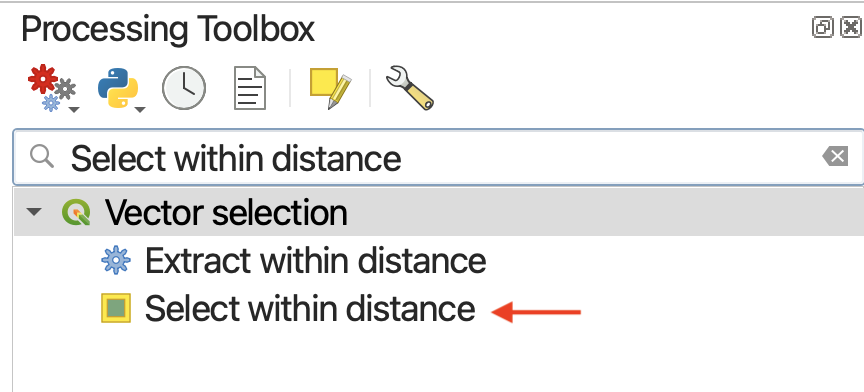

 

> * Let's practice by selecting all `Transit Stops` within `0.5km` of a `Historic Public Baths`. 

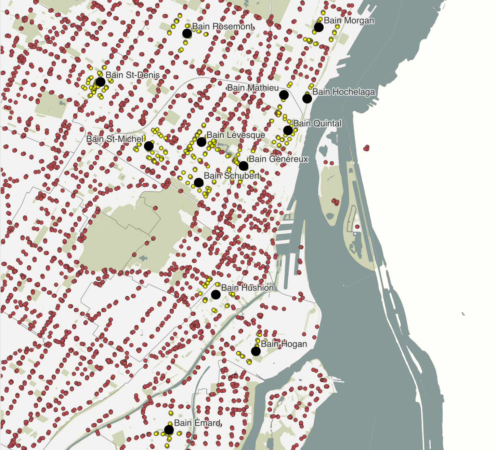

 

### Reproject 
However, try reversing the inputs: select all `Historic Public Baths` within `0.5km` of a `Transit Stops`. 

You'll get an error. This is because the spatial componant of layer `Historic Public Baths` is decimal degrees, which you can't run distance calculations on. 

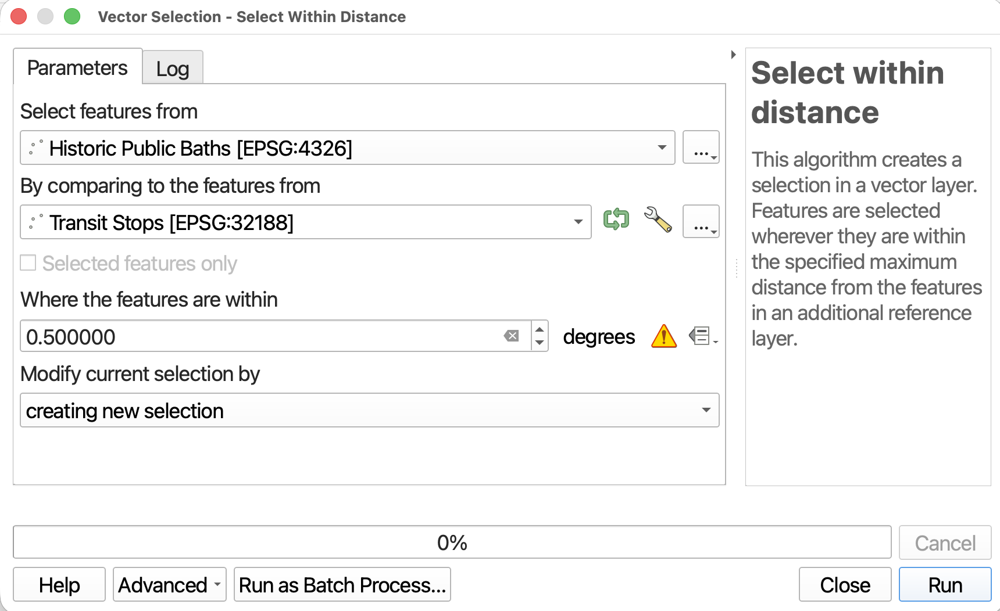

We must first **Reproject** the layer, giving it a PCS (projected coordinate system). 

> * **Reproject** `Historic Public Baths` to the **Project Projection**. 

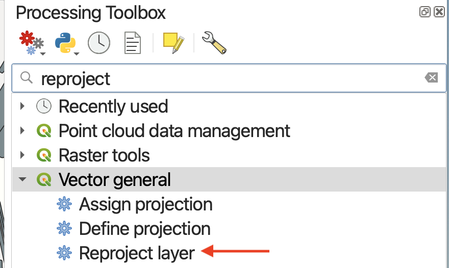

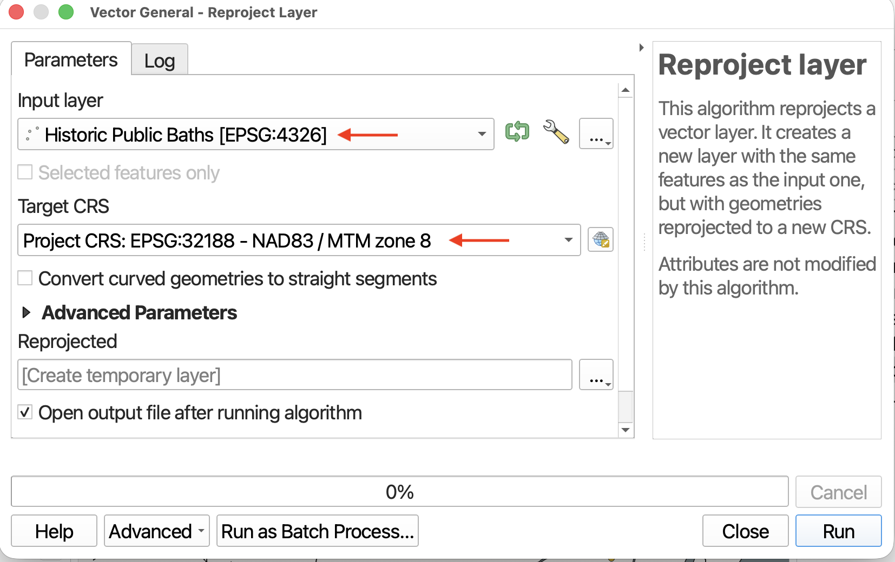

 

> * Now, return to **Select within Distance** and select all Historic Public Baths using the layer `Reprojected` within `0.5km` of a `Transit Stops`. All baths should be selected. 

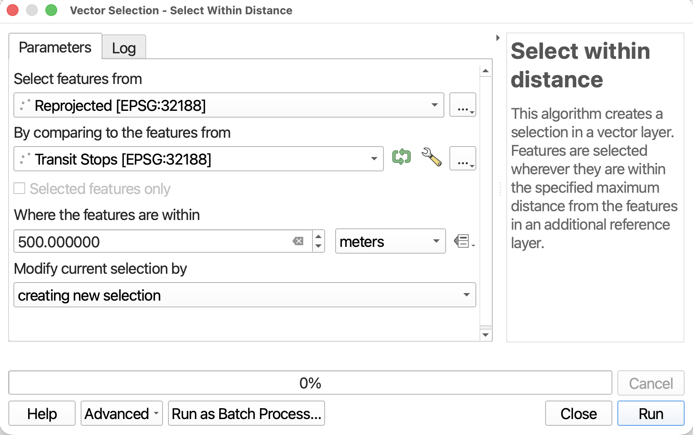

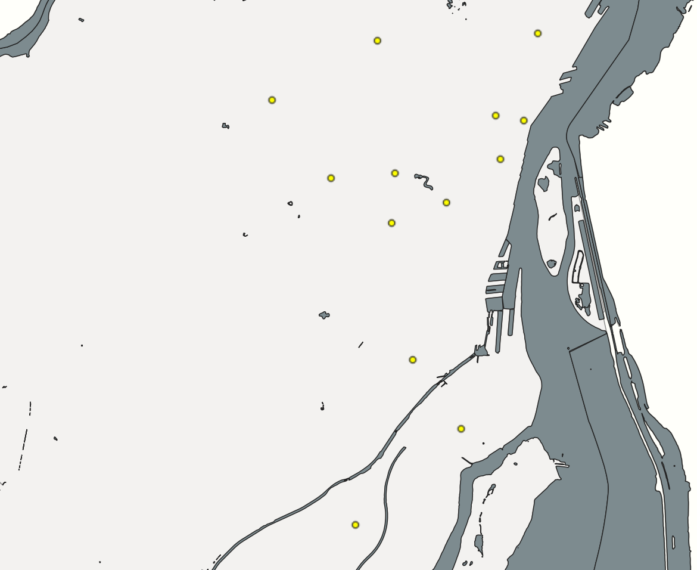

<!-- 
(we can re create this with buffer and clip later, as a puzzle)
{: .warn} -->

<!-- 
 

## spatial join?
{: .no_toc}

i think already we wont get to all these tools. maybe we can have some quiet working time to work in groups through them? 
{: .warn} -->

 

----

## Designing Workflows

Now it’s time to put everything you learned together by designing workflows to answer spatial questions. Using the tools above, think through how you might solve for the following…

Consider more puzzles?? what do you think?
{: .warn}

- instead of using select within distance, how could you use other tools to find out (and hint creat a new layer) of bus stops x distance to a bath?

- how many baths within xyz distance from metro station/stop. 
- how might you use clip and buffer to get xyz - 

need to have done merge here already? 
difference - parks - merged water features, so water can go below land thus show land outline
or can just do the jour

MTL - buffered bus stops or parks to see areas not within xyz distance. 

<!-- ----
spatial join - 
select within  -- bath in ward/neighborhood (not dissolved)
select by location - 

missed - calculate area (parks, eg) - did whole thing in thematic mapping about attribute table - check its not too much - otherwise could do that here. but still too much. just too much content all around. 

---- -->

----

#### QGIS Documentation Resources
{: .no_toc}
- [Vector Spatial Analysis with Buffers](https://docs.qgis.org/3.44/en/docs/gentle_gis_introduction/vector_spatial_analysis_buffers.html){:target="_blank"}
- [Vector Overlay](https://docs.qgis.org/3.44/en/docs/user_manual/processing_algs/qgis/vectoroverlay.html){:target="_blank"}
- [Vector Selections](https://docs.qgis.org/3.44/en/docs/user_manual/processing_algs/qgis/vectorselection.html#vector-selection){:target="_blank"}
- [Lesson on Spatial Queries](https://docs.qgis.org/3.44/en/docs/training_manual/spatial_databases/spatial_queries.html){:target="_blank"}
- [Advanced Vector Analysis](https://docs.qgis.org/3.44/en/docs/user_manual/processing_algs/qgis/vectoranalysis.html){:target="_blank"}

