# Georeferencing Overview
{: .no_toc}

I have to add note about where maps are from
{: .warn}

Georeferencing appends coordinate information to non-spatial data, such as images and PDFs. While historical or otherwise digitized maps represent a place, tracing geographic features such as roads, rivers, buildings, cities, and political boundaries, they cannot be read by a Geographic Information System (GIS) because the locational data for these features is not stored in a manner legible to the GIS––i.e., in latitude/longitude coordinate pairs. Georeferencing is the process of warping an image so that its geographic features match the location of those on a known geospatial layer.

There are many reasons one might want to georeference a historical map, included, but not limited to the following
- to render maps query-able by location or attribute data
- to add as a project basemap
- to make comparison calculations
- to serve as reference for creating shapefiles for spatial analysis or reference mapping

can you think of others?
{: .warn}

<!-- What do you hope to gain from georeferencing? How might georeferencing be useful in your area of research?  -->

*Note that georeferencing is not geocoding. Geocoding is when you have a tabular dataset with street addresses and you use a GIS to geolocate the data as coordinate points.*

show me historical map where i am example// prepare to demo other options, [David Rumsey Georeferencer](https://www.davidrumsey.com/view/georeferencer){:target="_blank"}; allmaps/IIIF; show me historical map where i am example; considerations copyright etc. pick something that doesnt have allmaps link
{: .warn}

 

(maybe move this to the resource page?? but could be good to have some examples here - and every day - of DH projects that use whatever we're talking about...)
Here are some examples of and literature on Georeferencing in the Digital Humanities
- [Don Valley Historical Map Project](https://utoronto.maps.arcgis.com/apps/webappviewer/index.html?id=6055c7fbccdf44ac911a4e13b34a825c){:target="_blank"}
- [special issue](https://www.tandfonline.com/toc/wmgl20/9/1-2){:target="_blank"} in the Journal of Map & Geography Libraries on Working Digitally with Historical Maps. 
- [Journal issue on Spatial Humanities and libraries](https://www.tandfonline.com/toc/wmgl20/19/1-2){:target="_blank"}
- [resource tutorial](https://geospatialhistorian.wordpress.com/lessons/){:target="_blank"}
- [Georeferencing in QGIS 2.0](https://programminghistorian.org/en/lessons/georeferencing-qgis){:target="_blank"}
- [georeferencing in arcgis](https://geospatialhistorian.wordpress.com/lessons/arcgis-lesson-4-digitizing/){:target="_blank"}
- [Creating New Vector Layers in QGIS 2.0](https://programminghistorian.org/en/lessons/vector-layers-qgis){:target="_blank"}
- [intro to map warper ](https://programminghistorian.org/en/lessons/introduction-map-warper){:target="_blank"}

  

    On this page:
  

  {: .text-delta }
 - TOC
{:toc}

----

## Activity: Georeference with QGIS

> * In the `sandbox.qgz` project, turn off all layers except an OSM basemap. (Add an OSM basemap now if you don't already have one loaded.) The layers that you'll match to the digitized map are called **Target Layers**. 

> * Look through the digitized maps of Montreal's waterfront in the folder. This demo will show you how to georeference the 1914 map, but you'll then have a chance to work with one of your choosing. 

> * When Georeferencing with QGIS, you'll want to set the project projection to that which you want your georeferenced map to be in. We'll address CRSs more shortly. 

 

### 1. Open Georeferencer
If you drag and drop the map `Carte du Port 1914` into QGIS, nothing happens. This is because we need to open the QGIS **[Georeferencer](https://docs.qgis.org/3.44/en/docs/user_manual/managing_data_source/georeferencer.html){:target="_blank"}** tool. This can be found in the **Layer menu** at the top of your screen. 

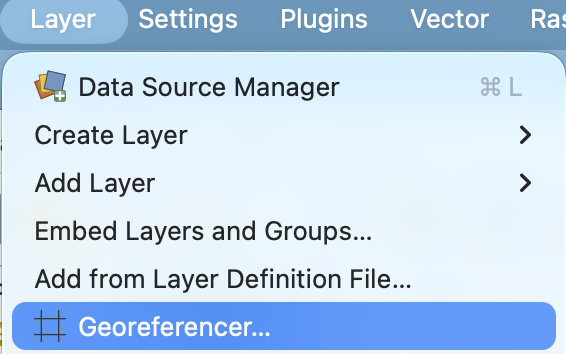

 

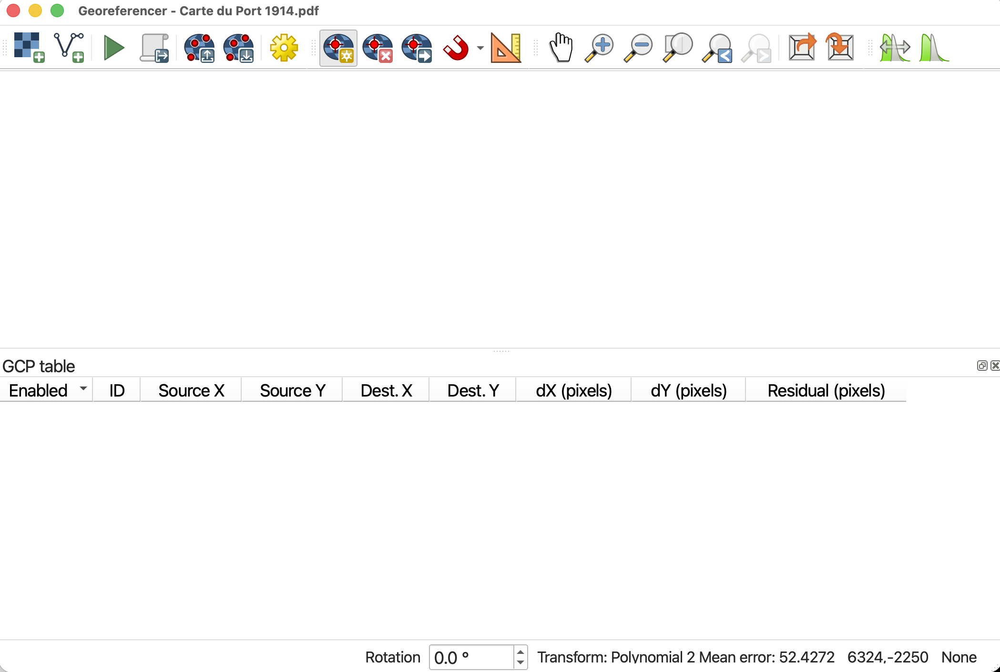

The Georeferencer window has its own toolbar. Take a minute to hover over each icon to learn what they do. The Zoom and Pan buttons work the same as those on the main QGIS interface.

 

### 2. Load Source Layer
**Source Layer** is what the digitized map you want to georeference is called. Load `Carte du Port 1914` into the Georeferencer. 

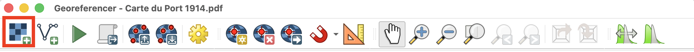

You should now see the historical map loaded to the Georeferencer canvas.

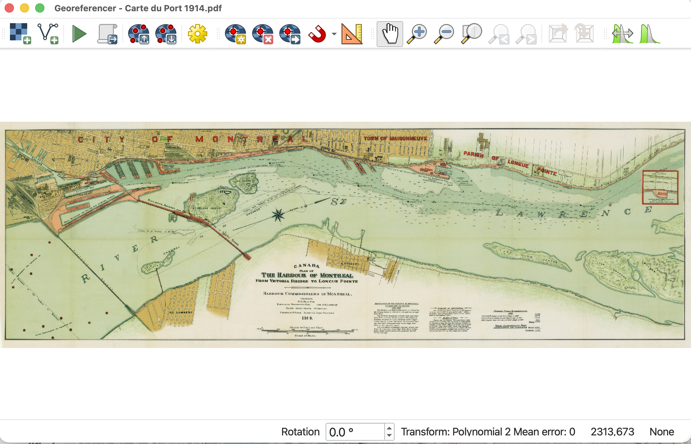

<!-- The basic workflow for georeferencing within QGIS is as follows:

1. Load your Target Layer into GIS
2. Set the Coordinate Reference System (CRS) of your project
3. Load your Source Layer as a high resolution image 
4. Match a handful of points on the Source Layer to those on the Target 
5. Layer, thus appending locative information to the Source Layer
6. Assess error; Adjust; Save georeferenced image -->

 

### 3. Set Transformation Settings
**Transformation Settings** tell QGIS how to georeference the image. Open Transformation Settings by clicking the gear icon.
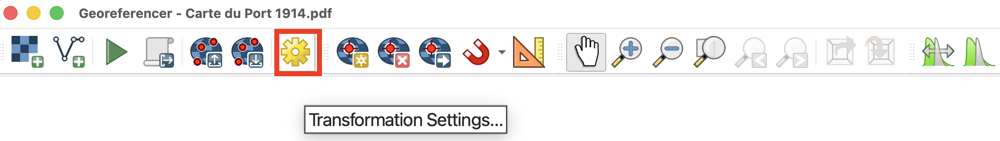

Select the following settings:

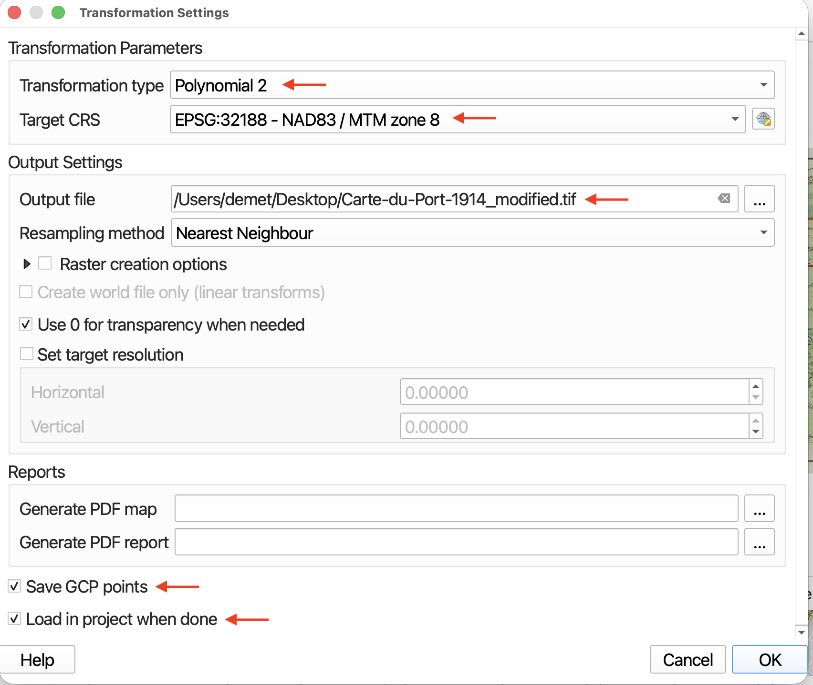

> * At this state, it's best if you know what CRS (projection + datum) the map you are trying to georeference was made and stored in. However, if you don't know, assign it one that works for the area. Here, we'll choose the project projection of `NAD83 / MTM zone 8`. 

> * The **Transformation type** determines how the pixels of your Source Layer are shifted so as to warp to match a projection. The Target CRS should be the project CRS (Coordinate Reference System) and the projection you wish to georeference your historical map in. QGIS should automatically save the output georeferenced image to the same folder as it currently is stored in and append “modified” to its file name. We’ll use **Nearest Neighbor** as our resampling method since we don’t want to assign new values to the image pixels.
<!-- If this has not automatically occurred, save the output to the DHSI workshop folder for Day 3/Tools-and-workflows as `Carte-du-Port-1914_modified.tif` (or whichever map you are choosing to georeference). -->

 

### 4. Add control points
The points matched between the two layers are called **Ground Control Points (GCPs)**. When choosing a map to georeference (**Source Layer**) and geospatial reference layer(s) (**Target Layer**), it is important to ensure there are clear GCPs. GCPs may be physical geographic features, such as river bends, coastlines, or lake boundaries. GCPs may be infrastructural features such as the intersection of two roads or political boundaries or meridian lines. In any case, it is important to consider whether the geographic location of a potential GCP may have changed in the time since the historical map was rendered. These changes will matter more or less depending on the scale of the Source Layer. Most likely, your GCPs will be mix of features.

To get started adding GCPs, click the Add Points tool. Beside it you'll also see there are tools to delete and move points. 

> * Choose your first GCP on the historical map. Once you select a GCP on your Source Layer from the Georeferencer window, a dialogue box will open prompting you to Enter Map Coordinates on the Target Layer. Choose to do this from **From Map Canvas**. The QGIS Map Canvas will come to the forefront of your screen and your cursor will turn into a crosshair. Click the corresponding GCP on the OSM street map of Montreal. 

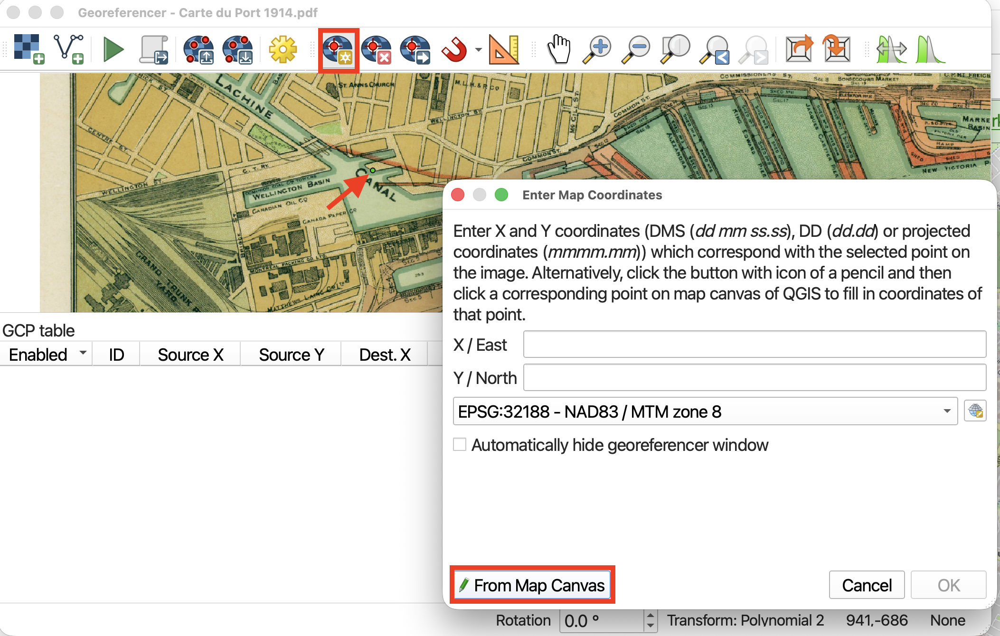

Once you have have matched a GCP on the Target Layer, the Georeferencer Window will jump back to the forefront. If you are content with your selection, click **OK**.

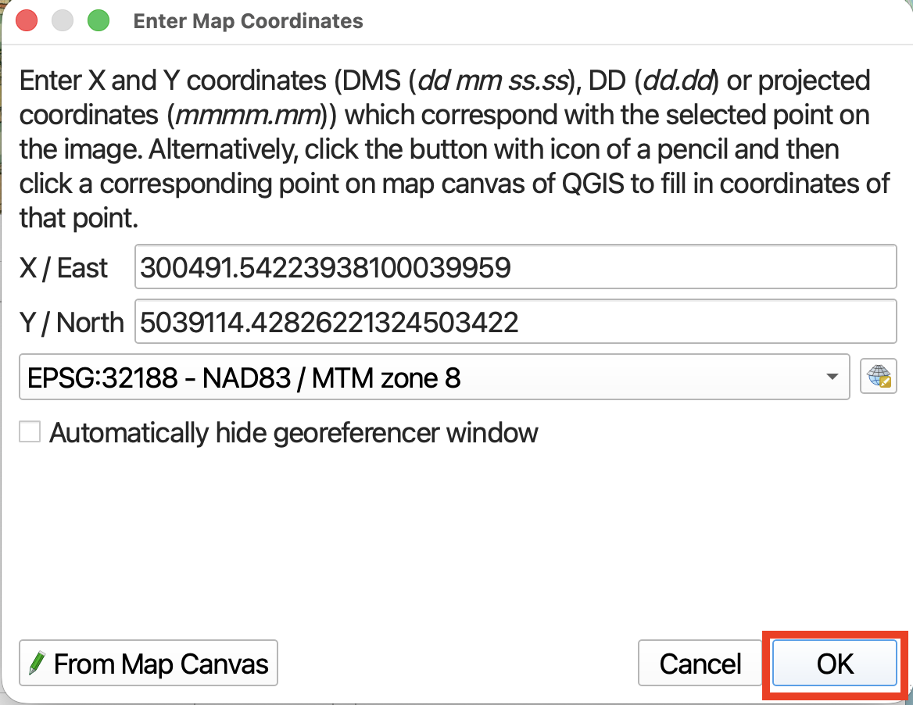 

You should now see your first point added to the GCP table in the Georeferencer Window. (If you don't see the table in Georeferencer, right-click the Add Points tool and make sure **GCP Table** is checked *on*.) 

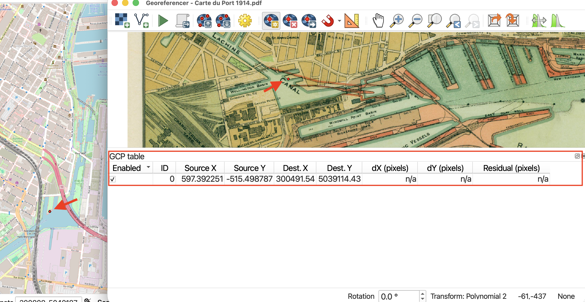

As you work, use the zoom and pan tools in both the main QGIS map canvas and the Georeferencer canvas to navigate around your maps. If you loose the crosshair, simply click back to the Georeferencer and click **From Map Canvas** once more. 
{: .note}

  

### 5. Try running georeferencer 

Add about 10 GCP points and then try running Georeferencer. 

Your map might look really strange! **Be sure to add GCPs at te edges of the digitized map, not just the middle.**

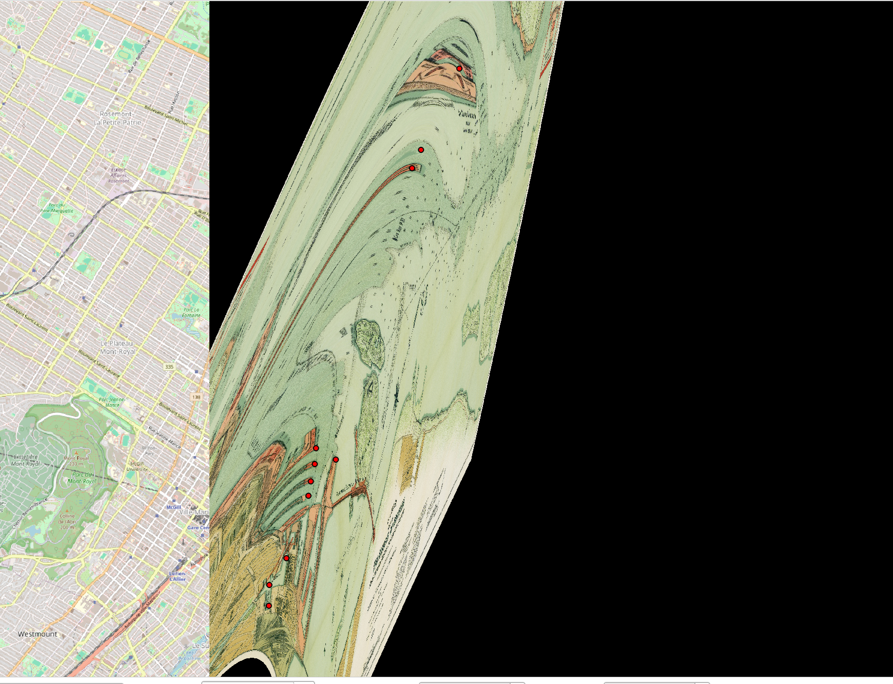

Add a few more control points, and then run the Georeferencer again. 

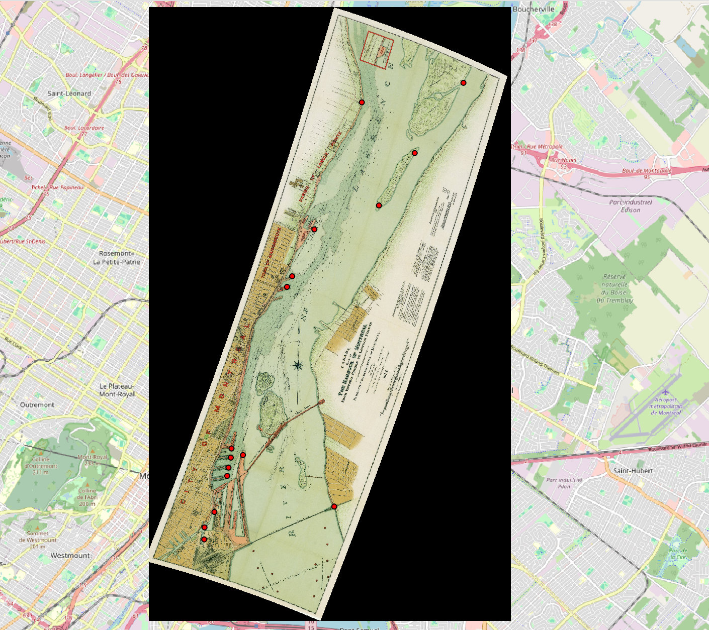

For this map, 15-20 points should be plenty. 

Note that each time you run the georeferencer, a new layer will be created. 

> * Adjust the transparency of your new layer under Layer Properties --> Transparency. 

### 8. Save your GCP Points

You can save your GCP points if you want to come back and work on it later. You can also upload a file of saved GCP points. 

### 9. Save georeferenced map as a GeoTiff

When you are happy with your georeferenced map, right-click the layer in your Layers Panel and choose **Export** --> **Save As...**. 

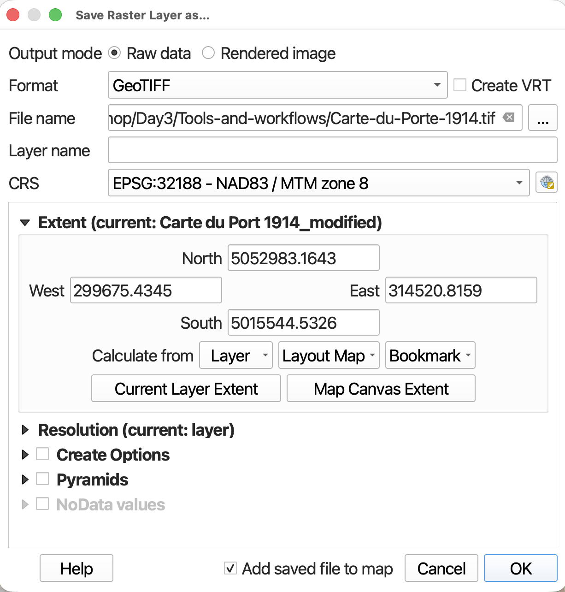

 

### Assessing Error
In the Georeferencer Window table the column dX, dY and Residual refer to error. You may notice little red lines on your Source layer around the GCP point. These are the error vectors visualizing dX and dY. The longer the line, the greater the error. For this exercise, the error should be small and you can ignore the lines. If you get any really long ones, double check that your GCPs match. The error is likely the result of misplacing the GCP on your target layer.

#### Georeferencing Resources
- [Georeferencing Historical Maps with QGIS](https://ubc-library-rc.github.io/gis-georeferencing/){:target="_blank"}
- [Georeferencing with KnightLab](https://programminghistorian.org/en/lessons/displaying-georeferenced-map-knightlab-storymap-js){:target="_blank"}
- [Georeferencing Tutorial by GeoRealm](https://www.geographyrealm.com/georeference-map-qgis/){:target="_blank"}

