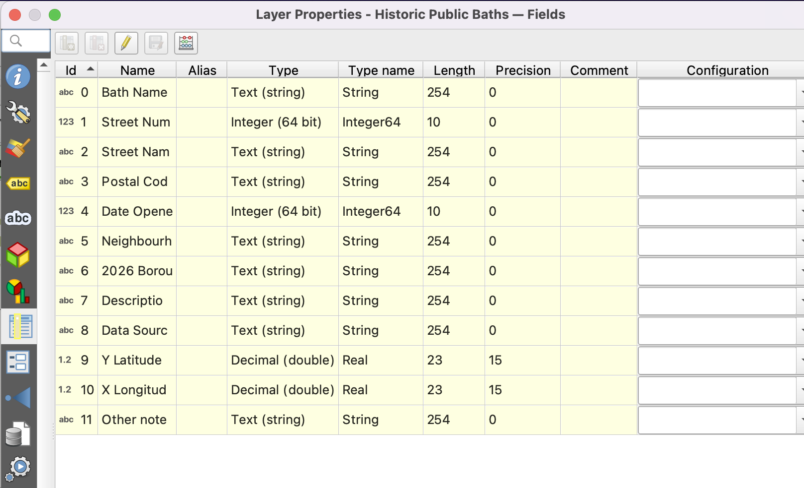
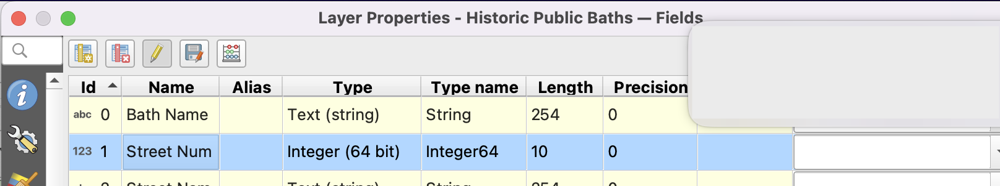
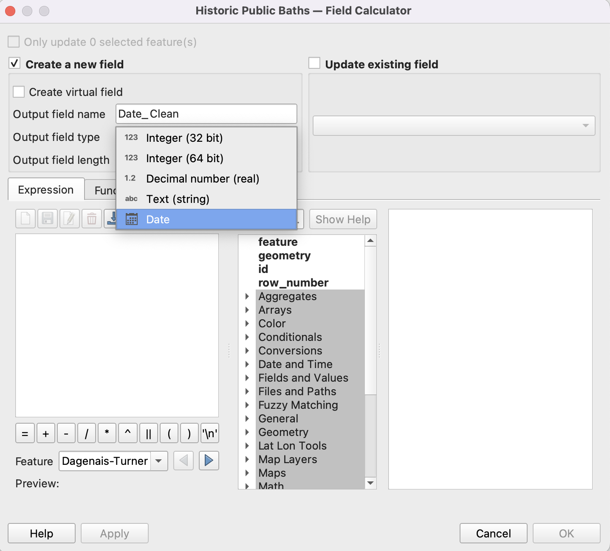
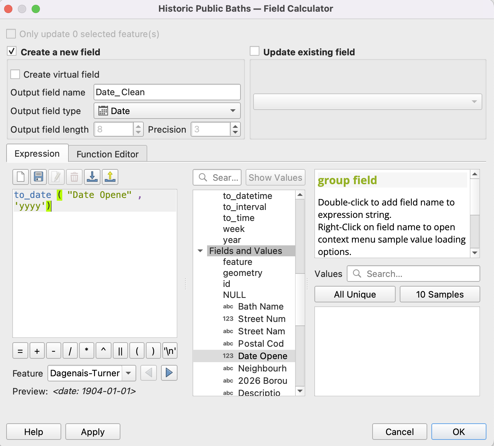
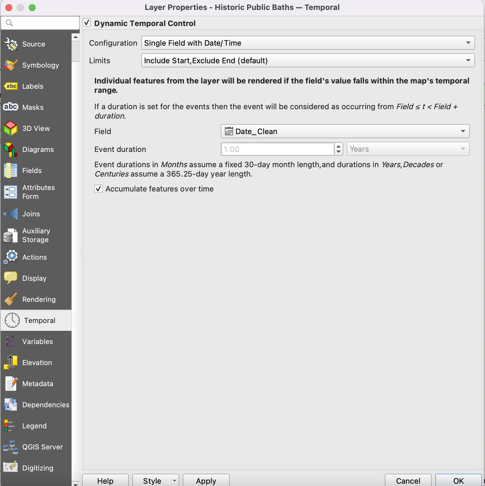
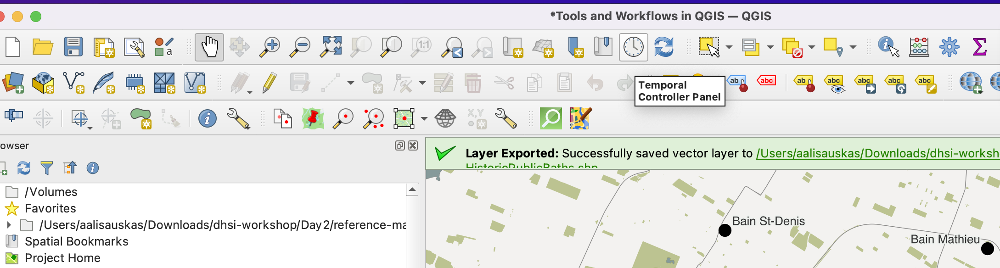
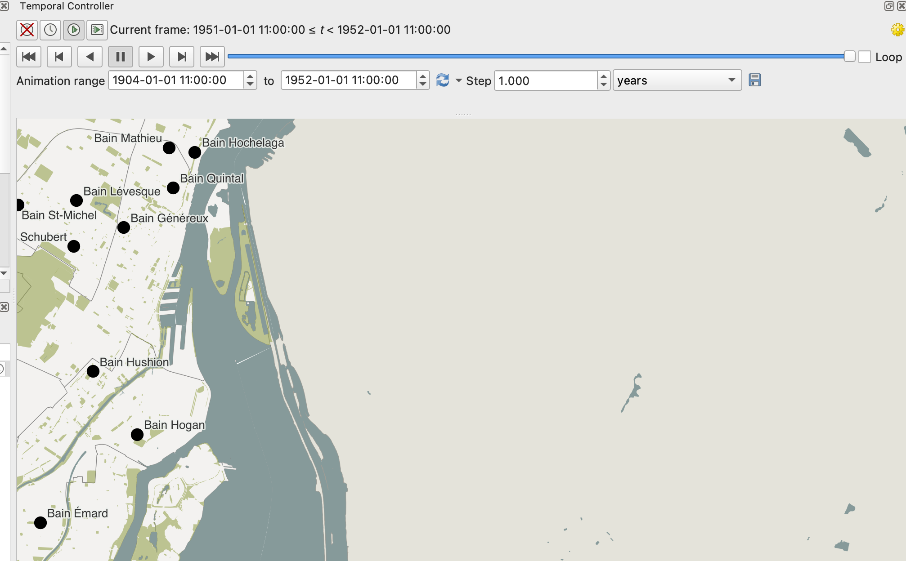
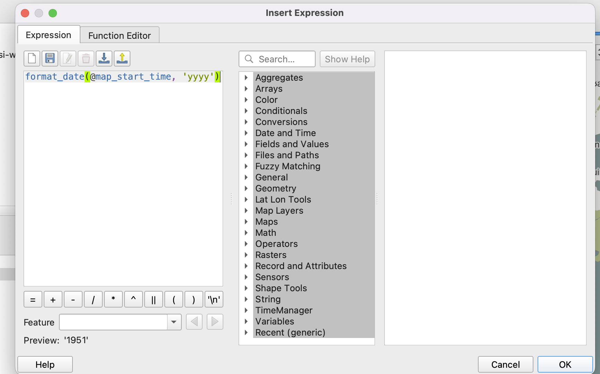
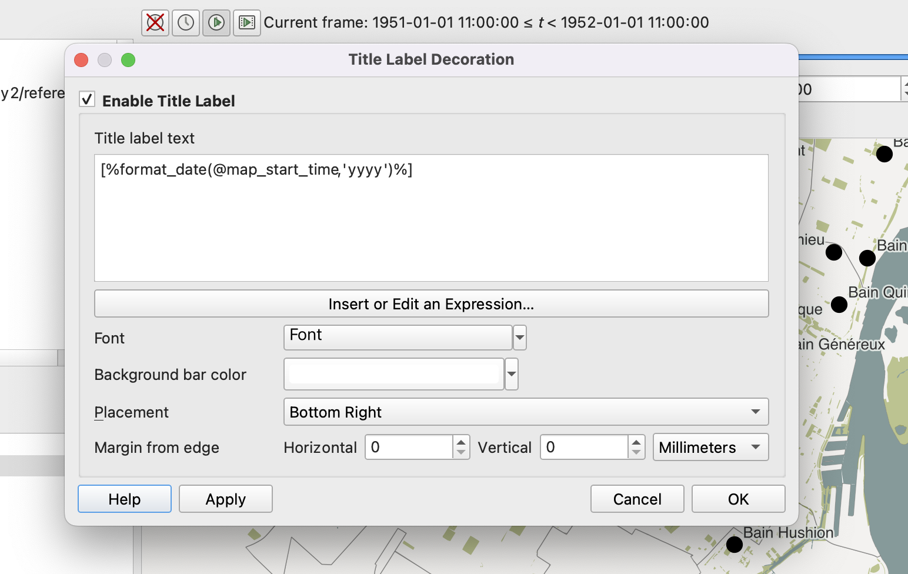

# Creating a Temporal Controller
{: .no_toc}

Digital Humanists often want to incorporate a temporal visualization to their spatial projects or data. [Temporal Controller](https://ubc-library-rc.github.io/gis-dhsi/content/day3/temporal-controller.html){:target="_blank"} is a built-in QGIS plugin which allows you to animate your map elements over time. You can then export these images to create a `.gif` or other animation for your project.


We are going to create an animation of the development of Montreal’s public baths over time in the `sandbox.qgz` project located in the folder `dhsi-workshop/Day3/tools-and-workflows`. Open this file in QGIS if you haven’t already, and un-click the `Transit Stops` layer to hide it from view.

<br>

## Ensuring your Date Data is Formatted Properly
For the Temporal Controller plugin/tool to work, it needs to pull from a date field that has been properly formatted as date data.


If you are creating your own spreadsheet/CSV, try to ensure this happens when you are creating data by properly formatting the cells. However, if you are using data from elsewhere or you forgot to do so, there are ways to ensure that your date field is formatted as a date within QGIS using the Field Calculator in the Attribute Table or Properties.


## Making a Map with Temporal Controller

*1*{: .circle .circle-purple} Open the Properties box of the Historic Public Baths layer and click Manage Fields button. 



Take a look at the `Date Opened` field. As you can see, it is categorized as an integer. We need to make sure it is a date to work with the [Temporal Controller](https://ubc-library-rc.github.io/gis-dhsi/content/day3/temporal-controller.html){:target="_blank"} plugin, so we are going to create a new date field for that plugin to work with.

<br>

*2*{: .circle .circle-purple} Click on the Pencil in the upper right corner to Toggle Editing, and then select the Field Calculator (the Abacus looking button).



<br>

*3*{: .circle .circle-purple} We are going to create an expression to create a new `Date` field for the time unit we will be using (you could also update the current field, but let’s do a new field to make sure we don’t lose any data). We are going to be using years since that is the only date data we have, but you could use any increment of time with Temporal Controller. 

In the field calculator, click “Create a new field.” As your Output field name, write “Date_Clean”. As the output field type, click the drop down to select `Date`.




We are going to use the expression “to date”, which converts a string into a date format. You can find it under the Date and Time expression menu. Since our date is only entered as a year, we have to tell the expression that’s the output we want. 

> Write the following: ```to_date (“Date Opened” , ‘yyyy’)```

The date opened is our current field, and YYYY is the date output we want in the new field. 

> Click OK. You should see a new Date_Clean field in your attribute table. Now we can connect this data to Temporal Controller!


Make sure to click the pencil icon again to turn off editing mode for your attribute table.



<br>

*4*{: .circle .circle-purple} Now we are going to activate the Temporal Controller option. In your layer properties click on the Clock icon near the bottom.

> - Click Dynamic Temporal Control
> - Select Single Field with Date/Time as the configuration and keep the default Limits.
> - Select the Date_Clean field if it hasn’t already, and change the event duration to 1 year (this will make the animation go year by year; you could set it for any time interval depending on the kind of data you have).
> - Click accumulate features over time to have the features remain on the layer as they are added and as time progresses.



<br>

*5*{: .circle .circle-purple} To create the animation, we need to open the Temporal Controller Panel. You can select it in the project toolbar, by looking for the Clock Icon.



<br>

*6*{: .circle .circle-purple} Once you have the panel opened, click on the third button (clock with a triangle) to activate the animation. Then change the dates to the slightly before and after the earliest and latest dates of our bath dates (1904 to 1951).



> Hit play and see what happens!

<br>

*7*{: .circle .circle-purple} We might also want to add a date label on our animation so people can tell the time period as it changes. We can create a label with the Title decoration element. Go to the View menu then select Decorations, then Title Label.

> Click the Enable Title Label Checkbox.

We are going to create an expression to display the year associated with the points coming up in the animation and to format the date. 

> Click Insert an Expression, then insert the following expression: `format_date (@map_start_time, ‘yyyy’)`



This tells QGIS to display the date as the timestamp of the current time slice being displayed. Click OK.

> - Now we should modify our label display so it is readable. On the background, select white. On font, select 25 for the size, and black or another colour for the colour.
> - For placement, select bottom right. 



This should make the date appear in the bottom right corner as time progresses.

<br>

*8*{: .circle .circle-purple} To export your animation, you will click the save icon on the Time Controller Panel. This will download a series of png images which you can then knit together into a gif using something like [Ezgif](https://ezgif.com/maker){:target="_blank"}. 


