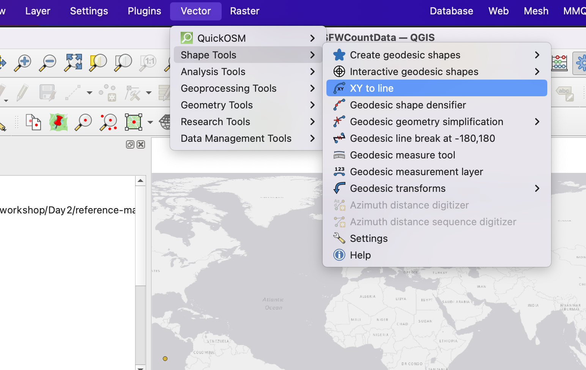
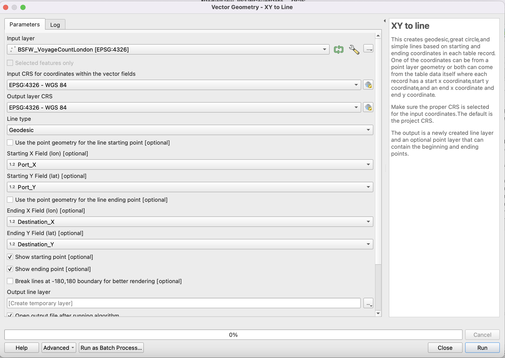
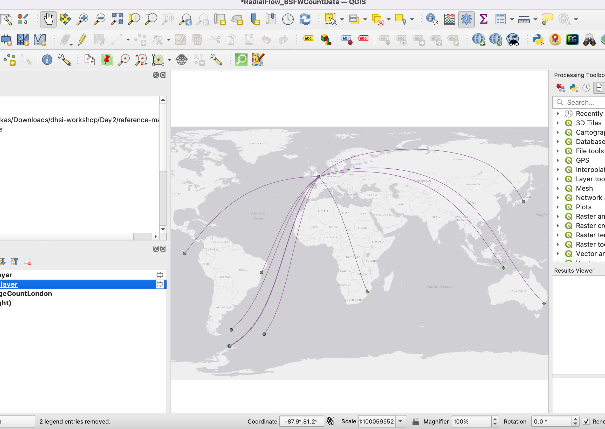
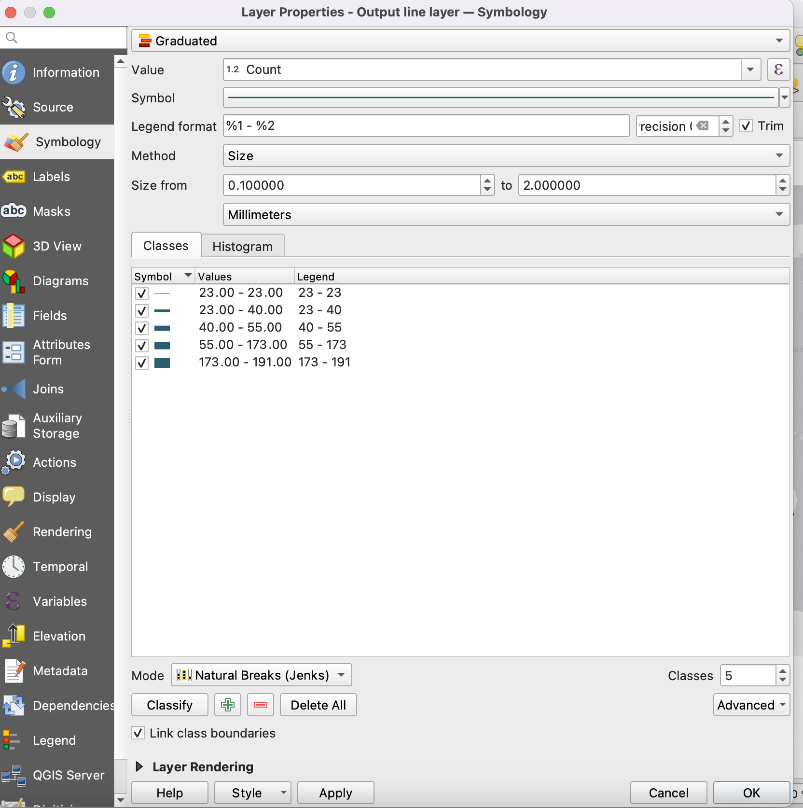
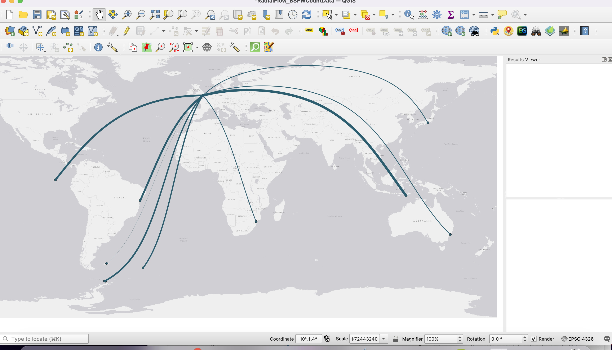

# Radial Flow Maps in QGIS
{: .no_toc}

Flow maps are another useful spatial visualization in Digital Humanities. A **flow map** is a type of thematic map that combines cartography and flow diagrams to show the movement of people, goods, or information between geographical locations. They use directional arrows and lines where the thickness represents volume or magnitude, if your data contains counts or amounts.

Today we are going to be working with a selection of data that has been adapted from the [British Southern Whale Fishery Dataset](https://whalinghistory.org/bswf-databases/){:target="_blank"}.

To create a radial flow map you need a layer that contains coordinates for both origin and destination. We have also prepared the data to create a count of the number of voyages by destination from London using the “Statistics by Category” tool, and then joining and cleaning up data to create a new simplified layer. Feel free to ask about how to do this!

<!--FIX-->
Open the XXX.qgz project. The main point layer is a dataset of counts of voyages to various locations from London. We are going to create a Radial Flow map that shows the movement from London to these locations, and visualizes the intensity of the route. Right now, the destination points have been loaded as coordinates.

 

## Create a Radial Flow Map using Shape Tools

*1*{: .circle .circle-purple} We are going to use the [QGIS Plugin, Shape Tools](https://plugins.qgis.org/plugins/shapetools/){:target="_blank"}. Go to Plugins, Manage and Install Plugins, and search for this tool and install it. You will then access Shape Tools from the Vector Menu.
 

*2*{: .circle .circle-purple} We are going to create great circles to visualize the movement from London to the various whaling points. This isn’t exactly a voyage route, as it will go over land and show a radial line, but it will give us a sense of the overall reach and amount of these voyages.

> Go to the Vector menu, then select Shape Tools, then XY to line. 

 

*3*{: .circle .circle-purple} In the pop up, make sure that BSFW_VoyageCountLondon is selected as the input layer, and set the CRS to the `project CRS (EPSG:4326)` if it isn’t already.

> Select Great Circle as the line (this will create an arced line) and click Use Point Geometry for the line starting point if you want a point to appear at the origin.

>For starting field X, select Port_X, and for starting field Y, select Port_Y.

>For Ending X Field select, Destination_X, and for Ending Y Field, select Destination_Y.

>Click both show starting and ending point if you want these to appear.

>Choose to save the point and line layers (make sure to select a directory).

>Click Run

 

*4*{: .circle .circle-purple} You should now have a map that visualizes the flow from London.

 

We can now play with the symbology to help visualize the number of voyages.

> Click on the **Output Line Layer properties**, and go to **symbology**. 

>Select **Graduated Symbol** at the top. Then select `Count` as the value that will be symbolized.

> Feel free to change the colour of the line. For *Method* select `size`, as we are going to use the line size to show the number of voyages. 

Like with our choropleth map, select Classify to break the data into categories, and choose which method you want to use to visualize (natural breaks usually works best).

 

Click ok and voila, you have a map demonstrating the flow of voyages!

 

### Other options for visualization with this data
The radial flow map visualizes movement, but think about how else you might visualize the data related to destination counts using symbology. Play around with symbolizing the points instead of the lines.

