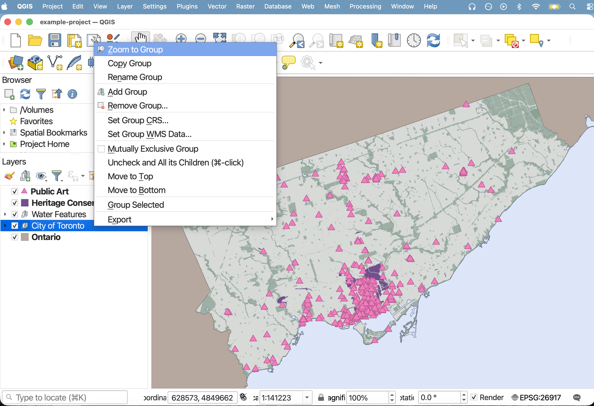
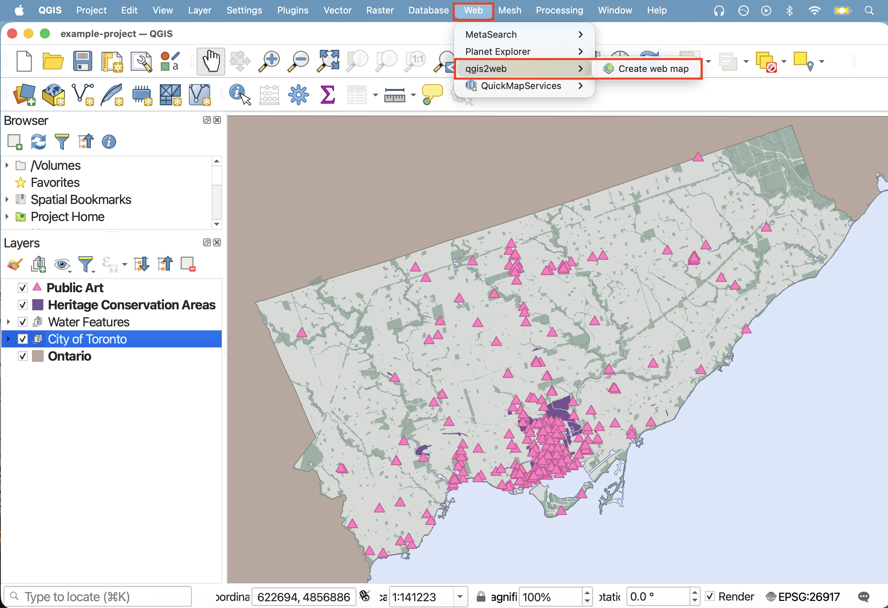
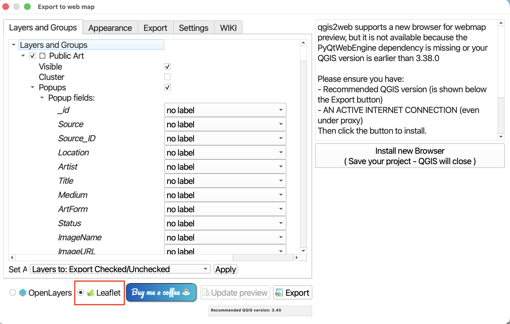
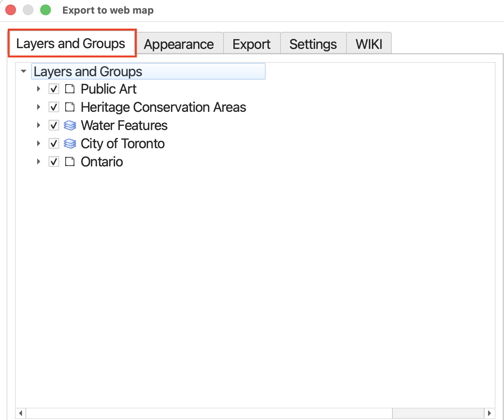
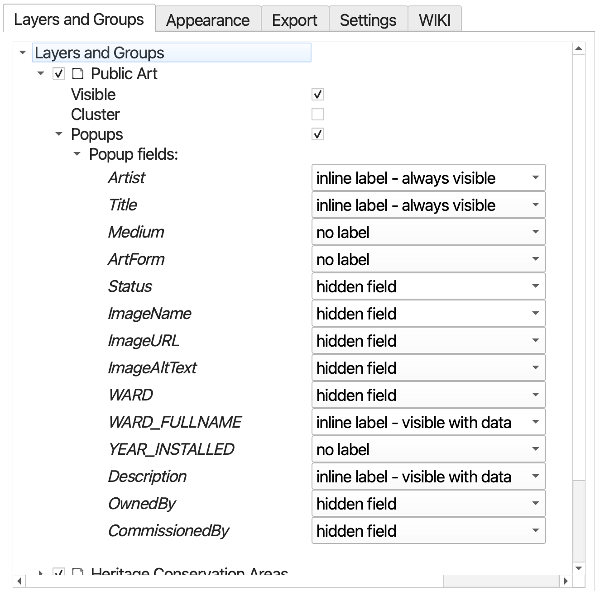
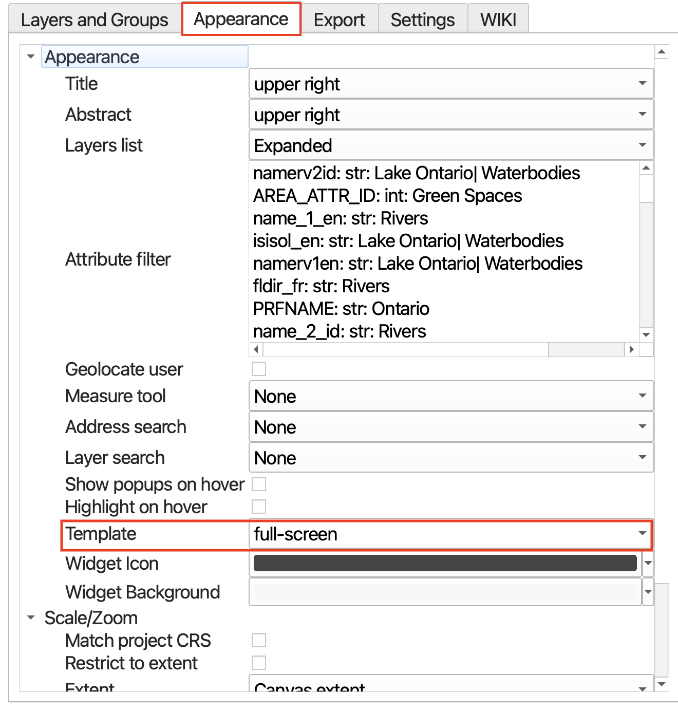
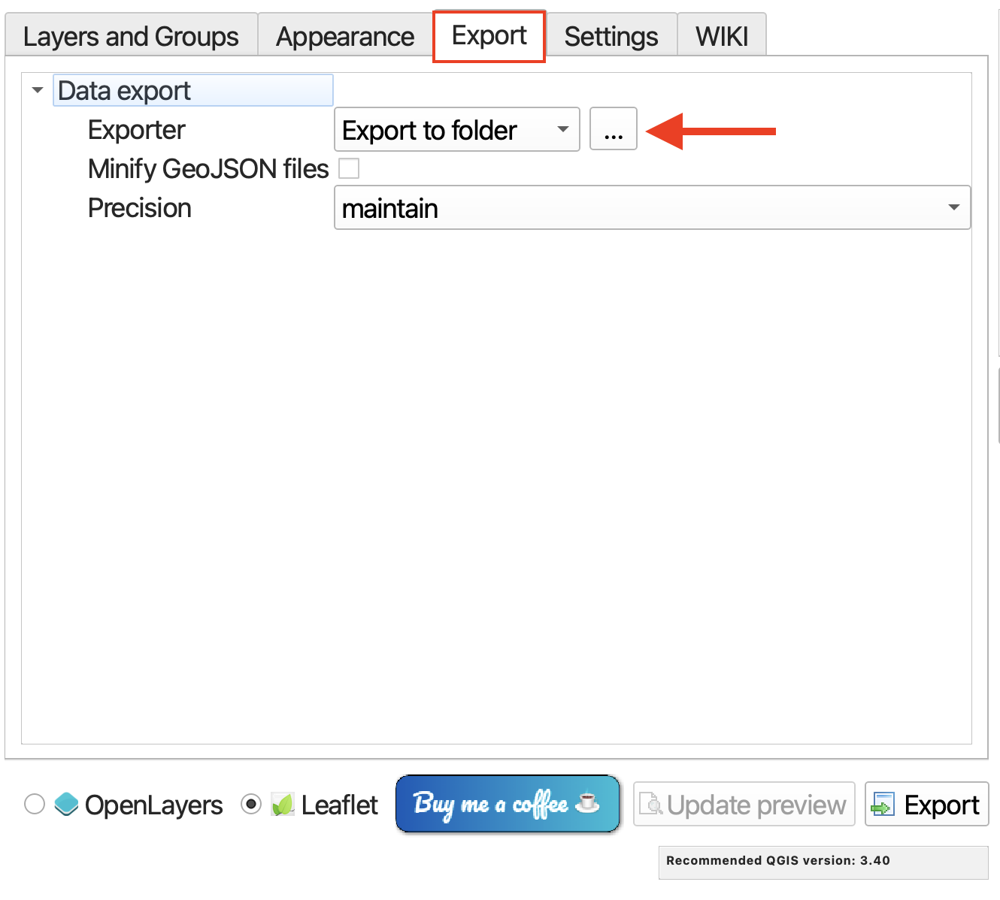

# Webmapping with QGIS using qgis2web plugin

Want to convert your QGIS project into a dynamic and interactive webmap? There's a plugin for that! [qgis2web](https://plugins.qgis.org/plugins/qgis2web/) allows you to seamlessly create a webmap from your project that preserves your layers *and* their symbology. This next section will guide you through turning your current QGIS project into a webmap powered by Leaflet. If you're interested in Leaflet, check out the Research Commons' [Webmapping with Leaflet](https://ubc-library-rc.github.io/gis-intro-leaflet/) workshop for a gentle introduction.

 

Before going on, take a moment to install the **qgis2web** plugin. Once installed, you'll find it under the **Web** menu at the top of your screen. 

----

<!-- ## Preparing the QGIS Project

Open - have already created a project for you to web-mapify. 

if not, 
First things first, let's prepare the QGIS project by doing the following:

>- Remove all temporary layers and csv files from your map. Remove `van-shoreline` as well. The basemap will provide the necessary context. Removing permanent layers from your Layers Panel does not delete the data, it simply removes the connection to your project. You can add them back at any time, though your symbology will be lost unless saved as a template. 

>- Ensure the symbology of your remaining layers are to your liking and that you are happy with your chosen basemap. 

>- Rename the remaining layers in your Layers Panel so it's clear what each layer is representing. Capitalize words, etc. qgis2web will create a table of contents using these layer names, so it's important to edit them *before* running the plugin. To rename layers, right click layer in Layers Panel and choose **Rename**. 

### Set field visibility in Attributes Form 
Each datapoint has a host of attribute data associated with it, as previously seen in the attribute table. In a dynamic and interactive webmap, this information will pop-up when a point is clicked. However, a lot of this information is extraneous and uncessary for the average user. To cut down on the amount of information rendered in each pop-up, we can customize which fields are visible and which ones are hidden. Technically you can do this from the qgis2web dialogue window, but it's much more difficult to get right. Thought time consuming, it may be wise to set each layer's attribute field visibility before converting your project into a webmap.  -->

CHECK MY NOTES FOR IMPORTANT THINGS TO REMEMBER HERE

## Creating a webmap with qgis2web plugin
QGIS project is prepared for you

### 1. Open qgis2web 
Open the **qgis2web** plugin from the **Web** menu at the top of your screen. Chose **Create web map**.

### 2. Power your webmap with Leaflet
Change the code library powering your webmap to **Leaflet**. [Leaflet](https://leafletjs.com/) is a free and open-source code library that powers the interactivity and symbology of webmaps. 

## 3. Specify Layers and Groups
**Layers and Groups** refers to everything that was in your Layers Panel. At this point, you can decide which layers are added to your webmap, whether they are visible upon initial load, and whether or not they have popups (and if so, whether the contents of these popups are labeled). Notice that the popup fields listed are only the ones you left visible when setting field visibility. If you choose to give your popups labels, they will reflect any aliases you made.

## 4. Set Appearance
In the **Appearance** tab, you can specify whether your webmap has a title and abstract, or description. You can also indicate whether you want your Layers list, or legend, expanded or collapsed upon initial load.

**Change the Template to fullscreen**. This will ensure your map takes up 100% of the screen by default, making it easier to adjust the size down the road. If we begin with it taking up only a portion of the screen, resizing becomes uncessary difficult. 

## 5. Export
It's now time to export your map. Set the export **folder** to the workshop folder, but not the data subfolder. When the qgis2web tool runs, it will output a separate folder containing your data as well as the associated styling. 

Uncheck minify geojson files. The files are not that large so this is not necessary. 

Finally, hit **export**. The run time should only be a moment as the datasets are not that large. You should get green messages if it works.

----

## Explore your webmap 

From your computer's finder window, navigate to the workshop folder. Inside you should now see a new folder called qgis2web followed by the date. Open this folder. 

Inside you will see a handful of subfolders. 

> - **css** contains the cascading style sheets responsible for the synology of your map layers. 
> - **data** contains your data layers
> - **images** contains any images
> - **js** contains the javascript code which powers the interactivity of your webmap 
> - **legend** contains your legend's icons 
> - **markers** would contain any markers on your map 
> - **webfonts** contains the font families of map text

There is also an `index.html` document. [Html](https://www.w3schools.com/Html/), or hyper text markup language, is the language read by web browsers. Either double-click this file or right-click and choose to open it with a web browser of your choice. Google Chrome is recommended. 

Your webmap should load in a web browser:

 
Try interacting with your map!
- Check and uncheck the visibility of different layers
- Collapse and expand the layers list
- Zoom in and zoom out; pan around
- Click on different points and explore the pop-up information

Make note of the attribution at the bottom right corner of your webmap. 

If you want to change anything, you can always return to QGIS and re-run qgis2web. It will create a new output folder each time. Though each successive output folder will be date and timestamped, it's helpful to delete or discard deprecated folders so as to remain organized. If you want to make any edits directly from the Leaflet code, check out the Research Commons [Webmapping with Leaflet](https://ubc-library-rc.github.io/gis-intro-leaflet/) workshop. 

Notice the file path in your browser's search bar. You should recognize it as referencing the location of your qgis2web output's `index.html` file local to your computer. Because this map is stored on your local device, it can't be searched via the web by others. To share the map as is, you'd have to send the entire folder to someone along with instructions on how to download and open your map. **The next page will guide you through making this map accessible via the web.**
