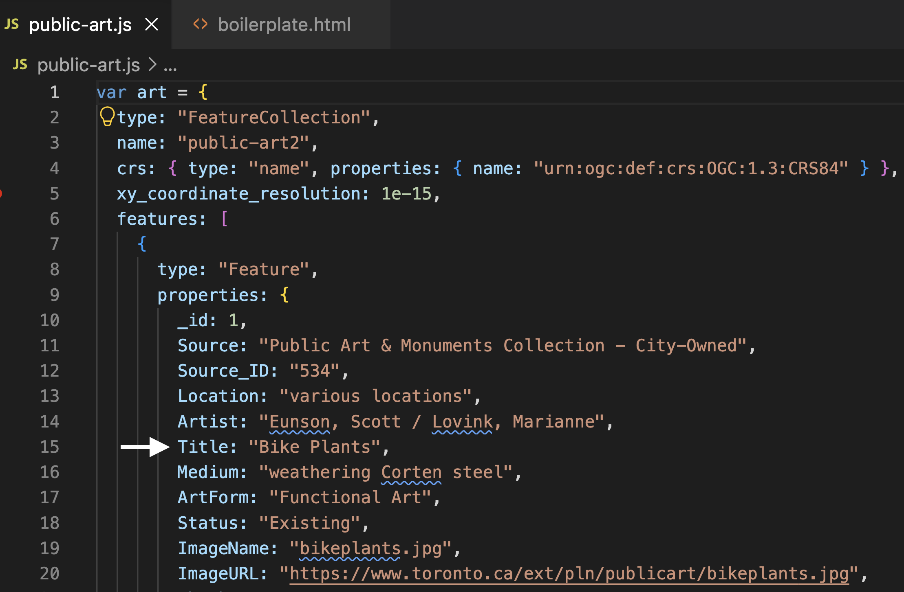
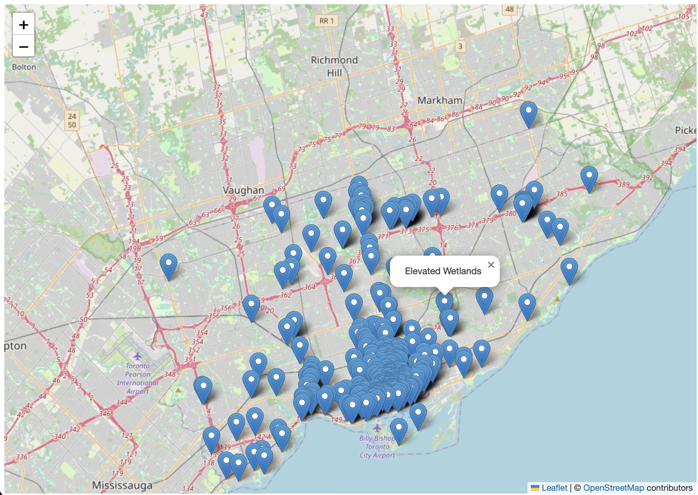
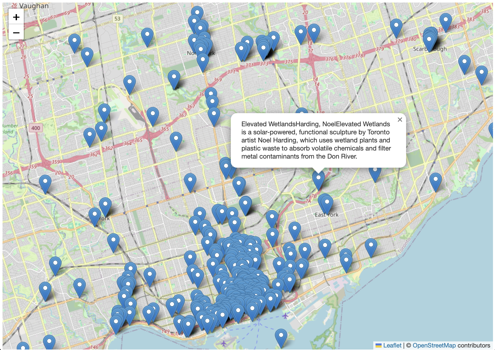
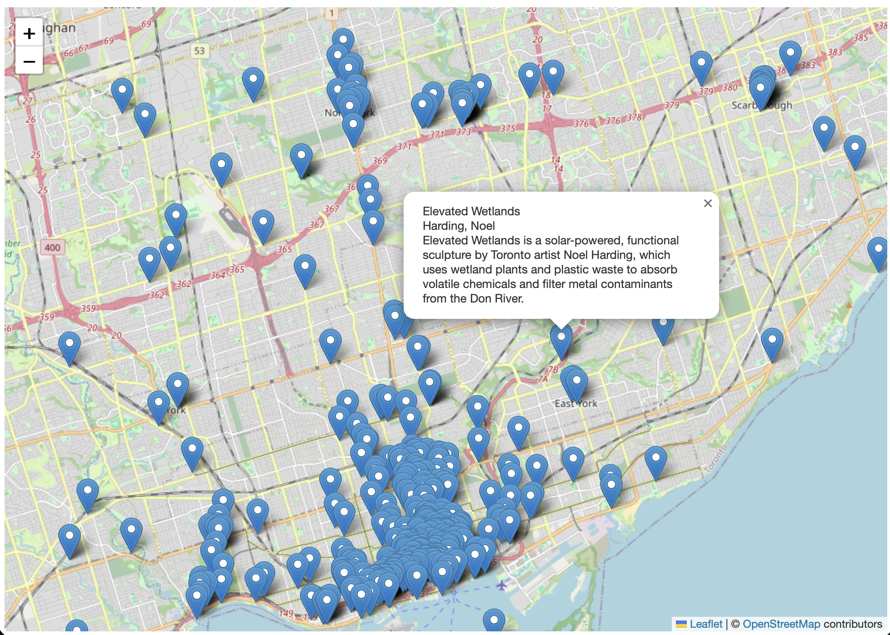
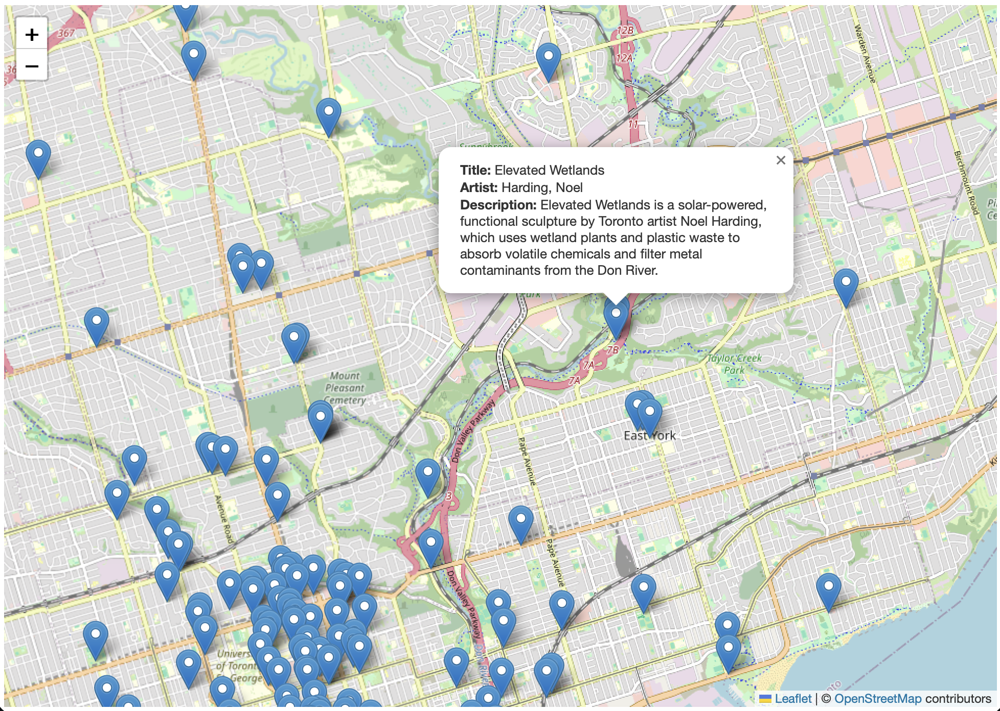
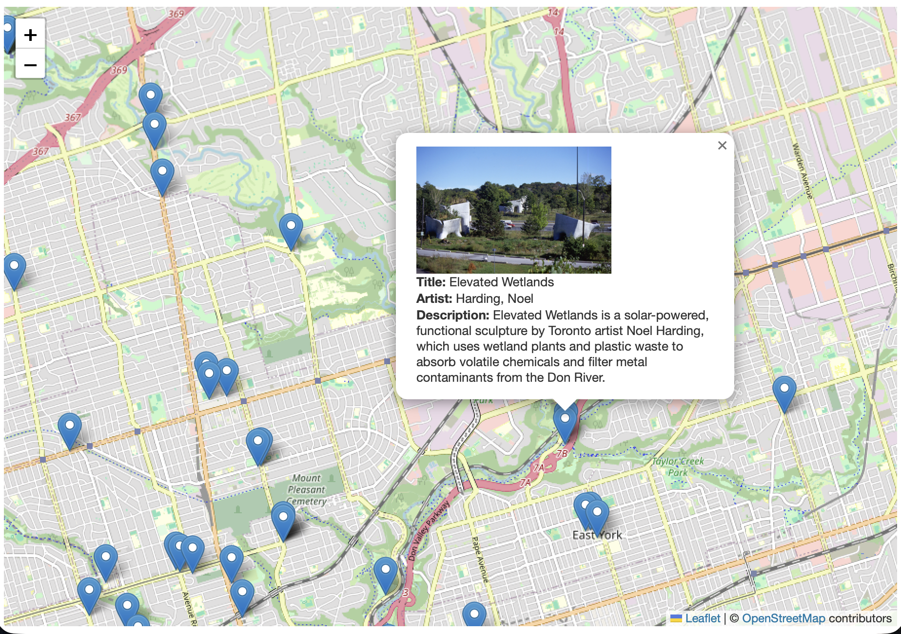

# Configuring Popups
{: .no_toc}

Both the Public Art and Heritage Conservation Districts datasets contain attribute values for each feature. We got a glimpse of these when looking at the datasets in VS Code. Currently, if we click on the features in our web map, we cannot view this information because we haven't yet configured our map to load pop-ups for each layer. To add pop-ups with specified attribute information, we'll need to add more functions. 

Below, you'll be shown how to add pop-ups to the point layer, as well as configure these pop-ups. 


<details open markdown="block">
  <summary>
    On this page:
  </summary>
  {: .text-delta }
 - TOC
{:toc}
</details>
----

## Adding Labels to Public Art
Let's begin by adding the **Titles** of Public Art as pop-ups to our web map. We know from looking at the data layer in VSCode that the value for the title of each public artwork is contained in the `Title` property. The function we'll use to add pop-ups to each feature is called `onEachFeature`. This function is *case sensitive*, so be sure to double check your data's properties. 


 


 <br>

Now we have to add an option `{onEachFeature}` to the code that loads the data layer that references this new function. In your web map's HTML document, *replace the code that adds Public Art* as a point layer with the following:


Copy/Paste
{: .label .label-purple }
```js
   L.geoJson(art, {onEachFeature: function(feature, layer){
            layer.bindPopup(
                feature.properties.Title 
                );
        }
    }).addTo(mymap);
```


<br>

If all went well, the name of Heritage Conservation District should popup when you click. 

 


<br>


## Adding multiple properties to a pop-up 
For the Public Art layer, we might want to include more information in a pop-up, such as the Artist and Description. We can do this by simply building onto the code we just added. 
<!-- In some cases the Description will be "None". -->

Below, you'll see we have the familiar line `feature.properties.Title`, followed by two more lines calling the Artist and Description properties. You'll also notice a plus sign `+` is used to string the three properties together. 


Replace your Public Art layer with the following code:

Copy/Paste
{: .label .label-purple }
```js
   L.geoJson(art, {onEachFeature: function(feature, layer){
            layer.bindPopup(
                feature.properties.Title +
                feature.properties.Artist +
                feature.properties.Description
                );
        }
    }).addTo(mymap);
```


Your boilerplate map will update to look something like this:

 


 <br>

As you can see, while Title, Artist, and Description have been added, they appear one after the other. It would be good if we could add a line break between each property.

<br><br>


## Formatting pop-ups
We can format our pop-ups by combining CSS styling within double quotes. Below, we've included `<br>`, which indicates a line break. We've included each `<br>` in double quotes so as to distinguish it from the feature properties, and then added plus signs `+` before and after to string the line breaks together with the properties, and the properties together with each other. 

Replace your Public Art layer with the following code:

Copy/Paste
{: .label .label-purple }
```js
   L.geoJson(art, {onEachFeature: function(feature, layer){
            layer.bindPopup(
                feature.properties.Title + "<br>" +
                feature.properties.Artist + "<br>" +
                feature.properties.Description
                );
        }
    }).addTo(mymap);
```


Your boilerplate map will update to look something like this:

 


 <br>


 Finally, you might want to add a text descriptor before each property, so that the pop-up reads as **Title:** whatever the title of the artwork is. We can add Descriptors the same way as we added line breaks: by introducing CSS styling and plain text. Below, we've simply added `Title: `, `Artist: ` and `Description: ` as text-descriptors before each property. Notice how we must include the space after the colon as well to ensure there is a space between the text-descriptor and the respective property. We've also placed each descriptor inside a `<b></b>` tag, which will **bold** the text. Finally, we've included the line break `<br>` inside the string (double quotes) so we don't have to add too many little strings together. 


Replace your Public Art layer with the following code:

Copy/paste
{: .label .label-purple}
```js
   L.geoJson(art, {onEachFeature: function(feature, layer){
            layer.bindPopup(
                "<b>Title: </b>" + feature.properties.Title + 
                "<br><b>Artist: </b>" + feature.properties.Artist + 
                "<br><b>Description: </b>" + feature.properties.Description
                );
        }
    }).addTo(mymap);
```


Your boilerplate map will update to look something like this:

 


<br>

<br>


## Adding Images 
The Public Art dataset even includes a link to an image, stored in the **`ImageURL`** property. This would be great to include in our popup! 


To add an image in an HTML document you'd add an image tag `` and include the image metatdata including its source and size inside the opening tag. In fact, image `` tags, like line break `<br>` tags, exist only as an opening tag, though you *can* include a closing tag </img>`. All together, adding an image would look like: 

```html

```

Since each art installation and has a unique image, we need to include not a specific filepath as our image source (`src`), but rather the **`ImageURL`** property. Our image source will thus be `feature.properties.ImageURL`. However, this must remain outside our plain text and css that's formatting the pop-up. What does this mean? This means we'll split our image into two with the feature property in the middle. Additionally, while the image source above is included between double quotes, since we are using double quotes in our pop-up content to distinguish formatting text from feature properties, we will use single quotes to establish our image file path of the source image. 


Replace your Public Art layer with the following code:


Copy/paste
{: .label .label-purple}
```js
  L.geoJson(art, {onEachFeature: function(feature, layer){
            layer.bindPopup(
                "<br><b>Title: </b>" + feature.properties.Title + 
                "<br><b>Artist: </b>" + feature.properties.Artist + 
                "<br><b>Description: </b>" + feature.properties.Description
                );
        }
    }).addTo(mymap);
```


Your boilerplate map will update to look something like this:




