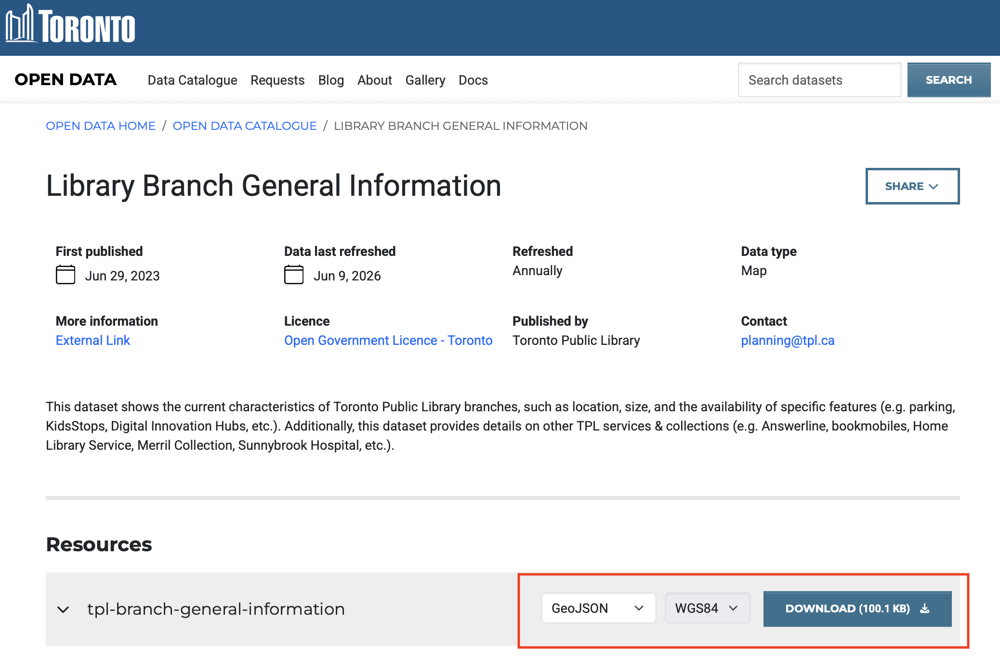
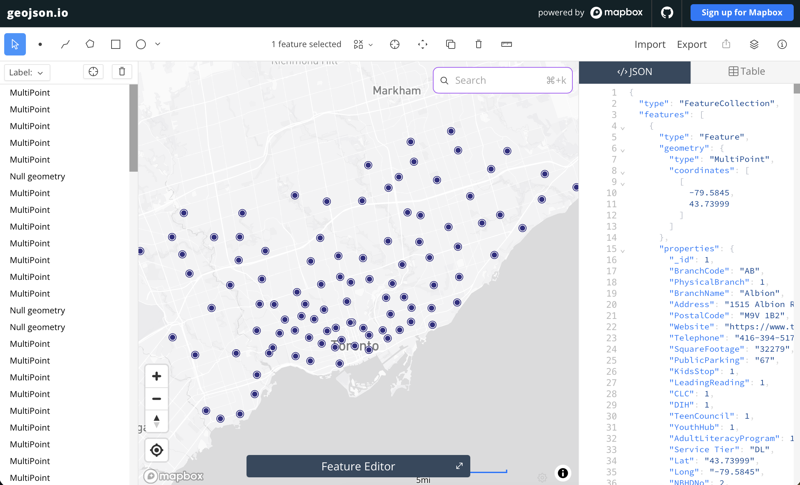
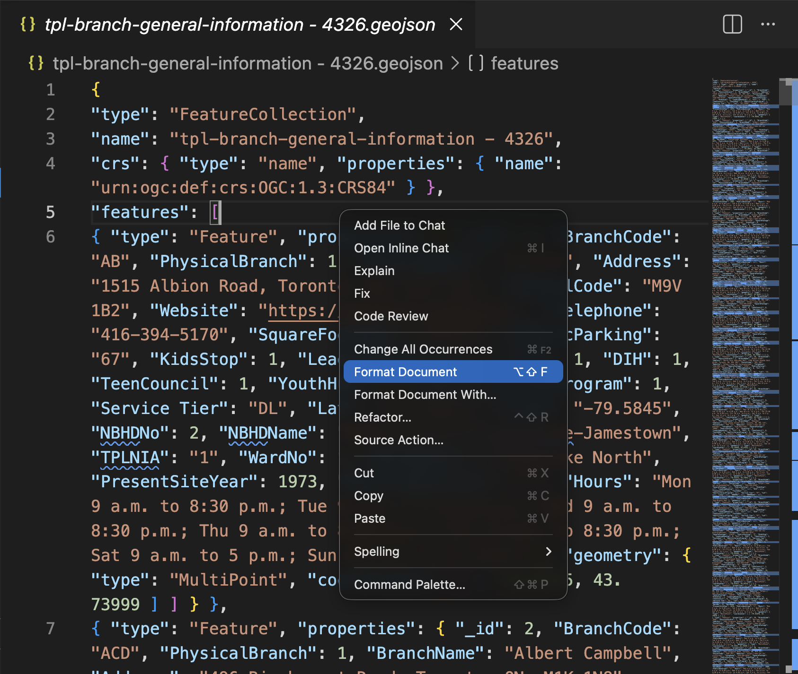
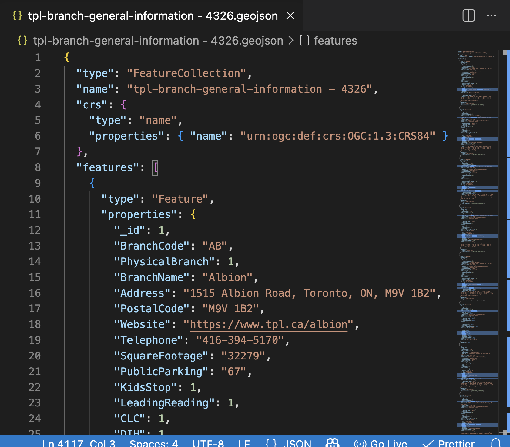
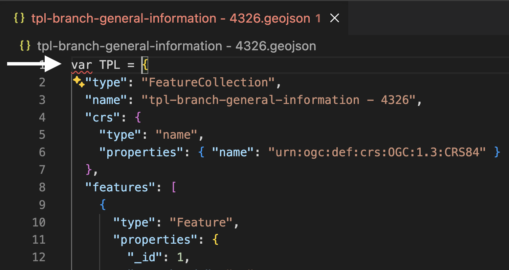
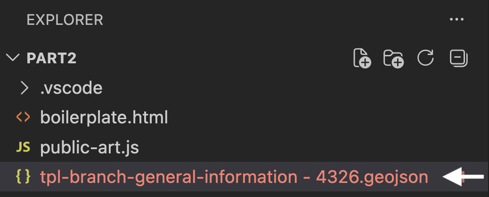
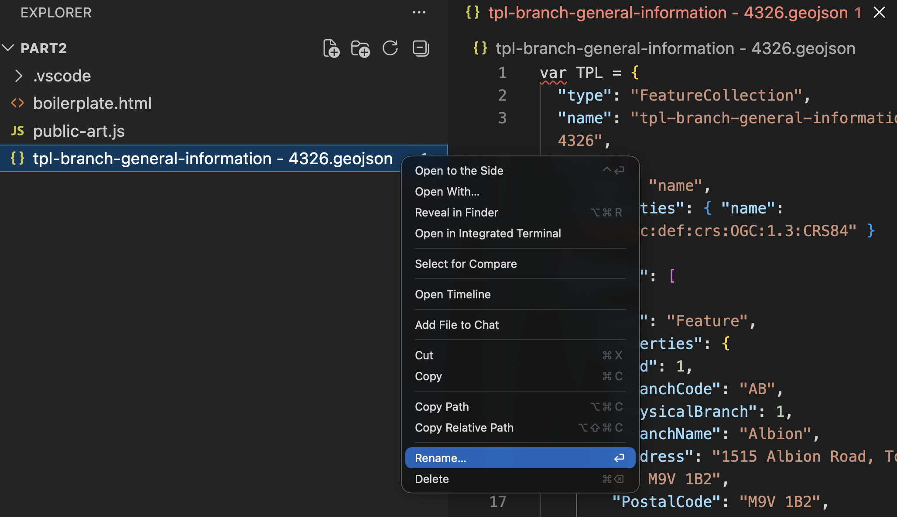
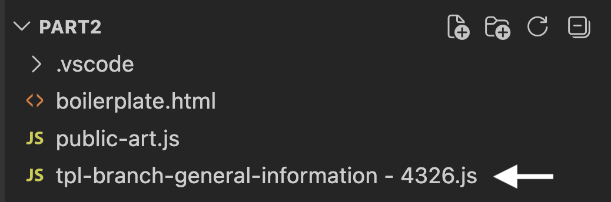
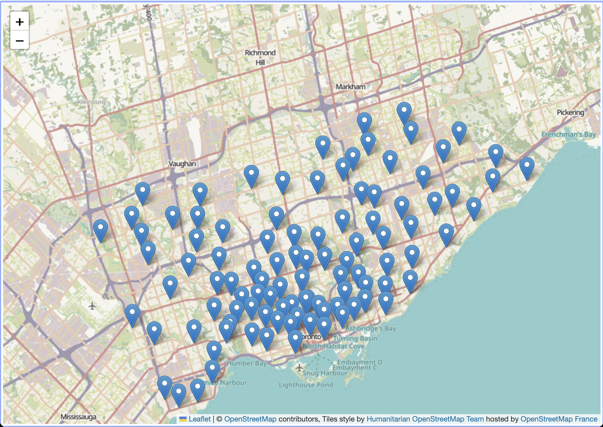

# Practice adding another dataset

Practice what you've learned in this workshop by choosing a new dataset from Toronto's [open data portal](https://open.toronto.ca/){:target="_blank"} to add to your web map. You will need to download the dataset in GeoJSON format, move it to your `webmapping-workshop/Part2` folder, wrap it as a JavaScript variable, and add it as both a data source in the `<head>` element *and* as a data layer in your `<script>` element. 


Take a moment to practice on your own. Reference the hints below if you get stuck. 

<br>

----


*1*{: .circle .circle-purple} For example, download [Toronto Public Libraries](https://open.toronto.ca/dataset/library-branch-general-information/){:target="_blank"} from the Open Data Portal. (The newest dataset is called **Library Branch General Information**.)



> * Be sure to export the dataset in `GeoJSON` format and in `WGS84`, which happens to be the only available Coordinate Reference System anyway. 

> * Move the download file, `tpl-branch-general-information - 4326.geojson`, to your workshop folder. It's important your data be in the same folder of your web map's HTML document. 


<br>

Remember, you can always quickly import your new dataset to [geojson.io](https://geojson.io/){:target="_blank"} to check the dataset. 




<br>


*2*{: .circle .circle-purple} Open the dataset in VSCode. It will either appear in your Contents after you add it to your working folder, or you can right-click it from your computer and open it with VSCode. 


>* It will look like a wall of code. Right-click anywhere on the page and select "Format Document" to format it. 





<br>


*3*{: .circle .circle-purple} Now wrap it as the variable `TPL` by adding `var TPL = ` in front of the entire dataset. 



You'll notice the name of the document becomes red, signifying there's a syntax error somewhere in the document. There isn't. Rather, you have formatted the document as JavaScript, but the file extension is still GeoJSON. 

<br>

*4*{: .circle .circle-purple} Rename the file with the proper extension: `.js`. You can do this by simply right-clicking the file in VSCode and choosing to rename it. Then simply replace the extension with `.js`.<Br>

 

 

 


Everything should be in order now with no warnings. 

<br><br>


*5*{: .circle .circle-purple} Now, return to your `boilerplate.html` document in VS Code. In the `<head>` tag, add a line beneath your current data sources that directs your map to your libraries data: <br>
```html
<script src="./tpl-branch-general-information - 4326.js" charset="utf-8"></script>
```
<br>

*6*{: .circle .circle-purple} Then, in the `<script>` tag of the body element, add a function to add your second data source as a layer: 
<br>

```js
L.geoJSON(TPL).addTo(mymap);
```
<br>

*7*{: .circle .circle-purple} Save your HTML file and go to your Live Server. You should see your data layer added to the map. 

<br>

<br>

You can now experiment with adding pop-ups for the libraries. 

<!-- Remember though, you might need to move all your code for libraries into a new script tag if you want your other data layers to maintain their interactivity as well.  -->


<br>

## Note about point data

If you are exporting point data in geoJSON format from QGIS, make sure to check in VSCode that the dataset is saved as **`type:points`**, and *not* `type:multipoints`. Pop-ups will disappear upon clustering unless the original dataset is `type:points`. If your data is `type:multipoints` for some reason, you can easily force it to become `type:points` by running the **Centroids** tool on your (already) point data inside QGIS. 