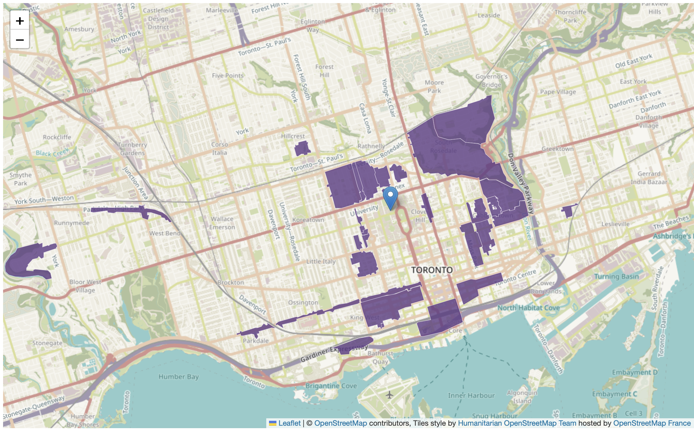
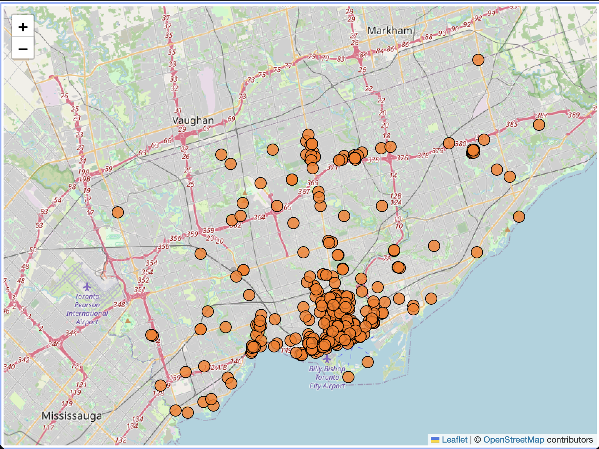
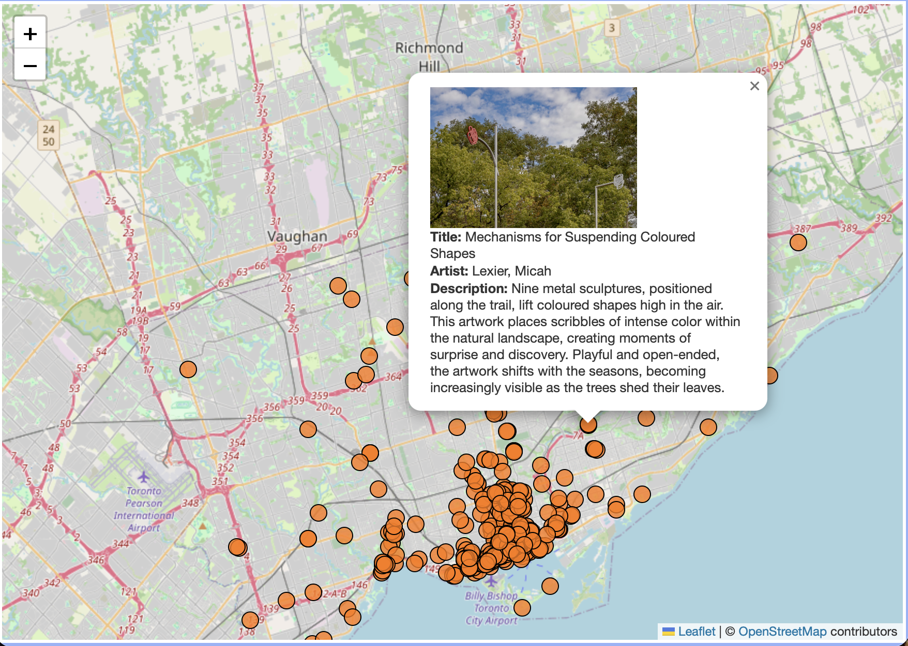
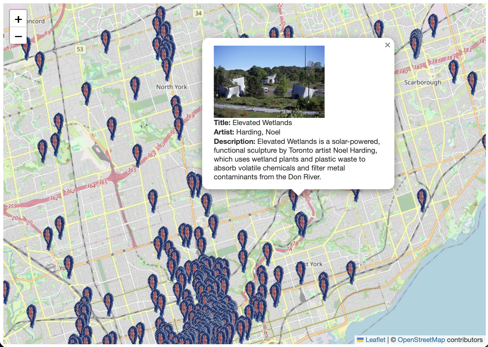

<!--NEED TO ADD BLUE ICON FOR NEXT YEARS DATA FOLDER-->
# Styling polygon features
Styling a polygon layer is quite straightforward. To change the styling of a polygon data layer, we will (1) write a *function* that styles a specific layer, in this case `heritage`, and (2) add our new style as an option to that data layer. A *function* in programming is a block of code that does some specific task, like a mini program. Let's practice by changing the color and opacity of the Heritage Conservation Districts layer. 

In your web map HTML boilerplate document, replace the line of code that loads Heritage Conservation Districts with the following:


Copy/paste
{: .label .label-purple}
```js
    L.geoJson(heritage, {style: style}).addTo(mymap);

    function style(feature, heritage) {
      return {
        fillColor: '#5E3A85',
        color: '#EBE1F0',
        weight: .5,
        fillOpacity: 0.8
      };
    }
```

We have created a style function that looks at every feature in the `heritage` layer and gives it a `fillColor` of `#5E3A85`, which is the [HEX code for purple](https://www.google.com/search?q=hex+color+picker&oq=hex+color+picker&aqs=chrome..69i57j35i39j0i67i131i433j0i67i433j0i433i512j0i67j0i512j0i131i433i512j0i512l2.1699j0j7&sourceid=chrome&ie=UTF-8){:target="_blank"}. `color` dictates the color of each feature's outline, and `weight` is the thickness of those outlines. `fillOpacity` is the transparency of the shading, where 0 is completely transparent and 1 is completely solid. Take a moment to play around with the color of the heritage districts.
<br>

Comment out your point layer(s) if necessary so you can see the updated polygon layer. Your boilerplate map should look something like the following:




<br><br>


# Styling point features
Point features are a bit more tricky to style. Currently, all datasets visualizing point locations on your boilerplate map are symbolized with *markers*. This means they are *Marker Layers*. 

You can go two directions with your styling: you can *either* change your marker to a different icon (either an image or svg file), *or*, you can turn it into a point layer. You might be thinking 'clearly it's already a point layer?!', but in Leaflet, a 'point layer' very specifically refers to a layer of vector points. Currently, we have markers, or static images, visualizing the location of each coordinate in our point feature layer (aka dataset). 


## Converting a marker layer into a point layer
Changing the color (not icon) of a marker layer is more difficult than adjusting that of a polygon/line layer because you have to first turn your marker layer into a point layer by "passing a `pointToLayer` function in a GeoJSON options object when creating the GeoJSON layer" (see [Leaflet](https://leafletjs.com/examples/geojson/){:target="_blank"}). The following documentation is based on the [Leaflet tutorial](https://leafletjs.com/examples/geojson/){:target="_blank"}, though significant tinkering of the source code was necessary to make it work. 


*Comment out* all code you have for Public Art. Then add the following code:

Copy/paste
{: .label .label-purple}
```js
var artLayer = {
            radius: 8,
            fillColor: "#ff7800",
            color: "#000",
            weight: 1,
            opacity: 1,
            fillOpacity: 0.8
        };


        L.geoJSON(art, {
            pointToLayer: function (feature, latlng) {
                return L.circleMarker(latlng, artLayer);
            }
        }).addTo(mymap);
```

Your boilerplate map will update to look something like this:



<br>

>* As with styling polygons, you can adjust the marker options to change the fill color, opacity, etc. 

>* You'll notice that the new Public Art layer has none of the pop-up content we so carefully formatted earlier. You can incorporate that back by making the following adjustments to your code:

Copy/paste
{: .label .label-purple}
```js
function onEachFeature(feature, layer) {
          var popupContent =
            "<br><b>Title: </b>" + feature.properties.Title +
            "<br><b>Artist: </b>" + feature.properties.Artist +
            "<br><b>Description: </b>" + feature.properties.Description
          layer.bindPopup(popupContent);
        }

        var artLayer = L.geoJSON(art, {

          style(feature) {
            return feature.properties && feature.properties.style;
          },

          onEachFeature,

          pointToLayer(feature, latlng) {
            return L.circleMarker(latlng, {
              radius: 8,
              fillColor: "#ff7800",
              color: "#000",
              weight: 1,
              opacity: 1,
              fillOpacity: 0.8
            });
          }
        }).addTo(mymap);
```


Your boilerplate map will update to look something like this:



<br>


<!-- 
Using that documentation from [https://troubleshooting - realized popups disappear on cluster UNLESS og dataset is set to points, not type:multipoints - ran through centroids in qgis to fix.]Leaflet, I was able to get Boilerplate1 to turn into Boilerplate2. (See attached images and data linked at the bottom.) -->


If you are exporting point data in geoJSON format from QGIS, make sure to check in VSCode that the dataset is saved as **`type:points`**, and *not* `type:multipoints`. Pop-ups will disappear upon clustering unless the original dataset is `type:points`. If your data is `type:multipoints` for some reason, you can easily force it to become `type:points` by running the **Centroids** tool on your (already) point data inside QGIS. 
{: .warn}


<Br><br>


## Customizing markers 
You can't just change the color of the drop-pins from blue to orange etc. because they are not a point layer (think vector data) but actually images (so think raster instead). Leaflet provides a tutorial for customizing the marker of each point individually: [https://leafletjs.com/examples/custom-icons/](https://leafletjs.com/examples/custom-icons/){:target="_blank"}. However, this would be a monumental hassle for a layer like public art. 

Instead, I [this stack exchange](https://gis.stackexchange.com/questions/121424/leaflet-how-to-use-a-custom-marker-on-a-geojson-layer){:target="_blank"} webpage and [the demo file posted](https://gist.github.com/ThomasG77/61fa02b35abf4b971390){:target="_blank"} can be explored to learn how to update all the public art to a custom icon, included in your data folder as `custom-marker.png`. 


***Comment out*** all prior code for Public Art. Then, add the following code at the bottom of your `<script>` element. 

Copy/paste
{: .label .label-purple}
```js
var myIcon = L.icon({
            iconUrl: './custom-marker.png',
            iconSize: [20, 45],
            iconAnchor: [22, 94],
            popupAnchor: [-3, -76],
        });

        function onEachFeature(feature, layer) {

           var popupContent =
            "<br><b>Title: </b>" + feature.properties.Title +
            "<br><b>Artist: </b>" + feature.properties.Artist +
            "<br><b>Description: </b>" + feature.properties.Description
          layer.bindPopup(popupContent);
        }


        L.geoJson(art, {
            pointToLayer: function (feature, latlng) {
                console.log(latlng, feature);
                return L.marker(latlng, {
                    icon: myIcon
                });
            },
            onEachFeature: onEachFeature
        }).addTo(mymap);
```


Your boilerplate map will update to look something like this:



<br>

> * Note that the filepath for **`myIcon`** is a local path. There is no shadow image for this icon. You can explore the demo file for further information on how to add remote markers. See [OpenSVG](https://opensvg.dev/icons){:target="_blank"} for a host of free and open source SVGs you you can download and use. 
> * If you use your own icon, make sure that it's saved as a `.png` and so the background is transparent. 
<!-- It seems like the pop-up styling here moves to it's own function above the L.geojson that adds the layer... not entirely sure why. -->