# Webmapping with QGIS using qgis2web plugin
With the time we have left, you are welcome to practice making a webmap of your own. However, we will also briefly demonstrate how to turn a QGIS project into a dynamic and interactive webmap using the [qgis2web](https://plugins.qgis.org/plugins/qgis2web/) plugin. This plugin allows you to seamlessly create a webmap from your project that preserves your layers *and* their symbology. See the [qgis2web wiki](https://qgis2web.github.io/qgis2web/) for additional documentation. 

We have prepared a QGIS project and data for you. Find and open it from the folder `dhsi-workshop/Day4/QGIS-webmapping`. 

----

## Open QGIS and Prepare the Project 
This next section will guide you through turning your current QGIS project into a webmap powered by Leaflet. A QGIS project has been prepared for you: `dhsi-workshop/Day4/QGIS-webmapping/webmapping.qgz`. The data will look familiar as it's from our reference mapping lesson. Besides the Historic Public Baths which were compiled by Alex Alisauskas, data is from Montreal's Open Data Portal. 

> *  The map should already be at a good zoom. You can zoom in if you wish, or choose the preset `Webmap` Spatial Bookmark. 

> * If the basemaps are not loaded properly, remove them and add your own. Include *at least* one basemap.

 

## Install qgis2web
Install the [qgis2web](https://plugins.qgis.org/plugins/qgis2web/) plugin. 

<!-- Once installed, you'll find it under the **Web** menu at the top of your screen. -->

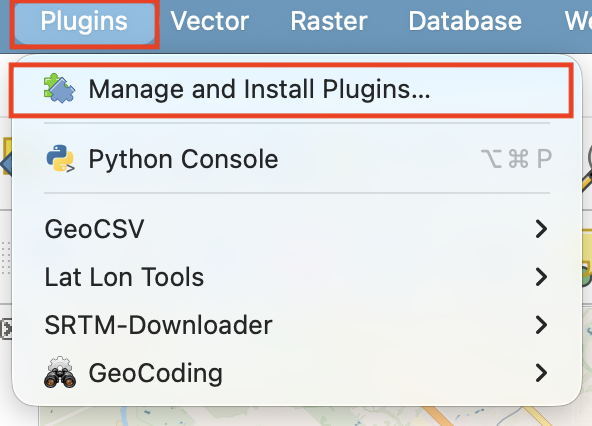

 

## Use qgis2web to make a webmap
Once installed, open the **qgis2web** plugin from the **Web** menu at the top of your screen. Choose **Create web map**.

The following window will open:

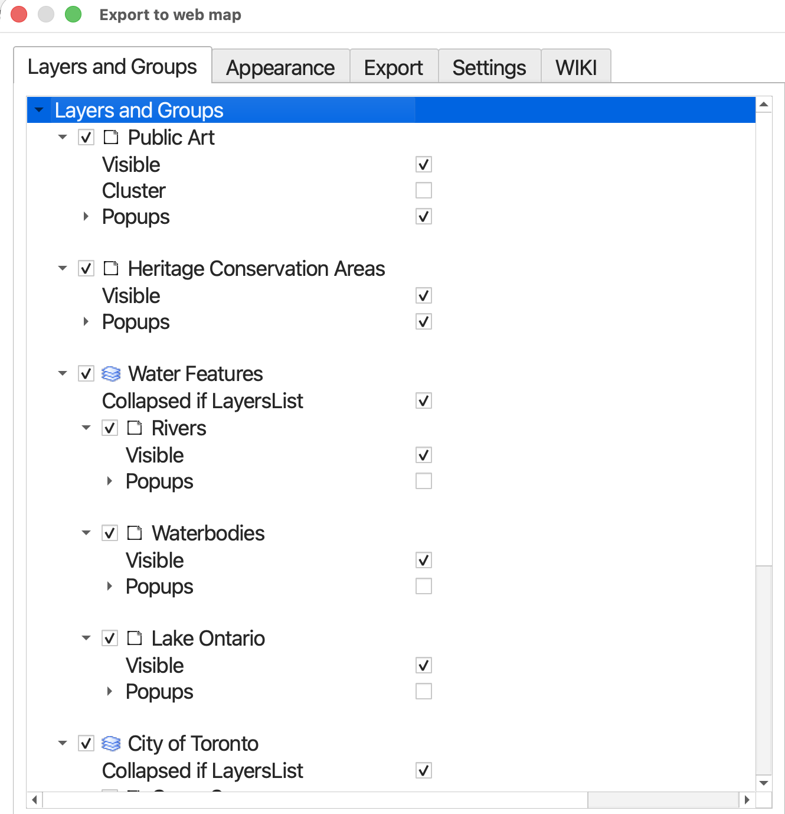

 

**We have to set a few things...**

### **1. Power your webmap with Leaflet**
At the very bottom of the window, change the code library powering your webmap to **Leaflet**. [Leaflet](https://leafletjs.com/) is a free and open-source code library that powers the interactivity and symbology of webmaps. 

### **2. Specify Layers and Groups**
Along the top, you'll see there are multiple tabs. **Layers and Groups** refers to everything that was in your Layers Panel. At this point, you can decide which layers are added to your webmap, whether they are visible upon initial load, and whether or not they have popups (and if so, whether the contents of these popups are labeled). 

> * We will include **all layers and groups** in our output map.  
> * Additionally, all layers should be **visible upon initial load**. 
> * However, **not all layers should have popups**. 

>  Ensure each layer and group is checked, and set to visible. then, Keep popups on only for `Historic Public Baths` and `Community Gardens`. 
 

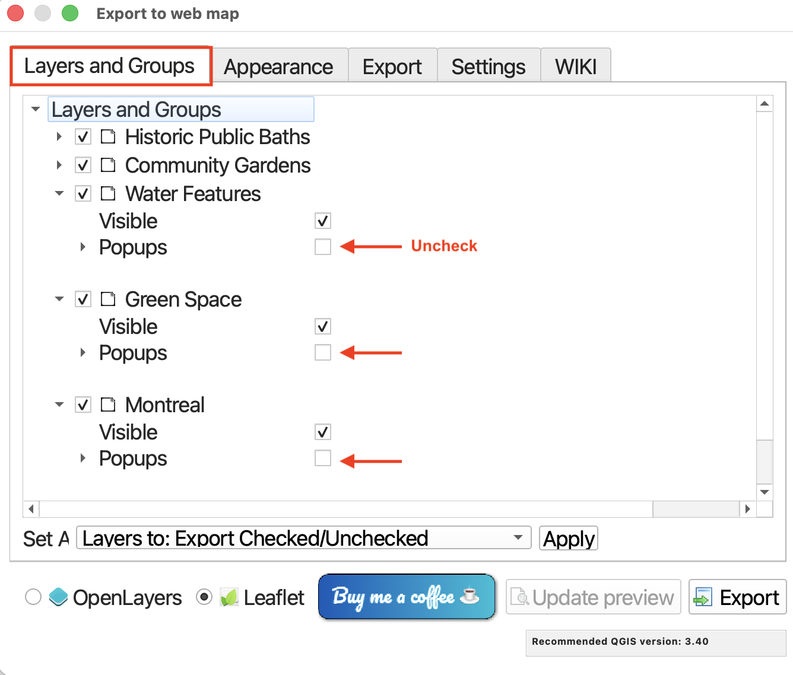

> Set your Basemap(s) as a Basemap. While you can treat basemaps as layers, indicating to the plugin that they are basemaps will ensure they are always visible.  

> Configure pop-ups for `Historic Public Baths` and `Community Gardens` by expanding each layer and deciding which attributes you want included in pop-ups, and whether or not they should have labels. 
If there are any attributes you don't want to show, simply choose hidden field. 

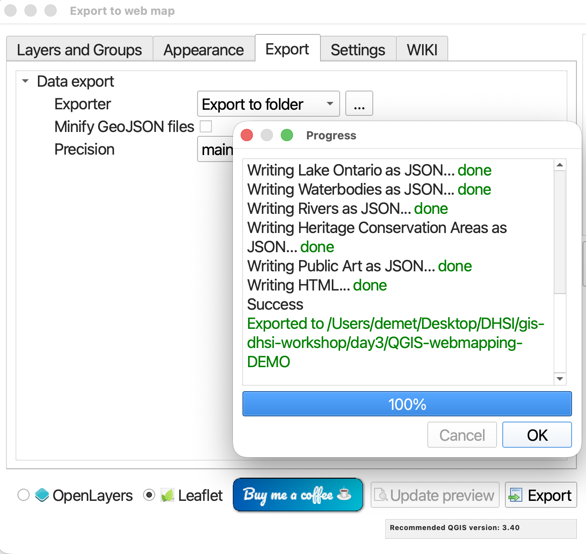

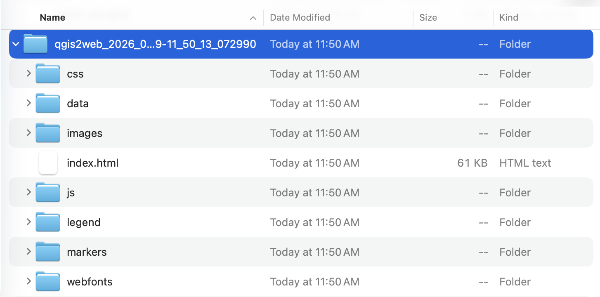

 

### **3. Set Appearance**
Next, in the **Appearance** tab, you can specify whether your webmap has a title and abstract, or description. You can also indicate whether you want your Layers list, or legend, expanded or collapsed upon initial load.

> * Include an *expanded* Layers List

> * *Change the Template to fullscreen*. This will ensure your map takes up 100% of the screen by default, making it easier to adjust the size down the road. If we begin with it taking up only a portion of the screen, resizing becomes unnecessarily difficult. 

> * We'll *keep the Extent set to the canvas-extent*. 

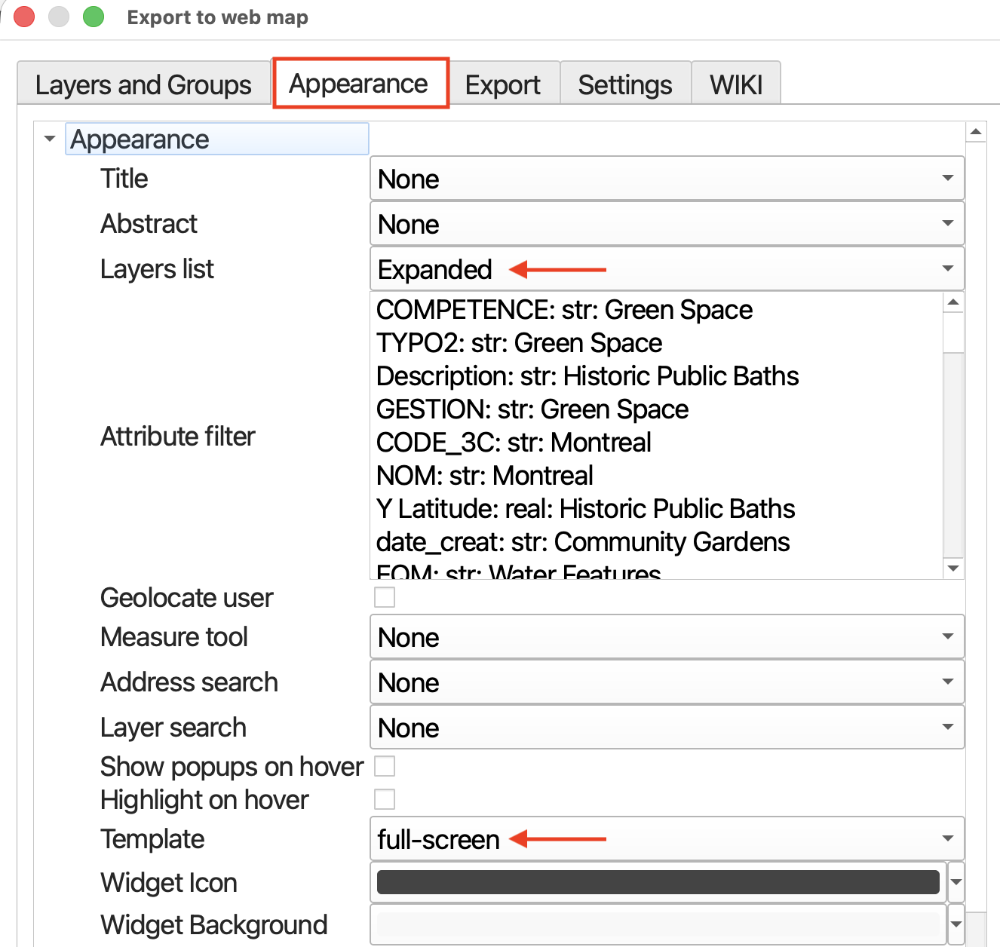

 

### **4. Export**
Set the export **folder** to the workshop subfolder, `dhsi-workshop/Day4/QGIS-webmapping/`. Be sure to click the three dots next to "Export to folder" to designate a specific folder for the webmap to export to. When the qgis2web tool runs, it will output a separate folder containing your data as well as the associated styling. 

>  Uncheck minify geojson files. The files are not that large so this is not necessary. 

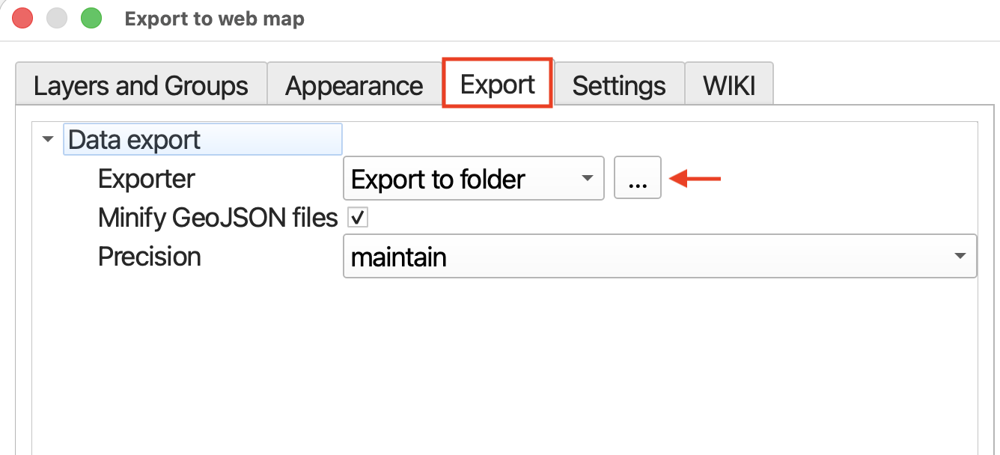

 

> Now, hit **export**. The run time should only be a moment as the datasets are not that large. You should get green messages if it works.

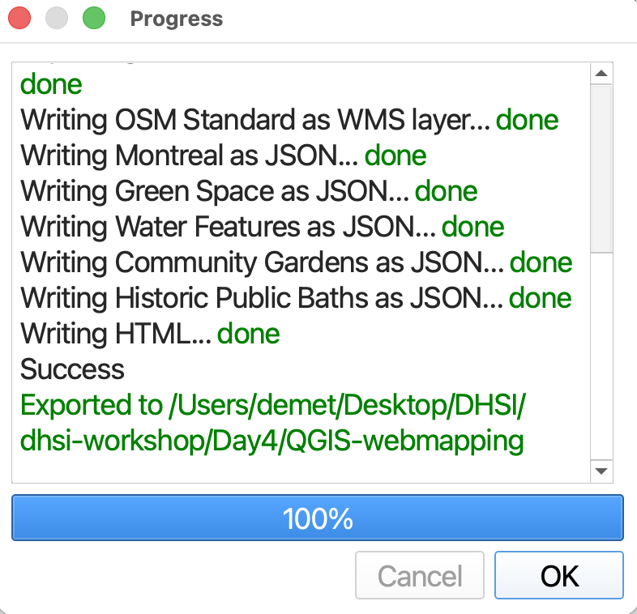

 

## Explore your Webmap 

From your computer's finder window, navigate to the workshop folder. Inside you should now see a new folder called qgis2web followed by the date. Open this folder. 

Inside you will see a handful of subfolders. 

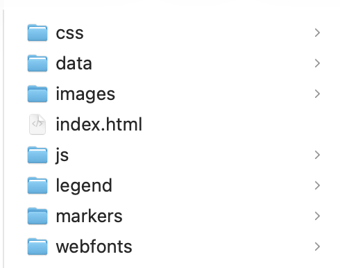

> - **css** contains the cascading style sheets responsible for the synology of your map layers. 
> - **data** contains your data layers
> - **images** contains any images
> - **js** contains the javascript code which powers the interactivity of your webmap 
> - **legend** contains your legend's icons 
> - **markers** would contain any markers on your map 
> - **webfonts** contains the font families of map text

There is also an `index.html` document. [HTML](https://www.w3schools.com/Html/), or hyper text markup language, is the language read by web browsers. Either double-click this file or right-click and choose to open it with a web browser of your choice. **Google Chrome is recommended.** (DuckDuckGo sometimes doesn't work.)

Your webmap should load in a web browser:
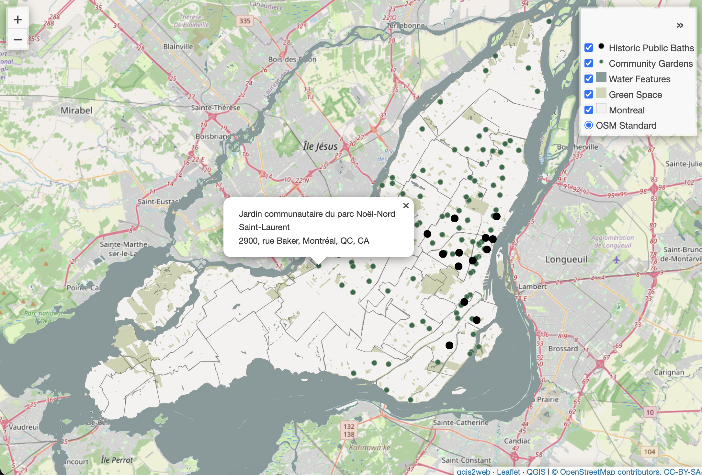

 
**Try interacting with your map!**
- Check and uncheck the visibility of different layers
- Collapse and expand the layers list
- Zoom in and zoom out; pan around
- Click on different points and explore the pop-up information

Make note of the attribution at the bottom right corner of your webmap. Notice also the file path in your browser's search bar. You should recognize it as referencing the location of your qgis2web output's `index.html` file local to your computer. Because this map is stored on your local device, it can't be searched via the web by others. To share the map as is, you'd have to send the entire folder to someone along with instructions on how to download and open your map. In the afternoon, you will learn not just more about Leaflet, the code library powering this webmap, but how to host this map on the web so it can be accessed via a link.  

**If you want to change anything, you can always return to QGIS and re-run qgis2web.** It will create a new output folder each time. Though each successive output folder will be date and timestamped, it's helpful to delete or discard deprecated folders so as to remain organized. 

 

***Congratulations! You just made a webmap using QGIS!***

 

## Note: Preparing the QGIS Project
A pre-prepared QGIS project was provided for you. However, in your own work your QGIS project might not be as tidy when you create a webmap. Below are some tips for preparing your QGIS Project for webmapping. 

 - Add a basemap if you want one. It's fine to use spatial data layers instead. Not all maps need a web-based basemap! 

- Remove all temporary layers and csv files from your map. Remember, removing permanent layers from your Layers Panel does not delete the data, it simply removes the connection to your project. You can add them back at any time, though your symbology will be lost unless saved as a template. 

- Rename the remaining layers in your Layers Panel so it's clear what each layer is representing. Capitalize words, remove dashes, etc. The qgis2web plugin will create a table of contents using these layer names, so it's important to edit them *before* running the plugin. To rename layers, right click layer in Layers Panel and choose **Rename**. 

- Ensure the symbology of your remaining layers layers to your liking.

- Group like layers. If there are layers such as contextual features, it can help reduce visual clutter in the final map by grouping them. Then, when making your webmap, under **Layers and Groups** you can set the whole group to be collapsed upon initial load. 

- Set **field visibility** in **Attributes Form**  Each datapoint has a host of attribute data associated with it, as previously seen in the attribute table. In a dynamic and interactive webmap, this information will pop-up when a point is clicked. However, a lot of this information is extraneous and unnecessary for the average user. To cut down on the amount of information rendered in each pop-up, we can customize which fields are visible and which ones are hidden. Technically you can do this from the qgis2web dialogue window, but it's much more difficult to get right. Thought time consuming, it may be wise to set each layer's attribute field visibility from the Attributes Form *before* converting your project into a webmap. **The Attributes Form can be found by going to a layers Properties.** Later on, when you're customizing the settings for **Layers and Groups**, you'll notice that the popup fields listed are only the ones you left visible when setting field visibility. Moreover, if you choose to give your popups labels, they will reflect any aliases set in the Attributes Form.

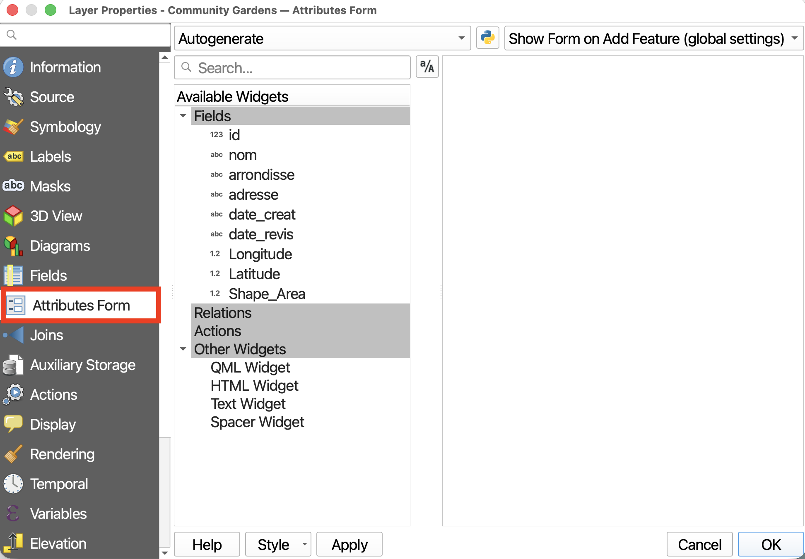

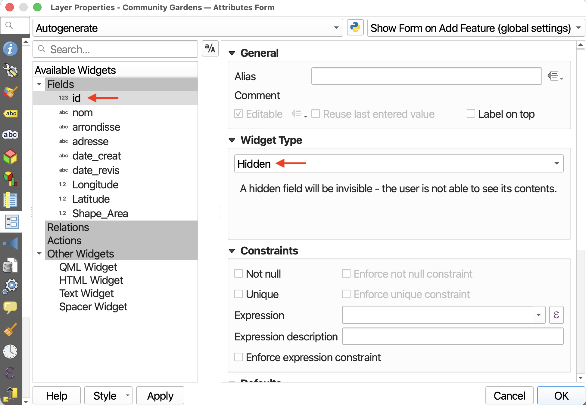

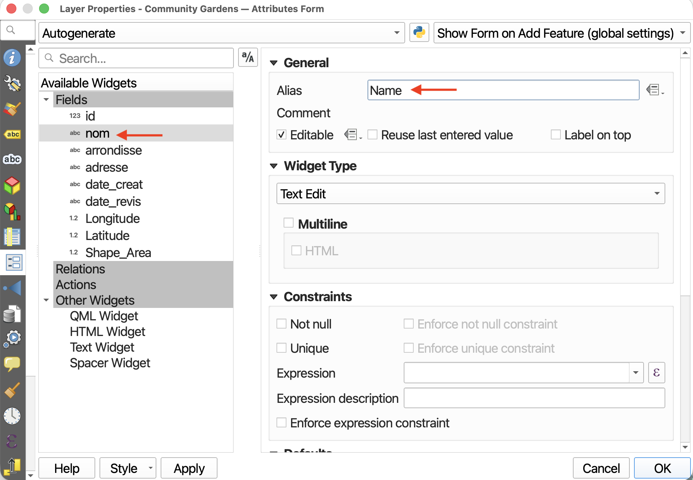