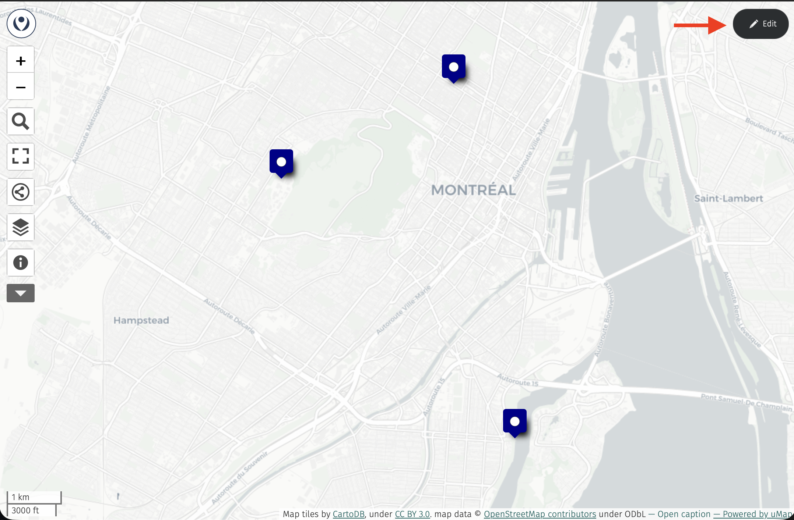
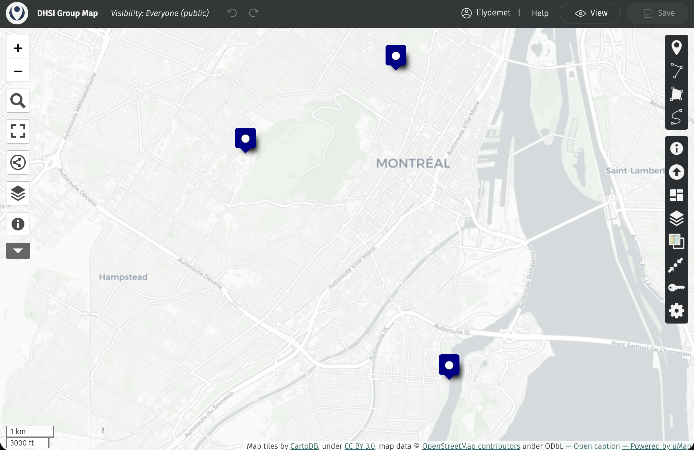
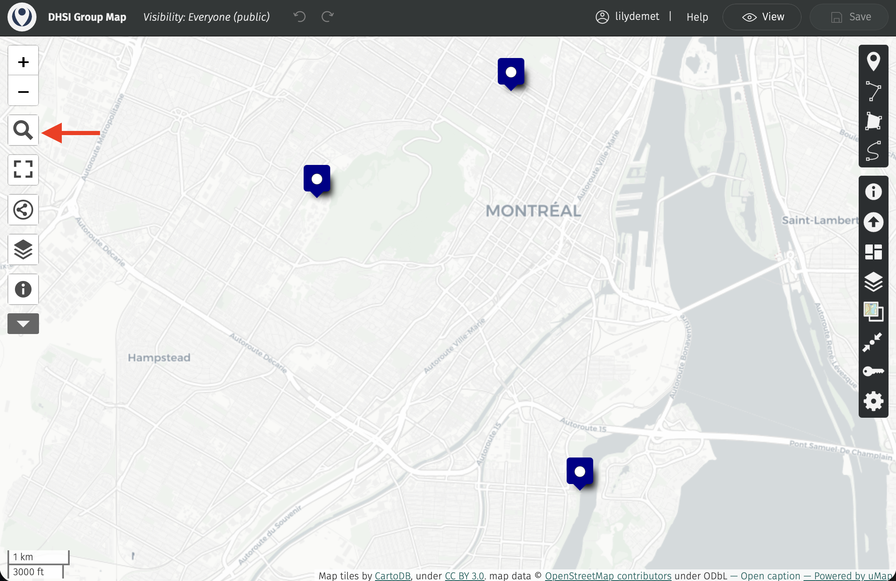
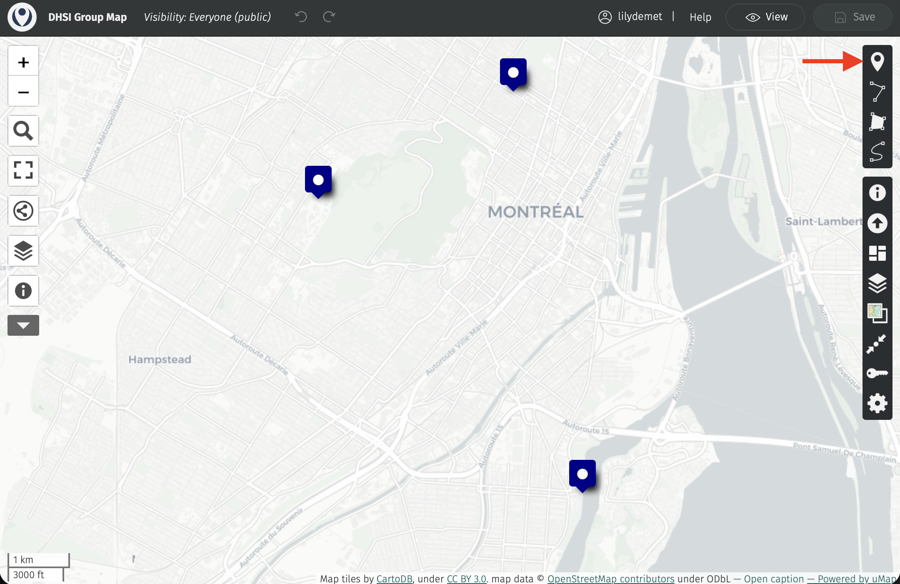

# Group Project: Collaborative uMap

Throughout the week, we thought it would be fun to collectively develop a collective map of our time in Montreal by asynchronously adding points of interest to a group web map. The platform we will use is called [uMap](https://umap.openstreetmap.fr/en/){:target="_blank"}. uMap is a browser-based platform for individual and collaborative web mapping — that is, making interactive maps that live on the web and can be shared with others via a link. You will learn more about uMap and other webmapping platforms on Day 4. 

We encourage all course participants to add between 2 and 5 points of interest from your everyday in Montreal. These could be cafes, bookstores, parks, or other lookouts and attractions you visited or happened upon that you particularly enjoyed. For each place, you'll add a new point to our collective map, give it a title, short description, and add a photo. Please note that the data you contribute will be publicly visible, and downloadable by workshop instructors and participants. Therefore, please do not include sensitive of confidential information, and credit your photos if you so wish. 

Below you can find step-by-step documentation for adding a point to the group map. Let us know if you have any questions! There will be time Thursday and Friday for individual assistance adding to this map. 
<!-- So, if you'd prefer to add your points all at once, just keep track of the crossroads or general locations where you took pictures and you can sort out  -->

## Adding points of interest to a group uMap

*1*{: .circle .circle-green} Upload your image(s) to the following Google Drive folder: [https://drive.google.com/drive/folders/1qTKyPgz7K9g83tEFuREzxsIH38wU2k8q?usp=sharing](https://drive.google.com/drive/folders/1qTKyPgz7K9g83tEFuREzxsIH38wU2k8q?usp=sharing){:target="_blank"}. **Make sure their sharing visibility is set to Editor so that everyone has access to it.** Copy the link to the image associated with your first point of interest.

 

*2*{: .circle .circle-green} Make sure you've created a [uMap Account](https://umap.openstreetmap.fr/en/){:target="_blank"} as directed in the [Course Preparation Tasks](./index.md#in-preparation-for-the-course). 

 

*3*{: .circle .circle-green} In a web-browser, open the group uMap: [https://umap.openstreetmap.fr/en/map/dhsi-group-map_1415666#13/45.491367/-73.587456](https://umap.openstreetmap.fr/en/map/dhsi-group-map_1415666#13/45.491367/-73.587456){:target="_blank"} Then, click the edit button in the top left-hand corner.

 

*4*{: .circle .circle-green} Now, if your point of interest has a common name, such as a library, university, park, business, or restaurant, *or* know the address or coordinates of your point of interest, you can simply search for it using the "Search Tool" in the left-hand panel. This is the easiest way to add a point of interest. 

Once searched, click on the marker icon that prompts you to "Add this place to my map". In the "Feature Properties" side-panel that opens, scroll down and add a description in the **Comments** field. (Add any image credits you wish here as well.)

Then, paste the Google Drive link to your relevant image in the **ImageURL** field. 

Close the "Feature Properties" side-panel.

 

*4*{: .circle .circle-green} All the points we add are part of a single data layer called "Points of Interest". If you accidentally closed the panel early, or want to add more information to your point, you can do so by opening the data table for "Points of Interest" and editing it directly. 

Note that you can also add a marker directly to the map using the "Add Marker" tool in the right-hand panel. 

*4*{: .circle .circle-green} 

- save. notice you may get error if someone else is editing. wait for them to finish or save and return. try not to override someone. that being said, close tab when done. we've tried to douncut this by staggering additions by having you add asyncrhoneously throuhout the week. 

> zoom to layer and save. 

- teach thursday but if you want to start adding - welcome to - how to add images → add new field, upload image link  - then upload image to drive - make edit all and then link? could make google drive collective for them…

