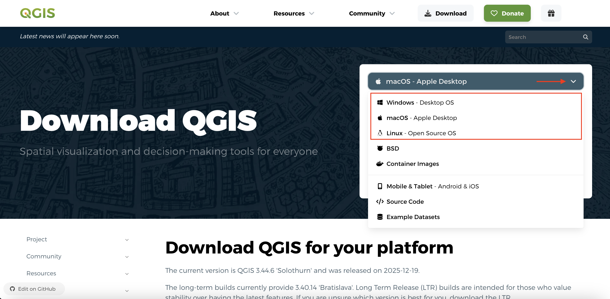
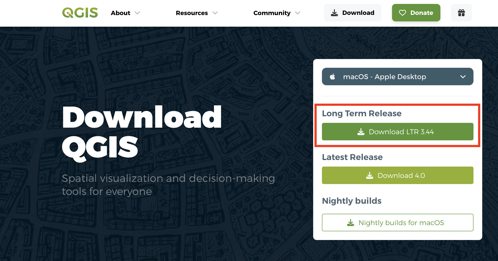
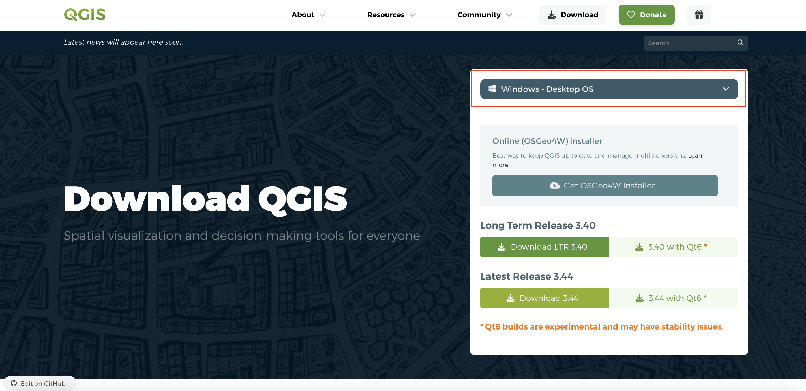
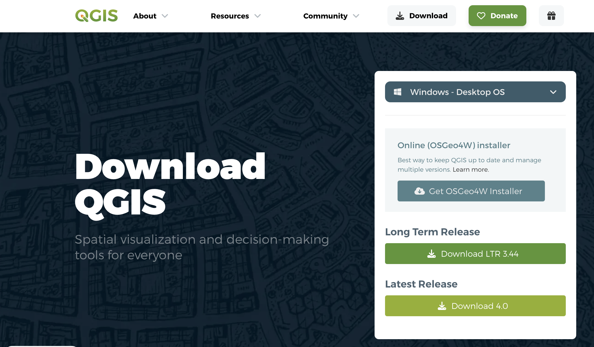
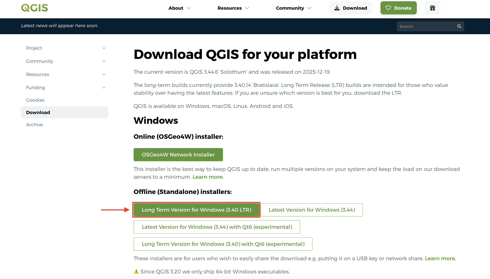
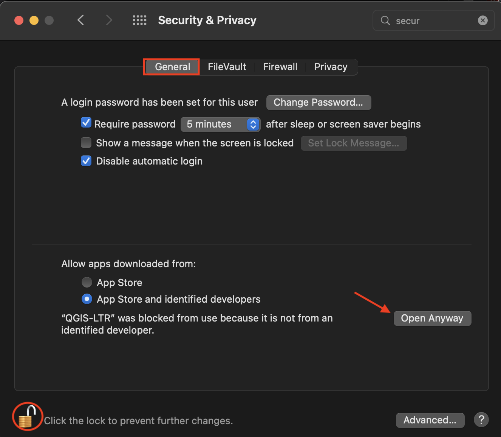
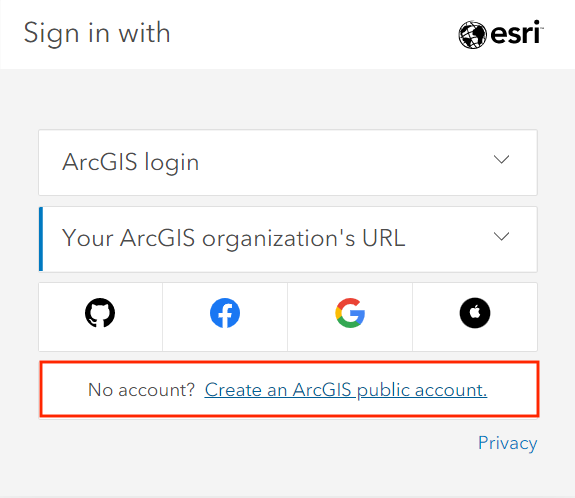
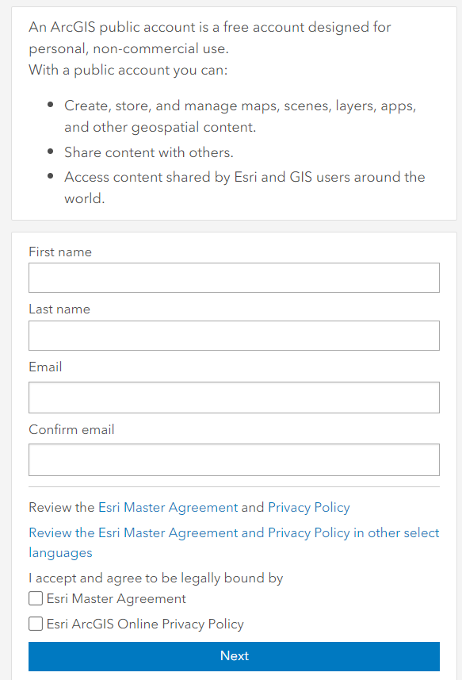
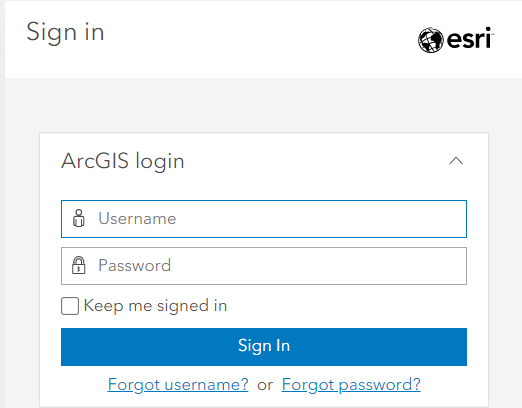

# Software Download and Account Creation
{: .no_toc}

not sure i need to add this page
{: .warn}

The following outlines how to download the necessary software and create accounts for the platforms we will use throughout the week. 

  

    On this page:
  

  {: .text-delta }
 - TOC
{:toc}

----

## Downloading & Installing QGIS

QGIS can be downloaded from [qgis.org's Downloads page](https://qgis.org/en/site/forusers/download.html). In most cases, you'll want to download and install the **Long term release** instead of the latest release. This will give you most of the functionality you'll need without encountering the software bugs of newly released versions.

To Do
{: .label .label-green }
Install QGIS for your operating system. From [qgis.org's Downloads page](https://qgis.org/en/site/forusers/download.html), select your computer's operating system from the drop-down menu. 

 

### For Mac, choose the "Long Term Release" (if available)
The long term release is less buggy and won't crash (as often). If no long term version exists, download the "regular verion". Avoid nightly builds as they can be more buggy. 

{: .no_toc} 

  
### For Windows, choose the Long Term Release
{: .no_toc}

<!-- 

     -->
Later on in this workshop, you will be given a tour of the interface, as well as guided through adding data to a project and saving your project. For now, just make sure you have properly downloaded QGIS and are able to launch it. See below for troubleshooting tips if you're working on a Mac computer. 

 

### Troubleshooting
{: .no_toc}
If you're working on a MacOS and get the message: _"QGIS-LTR can’t be opened because Apple cannot check it for malicious software"_ when you try to open the application, go to System Preferences --> Security & Privacy --> General and unlock your settings. At the bottom of the dialogue box you will see an option to Open Anyway. Click that, then re-lock your settings and try again to open the QGIS-LTR application. 

## Downloading Workshop Data Folder

## Downloading VS Code 

## Creating Accounts

### uMap

### ArcGIS Online
*1*{: .circle .circle-purple} Navigate to [www.arcgis.com](https://www.arcgis.com/home/index.html) and click **Sign In**.

*2*{: .circle .circle-purple} Click **Create an account** at the very bottom. 

*3*{: .circle .circle-purple} Fill in your information.

*4*{: .circle .circle-purple} Sign in.

{: .note}
If you are interested getting a personal ArcGIS account, you can find more information [here](https://gis.ubc.ca/software/). Be mindful that students and departments have different options for licenses. Please contact Geospatial Systems Analyst Haitao Li (ht.li@ubc.ca) if you need help with UBC’s Esri product.

 

## ArcGIS Free vs. Enterprise Account
An ArcGIS free account can be created by anyone and is intended for noncommercial, nongovernmental use. When using ArcGIS StoryMaps with a public account, some advanced storytelling and customization features are not available, including:

- embedding web pages
- customizing story theme and logo
- Google analytics tracking ID
- including Audio
- image galleries
- timelines

You can still include images and video, embed map tours, and use the swipe tool. You can read more about features on the [ArcGIS Storymap Licensing page](https://doc.arcgis.com/en/arcgis-storymaps/reference/licensing.htm).

A free account on ArcGIS online does not allow you to do any spatial analysis on your web map like you could on a desktop GIS, however, it does allow styling, filtering, etc. By the end of this workshop you will have a better idea as to whether the free account meets your needs or not. 

### GitHub

